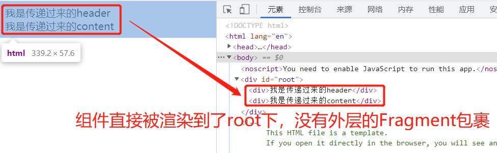
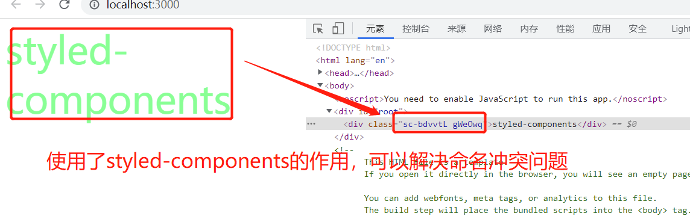

<!-- START doctoc generated TOC please keep comment here to allow auto update -->
<!-- DON'T EDIT THIS SECTION, INSTEAD RE-RUN doctoc TO UPDATE -->
**Table of Contents**  *generated with [DocToc](https://github.com/thlorenz/doctoc)*

- [一、项目构建工具 create-react-app](#一项目构建工具-create-react-app)
- [二、关于React](#二关于react)
  - [2.1 React的起源和发展](#21-react的起源和发展)
  - [2.2 React与传统MVC的关系](#22-react与传统mvc的关系)
  - [2.3 React高性能的体现：虚拟DOM](#23-react高性能的体现虚拟dom)
  - [2.4 React的特点和优势](#24-react的特点和优势)
- [三、编写第一个React应用](#三编写第一个react应用)
- [四、元素与组件](#四元素与组件)
  - [4.1 函数式组件](#41-函数式组件)
  - [4.2 class组件](#42-class组件)
  - [4.3 更老的一种方法](#43-更老的一种方法)
  - [4.4 组件的组合、嵌套](#44-组件的组合嵌套)
  - [4.5 小结](#45-小结)
- [五、JSX原理](#五jsx原理)
- [六、组件中的DOM样式](#六组件中的dom样式)
  - [6.1 行内样式](#61-行内样式)
  - [6.2 使用class](#62-使用class)
  - [6.3 不同的条件添加不同的样式](#63-不同的条件添加不同的样式)
  - [6.4 css-in-js](#64-css-in-js)
- [七、组件的数据加载方式](#七组件的数据加载方式)
  - [7.1 属性](#71-属性)
    - [7.1.1 设置组件默认的props](#711-设置组件默认的props)
    - [7.1.2 props.children](#712-propschildren)
    - [7.1.3 使用prop-types检查props](#713-使用prop-types检查props)
  - [7.2 状态](#72-状态)
    - [7.2.1 定义state](#721-定义state)
    - [7.2.2 setState](#722-setstate)
  - [7.3 属性VS状态](#73-属性vs状态)
  - [7.4 状态提升](#74-状态提升)
  - [7.5 受控组件与非受控组件](#75-受控组件与非受控组件)
  - [7.6 渲染数据](#76-渲染数据)
  - [八、事件处理](#八事件处理)

<!-- END doctoc generated TOC please keep comment here to allow auto update -->

## 一、项目构建工具 create-react-app

两种创建项目方式

```bash
# 先安装脚手架
npm install create-react-app -g

# 通过脚手架创建项目
create-react-app proname
```

另外一种安装方式：

```bash
npx create-react-app proname
```

npx是node内置的一个工具，它首先会去全局环境去寻找create-react-app，看有没有这个包，如果有，则使用全局的工具包去安装，如果没有，则先下载一个工具包，之后再安装，安装create-react-app后再创建项目。不过在项目创建完成之后，create-react-app就会被自动的移出了，不会污染环境。

> 以后类似需要全局安装的工具，都可以使用npx工具。

在前端领域，如果使用到node、npm、yarn的时候，可以设置镜像。

## 二、关于React

### 2.1 React的起源和发展

react在2013年5月开源的，源于Instagram项目；

国内大厂在2015年逐渐开始使用React项目；

React在国内流行于2015年底、2016年初的时候：写简历的时候，不要写在2015年或者之前就已经开始大量做react项目了，除非在阿里或者facebook。

### 2.2 React与传统MVC的关系

react是一个library，是一个用于构建用户界面的库，不是一个frame，不是框架，更不是一个完整的MVVM框架，它只是MVVM中的View部分。

Vue也不是纯粹的MVVM框架，但是vue有单文件组件系统、指令，从这个角度上来说，比React完整一些，React是没有单文件组件系统和指令集的。

React本身也不一定就是非常认可MVC模式，React将页面拆分成了众多的小模块，每个模块就是一个组件，然后这些组件之间组合、嵌套，形成了一个个功能完善、丰富的页面。

### 2.3 React高性能的体现：虚拟DOM

React两个优势：

1. 组件

   组件思想，让开发效率提升、降低了管理成本

2. 虚拟DOM

   虚拟DOM让用户对产品的体验更好

项目好坏的评价，或者一个工具库、框架的好坏，通常有两个评价因素：

1. 老板，管理者，也可以说是资本方

   关注的是做事情的效率有没有提升，是不是可以投入更少的资源做更多的事情，且质量上还很有保证

2. 用户

   用户的使用体验是不是友好，是不是能够解决用户的问题、痛点。

复杂、繁琐的DOM操作，通常是web项目性能瓶颈的原因。

> Vue的很多优秀的思想是参考了React的，所以说Vue的开发，是站了巨人的肩膀上的。

### 2.4 React的特点和优势

1. 虚拟DOM

2. 组件系统

3. 单向数据流

   react的核心就是数据绑定，所谓的数据绑定，就是指将服务端的数据和前端页面绑定好，开负责只关注实现业务就可以了。

4. jsx语法

   vue中，我们使用render函数构建组件的DOM结构性能较高，因为省区了查找和编译模板的过程。但是在render中利用createElement创建结构的时候代码可读性较低，较为复杂，此时可以利用jsx语法在render中创建DOM，解决这个问题，但前提是需要使用工具来编译jsx。

## 三、编写第一个React应用

通过脚手架搭建的项目，先把src下面的文件全部删除掉。

1. src下新建入口文件：index.js  必须是这个文件名，不可改

   react可以做两件事：

   1. 基于浏览器的web项目
   2. 开发原生的app：native

   入口文件中，先把需要使用到的react核心的文件导入

   ```javascript
   // React变量名按照规范，首字母要大写，但不是技术上一定要这样
   import React from "react";
   /**
    * react可以做基于浏览器的web项目，也可以做native，也就是app
    * 如果是做基于浏览器的web项目，则需要导入react-dom
    * 如果是做native，则需要导入react-native
    */
   import ReactDOM from "react-dom";
   ```

2. 简单的做一个小小的封装

   ```javascript
   // index.js 入口文件，必须是这个文件名
   // React变量名按照规范，首字母要大写，但不是技术上一定要这样
   // import React from "react";
   /**
    * react可以做基于浏览器的web项目，也可以做native，也就是app
    * 如果是做基于浏览器的web项目，则需要导入react-dom
    * 如果是做native，则需要导入react-native
    */
   import ReactDOM from "react-dom";
   import App from "./app";
   
   /**
    * render函数渲染一个模板，也就是段DOM结构
    * 但要注意这段DOM结构外面不要使用引号包裹，这段代码，就是jsx
    * react实现的核心：告诉render函数要渲染什么，以及渲染到哪里，就完成了react的使命了
    */
   ReactDOM.render(
     //   App, // 这里直接App，是不可以的，因为App本身是一个class，而render需要的是一个组件，直接将App按照组件的方式写就可以了，按照组件的方式写，本质上就是一个类实例化的过程
     <App />,
     // document.getElementById("root")
     document.querySelector("#root")
   );
   
   // app.js 定义了一个class类组件
   import React from "react";
   
   class App extends React.Component {
     render() {
       return <div>Hello,经过封装后的jsx组件</div>;
     }
   }
   
   export default App;
   ```

## 四、元素与组件

### 4.1 函数式组件

jsx语法中显示变量，使用一对大括号包裹变量，Vue中使用两对大括号包裹变量

```javascript
import React from "react";
import ReactDOM from "react-dom";

// ReactDOM.render(
//   /**
//    * 这种方式可以让render函数将组件渲染到指定的元素上
//    * 但是假如我想给组件传递参数的时候怎么办呢？现在的jsx是做不到的
//    * 可以把jsx抽离出去，抽离成一个函数，然后函数返回jsx，然后render函数中通过执行抽离出去的函数，这个函数就叫做组件函数
//    * 看下面的代码案例
//    */
//   <div>Hello, React</div>, // jsx
//   document.getElementById("root")
// );

const app = (props) => {
  return <div>Hello,新世界{props}</div>; // jsx中使用一对大括号包裹变量
};

ReactDOM.render(app("!!!"), document.getElementById("root"));
```

React中：

HTML元素，也称为React元素，React元素使用小驼峰的命名方式(camel-case)，即首字母小写

React组件，使用大驼峰的命名方式(pascal-case)，即首字母大写

```javascript
const App = (props) => {
  let title = props.title;
  let name = props.name;
  return (
    <div>
      Hello,{name}
      {title}
    </div>
  );
};

// ReactDOM.render(app("!!!"), document.getElementById("root")); // 组件app()方式，还可以通过<app></app>方式编码

ReactDOM.render(
  <App title="." name="Nicholas" />,
  document.getElementById("root")
);
```

### 4.2 class组件

函数式组件，可以通过给函数传参的方式传递props，那么类组件呢，怎么传递props？

类组件，是把props直接绑定到了class上面，可以通过this.props拿到当前class上的props。

```javascript
/**
 * props默认可以绑定到class上，然后通过this.props获取到当前class上关联的props
 */
class App extends React.Component {
  render() {
    return <div>Hello,Cookie{this.props.title}</div>;
  }
}

ReactDOM.render(<App title="..." />, document.getElementById("root"));
```

类组件，一定要实现render函数。

React.Componnet是一个抽象类，所以实现的时候必须要实现抽象类中的方法。

### 4.3 更老的一种方法

在2015年以前ES6标准还没有发布的时候，React通过创建类的方法做了实现。

react文档，有一节给我们讲解了，不使用ES6去创建class组件的，现在项目中基本不会使用这种方式。

### 4.4 组件的组合、嵌套

react中的组建组合、嵌套，只有父子组价之间的关系，没有像Vue中的内容分发机制slot。

react中，一切的一切都是js，所有的内容都是js。

```jsx
// 入口文件：index.js
import ReactDOM from "react-dom";
import App from "./Nest";

ReactDOM.render(<App />, document.getElementById("root"));

// 组件文件：Nest.js
import React from "react";

class Header extends React.Component {
  render(props) {
    return <div>{this.props.content}</div>;
  }
}

class Content extends React.Component {
  render(props) {
    return <div>{this.props.content}</div>;
  }
}

class App extends React.Component {
  render() {
    return (
      <div>
        <Header content="我是传递过来的header"></Header>
        <Content content="我是传递过来的content"></Content>
      </div>
    );
  }
}

export default App;
```

React中的组价，和Vue3之前的组件系统相同，组件中需要有一个根节点。我们可以从案例代码中的App组件中看到组件的根节点为div。

使用div作为组件的根节点，从技术实现上是没有问题的，但是这个元素没有什么实际的意义，仅仅是作为一个占位元素存在，可是它确带来了一些负面的影响，就是增加了元素的层级，增加了元素的渲染时长。那有没有办法可以减少这一占位的层级呢？

Vue中的组件根节点有一个template元素占位符，不会被渲染到DOM中。

React中，也有一个元素，有类似Vue中template元素的作用，就是Fragments。Fragments允许我们向其中添加多个组件列表而不需要向DOM中添加额外的DOM节点。使用的时候，需要从react中导入一下:

```jsx
// 注意导入Fragment，直接解构了
import React, { Fragment } from "react";

class Header extends React.Component {
  render(props) {
    return <div>{this.props.content}</div>;
  }
}

class Content extends React.Component {
  render(props) {
    return <div>{this.props.content}</div>;
  }
}

class App extends React.Component {
  render() {
    return (
      // Fragment可以包裹多个子组件而不会向DOM添加额外的元素
      <Fragment>
        <Header content="我是传递过来的header"></Header>
        <Content content="我是传递过来的content"></Content>
      </Fragment>
    );
  }
}

export default App;
```

可看效果图：



Fragment有一个语法糖，就是在React组件中使用Fragment作为根节点的时候，Fragment可以省略，只留一个空的尖括号,然后也不用导入Fragment了。

```jsx
// 注意导入Fragment，直接解构了
// Fragment作为根节点的时候，可以省略，只留一对尖括号,这时，Fragment也不用导入了
import React, { Fragment } from "react";

class Header extends React.Component {
  render(props) {
    return <div>{this.props.content}</div>;
  }
}

class Content extends React.Component {
  render(props) {
    return <div>{this.props.content}</div>;
  }
}

class App extends React.Component {
  render() {
    return (
      // Fragment可以包裹多个子组件而不会向DOM添加额外的元素
      // <Fragment>也可以省略不写，只留一个尖括号<>
      <>
        <Header content="我是传递过来的header2"></Header>
        <Content content="我是传递过来的content2"></Content>
      </>
    );
  }
}

export default App;
```

### 4.5 小结

函数式组件、class组件，都可以编写react组件，之前class组件稍微多，现在基本都使用函数式组件了

React元素，React元素使用小驼峰的命名方式(camel-case)，即首字母小写

React组件，使用大驼峰的命名方式(pascal-case)，即首字母大写

## 五、JSX原理

Jsx：即js扩展。

要理解jsx原理，可以想象一下怎么用一个JS对象去描述一段DOM结构。可以先看一段DOM结构：

```html
<div class="app" id="appRoot">
    <h1 class="title">这是一个模块标题</h1>
    <p>React是一个非常不错的UI库，用于构建用户界面</p>
</div>
```

然后想一下怎么使用一个JS对象去描述这段DOM结构：

```javascript
var obj = {
    tag: "div",
    attrs: { className: "app", id: "appRoot" },
    children: [
        {
            tag: "h1",
            attrs: { className: "title" },
            children: ["这是一个模块标题"]
        },
        {
            tag: "p",
            attrs: null,
            children: ["React是一个非常不错的UI库，用于构建用户界面"]
        }
    ]
}
```

这种js表示DOM结构的这个JS对象，称为虚拟DOM。

如果有数据变化的时候，我们只替换被修改的那个小部分，而不用整个对象全部替换、重新渲染，所以虚拟DOM，在一定程度上，性能是优秀的。

虽然虚拟DOM，也就是这段JS表示的DOM结构的对象，在性能上是优秀的，但是代码写起来不够友好，复杂、可读性不太好，React就帮我们把这段Js对象描述成了一段类似DOM的结构，就是JSX，基本的标签还可以是HTML标签，只是一些属性名有些变化，理解以及可读性都有了很大的改善。

是先有的虚拟DOM，再有的JSX，React把虚拟DOM转换成了JSX。

## 六、组件中的DOM样式

### 6.1 行内样式

```jsx
<Fragment>
    <div style={{ fontSize: "50px", color: "#f20" }}>测试下行内样式</div>
</Fragment>
```

行内样式，需要注意react元素的属性值，需要使用大括号包裹

设置行内样式的时候，使用了两层大括号包裹，第一层大括号是React的标识，内层的大括号是css样式的标识；

行内样式还有一种写法，可以把css抽离出去，但是抽离出去的也还是个js对象

```jsx
import React, { Fragment } from "react";

const userListStyle = {
  fontSize: "32px",
  color: "#090",
  textAlign: "center",
  listStyle: "none",
};

class ClassStyle extends React.Component {
  render() {
    return (
      <Fragment>
        <div style={{ fontSize: "50px", color: "#f20" }}>测试下行内样式</div>
        <ul style={userListStyle}>
          <li>Nicholas Zakas</li>
          <li>Hanmeimmei</li>
        </ul>
      </Fragment>
    );
  }
}

export default ClassStyle;
```

这也是一种行内的样式，但是已经把css部分给提取出去了一个js对象，看上去好像干净了一些。

行内样式也称为动态样式，即只有在代码运行到了这一行的时候才会去加载、执行样式。

### 6.2 使用class

react中，除了使用行内样式以外，也可以像普通的网页那样，引入一个外部的样式文件，这种方式称为静态加载，指的是页面在加载的时候，就已经把样式给加载了进来。

```jsx
import React from "react";
// 导入外部样式
import "./assets/css/main.css";

class OuterCss extends React.Component {
  render() {
    return (
      <>
        {/**通过class设置样式，注意这是在jsx，属于React元素，react元素遵循cacel-case的命名方式，即小驼峰命名 */}
        <div className="userinfo">
          <p>姓名：Nicholas Zakas</p>
          <p>年龄：26</p>
        </div>
      </>
    );
  }
}

export default OuterCss;
```

### 6.3 不同的条件添加不同的样式

在Vue中，组件中的样式有scoped属性，style添加了scoped属性后，就只能对本组件内的元素生效，不会污染全局的样式。

那么在React中有没有类似的属性也实现类似的效果呢？React没有提供类似的功能。

那么想实现类似的功能怎么处理呢？推荐使用classnames这个包，来帮助我们实现类似vue中styles的scoped功能。

这种方式使用的很少，有兴趣的参考https://www.npmjs.com/package/classnames看下就可以了，很简单。

### 6.4 css-in-js

这种方式式最常用的，最推荐使用的。

这种方式，需要依赖styled-components包，styled-components是针对react写的一套css-in-js框架，简单来讲就是在js中写css，把css当做是组件，react的思想，就是一切皆组件。

使用styled-components:

1. 安装

   ```bash
   npm install styled-components --save
   ```

2. 导入使用

   ```jsx
   import styled from "styled-components";
   
   const DivContainer = styled.div`
      {
       /**样式的属性名，可以完全按照css的规则去写，也可以按照React元素的规则去写，即小驼峰的命名规范 */
     }
     ${"" /* fontsize: 32px; */}
     font-size: 50px;
     color: #6f9;
   `;
   
   export default DivContainer;
   ```

   这样声明了一个使用了styled-components的react组件，组件定义了组件的根元素div，以及根元素的一些样式。

3. 案例

   ```jsx
   // 定义styled-components组件
   import styled from "styled-components";
   
   const DivContainer = styled.div`
      {
       /**样式的属性名，可以完全按照css的规则去写，也可以按照React元素的规则去写，即小驼峰的命名规范 */
     }
     ${"" /* fontsize: 32px; */}
     font-size: 50px;
     color: #6f9;
   `;
   
   export default DivContainer;
   
   // 导入styled-components组件，并使用
   import DivContainer from "./StyledComponents";
   class ClassStyle extends React.Component {
     render() {
       return (
         <Fragment>
           {/* 使用styled-components组件 */}
           <DivContainer>styled-components</DivContainer>
         </Fragment>
       );
     }
   }
   
   export default ClassStyle;
   ```

   我不太喜欢、认可这种代码组织形式，虽然react推崇的一切皆组件，但是这种方式，我认为确实增加了编码的复杂程度，而且不容易理解，代码组织的较为混乱。

   我还是最喜欢的将样式部分抽离成一个文件，可以通过一些技术手段实现样式的模块化，将样式和逻辑分离。

   styled-components其实还实现了另外一个功能，就是混淆了class，一般不会发生class选择器的命名冲突问题。

   

## 七、组件的数据加载方式

### 7.1 属性

#### 7.1.1 设置组件默认的props

#### 7.1.2 props.children

#### 7.1.3 使用prop-types检查props

### 7.2 状态

#### 7.2.1 定义state

#### 7.2.2 setState

### 7.3 属性VS状态

### 7.4 状态提升

### 7.5 受控组件与非受控组件

### 7.6 渲染数据

### 八、事件处理

8.1 绑定事件

8.2 事件handle的写法

8.3 EVent对象

8.4 事件的参数传递

