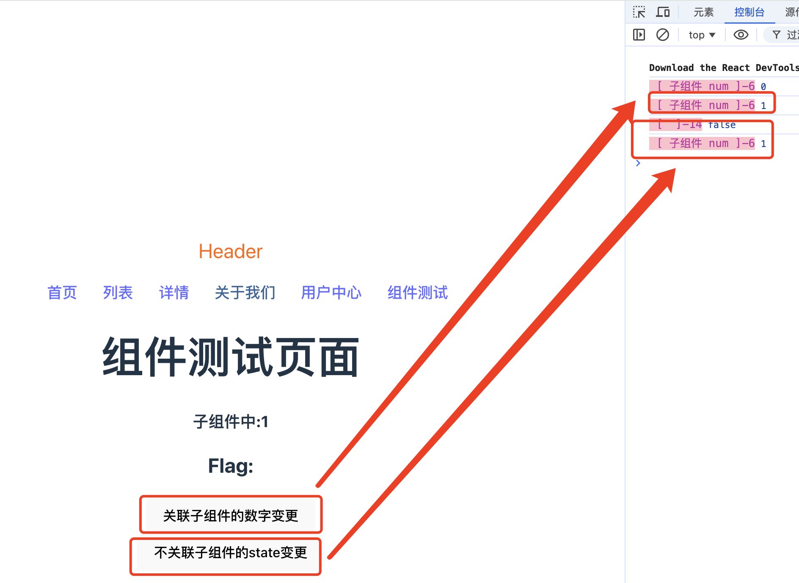

## 1. 简介

当我们使用React UI库编写代码时，无论是组件更新、状态的改变，还是父子组件之间的交互，都会涉及到React的渲染流程。那么我们应该就会有以下的一些疑问：

1. 组件渲染的具体流程是什么？

2. 引起组件重新渲染的因素有哪些？

3. React.memo、useMemo和useCallback等优化手段的原理是什么？怎么利用好它们？

## 2. 渲染过程

### 2.1 初次渲染

首先，我们来定义一个组件:

```tsx
functin Home() {
    return (
        <>
            <div>Home 首页</div>
            <h3>Home组件</h3>
        </>
    )
}
export default Home;
```

当页面初次渲染或者项目初次启动时，React会先创建一个根节点，用来绑定组件,并且使用render函数渲染具体的组件：

```tsx
createRoot(document.getElementById('root')!).render(
  <StrictMode>
    <App />
  </StrictMode>,
)
```

由于我们已经在App组件中引入了Home组件，所以就得到了Home组件中的tsx：

```tsx
<>
    <div>Home 首页</div>
    <h3>Home组件</h3>
</>
```

React会把这段tsx转换为虚拟DOM，即用Javascript对象的方式描述DOM元素：

```js
{
    type: React.Fragment,
    props: {
        children: [
            {type: "div", props: { children: "Home 首页"}},
            {type: "h3", props: { children: "Home组件"}}
        ]
    }
}
```

那么在首次渲染时React会将虚拟DOM转换为真实DOM：

```html
<div id="root">
    <div>Home 首页</div>
    <h3>Home组件</h3>
</div>
```

**为什么组件的tsx元素要放在一对<></>里面？**

Home组件是使用tsx编写的，浏览器没有办法直接识别。React的构建如webpack或者vite会把tsx代码编译为js代码，如果组件的代码不使用<></>包裹，会如下表现形式：

```tsx
functin Home() {
    return (
        <div>Home 首页</div>
        <h3>Home组件</h3>
    )
}
export default Home;
```

运行代码，则会产生一个报错：

```bash
Adjacent JSX elements must be wrapped in an enclosing tag. Did you want a JSX fragment <>...</>
```

因为去掉包裹的元素后，编译的结果是：

```ts
function home(){
    return (
        React.createElement("div", null, "Home 首页"),
        React.createElement("h3", null, "Home组件")
    );
}
```

而在js中，一个函数只允许有一个返回值。所以在一个组件中需要返回多个元素的时候，需要使用一个公共的容器去包裹一下。

### 2.2 更新渲染

React的更新机制可以用一个函数来表示：view=f(state)，view表示页面，state表示数据。在初次渲染以后，state的变化会引起view的变化，也就是说state的变化会引起组件的重新渲染，更深一层的是当且仅有state变化时才会引起组件的重新渲染。当一个组件冲洗渲染时，它的所有的字组件也会重新渲染。

```tsx
// Child.tsx
import { FC } from "react";
interface IChild {
    num: any;
}
const Child: FC<IChild> = ({ num }) => {
    console.log('%c [ 子组件 num ]-6', 'font-size:13px; background:pink; color:#bf2c9f;', num);
    return (
        <h3>
            子组件中:{num}
        </h3>
    )
}

export default Child;

// test.tsx
import { useState } from "react";
import Child from "./components/Child";

function Test() {
    const [num, setNum] = useState<number>(0);
    const [flag, setFlag] = useState<boolean>(false);

    const handleNumChange = () => {
        setNum(num + 1);
    }

    const handleNoRelChange = () => {
        console.log('%c [  ]-14', 'font-size:13px; background:pink; color:#bf2c9f;', flag);
        setFlag(!flag);
    }
    return (
        <>
            <h1>组件测试页面</h1>
            <Child num={num} />
            <h2>Flag: {flag}</h2>
            <button onClick={handleNumChange}>关联子组件的数字变更</button>
            <br />
            <button onClick={handleNoRelChange}>不关联子组件的state变更</button>
        </>
    )
}

export default Test;
```

最后我们点击和子组件有关联props的按钮和没有关联props的按钮，发现子组件都被重新渲染了



没有做动态图，用箭头做了下指向，大家应该可以想象出来这个效果。

## 3. 如何避免不必要的渲染？

### 3.1 React.memo

### 3.2 useMemo和useCallback

## 4. 总结

React渲染组件时，首先会执行函数组件，生成一个虚拟DOM树，以描述组件的结构。接着会将其与旧的虚拟DOM树对比，找到需要更新的部分，修改页面。只有state的改变会引起组件的重新渲染，并且它的所有子组件也会被重新渲染。如果想优化这一过程，可以使用React.memo、useDemo或者useCallback这3种方法对应不同的场景。深入理解React的渲染原理，有助于我们快速定位性能瓶颈，解决复杂场景中的问题。