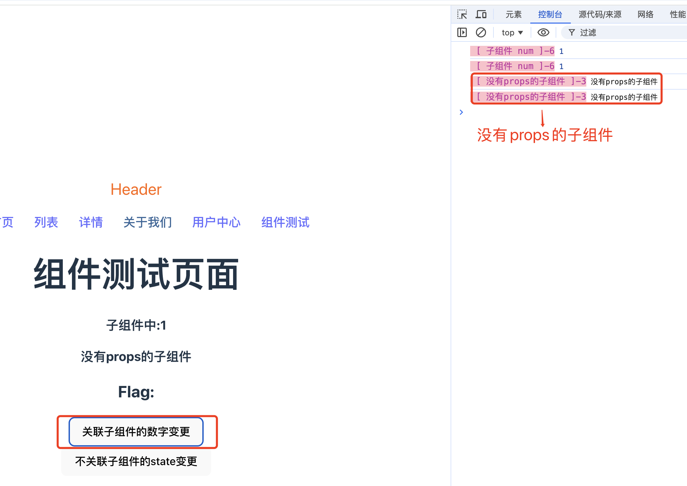
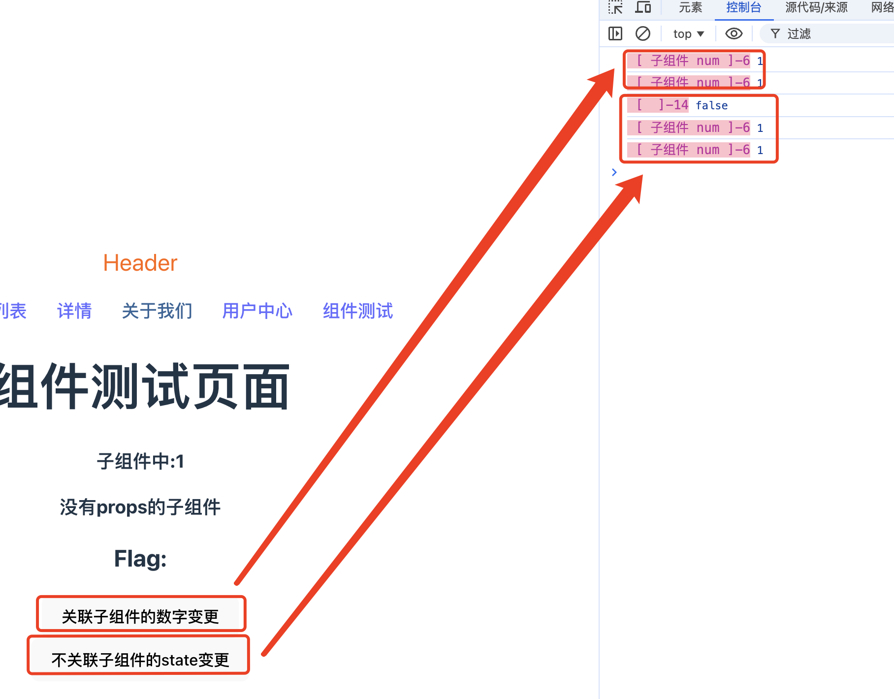
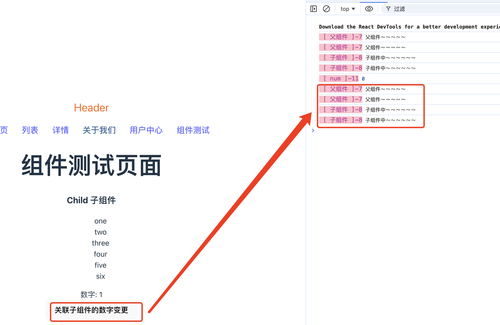
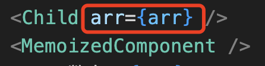
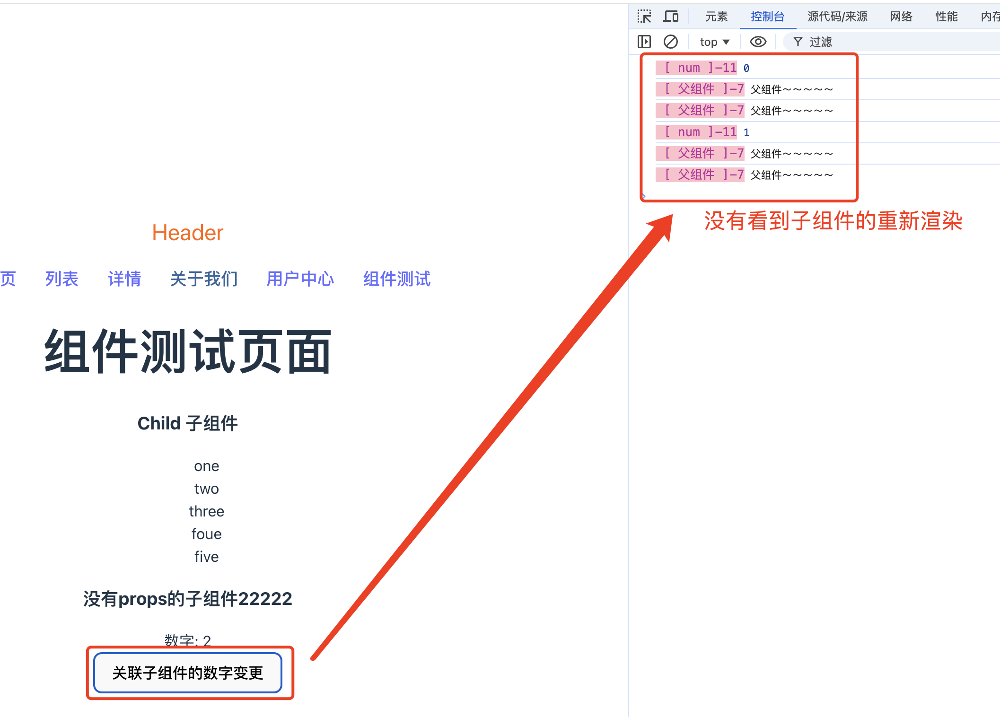
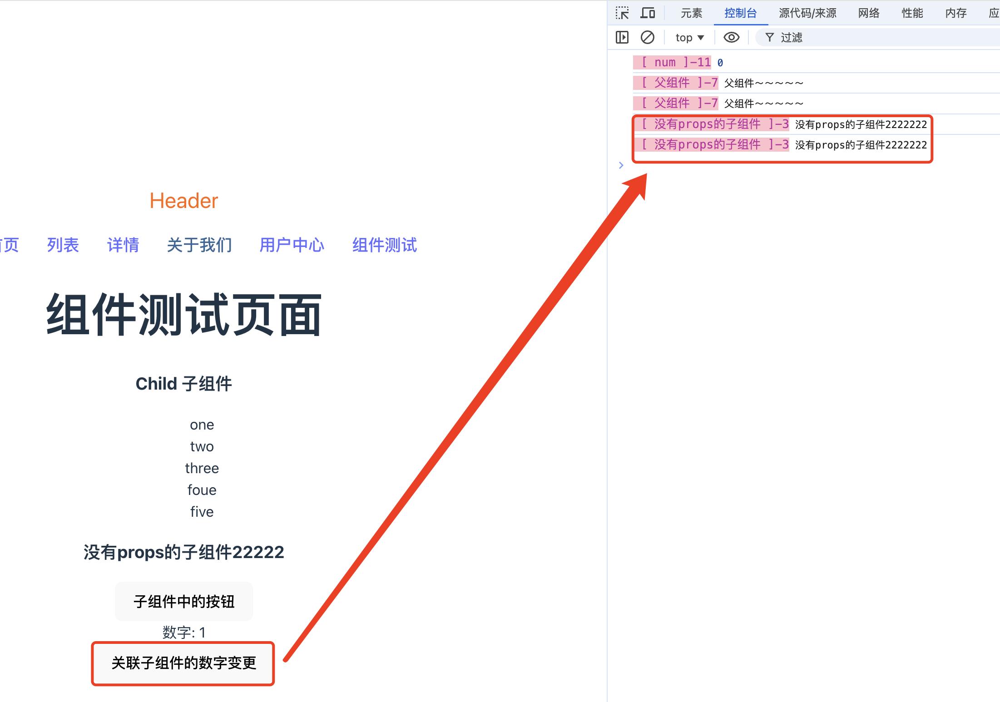
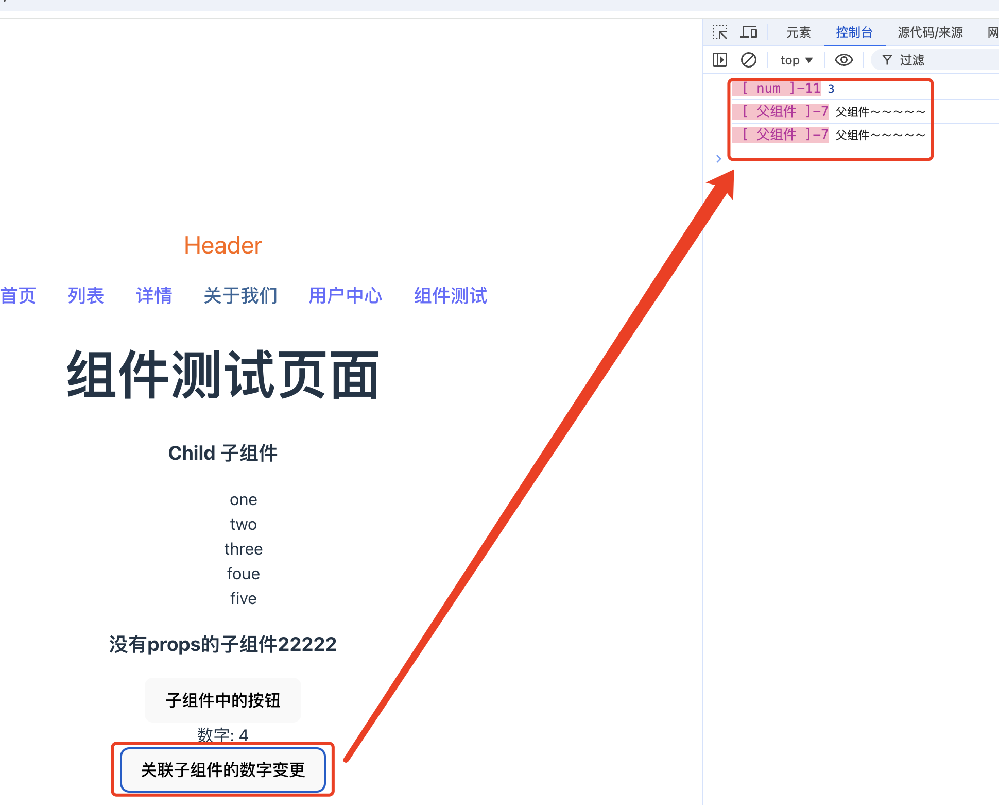

## 1. 简介

当我们使用React UI库编写代码时，无论是组件更新、状态的改变，还是父子组件之间的交互，都会涉及到React的渲染流程。那么我们应该就会有以下的一些疑问：

1. 组件渲染的具体流程是什么？

2. 引起组件重新渲染的因素有哪些？

3. React.memo、useMemo和useCallback等优化手段的原理是什么？怎么利用好它们？

## 2. 渲染过程

### 2.1 初次渲染

首先，我们来定义一个组件:

```tsx
functin Home() {
    return (
        <>
            <div>Home 首页</div>
            <h3>Home组件</h3>
        </>
    )
}
export default Home;
```

当页面初次渲染或者项目初次启动时，React会先创建一个根节点，用来绑定组件,并且使用render函数渲染具体的组件：

```tsx
createRoot(document.getElementById('root')!).render(
  <StrictMode>
    <App />
  </StrictMode>,
)
```

由于我们已经在App组件中引入了Home组件，所以就得到了Home组件中的tsx：

```tsx
<>
    <div>Home 首页</div>
    <h3>Home组件</h3>
</>
```

React会把这段tsx转换为虚拟DOM，即用Javascript对象的方式描述DOM元素：

```js
{
    type: React.Fragment,
    props: {
        children: [
            {type: "div", props: { children: "Home 首页"}},
            {type: "h3", props: { children: "Home组件"}}
        ]
    }
}
```

那么在首次渲染时React会将虚拟DOM转换为真实DOM：

```html
<div id="root">
    <div>Home 首页</div>
    <h3>Home组件</h3>
</div>
```

**为什么组件的tsx元素要放在一对<></>里面？**

Home组件是使用tsx编写的，浏览器没有办法直接识别。React的构建如webpack或者vite会把tsx代码编译为js代码，如果组件的代码不使用<></>包裹，会如下表现形式：

```tsx
functin Home() {
    return (
        <div>Home 首页</div>
        <h3>Home组件</h3>
    )
}
export default Home;
```

运行代码，则会产生一个报错：

```bash
Adjacent JSX elements must be wrapped in an enclosing tag. Did you want a JSX fragment <>...</>
```

因为去掉包裹的元素后，编译的结果是：

```ts
function home(){
    return (
        React.createElement("div", null, "Home 首页"),
        React.createElement("h3", null, "Home组件")
    );
}
```

而在js中，一个函数只允许有一个返回值。所以在一个组件中需要返回多个元素的时候，需要使用一个公共的容器去包裹一下。

### 2.2 更新渲染

React的更新机制可以用一个函数来表示：view=f(state)，view表示页面，state表示数据。在初次渲染以后，state的变化会引起view的变化，也就是说state的变化会引起组件的重新渲染，更深一层的是当且仅有state变化时才会引起组件的重新渲染。当一个组件冲洗渲染时，它的所有的字组件也会重新渲染。

```tsx
// Child.tsx
import { FC } from "react";
interface IChild {
    num: any;
}
const Child: FC<IChild> = ({ num }) => {
    console.log('%c [ 子组件 num ]-6', 'font-size:13px; background:pink; color:#bf2c9f;', num);
    return (
        <h3>
            子组件中:{num}
        </h3>
    )
}

export default Child;

// test.tsx
import { useState } from "react";
import Child from "./components/Child";

function Test() {
    const [num, setNum] = useState<number>(0);
    const [flag, setFlag] = useState<boolean>(false);

    const handleNumChange = () => {
        setNum(num + 1);
    }

    const handleNoRelChange = () => {
        console.log('%c [  ]-14', 'font-size:13px; background:pink; color:#bf2c9f;', flag);
        setFlag(!flag);
    }
    return (
        <>
            <h1>组件测试页面</h1>
            <Child num={num} />
            <h2>Flag: {flag}</h2>
            <button onClick={handleNumChange}>关联子组件的数字变更</button>
            <br />
            <button onClick={handleNoRelChange}>不关联子组件的state变更</button>
        </>
    )
}

export default Test;
```

最后我们点击和子组件有关联props的按钮和没有关联props的按钮，发现子组件都被重新渲染了


没有做动态图，用箭头做了下指向，大家应该可以想象出来这个效果。

1. 父组件的重新渲染，为什么会引起子组件的重新渲染呢？

通过上面的示例后，我们发现当父组件中state变化了以后，也带来了子组件的重新渲染。

我们可以再通过一组没有使用props的子组件，来确认是否因为父组件中影响到了子组件中props而引起了子组件的变化。

```tsx
// Child2.tsx
const Child2 = () => {
    console.log('%c [ 没有props的子组件 ]-3', 'font-size:13px; background:pink; color:#bf2c9f;', "没有props的子组件");
    return (
        <>
            <h3>没有props的子组件</h3>
        </>
    )
}

export default Child2;

// Test.tsx
import { useState } from "react";
import Child from "./components/Child";
import Child2 from "./components/Child2";

function Test() {
    const [num, setNum] = useState<number>(0);
    const [flag, setFlag] = useState<boolean>(false);

    const handleNumChange = () => {
        setNum(num + 1);
    }

    const handleNoRelChange = () => {
        console.log('%c [  ]-14', 'font-size:13px; background:pink; color:#bf2c9f;', flag);
        setFlag(!flag);
    }
    return (
        <>
            <h1>组件测试页面</h1>
            <Child num={num} />
            <Child2 />
            <h2>Flag: {flag}</h2>
            <button onClick={handleNumChange}>关联子组件的数字变更</button>
            <br />
            <button onClick={handleNoRelChange}>不关联子组件的state变更</button>
        </>
    )
}

export default Test;
```



发现没有使用props的子组件，在父组件重新渲染的时候，子组件也重新渲染了。那么就可以得出一个结论，就是子组件的重新渲染与是否使用props是没有关系的。

到这里，我们就会有一个疑问，明明子组件Child2没有发生任何变化，为什么要对它重新渲染呢？<font color="#f20">因为React没有办法知道子组件中是否使用了变化的state。</font>

## 3. 如何避免不必要的渲染？

既然我们知道了一些场景是不需要子组件重新渲染的，那么有没有办法阻止它们重新渲染呢？

### 3.1 React.memo

我们可以通过React.memo，让只有props变化的组件去重新渲染，具体方法如下：

```tsx
const MemoizedComponent = React.memo(Child2);
export default MemoizedComponent;
// 也可以是
export default memo(Child2);
```



点击按钮，无论是有关联state的变更，还是没有有关联的state的按钮，使用了memo的子组件都没有重新渲染。

当把组件使用React.memo包裹之后，就相当于开启了React的记忆功能。React在初次渲染之后会记住当前组件的返回值，当父组件重新渲染时，如果传递过来的props值没有改变，则该组件就不需要重新渲染。

那有另外一个问题，为什么要开启React的记忆功能，让没有变更props的子组件不重新渲染，那么为什么不直接只更新有props变更的子组件呢？这样对性能来说不是更友好吗？

当我们使用React.memo后，React每次渲染前，都会比较props值是否发生了变化，假设一个父组件拥有很多个子组件，那么在每次渲染该组件时，要单独对比每个字组件的props值是否有更新。此外，React还需要记住每个组件的返回值，因此，虽然节省了组件重新渲染的消耗，但是也增加了许多其他的负担。也可能是因此React没有默认开启这一次策略吧。

### 3.2 useMemo和useCallback

看一段代码：

```tsx
// Child.tsx
import { FC, memo } from "react";
interface IChild {
    num?: any;
    arr?: string [];
}
const Child: FC<IChild> = ({ arr }) => {
    console.log('%c [ 子组件 ]-8', 'font-size:13px; background:pink; color:#bf2c9f;', "子组件中～～～～～～");
    return (
        <>
            <h3>Child 子组件</h3>
            <ul>
                {
                    arr && arr.map((item,index) => (
                        <li key={index}>{item}</li>
                    ))
                }
            </ul>
        </>
    )
}

export default memo(Child);

// test.tsx
import { useState } from "react";
import Child from "./components/Child";

function Test() {
    console.log('%c [ 父组件 ]-7', 'font-size:13px; background:pink; color:#bf2c9f;', "父组件～～～～～");
    const arr = ["one", "two", "three", "four", "five", "six"];
    const [num, setNum] = useState<number>(0);

    const handleClick = () => {
        console.log('%c [ num ]-11', 'font-size:13px; background:pink; color:#bf2c9f;', num);
        setNum(num + 1);
    }
    return (
        <>
            <h1>组件测试页面</h1>
            <Child arr={arr} />
            <div>数字: {num}</div>
            <button onClick={handleClick}>关联子组件的数字变更</button>
        </>
    )
}

export default Test;
```

看下运行结果：



按理说呢，点击了按钮，子组件Child是没有props的变化的，那么它就不应该被重新渲染。但事实上，父组件state变更之后，子组件也跟着重新渲染了。代码中呢，子组件Child也是被memo包裹了的，但是该子组件接收了一个props：arr。

这个和之前的父组件更新子组件不重新渲染有一个区别，就是子组件有没有传递props。



为什么子组件差了个props之后，memo的作用就没有了呢？

看下面的案例：

```js
function newArr() {
    const arr = ["one", "two", "three", "foue", "five"];
    return arr;
}

const res1 = newArr();
const res2 = newArr();
console.log('%c [  ]-11', 'font-size:13px; background:pink; color:#bf2c9f;', res1 === res2); // false
```

从结论上来看，同一个函数返回相同的值的数组，但是确不相等。这是因为js中使用===比较对象时，比较的不是对象的值，而是它们的引用地址。每当我们调用newArr函数时，都会创建一个新的数组的实例，这个新的数组的实例会被分配到不同的内存地址。即使这些数组的值完全相同，但是它们在不同的内存地址，所以对它们做全等性比较的时候，也是不同的。

而在React中，组件的本质就是js函数，对组件的引用就是对函数的调用。因此每当父组件重新渲染时，在这个组件中定义的所有的数据都会被重新创建一遍。那么回到我们的案例，每当Test组件重新渲染时，都会创建一个新的数组arr，那么其子组件Child从父组件中获取的props arr也是新的数据，所以子组件Child重新渲染了。

**为了这种没有本质上的更新导致的重新渲染，可以使用useMemo来避免该问题。**

1. useMemo

我们在父组件中将需要传递给子组件的数据，使用useMemo包裹起来：

```tsx
import { useMemo, useState } from "react";
import Child from "./components/Child";
import MemoizedComponent from "./components/Child2";

function Test() {
    console.log('%c [ 父组件 ]-7', 'font-size:13px; background:pink; color:#bf2c9f;', "父组件～～～～～");
    // 使用useMemo将数据包裹起来
    const arr = useMemo(() => ["one", "two", "three", "foue", "five"], []);

    const [num, setNum] = useState<number>(0);

    const handleClick = () => {
        console.log('%c [ num ]-11', 'font-size:13px; background:pink; color:#bf2c9f;', num);
        setNum(num + 1);
    }
    return (
        <>
            <button onClick={handleClick}>关联子组件的数字变更</button>
        </>
    )
}

export default Test;
```

看运行结果:



然后，我们没有看到子组件的重新渲染。

useMemo可以接收2个参数，第一个参数是函数，第2个参数是一个依赖项数组，在组件首次渲染时，React会把useMemo的返回值记录下来，此后在组件重新渲染时，都会使用之前记录的返回值，除非依赖项发生变化。

2. useCallback

useCallback是一个与useMemo功能类似的hook，它可以用来缓存函数。在组件中，会定义很多函数，有时候需要把某些函数传递给子组件，如果不对函数进行缓存，也可能会导致子组件进行无谓的重新渲染。因为子组件在比较传递过来的函数时，也是通过比较引用地址的。

```tsx
// import React, { FC } from "react";

interface IChild2 {
    onClick?: any;
}

const Child2: FC<IChild2> = ({ onClick }) => {
    console.log('%c [ 没有props的子组件 ]-3', 'font-size:13px; background:pink; color:#bf2c9f;', "没有props的子组件2222222");
    return (
        <>
            <h3>没有props的子组件22222</h3>
            <button>子组件中的按钮</button>
        </>
    )
}

const MemoizedComponent = React.memo(Child2);

export default MemoizedComponent;


// test.tsx
import { useMemo, useState } from "react";
import Child from "./components/Child";
import MemoizedComponent from "./components/Child2";

function Test() {
    console.log('%c [ 父组件 ]-7', 'font-size:13px; background:pink; color:#bf2c9f;', "父组件～～～～～");
    // const arr = ["one", "two", "three", "four", "five", "six"];
    const arr = useMemo(() => ["one", "two", "three", "foue", "five"], []);

    const [num, setNum] = useState<number>(0);

    const handleClick = () => {
        console.log('%c [ num ]-11', 'font-size:13px; background:pink; color:#bf2c9f;', num);
        setNum(num + 1);
    }

    const handleChildClick = () => {
        
    };
    return (
        <>
            <h1>组件测试页面</h1>
            <Child arr={arr} />
            <MemoizedComponent onClick={handleChildClick} />
            <div>数字: {num}</div>
            <button onClick={handleClick}>关联子组件的数字变更</button>
        </>
    )
}

export default Test;
```

在demo中，我们把原来没有接收props组件的子组件，接收了1个函数prop，然后在点击父组件中按钮的时候，子组件也重新渲染了。



然后我们尝试把传递给子组件的函数使用useCallback包裹起来，看下效果：

```tsx
import { useCallback, useMemo, useState } from "react";
import Child from "./components/Child";
import MemoizedComponent from "./components/Child2";

function Test() {
    console.log('%c [ 父组件 ]-7', 'font-size:13px; background:pink; color:#bf2c9f;', "父组件～～～～～");
    const arr = useMemo(() => ["one", "two", "three", "foue", "five"], []);

    const [num, setNum] = useState<number>(0);

    const handleClick = () => {
        console.log('%c [ num ]-11', 'font-size:13px; background:pink; color:#bf2c9f;', num);
        setNum(num + 1);
    }
    const handleChildClick = useCallback(() => {
        
    }, []);
    return (
        <>
            <h1>组件测试页面</h1>
            <Child arr={arr} />
            <MemoizedComponent onClick={handleChildClick} />
            <div>数字: {num}</div>
            <button onClick={handleClick}>关联子组件的数字变更</button>
        </>
    )
}

export default Test;
```

我们将传递给子组件的函数使用useCallback包裹了起来，看下效果：



我们发现当使用了useCallback之后，子组件就没有再重新渲染了。

**什么时候使用useMemo和useCallback这2个hooks呢？**

useMemo常用于缓存复杂计算的结果，以免重复计算；useCallback用于缓存函数实例，适合在将回调函数传递给子组件的时候使用，以避免子组件不必要的重复渲染。在平时的开发中，不需要把每一个对象或者函数都用这些hooks包裹起来，因为React本身有很多优化措施。当网站的性能出现问题时，或者子组件渲染过多时，可以考虑使用这些hooks进行优化。

## 4. 总结

React渲染组件时，首先会执行函数组件，生成一个虚拟DOM树，以描述组件的结构。接着会将其与旧的虚拟DOM树对比，找到需要更新的部分，修改页面。只有state的改变会引起组件的重新渲染，并且它的所有子组件也会被重新渲染。如果想优化这一过程，可以使用React.memo、useDemo或者useCallback这3种方法对应不同的场景。深入理解React的渲染原理，有助于我们快速定位性能瓶颈，解决复杂场景中的问题。