<!-- START doctoc generated TOC please keep comment here to allow auto update -->
<!-- DON'T EDIT THIS SECTION, INSTEAD RE-RUN doctoc TO UPDATE -->
**Table of Contents**  *generated with [DocToc](https://github.com/thlorenz/doctoc)*

- [1. React全家桶](#1-react%E5%85%A8%E5%AE%B6%E6%A1%B6)
  - [1.1 React是什么？](#11-react%E6%98%AF%E4%BB%80%E4%B9%88)
  - [1.2 起源](#12-%E8%B5%B7%E6%BA%90)
  - [1.3 价值](#13-%E4%BB%B7%E5%80%BC)
  - [1.4 React特点](#14-react%E7%89%B9%E7%82%B9)
  - [1.5 学习React的需要准备的JS基础知识](#15-%E5%AD%A6%E4%B9%A0react%E7%9A%84%E9%9C%80%E8%A6%81%E5%87%86%E5%A4%87%E7%9A%84js%E5%9F%BA%E7%A1%80%E7%9F%A5%E8%AF%86)
- [2.React基础](#2react%E5%9F%BA%E7%A1%80)
  - [2.1 基本介绍](#21-%E5%9F%BA%E6%9C%AC%E4%BB%8B%E7%BB%8D)
    - [2.1.1 官网](#211-%E5%AE%98%E7%BD%91)
    - [2.1.2 介绍](#212-%E4%BB%8B%E7%BB%8D)
    - [2.1.3 React特点](#213-react%E7%89%B9%E7%82%B9)
    - [2.1.4 React高效的原因](#214-react%E9%AB%98%E6%95%88%E7%9A%84%E5%8E%9F%E5%9B%A0)
  - [2.2 React基本使用](#22-react%E5%9F%BA%E6%9C%AC%E4%BD%BF%E7%94%A8)
    - [2.2.1 效果](#221-%E6%95%88%E6%9E%9C)
    - [2.2.2 相关js库](#222-%E7%9B%B8%E5%85%B3js%E5%BA%93)
    - [2.2.3 创建虚拟DOM的两种方式](#223-%E5%88%9B%E5%BB%BA%E8%99%9A%E6%8B%9Fdom%E7%9A%84%E4%B8%A4%E7%A7%8D%E6%96%B9%E5%BC%8F)
  - [2.3 React JSX](#23-react-jsx)
    - [2.3.1 效果](#231-%E6%95%88%E6%9E%9C)
    - [2.3.2 JSX](#232-jsx)
    - [2.3.3 渲染虚拟DOM（元素）](#233-%E6%B8%B2%E6%9F%93%E8%99%9A%E6%8B%9Fdom%E5%85%83%E7%B4%A0)
    - [2.3.4 JSX demo](#234-jsx-demo)
  - [2.4 模块与组件和模块化与组件化的理解](#24-%E6%A8%A1%E5%9D%97%E4%B8%8E%E7%BB%84%E4%BB%B6%E5%92%8C%E6%A8%A1%E5%9D%97%E5%8C%96%E4%B8%8E%E7%BB%84%E4%BB%B6%E5%8C%96%E7%9A%84%E7%90%86%E8%A7%A3)
    - [2.4.1 模块](#241-%E6%A8%A1%E5%9D%97)
    - [2.4.2 组件](#242-%E7%BB%84%E4%BB%B6)
    - [2.4.3 模块化](#243-%E6%A8%A1%E5%9D%97%E5%8C%96)
    - [2.4.4 组件化](#244-%E7%BB%84%E4%BB%B6%E5%8C%96)
- [3. React面向组件编程](#3-react%E9%9D%A2%E5%90%91%E7%BB%84%E4%BB%B6%E7%BC%96%E7%A8%8B)
  - [3.1 基本理解和使用](#31-%E5%9F%BA%E6%9C%AC%E7%90%86%E8%A7%A3%E5%92%8C%E4%BD%BF%E7%94%A8)
  - [3.2 组件实例的三大核心属性之一：state](#32-%E7%BB%84%E4%BB%B6%E5%AE%9E%E4%BE%8B%E7%9A%84%E4%B8%89%E5%A4%A7%E6%A0%B8%E5%BF%83%E5%B1%9E%E6%80%A7%E4%B9%8B%E4%B8%80state)
  - [3.3 组件实例的三大核心属性之二：props](#33-%E7%BB%84%E4%BB%B6%E5%AE%9E%E4%BE%8B%E7%9A%84%E4%B8%89%E5%A4%A7%E6%A0%B8%E5%BF%83%E5%B1%9E%E6%80%A7%E4%B9%8B%E4%BA%8Cprops)
  - [3.4 组件实例的三大核心属性之三：refs与事件处理](#34-%E7%BB%84%E4%BB%B6%E5%AE%9E%E4%BE%8B%E7%9A%84%E4%B8%89%E5%A4%A7%E6%A0%B8%E5%BF%83%E5%B1%9E%E6%80%A7%E4%B9%8B%E4%B8%89refs%E4%B8%8E%E4%BA%8B%E4%BB%B6%E5%A4%84%E7%90%86)
    - [3.4.1 理解](#341-%E7%90%86%E8%A7%A3)
    - [3.4.2 使用](#342-%E4%BD%BF%E7%94%A8)
    - [3.4.3 使用ref时注意](#343-%E4%BD%BF%E7%94%A8ref%E6%97%B6%E6%B3%A8%E6%84%8F)
    - [3.4.4 React中的事件处理](#344-react%E4%B8%AD%E7%9A%84%E4%BA%8B%E4%BB%B6%E5%A4%84%E7%90%86)
  - [3.5 收集表单数据](#35-%E6%94%B6%E9%9B%86%E8%A1%A8%E5%8D%95%E6%95%B0%E6%8D%AE)
  - [3.6 组件生命周期](#36-%E7%BB%84%E4%BB%B6%E7%94%9F%E5%91%BD%E5%91%A8%E6%9C%9F)
    - [3.6.1 高阶函数](#361-%E9%AB%98%E9%98%B6%E5%87%BD%E6%95%B0)
    - [3.6.2 函数柯里化](#362-%E5%87%BD%E6%95%B0%E6%9F%AF%E9%87%8C%E5%8C%96)
    - [3.6.3 生命周期](#363-%E7%94%9F%E5%91%BD%E5%91%A8%E6%9C%9F)
    - [3.6.4 react新版本的生命周期（v17.0.2）](#364-react%E6%96%B0%E7%89%88%E6%9C%AC%E7%9A%84%E7%94%9F%E5%91%BD%E5%91%A8%E6%9C%9Fv1702)
  - [3.7 虚拟DOM与DOM diff算法](#37-%E8%99%9A%E6%8B%9Fdom%E4%B8%8Edom-diff%E7%AE%97%E6%B3%95)
- [4. React应用：基于React脚手架](#4-react%E5%BA%94%E7%94%A8%E5%9F%BA%E4%BA%8Ereact%E8%84%9A%E6%89%8B%E6%9E%B6)
  - [4.1 使用create-react-app创建react应用](#41-%E4%BD%BF%E7%94%A8create-react-app%E5%88%9B%E5%BB%BAreact%E5%BA%94%E7%94%A8)
    - [4.1.1 react脚手架](#411-react%E8%84%9A%E6%89%8B%E6%9E%B6)
    - [4.1.2 创建并启动项目](#412-%E5%88%9B%E5%BB%BA%E5%B9%B6%E5%90%AF%E5%8A%A8%E9%A1%B9%E7%9B%AE)
    - [4.1.3 react项目文件分析](#413-react%E9%A1%B9%E7%9B%AE%E6%96%87%E4%BB%B6%E5%88%86%E6%9E%90)
    - [4.1.4 样式的模块化](#414-%E6%A0%B7%E5%BC%8F%E7%9A%84%E6%A8%A1%E5%9D%97%E5%8C%96)
    - [4.1.5 react应用中样式应用](#415-react%E5%BA%94%E7%94%A8%E4%B8%AD%E6%A0%B7%E5%BC%8F%E5%BA%94%E7%94%A8)
    - [4.1.6 功能界面的组件化编程流程](#416-%E5%8A%9F%E8%83%BD%E7%95%8C%E9%9D%A2%E7%9A%84%E7%BB%84%E4%BB%B6%E5%8C%96%E7%BC%96%E7%A8%8B%E6%B5%81%E7%A8%8B)
  - [4.2 TodoList 案例](#42-todolist-%E6%A1%88%E4%BE%8B)
    - [4.2.1 父子组件之间的通信](#421-%E7%88%B6%E5%AD%90%E7%BB%84%E4%BB%B6%E4%B9%8B%E9%97%B4%E7%9A%84%E9%80%9A%E4%BF%A1)
    - [4.2.2 生成唯一值](#422-%E7%94%9F%E6%88%90%E5%94%AF%E4%B8%80%E5%80%BC)
    - [4.2.3 react中事件](#423-react%E4%B8%AD%E4%BA%8B%E4%BB%B6)
    - [4.2.4 checkbox控件的defaultChecked和checked属性](#424-checkbox%E6%8E%A7%E4%BB%B6%E7%9A%84defaultchecked%E5%92%8Cchecked%E5%B1%9E%E6%80%A7)
- [5. React Ajax](#5-react-ajax)
  - [5.1 理解](#51-%E7%90%86%E8%A7%A3)
    - [5.1.1 前置说明](#511-%E5%89%8D%E7%BD%AE%E8%AF%B4%E6%98%8E)
    - [5.1.2 常用的ajax请求库](#512-%E5%B8%B8%E7%94%A8%E7%9A%84ajax%E8%AF%B7%E6%B1%82%E5%BA%93)
  - [5.2 axios库](#52-axios%E5%BA%93)
  - [5.3 配置代理](#53-%E9%85%8D%E7%BD%AE%E4%BB%A3%E7%90%86)
  - [5.4 消息订阅-发布机制](#54-%E6%B6%88%E6%81%AF%E8%AE%A2%E9%98%85-%E5%8F%91%E5%B8%83%E6%9C%BA%E5%88%B6)
- [6. react-router   路由](#6-react-router---%E8%B7%AF%E7%94%B1)
  - [6.1 相关理解](#61-%E7%9B%B8%E5%85%B3%E7%90%86%E8%A7%A3)
    - [6.1.1 SPA的理解](#611-spa%E7%9A%84%E7%90%86%E8%A7%A3)
    - [6.1.2 路由的理解](#612-%E8%B7%AF%E7%94%B1%E7%9A%84%E7%90%86%E8%A7%A3)
    - [6.1.3 react-router的理解](#613-react-router%E7%9A%84%E7%90%86%E8%A7%A3)
  - [6.2 react-router相关API](#62-react-router%E7%9B%B8%E5%85%B3api)
    - [6.2.1 内置组件](#621-%E5%86%85%E7%BD%AE%E7%BB%84%E4%BB%B6)
    - [6.2.2 其他](#622-%E5%85%B6%E4%BB%96)
  - [6.3 基本的路由使用](#63-%E5%9F%BA%E6%9C%AC%E7%9A%84%E8%B7%AF%E7%94%B1%E4%BD%BF%E7%94%A8)
  - [6.4 嵌套路由使用](#64-%E5%B5%8C%E5%A5%97%E8%B7%AF%E7%94%B1%E4%BD%BF%E7%94%A8)
  - [6.5 向路由组件传递参数数据](#65-%E5%90%91%E8%B7%AF%E7%94%B1%E7%BB%84%E4%BB%B6%E4%BC%A0%E9%80%92%E5%8F%82%E6%95%B0%E6%95%B0%E6%8D%AE)
    - [6.5.1 通过params方式传递参数](#651-%E9%80%9A%E8%BF%87params%E6%96%B9%E5%BC%8F%E4%BC%A0%E9%80%92%E5%8F%82%E6%95%B0)
    - [6.5.2 search参数](#652-search%E5%8F%82%E6%95%B0)
    - [6.5.3 state参数](#653-state%E5%8F%82%E6%95%B0)
    - [6.5.4 向路由传递参数总结](#654-%E5%90%91%E8%B7%AF%E7%94%B1%E4%BC%A0%E9%80%92%E5%8F%82%E6%95%B0%E6%80%BB%E7%BB%93)
  - [6.6 多种路由跳转方式](#66-%E5%A4%9A%E7%A7%8D%E8%B7%AF%E7%94%B1%E8%B7%B3%E8%BD%AC%E6%96%B9%E5%BC%8F)
    - [6.6.1 编程式导航](#661-%E7%BC%96%E7%A8%8B%E5%BC%8F%E5%AF%BC%E8%88%AA)
    - [6.6.2 withRouter的使用](#662-withrouter%E7%9A%84%E4%BD%BF%E7%94%A8)
  - [6.7 BrowserRouter和HashRouter](#67-browserrouter%E5%92%8Chashrouter)
- [7. redux](#7-redux)
  - [7.1 redux理解](#71-redux%E7%90%86%E8%A7%A3)
    - [7.1.1 学习文档](#711-%E5%AD%A6%E4%B9%A0%E6%96%87%E6%A1%A3)
    - [7.1.2 redux是什么？](#712-redux%E6%98%AF%E4%BB%80%E4%B9%88)
    - [7.1.3 什么情况下需要使用redux](#713-%E4%BB%80%E4%B9%88%E6%83%85%E5%86%B5%E4%B8%8B%E9%9C%80%E8%A6%81%E4%BD%BF%E7%94%A8redux)
    - [7.1.4 redux工作流程](#714-redux%E5%B7%A5%E4%BD%9C%E6%B5%81%E7%A8%8B)
  - [7.2 redux的三个核心概念](#72-redux%E7%9A%84%E4%B8%89%E4%B8%AA%E6%A0%B8%E5%BF%83%E6%A6%82%E5%BF%B5)
    - [7.2.1 action](#721-action)
    - [7.2.2 reducer](#722-reducer)
    - [7.2.3 store](#723-store)
  - [7.3 redux的核心API](#73-redux%E7%9A%84%E6%A0%B8%E5%BF%83api)
  - [7.4 使用redux编写应用](#74-%E4%BD%BF%E7%94%A8redux%E7%BC%96%E5%86%99%E5%BA%94%E7%94%A8)
  - [7.5 redux异步编程](#75-redux%E5%BC%82%E6%AD%A5%E7%BC%96%E7%A8%8B)
  - [7.6 react-redux](#76-react-redux)
  - [7.7 使用redux调试工具](#77-%E4%BD%BF%E7%94%A8redux%E8%B0%83%E8%AF%95%E5%B7%A5%E5%85%B7)
  - [7.8 纯函数和高阶函数](#78-%E7%BA%AF%E5%87%BD%E6%95%B0%E5%92%8C%E9%AB%98%E9%98%B6%E5%87%BD%E6%95%B0)
    - [7.8.1 纯函数](#781-%E7%BA%AF%E5%87%BD%E6%95%B0)
    - [7.8.2 高阶函数](#782-%E9%AB%98%E9%98%B6%E5%87%BD%E6%95%B0)
- [8. 项目部署](#8-%E9%A1%B9%E7%9B%AE%E9%83%A8%E7%BD%B2)

<!-- END doctoc generated TOC please keep comment here to allow auto update -->

### 1. React全家桶

React基础

React-router

PubSub 消息管理

Redux 集中式状态管理

Ant-Design UI库

#### 1.1 React是什么？

学习react之前，推荐一个前端资源库的CDN：https://www.bootcdn.cn/

用户构建用户界面的Js库

React只关注视图、只关注页面

React是一个将数据渲染为HTML视图的开源Javascript库

> 几个重点网站：
>
> React-router文档：https://reactrouter.com/docs/en/v6
>
> React：https://reactjs.org/
>
> 建议大家尽量看英文文档，穿一手鞋，不穿二手鞋。

#### 1.2 起源

facebook公司推出的。

facebook2011年部署在newsfeed

2012年部署了Instgram

2013年5月开源了

React被国际上广大互联网一线大厂使用。

#### 1.3 价值

* 原生js开发，效率低，DOM操作繁琐
  * React、Vue等UI库、框架之前的前端开发，是通过DOM API操作UI
* 使用js操作DOM，浏览器会进行大量的重绘重排，严重影响性能；
* 原生js没有组件化解决方案，代码复用率低；

#### 1.4 React特点

* 采用组件式模式、声明式编码，提高开发效率和组件复用率；
* React Native中可以使用React语法进行移动端开发；
* 使用虚拟DOM+优秀的Diff算法，尽量减少与真实DOM的交互；

#### 1.5 学习React的需要准备的JS基础知识

判断this的指向

class（类）

ES6语法规范

npm包管理器

原型、原型链

数组常用方法

模块化

### 2.React基础

#### 2.1 基本介绍

##### 2.1.1 官网

https://reactjs.org/

https://react.docschina.org/

React CDN：https://unpkg.com/

##### 2.1.2 介绍

用于动态构建用户界面的javascript库，只关注视图

由facebook在2013年5月开源

##### 2.1.3 React特点

* 声明式编码
* 组件化编码
* 开用React Native编写原生应用
* 高效：优秀的diff算法和虚拟DOM

##### 2.1.4 React高效的原因

* 使用虚拟DOM，不总是直接操作页面的真实DOM
* DOM的diff算法，最小化的页面重绘

#### 2.2 React基本使用

##### 2.2.1 效果

JSX：开源像写js一样写jsx。jsx本身就是js的一写扩展，多了一些规则而已，可以像写js一样写jsx。

```html
    <!--容器-->
    <div id="app"></div>

    <!--
        引入react库时，注意引入的顺序：
        1. 引入react和辛库
        2. 引入react的扩展库：react-dom,让react具有操作DOM的能力
        3. 再引入扩展工具：babel.min.js
    -->
    <!--引入React核心库-->
    <script src="./js/react.development.js"></script>
    <!--引入react扩展库react-dom,支持react操作DOM-->
    <script src="./js/react-dom.development.js"></script>
    <!--引入babel，将jsx转为js-->
    <script src="./js/babel.min.js"></script>
    <!--
        type写成text/babel，表示这是jsx类型的代码，且使用babel进行转换
        type属性一定要写，默认为js
    -->
    <script type="text/babel">
      // 1. 创建虚拟DOM
      const VDOM = (
        <h1>Hello React</h1>
      ); /* 这里是jsx，不是js中的字符串，不要使用引号 */
      // 2. 渲染虚拟DOM到页面
      ReactDOM.render(VDOM, document.querySelector("#app"));
    </script>
```

效果：

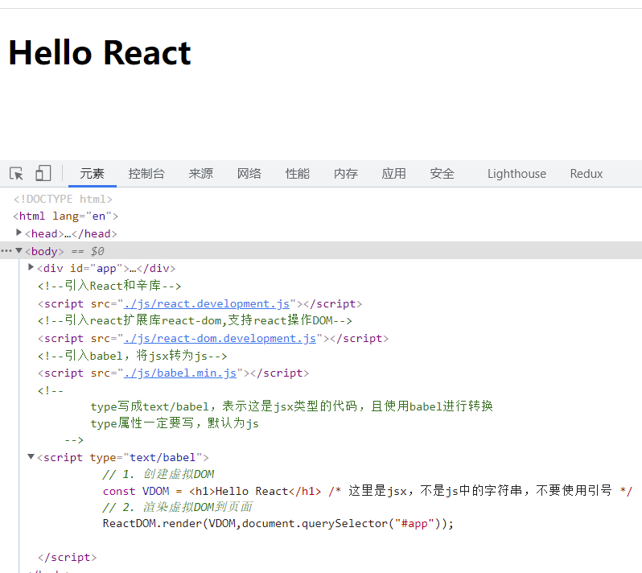

##### 2.2.2 相关js库

react.development.js  react核心库

react-dom.development.js react扩展库，让react具备操作DOM的能力

babel.min.js react的转换工具，可以从https://www.babeljs.cn/setup这里获取

##### 2.2.3 创建虚拟DOM的两种方式

1. 纯js的方式：一般不会用

   ```html
   <!--创建react应用的容器-->
   <div id="app"></div>
   
   <!--引入react库，注意先后顺序：核心库、扩展库-->
   <script src="../js/react.development.js"></script>
   <script src="../js/react-dom.development.js"></script>
   <!--不需要引入转换工具了，因为babel的目标是把jsx转换成js，而现在我们直接使用js，所以不需要转换了-->
   <!-- <script src="../js/babel.min.js"></script> -->
   
   <!--type可以省略了，或者显示设置成text/javascript-->
   <script type="text/javascript">
       // 1. 以js的方式创建虚拟DOM
   
       /**
          * React.createElement()接收3各参数，分别为：
          * 标签名  string
          * 标签属性 object
          * 标签内容 any
          */
       const vd = React.createElement("h1",{id: "js"},"以js的方式创建虚拟DOM");
       // 2. 渲染虚拟DOM到页面
       ReactDOM.render(vd,document.querySelector("#app"));
   </script>
   ```

   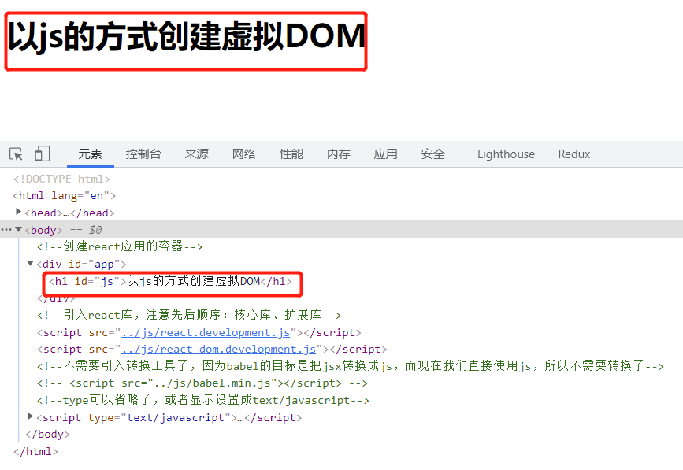

2. JSX方式，推荐使用

   ```html
   <!--创建react应用的容器-->
   <div id="app"></div>
   
   <!--引入react库，注意引入顺序：核心库、扩展库、转换工具-->
   <script src="../js/react.development.js"></script>
   <script src="../js/react-dom.development.js"></script>
   <script src="../js/babel.min.js"></script>
   <script type="text/babel">
         const vd = <h1 id="jsx">使用JSX方式创建虚拟DOM</h1>;
         ReactDOM.render(vd, document.querySelector("#app"));
   </script>
   ```

   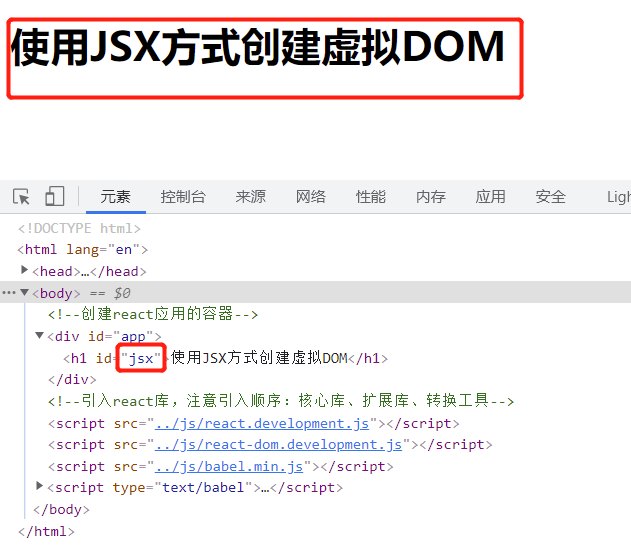

实际代码中，推荐jsx的方式，因为如果有多层标签嵌套的时候，jsx可以直接按照真实的结构去写代码，简单；而js创建虚拟DOM就不一样了，需要多层都通过React.createElement()方法去创建标签。

JSX的主要作用，就是为了创建虚拟DOM，让我们开发代码更简单。

jsx在写的代码片段较长时，可以像写HTML一样进行折行书写，只是这个时候需要把jsx使用()包裹起来.

```html
<!--创建react应用的容器-->
<div id="app"></div>

<!--引入react库，注意引入顺序：核心库、扩展库、转换工具-->
<script src="../js/react.development.js"></script>
<script src="../js/react-dom.development.js"></script>
<script src="../js/babel.min.js"></script>
<script type="text/babel">
      const vd = (
        <h1 id="jsx">
          <span className="text">使用JSX方式创建虚拟DOM</span>
    </h1>
      );
      ReactDOM.render(vd, document.querySelector("#app"));
</script>
```

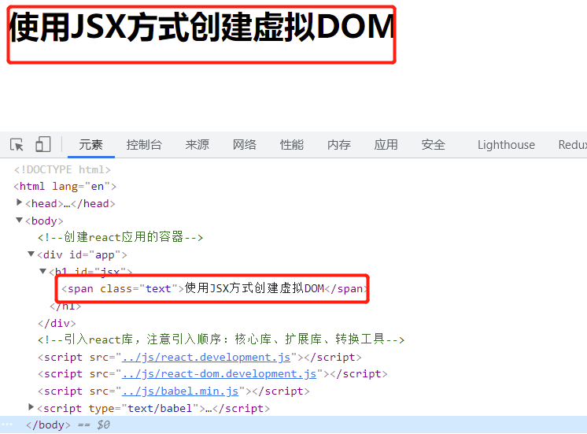

**关于虚拟DOM**

1. 本质是一般的Object对象；
2. 虚拟DOM本身比较轻量，真实DOM相对较重。因为虚拟DOM主要是为了供react内部使用，够React使用就可以了；但是真实DOM需要考虑兼容很多种场景，有了较多的冗余属性，导致了较多的属性，显得较重；
3. 虚拟DOM最终会被React渲染成真实DOM，呈现在页面上； --- 虚拟DOM是保存在内存中

#### 2.3 React JSX

1. 全称：Javascript XML
2. 是react定义的一种类似xml的js扩展语法：Js + XML
3. 本质是React.createElement(component,props,...children)方法的语法糖
4. 作用：用来简化创建虚拟DOM
   1. 写法：var element = <h1>Hello React JSX</h1>
   2. 注意：
      1. 它不是字符串，也不是HTML、XML标签
      2. 它最终产生的就是一个普通的Object对象
5. 标签名任意：可以是HTML标签或者其他标签

##### 2.3.1 效果

##### 2.3.2 JSX

jsx语法规则

1. 定义jsx时不要使用引号，因为它不是字符串

2. jsx如果需要混用js变量，那么js变量需要使用{}包裹起来，{}内也可以使用js表达式

   1. 标签中混入js表达式时使用{}包裹

3. 通过类来指定样式时，使用className，不要使用class，且属性值不需要使用{}包裹，正常使用引号即可

4. 内联样式，要用style={{key:value}}的形式去写：外层的{}表示要使用js表达式了，内层的{}表示js对象，css的属性本身是key：value的形式

5. 虚拟DOM必须只能有1个根标签

6. 标签必须闭合

7. 标签首字母：

   1. 如果首字母是小写字母，则将标签转换为HTML中的同名元素；如果HTML没有对应的同名元素，则浏览器会报错

      1. 也就是说，jsx中，如果首字母是小写，那么只能使用html中有的元素，html中没有的标签元素，jsx中不要随便使用

   2. 如果大写字母开头，就去渲染对应的组件

      1. 如果组件没有定义，则报错

         ```react
             <style>
               .title {
                 color: #f20;
                 font-size: 32px;
               }
             </style>
           </head>
           <body>
             <!--react应用容器-->
             <div id="app"></div>
         
             <!--导入react库-->
             <script src="../js/react.development.js"></script>
             <script src="../js/react-dom.development.js"></script>
             <script src="../js/babel.min.js"></script>
         
             <script type="text/babel">
               const propId = "msg";
               const data = "Hello React!";
               // 创建虚拟DOM
               const VDOM = (
                 // 只能有1个根元素
                 <div>
                   {/*使用js变量时，要使用{}包裹*/}
                   <h2 id={msg}>
                     {/*
                         内联属性，使用双层的{},外层的{}表示要使用js表达式了，内层的{}表示这是一个对象
                         内联属性如果是多个单词组成，则使用小驼峰的命名规则
                         如果希望通过类（class）来控制样式，需要使用className作为属性名，而不能直接使用class
                     */}
                     <span style={{ padding: "10px", fontStyle: "italic" }}>{data}</span>
                   </h2>
                   {/*标签要闭合，可以自闭和，也可以使用闭合标签*/}
                   <input type="text" />
                   {/*
                         jsx中标签
                             如果首字母小写，则只能使用HTML中有的标签，然后react会将这些jsx标签转换为同名的HTML标签
                             如果首字母大写，react会去渲染对应的组件：如果组件不存在则会报错
                     */}
                   <Card></Card>
                 </div>
               );
         
               // 渲染VDOM到页面
               ReactDOM.render(VDOM, document.querySelector("#app"));
             </script>
         ```

##### 2.3.3 渲染虚拟DOM（元素）

##### 2.3.4 JSX demo

在写jsx时，需要明确js中表达式和语句的概念。

表达式：可以被求值的并产生一个值的js短语，如：a、a+b、fn(2)、arr.map()、function fn(){}等，从案例中可以看到，一个变量、算术运算、函数调用、数组访问、函数定义等，都是表达式；

语句：控制程序走向的语句，如if、for、switch等，都是js语句

<font color="#f20">jsx中，只能使用表达式，不能使用语句。</font>

```react
    <!--react应用容器-->
    <div id="app"></div>

    <!--导入react库-->
    <script src="../js/react.development.js"></script>
    <script src="../js/react-dom.development.js"></script>
    <script src="../js/babel.min.js"></script>

    <script type="text/babel">
      const data = ["Angular", "React", "Vue"];

      const VDOM = (
        <div>
          <h2>前端框架</h2>
          <ul>
            {data.map((item,index) => {
            {/*实际项目中，不要使用index和随机数作为key值，这里仅仅是小的demo演示，可以先不细究这个问题*/}
              return <li key={index}>{item}</li>;
            })}
          </ul>
        </div>
      );

      // 渲染DOM
      ReactDOM.render(VDOM, document.querySelector("#app"));
    </script>
```

#### 2.4 模块与组件和模块化与组件化的理解

##### 2.4.1 模块

前端领域中的模块，指的是js的模块。

1. 理解：向外提供特定功能的js程序，一般情况下就是一个文件就是一个模块
2. 为什么要拆成模块：随着业务逻辑的增加，代码越来越多且越来越复杂
3. 作用：复用js、简化js的编写，提高js的运行效率

前端工程中说的模块化，一般就是指js的模块化。

##### 2.4.2 组件

1. 理解：用来实现局部功能效果的代码和资源的集合
2. 为什么要用组件：页面的功能复杂
3. 作用：复用编码，简化项目编码，提高运行效率

组件和模块相比的区别：

1. 模块指的是js模块
2. 组件，指某个局部效果的所有资源的集合，包括js、html、css、image等所有的资源

##### 2.4.3 模块化

当应用的js都已模块的方式来编写的，这个应用就是一个模块化的应用

##### 2.4.4 组件化

当应用是以多组件的形式实现，这个应用就是一个组件化的应用

### 3. React面向组件编程

#### 3.1 基本理解和使用

react中有两种定义组件的方式：

1. 函数式组件

   就是通过function定义的组件

   定义函数式组件时，函数名的首字母一定要大写，且函数一定要有返回值

   另外在注册组件时，组件的首字母也使用大写，标签要闭合

   ```react
       <!--定义react应用容器-->
       <div id="app"></div>
   
       <!--引入react库-->
       <script src="../js/react.development.js"></script>
       <script src="../js/react-dom.development.js"></script>
       <script src="../js/babel.min.js"></script>
   
       <script type="text/babel">
         // 1. 创建函数式组件
         // 函数名要使用大写
         function Demo() {
           return <h2>Hello React</h2>;
         }
   
         // 2. 渲染组件到页面
         // 组件渲染时，首字母也要使用大写
         ReactDOM.render(<Demo />, document.querySelector("#app"));
       </script>
   ```

2. 类式组件

   通过class定义的组件
   
   React中，如果使用类式组件，需要满足几个条件：
   
   * 那么类需要继承React.Component
   * 必须要实现render函数
   * 必须要有返回值
   
   ```react
      <!--定义react应用的容器-->
       <div id="app"></div>
   
       <!--导入react库-->
       <script src="../js/react.development.js"></script>
       <script src="../js/react-dom.development.js"></script>
       <script src="../js/babel.min.js"></script>
   
       <script type="text/babel">
         // 类式组件必要是继承React.Component
         // 类名，也就是组件名，首字母需要大写
         // react中的组件明明，直接使用大驼峰的命名方式就可以了
         class MyComponent extends React.Component {
           // 必须要实现render函数
           render() {
               /**
                * render是放在哪里的？ ---- 类MyComponent的原型对象上，供实例使用
                * render中的this是谁？ ---- 类MyComponent的实例对象，MyComponent组件实例对象
                */
             // render函数必须要有返回值，返回值其实是jsx
             return <h2>Hello,React的类式组件</h2>;
           }
         }
   
         ReactDOM.render(<MyComponent />, document.querySelector("#app"));
         /**
          * 执行ReactDOM.render(<MyComponent />, document.querySelector("#app"));之后，发生了什么？
          * 1. React解析组件标签，找到了MyComponent组件；
          * 2. 发现组件是用类定义的，随后new出来该实例对象，并通过该实例调用原型上的render方法
          * 3. 将render返回的虚拟DOM转换为真实DOM，随后呈现在页面中
          */
       </script>
   ```

#### 3.2 组件实例的三大核心属性之一：state

**组件实例的三大属性，指的是类组件实例的三大属性：state、refs、props**

**state**

理解：

1. state是组件对象中最重要的属性，值是对象：可以是包含多个key-value的组合
2. 组件被称为“状态机”，通过更新组件的state来更新对应页面的显示：执行render方法，重新渲染组件

注意：

1. 组件中render()方法中的this为组件的实例对象；
2. 组件自定义方法中的this为undefined，如何解决？
   1. 强制绑定this，通过函数对象的bind()方法
   2. 箭头函数：建议使用这种方式，简单
3. 状态数据，不能直接修改或者更新，需要通过react提供的API setState来修改

函数式组件，通过hooks也实现了state、refs和props。

react中组件又可以分为简单组件和复杂组件。

简单组件：无状态的组件称为简单组件；

复杂组件：带有状态的组件称为复杂组件；

**那么什么是状态呢？-state**

状态，就是数据，如name、age、gender、grade等等，

**复习下js中常用的绑定事件的方法**

​    原生js绑定事件常用的3种方法：

​    1. 通过addEventListener()方法绑定

​    2. 通过绑定onclick响应函数绑定

   3. 直接在HTML元素上绑定响应事件

      ```html
      <button id="btn1">按钮1</button>
      <button id="btn2">按钮2</button>
      <button onclick="fn3()">按钮3</button>
      <script>
          /**
           * 原生js绑定事件常用的3种方法：
           * 1. 通过addEventListener()方法绑定
           * 2. 通过绑定onclick响应函数绑定
           * 3. 直接在HTML元素上绑定响应事件
           */
          const btn1 = document.getElementById("btn1");
          btn1.addEventListener("click", () => {
              console.log("按钮1的点击事件执行了");
          });
      
          const btn2 = document.getElementById("btn2");
          btn2.onclick = function () {
              console.log("按钮2的点击事件执行了");
          };
      
          function fn3() {
              console.log("按钮3的事件执行了");
          }
      </script>
      ```

我们知道，react其实就是js，就几乎是完全遵循js的规则做事情。那么react中怎么给元素绑定事件呢？

上面的3种绑定事件的方式，都可以在react中实现，只是react更加推荐的是第三种，就是直接给DOM元素绑定事件。

```react
    <!--定义react应用的容器-->
    <div id="app"></div>

    <!--导入react核心库-->
    <script src="../js/react.development.js"></script>
    <script src="../js/react-dom.development.js"></script>
    <script src="../js/babel.min.js"></script>

    <script type="text/babel">
      // 创建组件
      class Weather extends React.Component {
        constructor(props) {
          super(props);
          // 初始化状态
          this.state = {
            isHot: true,
          };
        }
        render() {
          // return <h2>今天天气{this.state.isHot ? "炎热" : "凉爽"}</h2>;
          // 读取状态
          const isHot = this.state;
          return (
            <h2 id="title" onClick={fnTitle}>今天天气{isHot ? "炎热" : "凉爽"}!</h2>
          );
        }
      }

      // 渲染页面
      ReactDOM.render(<Weather />, document.querySelector("#app"));

      // 测试下react中给元素绑定事件的方法
      // 1. 通过addEventLisnter()给元素绑定事件
      // const title = document.getElementById("title");
      // title.addEventListener("click", function () {
      //   console.log("标题1被点击了");
      // });

      // 2. 尝试通过onclick的方式给元素绑定事件
      // title.onclick = function () {
      //   console.log("标题2被点击了");
      // };

      // 3. 尝试通过直接给DOM元素绑定事件的方式，只需要定义一个函数就可以了
      function fnTitle() {
        console.log("标题3被点击了");
      }
    </script>
```

通过实验，我们可以证明，确实可以通过原生js常用的绑定事件的方法给react元素绑定事件，只是在通过给react元素直接绑定事件的是，需要使用{}包裹事件名，且不带()外的区别。

通过给react元素绑定事件使用onClick={fnTitle}这种方式的原因，是因为在react中，本质上这个表达式是一个赋值语句，那么在赋值的时候把fnTitle函数的返回值赋值给了onClick了，如果给回调函数fnTitle加了()后的fnTitle()的形式，那么就是把函数执行的结果赋值给onClick了，所以在还没有触发点击事件的时候，就已经执行了。

那为什么react中的事件名称和DOM中的事件名称不一样了，把on后面的事件名称改成了大写了呢？因为react对DOM的原生事件都做了一层处理，把DOM中的事件的事件名称都改成了小驼峰的明明方式了

**react中类式组件中的this**

react中状态（state）里的数据，不接受、不能直接修改。

```javascript
changeWeather() {
    this.state.isHot = !this.state.isHot;
    console.log(this.state.isHot);
}
```

如demo中，isHot是存储在状态中的一个数据，但是在原型方法上修改了：this.state.isHot = !this.state.isHot;react是不认可这种修改方式的，所以这里的修改对于react来说是无效的。

react中如果要修改状态，需要借助react的内置API：setState

```javascript
changeWeather() {
    // 状态不能直接修改，所以这里的修改是无效的
    // this.state.isHot = !this.state.isHot;  // 这行代码，是修改不了状态的

    // 要修改状态，需要借助一个react内置的API：setState,且更新是一种合并动作，不是替换
    // 比如这里我只修改了isHot的状态，那么wind的状态是不会被改变的
    const isHot = this.state.isHot;
    this.setState({
        isHot: !isHot,
    });
}
```

react中，构造函数永远只执行一次

render是被执行了1+n次，1是react组件初始化的那次，n是状态更新的次数

react中，只要是合法的更新了状态，就会执行一次render。不执行render，页面不更新

看看精简的代码实现：

```react
    <!--定义react应用的容器-->
    <div id="app"></div>

    <!--导入react核心库-->
    <script src="../js/react.development.js"></script>
    <script src="../js/react-dom.development.js"></script>
    <script src="../js/babel.min.js"></script>

    <script type="text/babel">
      // 创建组件
      class Weather extends React.Component {
        // 初始化状态，直接给属性赋值
        state = {
          isHot: true,
        };

        render() {
          const { isHot } = this.state;
          return (
            <h2 onClick={this.changeWeather}>
              今天天气 {isHot ? "炎热" : "凉爽"}
            </h2>
          );
        }

        // 自定义方法
        /**
         * 主要需要注意changeWeather方法的上下文，即this的指向问题
         * 期望是可以直接将this指向到类的实例对象，如果这里使用了箭头函数，则内部的this会直接找外部作用域
         * 如果没有使用箭头函数，那么就需要在调用时重新绑定下this
         */
        changeWeather = () => {
          const isHot = this.state.isHot;
          this.setState({
            isHot: !isHot,
          });
        };
      }

      // 渲染页面
      ReactDOM.render(<Weather />, document.querySelector("#app"));
    </script>
```

说是简写形式，其实就是利用好js的基础知识，关键是类，以及类中方法的上下文、属性赋值的问题实现。

类中的方法，默认是开启了严格模式

类中的实例属性，可以直接赋值，而不是必须得通过构造方法

一个简单的实践，在react应用中，类式组件中的自定义方法，就都通过赋值语句的形式+箭头函数来实现

```javascript
changeWeather = () => {
    const isHot = this.state.isHot;
    this.setState({
        isHot: !isHot,
    });
};
```

#### 3.3 组件实例的三大核心属性之二：props

props，就是从外部传递给react组件的属性,也就是数据。来看个简单的应用：

```javascript
// 创建组件
class User extends React.Component {
    render() {
        const { name, age, gender } = this.props;
        return (
            <div className="user">
                <ul className="list">
                    <li>姓名：{name}</li>
                    <li>年龄：{age}</li>
                    <li>性别：{gender}</li>
                </ul>
			</div>
		);
	}
}
// 渲染组件到页面
ReactDOM.render(
    <User name="Nicholas Zakas" age="18" gender="男" />,
    document.querySelector("#app")
);
```

在给组件传递props的时候，需要注意：

1. 传递数据类型的合理性

2. 必要字段的必要传递，即必要性

3. 传递默认值

   ```html
      <!--react应用容器-->
       <div id="app"></div>
   
       <!--导入react库-->
       <script src="../js/react.development.js"></script>
       <script src="../js/react-dom.development.js"></script>
       <script src="../js/babel.min.js"></script>
   
       <!--导入prop-types.js，负责对react元素标签属性的类型限定-->
       <script src="../js/prop-types.js"></script>
   
       <script type="text/babel">
         // 创建组件
         class User extends React.Component {
           render() {
             const { name, age, gender } = this.props;
             return (
               <div className="user">
                 <ul className="list">
                   <li>姓名：{name}</li>
                   <li>年龄：{age}</li>
                   <li>性别：{gender}</li>
                 </ul>
               </div>
             );
           }
         }
   
         // 对标签属性进行类型、必要性限制
         User.propTypes = {
           name: PropTypes.string.isRequired,
           gender: PropTypes.string,
           age: PropTypes.number,
         };
   
         // 指定标签默认的属性值
         User.defaultProps = {
           gender: "不详",
           age: 16,
         };
         // 渲染组件到页面
         const user = {
           name: "Hanmeimei",
           age: 18,
           gender: "女",
         };
         ReactDOM.render(
           <User name="Nicholas Zakas" age={20} gender="男" />,
           document.querySelector("#app")
         );
       </script>
   ```

   props是只读的
   
   上面的demo中，我们通过在类组件User的外部，给类User定义属性的方式限制了组件标签属性、类型进行了一些必要性的限制，功能上是实现了，但是在类组件的外部实现了一些对类组件的一些修饰，不太符合类封装的本意，就是对于类的修饰，就放在类的内部，那我们可以通过使用static关键字，将在类组件外部定义在类身上的属性挪到类组件的内部，定义类属性，其功能还是和原来一样
   
   ```html
     <!--react应用的容器-->
       <div id="app"></div>
   
       <!--导入react核心库-->
       <script src="../js/react.development.js"></script>
       <script src="../js/react-dom.development.js"></script>
       <script src="../js/babel.min.js"></script>
       <script src="../js/prop-types.js"></script>
   
       <script type="text/babel">
         class User extends React.Component {
           // 对标签属性、类型进行必要性限制
           // 实现原理：就是将类外部定义在类身上的属性，挪到类的内部，通过static关键字声明成类属性
           static propTypes = {
             name: PropTypes.string.isRequired,
             age: PropTypes.number,
             gender: PropTypes.string,
           };
   
           static defaultProps = {
             name: "Hanmeimei",
             age: 16,
             gender: "不详",
           };
           render() {
             const { name, age, gender } = this.props;
             return (
               <div className="user">
                 <ul className="profile">
                   <li>姓名：{name}</li>
                   <li>年龄：{age}</li>
                   <li>性别：{gender}</li>
                 </ul>
               </div>
             );
           }
         }
   
         const user = {
           name: "Nicholas Zakas",
           age: 18,
           gender: "男",
         };
         ReactDOM.render(
           <User name={user.name} age={user.age} gender={user.gender} />,
           // <User {...user} />,
           document.querySelector("#app")
         );
       </script>
   ```
   
   这也算是props属性的一点点的简写形式吧。
   
   **类式组件中的构造器**
   
   类式组件中的构造器，可以省略。
   
   类式组件中的构造器，主要用于两种情况：
   
   1. 给this.state初始化值；
   
   2. 为事件处理函数绑定实例；
   
      ```javascript
      class User extends React.Component{
          constructor(props) {
              this.state = {
                  isHot: true,
                  isLogin: true,
              };
              this.login = this.login.bind(this);
          }
      
          login(){
      		console.log("这是一个自定义方法，登录了");
          }
          
          render(){
              return (
              	// react元素
              );
          }
      }
      ```
   
      但是在构造器中定义的状态，我可以从构造器中拿出来，构造器中定义的实例方法，也可以通过定义赋值语句加箭头函数的方式去实现：
   
      ```javascript
      class User extends React.Component {
          	// state可以从构造器函数中提取出来
              state = {
                isHot: true,
                isLogin: false,
              };
              // 对属性、类型进行必要性限制
              static propTypes = {
                name: PropTypes.string.isRequired,
                age: PropTypes.number,
                gender: PropTypes.string,
              };
      
              static defaultProps = {
                name: "Hanmeimei",
                age: 16,
                gender: "保密",
              };
      		
          	//不写构造器了，通过赋值语句加箭头函数，实现this的绑定 
              login = () => {
                console.log("登录了");
              };
              
              render() {
                const { name, age, gender } = this.props;
                return (
                  // react元素
                );
              }
            }
      ```
   
      如果在类式组件中想要使用构造器，那么就必须要接收props参数，且在构造器中调用super()方法，且super()方法要传递props参数
   
      ```javascript
      constructor(props) {
          super(props);
          this.state = {
              isHot: true,
              isLogin: true,
          };
          this.login = this.login.bind(this);
      }
      ```
   
      构造器中是否接收props，是否传递给super方法，取决于是否希望在构造器中通过this访问props
   
      <font color="#f20">类式组件中的构造器，能省略就省略</font>
   
      只要说到了实例组件，就和函数式组件没有关系了，因为函数没有实例。
   
      一般说的react的三大实例属性：state、props和refs，都是指类式组件，因为函数式组件没有实例，所以函数式组件中不存在state和refs，但是函数式组件中有props，因为函数可以接收参数，所以它可以接收props。
   
      ```html
          <!--定义react应用容器-->
          <div id="app"></div>
          <!--导入react核心库-->
          <script src="../js/react.development.js"></script>
          <script src="../js/react-dom.development.js"></script>
          <script src="../js/babel.min.js"></script>
          <script src="../js/prop-types.js"></script>
      
          <script type="text/babel">
            function User(props) {
              const { name, age, gender } = props;
              return (
                <div className="user">
                  <ul className="profile">
                    <li>姓名：{props.name}</li>
                    <li>年龄：{props.age}</li>
                    <li>性别：{props.gender}</li>
                  </ul>
                </div>
              );
            }
      
            ReactDOM.render(
              <User name="Nicholas Zakas" age="18" gender="男" />,
              document.querySelector("#app")
            );
          </script>
      ```
   
      函数式组件中是不能使用state、以及类中的static定义的属性的，那么函数式组件怎么实现标签属性和类型的校验呢？给函数式组件的原型扩充属性吧：
   
      ```html
      <!--定义react应用容器-->
          <div id="app"></div>
          <!--导入react核心库-->
          <script src="../js/react.development.js"></script>
          <script src="../js/react-dom.development.js"></script>
          <script src="../js/babel.min.js"></script>
          <script src="../js/prop-types.js"></script>
      
          <script type="text/babel">
            function User(props) {
              const { name, age, gender } = props;
              return (
                <div className="user">
                  <ul className="profile">
                    <li>姓名：{props.name}</li>
                    <li>年龄：{props.age}</li>
                    <li>性别：{props.gender}</li>
                  </ul>
                </div>
              );
            }
      
            User.propTypes = {
              name: PropTypes.string.isRequired,
              age: PropTypes.number,
              gender: PropTypes.string,
            };
      
            User.defaultProps = {
              name: "Hanmeimei",
              age: 16,
              gender: "保密",
            };
      
            const { name, age, gender } = {
              name: "Nicholas Zakas",
              age: 16,
              gender: "男",
            };
      
            ReactDOM.render(
              <User name={name} age={age} />,
              document.querySelector("#app")
            );
          </script>
      ```

**props的技术点**

**理解**

1. 每个组件对象都会有props属性

2. 组件标签的所有属性都会保存在props中

**作用**

1. 通过标签属性从组件外向组件内传递数据
2. 组件内部不能修改props数据

#### 3.4 组件实例的三大核心属性之三：refs与事件处理

##### 3.4.1 理解

组件内的标签可以定义ref属性来标识自己

##### 3.4.2 使用

1. 字符串形式的ref

   ```react
   <!--字符串形式的ref-->
   <input type="text" ref="username" />
   
    <input ref="umsg" onBlur={this.showMsg} type="text" placeholder="失去焦点提示数据" />
   ```

   那么在react中怎么获取string形式的refs呢？

   因为refs是定义在react实例上的属性，所以在类式组件中，可以直接通过this获取refs

   ```react
   let udata = this.refs.udata.value;
   let umsg = this.refs.umsg.value;
   ```

   来看下完整的案例：

   ```html
       <!--创建react应用的容器-->
       <div id="app"></div>
       <!--导入react核心库-->
       <script src="../js/react.development.js"></script>
       <script src="../js/react-dom.development.js"></script>
       <script src="../js/babel.min.js"></script>
       <script src="../js/prop-types.js"></script>
       <script type="text/babel">
         class User extends React.Component {
           showData = () => {
             // refs拿到的是真实的DOM，所以获取真实DOM中input的值的时候，还是通过value属性
             console.log(this.refs.udata.value);
           };
   
           showMsg = () => {
             // 解构拿到真实DOM umsg，然后获取umsg的value
             const { umsg } = this.refs;
             console.log(umsg.value);
           };
           render() {
             return (
               <div>
                 <div className="ipt">
                   <input ref="udata" type="text" placeholder="点击按钮提示数据" />
                 </div>
                 <div className="btn-area">
                   <button onClick={this.showData}>
                     点击我提示左侧输入框的数据
                   </button>
                 </div>
                 <div className="ipt">
                   <input ref="umsg" onBlur={this.showMsg} type="text" placeholder="失去焦点提示数据" />
                 </div>
               </div>
             );
           }
         }
   
         ReactDOM.render(<User />, document.querySelector("#app"));
       </script>
   ```

   string形式的refs，官方已经不再建议使用了，因为string实行的ref存在一些效率问题，可参考：

   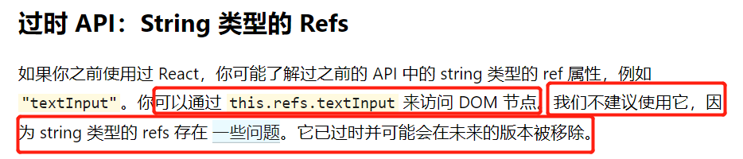

   具体问题可参考：https://github.com/facebook/react/pull/8333#issuecomment-271648615

2. 回调形式的ref

   ```react
   <!--回调形式的ref-->
   <input type="text" ref={(c) => {this.input1 = c}}>
   ```

   回调形式的refs，在回调中定义一个实例属性，将当前元素赋值给实例属性，然后就可以通过js去操作当前元素了

   因为在回调的时候，是将当前元素直接定义在了this上（也就是实例对象上），在react中接收ref的时候，就可以直接在实例对象上接收就可以了，如

   ```javascript
   const { udata } = this;
   ```

   来看完整的实例：

   ```html
   <!--创建react应用容器-->
       <div id="app"></div>
   
       <!--导入react核心库-->
       <script src="../js/react.development.js"></script>
       <script src="../js/react-dom.development.js"></script>
       <script src="../js/babel.min.js"></script>
       <script src="../js/prop-types.js"></script>
   
       <script type="text/babel">
         class User extends React.Component {
           showData = () => {
             // 因为udata实例属性，是在jsx中直接定义在this上的，所以这里接收的时候直接从this接收就可以了
             // 这里的this指向组件实例
             const { udata } = this;
             console.log(udata.value);
           };
   
           showMsg = () => {
             const { umsg } = this;
             console.log(umsg.value);
           };
           render() {
             return (
               <div>
                 <input
                   // 定义一个箭头函数，箭头函数会获取当前元素作为默认参数传递给箭头函数的处理程序
                   // 箭头函数中，会声明一个实例属性，去接收当前元素
                   // 如本案例中，定义了一个udata的实例属性，去接收了当前的input元素
                   // 回调函数的参数名称，我们可以自定义，但是最好的实践是见名知义，这里的c表示current
                   ref={(c) => (this.udata = c)}
                   type="text"
                   placeholder="点击按钮提示数据"
                 />
                 <button onClick={this.showData}>
                   点击按钮提示左侧输入框的数据
                 </button>
                 <input
                   onBlur={this.showMsg}
                   ref={(c) => (this.umsg = c)}
                   type="text"
                   placeholder="失去焦点提示数据"
                 />
               </div>
             );
           }
         }
   
         ReactDOM.render(<User />, document.querySelector("#app"));
       </script>
   ```

   **react中回调形式的ref中回调函数执行次数的问题**

   如果是内联回调形式的ref，那么在界面更新（注意是更新，不是初次渲染）的过程中，即有状态变化render方法重新执行的时候，那么ref的回调函数将被执行两次，第一次传入一个null，第二次才会传入当前的节点DOM。这是因为每次渲染时会创建一个新的函数实例，react清空旧的ref并且设置新的导致的。

   通过将ref的回调函数定义成class的绑定函数的方式可以避免这个内联回调函数被重复调用的问题。

   ref的内联回调函数被重复调用在功能上没有什么问题，只是看起来有点别扭而已。

   看效果，页面初次渲染的时候，ref的内联函数被执行了一次：

   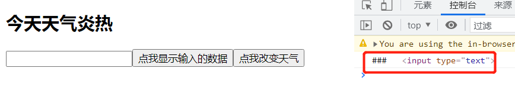

   只看下render函数吧：

   ```js
   render() {
     const { isHot } = this.state;
     return (
       <div>
         <h2>今天天气{isHot ? "炎热" : "凉爽"}</h2>
   	  {/*内联形式的ref回调函数，组件初始化时执行一次，有状态改变，即render再次执行时会被执行两次，第一次传入null，第二次会传入当前节点*/}
         <input
           type="text"
           ref={(c) => {
             this.udata = c;
             console.log("###", c);
           }}
         />
         <button onClick={this.showData}>点我显示输入的数据</button>
         <button onClick={this.changeWeather}>点我改变天气</button>
       </div>
     );
   }
   ```

   再来看下点击改变天气按钮时的操作：

   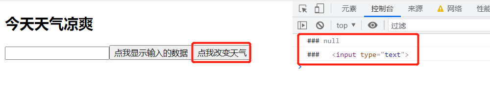

   ref的内联函数执行2次，在功能上说是没有任何问题的，那么有办法解决，不让它执行两次吗？

   办法是有的，前面已经提到了，将ref的回调函数定义成class的绑定函数就可以了。

   ```js
   {/*定义实例对象对象上的函数，就是react文档所说的鼎城class的绑定函数*/}
   saveUdata = (c) => {
       console.log(c);
   };
   
   render() {
     const { isHot } = this.state;
     return (
       <div>
         <h2>今天天气{isHot ? "炎热" : "凉爽"}</h2>
         {/*
         <input
           type="text"
           ref={(c) => {
             this.udata = c;
             console.log("###", c);
           }}
         />*/}
   	  {/*给ref定义一个回调函数，但是函数式定义在了实例对象上的，并不是内联的*/}
         <input type="text" ref={this.saveUdata} />
         <button onClick={this.showData}>点我显示输入的数据</button>
         <button onClick={this.changeWeather}>点我改变天气</button>
       </div>
     );
   }
   ```

   然后再看效果的时候，无论怎么点击改变天气的按钮，ref的回调函数都是只在页面初始化的时候执行了一次，没有多次被执行

   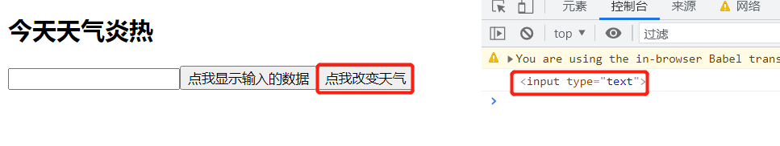

   贴一下整个案例的代码：

   ```html
       <!--react应用容器-->
       <div id="app"></div>
   
       <!--导入react核心库-->
       <script src="../js/react.development.js"></script>
       <script src="../js/react-dom.development.js"></script>
       <script src="../js/babel.min.js"></script>
       <script src="../js/prop-types.js"></script>
   
       <script type="text/babel">
         class User extends React.Component {
           state = {
             isHot: true,
           };
   
           showData = () => {
             const { udata } = this;
             console.log(udata.value);
           };
   
           changeWeather = () => {
             const { isHot } = this.state;
             this.setState({
               isHot: !isHot,
             });
           };
   
           saveUdata = (c) => {
             console.log(c);
           };
   
           render() {
             const { isHot } = this.state;
             return (
               <div>
                 <h2>今天天气{isHot ? "炎热" : "凉爽"}</h2>
                 {/*
                 <input
                   type="text"
                   ref={(c) => {
                     this.udata = c;
                     console.log("###", c);
                   }}
                 />*/}
                 <input type="text" ref={this.saveUdata} />
                 <button onClick={this.showData}>点我显示输入的数据</button>
                 <button onClick={this.changeWeather}>点我改变天气</button>
               </div>
             );
           }
         }
   
         ReactDOM.render(<User />, document.querySelector("#app"));
       </script>
   ```

3. createRef创建ref容器

   React可以通过createRef()函数创建存放ref标识节点的容器，每个容器只能存放一个节点元素，如果同一个容器被标识在了多个元素节点，那后面标识的元素会覆盖掉前面标识。

   React.createRef()容器返回的容器，是一个名为current的对象。如：

   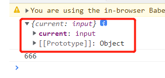

   current对象名称不可改，使用的时候直接使用current。获取容器的元素属性方式如下：

   ```js
   this.myRef.current.value
   ```

   由于React.createRef()只能存放一个元素节点，所以有多少个节点使用了ref，就需要定义几个容器，所以会有点感觉不太灵活。

   完整的案例：

   ```html
   <!--创建react应用容器-->
   <div id="app"></div>
   <!--导入react核心库-->
   <script src="../js/react.development.js"></script>
   <script src="../js/react-dom.development.js"></script>
   <script src="../js/babel.min.js"></script>
   <script type="text/babel">
     class User extends React.Component {
       /**
        * React.createRef()执行后返回一个容器，该容器可以存储被ref所标识的节点
        * createRef()函数创建的容器，只能给一个元素使用，专人专用，也就是说createRef()容器不能同时给2个或以上的元素使用
        * 否则先定义的ref会被下面的ref给覆盖
        */
       myRef = React.createRef();
       myRef2 = React.createRef();
       showData = () => {
         console.log(this.myRef);
         console.log(this.myRef.current.value);
       };
   
       showMsg = () => {
         console.log(this.myRef2.current.value);
       };
       render() {
         return (
           <div>
             <input
               type="text"
               ref={this.myRef}
               placeholder="点击按钮提示数据"
             />
             <button onClick={this.showData}>点击按钮提示数据</button>
             <input type="text" ref={this.myRef2} onBlur={this.showMsg} />
           </div>
         );
       }
     }
     ReactDOM.render(<User />, document.querySelector("#app"));
   </script>
   ```

通过refs拿到的节点，是真实的DOM，是已经被React处理完、已经被被转换为真实的DOM。

##### 3.4.3 使用ref时注意

通过上一节的学习，我们知道了react中ref的使用有三种方式，分别为：

1. 字符串形式
2. 内联回调
3. 通过React.createRef()函数创建一个ref容器

这三种方式，现在在项目中都可以使用，都没有任何的问题。

字符串形式的ref，使用最简单，但是有时候会产生一些性能问题，内联回调函数形式的ref，在组件重新渲染的时候会被执行两次；虽然字符串形式和内联回调函数形式有一些问题存在，但是对于我们做项目来说，不会带来实质性的异常，所以说在做项目的时候可以放心的使用，没有任何问题。

现在使用效果最好的是使用React.createRef()函数创建ref是最优秀的，也是react比较推荐的方式。

所以，我们在日常开发中，尽可能的使用React.createRef()函数创建ref容器的方式去使用ref，但是如果接手了老项目，或者自己不留心使用了字符串或者内联回调函数的ref，也不用纠结。

##### 3.4.4 React中的事件处理

1. 通过onXxx属性指定事件处理函数 --- 注意大小写

   1. react使用的是自定义（合成）事件，而不是原生的DOM事件
      1. react对DOM的原生事件都做了一次重新的封装处理，主要是为了兼容性处理
   2. react中的事件是通过事件委托方式处理的-委托给组件最外层元素
      1. 利用了DOM事件处理的冒泡流程，主要是为了事件高效处理的目标

2. 事件通过event.target得到发生事件的DOM对象

   1. 学习ref的时候，ref的官方的文档告诉我们，不要过渡的使用ref，那么什么时候可以省略ref呢？

      1. 发生事件的元素，正好是我们要操作获取值的元素，则可以省略ref

         ```html
         render() {
           return (
             <div>
               <input
                 type="text"
                 ref={this.umsg}
                 onBlur={this.showMsg}
                 placeholder="失去焦点提示数据"
               />
             </div>
           );
         }
         ```

         如这个案例中，我们期望获取input空间的值，同时也是期望在input空间发生onblur事件时做一些事情，那么这个时候input空间的ref就可以省略，可以通过event.target的方式获取到input控件属性

         ```javascript
           class User extends React.Component {
             showMsg = (event) => {
               //   console.log(this.umsg.current.value);
               console.log(event.target.value);
             };
         
             render() {
               return (
                 <div>
                   <input
                     type="text"
                     // ref={this.umsg}
                     onBlur={this.showMsg}
                     placeholder="失去焦点提示数据"
                   />
                 </div>
               );
             }
           }
         ```

#### 3.5 收集表单数据

表单中的组件分类

1. 受控组件

   1. 在页面的所有输入类组件中，如input、checkbox、radio等，随着数据的输入就可以将数据保存在状态中，等到用到这些数据的时候，就从状态中获取数据，这就是受控组件。

      受控组件，类似vue中的双向绑定，react没有实现双向绑定

      ```javascript
        class Login extends React.Component {
          state = {
            username: "",
            password: "",
          };
      
          // 保存用户名到状态中
          saveUsername = (event) => {
            this.setState({
              username: event.target.value,
            });
          };
      
          // 保存密码到状态中
          savePassword = (event) => {
            this.setState({
              password: event.target.value,
            });
          };
      
          // 表单提交
          handleLogin = (event) => {
            event.preventDefault();
            console.log(
              `用户名：${this.state.username}，密码：${this.state.password}`
            );
            console.log(this);
          };
          render() {
            return (
              <form onSubmit={this.handleLogin}>
                用户名：
                <input type="text" onChange={this.saveUsername} name="username" />
                密码：
                <input
                  type="password"
                  onChange={this.savePassword}
                  name="password"
                />
                <button>登录</button>
              </form>
            );
          }
        }
      
        ReactDOM.render(<Login />, document.querySelector("#app"));
      ```

      案例中，输入组件input用户名和密码的值都保存在了状态(state)中了，在用到这些值的时候，是去状态中获取的，而不是直接从input组件中获取的，这时的input组件就是受控组件。

2. 非受控组件

   1. react中，所有的输入类空间，如input、checkbox、radio等，这些控件的值是现用现取，就是非受控组件。

      ```javascript
        class Login extends React.Component {
          handleLogin = (event) => {
            // 阻止表单默认的跳转行为
            event.preventDefault();
            const { username, password } = this;
            console.log(`用户名是: ${username.value}，密码是：${password.value}`);
          };
          render() {
            return (
              <form onSubmit={this.handleLogin}>
                用户名：
                <input
                  type="text"
                  ref={(c) => (this.username = c)}
                  name="username"
                />
                密码：
                <input
                  type="password"
                  ref={(c) => (this.password = c)}
                  name="password"
                />
                <button>登录</button>
              </form>
            );
          }
        }
      
        ReactDOM.render(<Login />, document.querySelector("#app"));
      ```

      案例中是一个登录的小表单，在需要使用input组件来获取用户名和密码的时候，这2个组件的值都是现用现取，所以这里的input就是非受控组件。

3. 表单组件的使用

   表单组件分为了受控组件和非受控组件，在日常的开发中，推荐使用受控组件。

   因为受控组件中，基本可以不使用ref，而非受控组件中，大概的情况是有多少个输入项就要使用多少个的ref，而react并不希望我们在项目中过度的使用ref，所以建议受控组件。

#### 3.6 组件生命周期

##### 3.6.1 高阶函数

**定义**

如果一个函数符合下面两个条件中的任何一个，那这个函数就是高阶函数

1. 若A函数，接收的参数是一个函数，那么A就可以称为高阶函数

       2. 若A函数调用的返回值依然是一个函数，那么A就可以称之为高阶函数

常用的高阶函数有：Promise、setTimeout、setInterval、arr.map()等数组身上的很多方法

##### 3.6.2 函数柯里化

**定义：**通过函数调用继续返回函数的方式，实现多次接收参数最后统一处理的函数编码形式 

```js
      class Login extends React.Component {
        state = {
          username: "",
          password: "",
        };

        saveFormData = (dataType, value) => {
          this.setState({
            [dataType]: value,
          });
        };
        handleLogin = (event) => {
          event.preventDefault();
          const { username, password } = this.state;
          console.log(`用户名：${username},密码：${password}`);
        };
        render() {
          return (
            <form onSubmit={this.handleLogin}>
              用户名：
              <input
                type="text"
                name="username"
                // 这里的重点是onChange事件属性，一定要给它传递一个函数，无论是属性值直接是一个函数，还是调用一个函数的返回值（函数的返回值也要是返回一个函数）
                onChange={(event) => {
                  this.saveFormData("username", event.target.value);
                }}
              />
              密码：
              <input
                type="password"
                name="password"
                onChange={(event) => {
                  this.saveFormData("password", event.target.value);
                }}
              />
              <button>登录</button>
            </form>
          );
        }
      }
      ReactDOM.render(<Login />, document.querySelector("#app"));
```

##### 3.6.3 生命周期

react中，组件绑定到页面上显示出来，称为挂载(mount)，组件从页面中解除绑定，从页面中消失，称为卸载组件(unmount).

生命周期，本质上就是一些在react组件特定阶段自动执行的一些函数，因此生命周期也有其他的一些叫法，如生命周期函数、生命周期钩子函数、生命周期钩子等，但是说的都是一回事，不要被不同的人的不同叫法给迷惑了。

**简单的理解**

1. 组件从创建到销毁，会经历一些特定的阶段；
2. react组件中包含一些列钩子函数（生命周期的回调函数），会在特定的时刻调用；
3. 在定义组件时，会在特定的生命周期回调函数，做特定的事情；

**生命周期函数执行顺序：**

下面是一个主流程

1. constructor 构造器：状态初始化，一般情况下，都可以省略

2. componentWillMount 组件即将要挂载的时候的钩子
3. render 渲染、挂载组件
4. componentDidMount 组件挂载完成之后
5. componentWillUnmount  组件即将卸载的时候，即组件卸载之前

除了主线之外，还有三个流程：

1. 有state修改的时候，流程如下：

   1. shouldComponentUpdate  是否可以让组件更新，默认返回true
   2. componentWillUpdate 组件即将更新
   3. render
   4. componentDidUpdate 组件更新完成
   5. componentWillUnmount 组件即将卸载

2. 强制state修改的时候，流程如下：

   强制更新，指在不更新状态中数据的情况下，强制更新，应该强制更新组件吧，调用的时候使用this.forceUpdate()

   1. componentWillUpdate 组件即将更新
   2. render
   3. componentDidUpdate 组件更新完成
   4. componentWillUnmount 组件即将卸载

2. 父组件render、更新时

   1. componentWillReceiveProps  父组件发生变化时，子组件发生 ---- 组件初次渲染不算
      1. 第一次接收的不算，要是第二次及以上次数的接收到props时才算，社区也有讨论说把这个钩子函数更改为componentWillReceiveNewProps更加合适
   2. shouldComponentUpdate
   3. componentWillUpdate
   4. render
   5. componentDidUpdate
   6. componentWillUnmount
   
   看图示：
   
   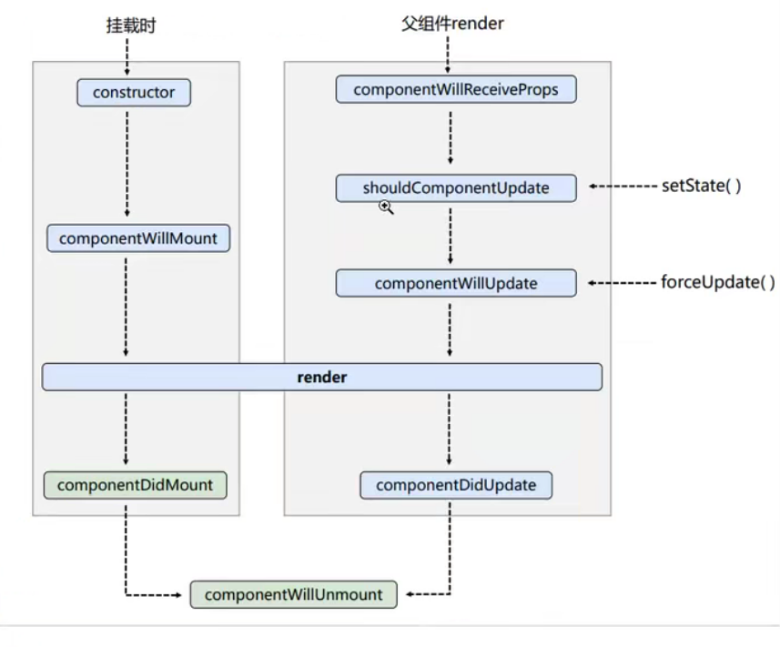
   
   ```html
       <!--react应用容器-->
       <div id="app"></div>
   
       <!--导入react核心库-->
       <script src="../js/react.development.js"></script>
       <script src="../js/react-dom.development.js"></script>
       <script src="../js/babel.min.js"></script>
       <script type="text/babel">
         class Counter extends React.Component {
           constructor(props) {
             console.log("constructor");
             super(props);
             this.state = {
               count: 0,
             };
           }
           // state = {
           //   count: 0,
           // };
   
           add = () => {
             let { count } = this.state;
             this.setState({
               count: count + 1,
             });
           };
   
           forceUpdateComponent = () => {
             this.forceUpdate();
           };
   
           unmountComponent = () => {
             ReactDOM.unmountComponentAtNode(document.querySelector("#app"));
           };
   
           componentWillMount() {
             console.log("componentWillMount");
           }
   
           componentDidMount() {
             console.log("componentDidMount");
           }
   
           componentWillUnmount() {
             console.log("componentWillUnmount");
           }
   
           shouldComponentUpdate() {
             // shouldComponentUpdate 钩子默认返回true，在不显示声明shouldComponentUpdate函数的情况下，都统一、默认返回true
             // 但是只要显示的声明了shouldComponentUpdate，就必须显示的声明返回值，true or false，如果没有返回，则默认返回undefined
             console.log("shoudeComponentUpdate");
             return true;
           }
   
           componentWillUpdate() {
             console.log("componentWillUpdate");
           }
   
           componentDidUpdate() {
             console.log("componentDidUpdate");
           }
           render() {
             console.log("render");
             let { count } = this.state;
             return (
               <div>
                 <h2>当前求和为: {count}</h2>
                 <button onClick={this.add}>加1</button>
                 <button onClick={this.unmountComponent}>卸载组件</button>
                 <button onClick={this.forceUpdateComponent}>强制更新</button>
               </div>
             );
           }
         }
   
         class A extends React.Component {
           // 初始化状态
           state = {
             carName: "奔驰",
           };
   
           changeCar = () => {
             this.setState({
               carName: "奥拓",
             });
           };
           render() {
             return (
               <div>
                 <h3>我是A组件</h3>
                 <button onClick={this.changeCar}>换车</button>
                 <B carName={this.state.carName} />
               </div>
             );
           }
         }
   
         class B extends React.Component {
           componentWillReceiveProps(){
             console.log("B---componentWillReceiveProps");
           }
           render() {
             return (
               <div>
                 <h3>我是B组件</h3>
                 <p>我接收到的车是: {this.props.carName}</p>
               </div>
             );
           }
         }
         ReactDOM.render(<A />, document.querySelector("#app"));
       </script>
   ```

组件的生命周期，也可以从另一个角度来区分，可以从三个方面去看：

1. 初始化阶段：由ReactDOM.render()触发，初次渲染
   1. constructor()
   2. componentWillMount()
   3. render()
   4. componentDidMount()
      1. 常用，经常做一些初始化数据的动作，如发送网络请求、订阅消息、开启定时器等
2. 更新阶段：由组件内部this.setState()或父组件重新render()的时候触发
   1. shouldComponentUpdate()
   2. componentWillUpdate()
   3. render()
      1. 这是个必须要用的周期、钩子，没的选
   4. componentDidUpdate()
3. 卸载组件：由ReactDOM.unmountComponentAtNode()触发
   1. componentWillUnmount()
      1. 常用，经常用来做一些收尾的事情，如关闭定时器、取消订阅消息等

##### 3.6.4 react新版本的生命周期（v17.0.2）

在之前的v16.14.0版本那种的componentWillMount()、componentWillUpdate()、componentWillReceiveProps()三个钩子函数，需要加上前缀：UNSAFE_，之前的生命周期钩子函数就都还可以用。

即v16.14.0及以前版本中带有will的钩子函数都加上UNSAFE_，除了componentWillUnmount钩子函数。

新的生命周期图：

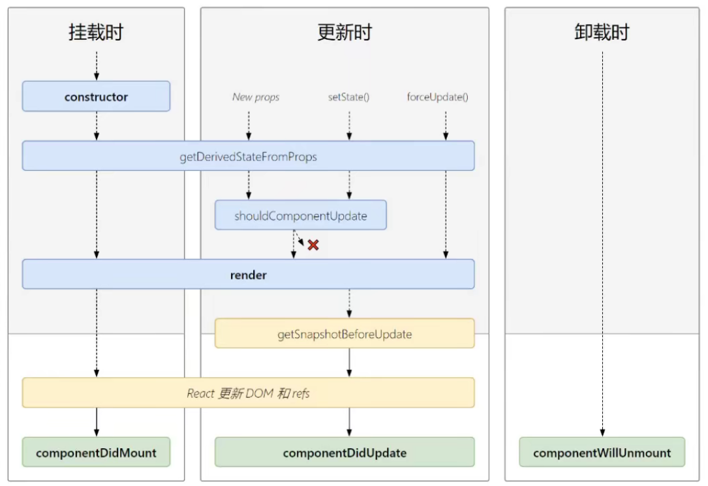

**getDerivedStateFromProps():从props中获取派生状态**

这个声明周期很少使用，只有在及特殊的情况下才会使用，即state的值在任何时候都取决于props。且派生状态会导致代码荣誉，使组件难以维护。了解即可

getDerivedStateFromProps()需要定义成静态的类方法，方法需要返回一个状态对象或者null。正常定义之后，初始状态和修改状态时都不会生效，都会以props为准。

```html
    <!--react应用容器-->
    <div id="app"></div>
    <!--导入react核心库-->
    <script src="../js/v17.0.2/react.development.js"></script>
    <script src="../js/v17.0.2//react-dom.development.js"></script>
    <script src="../js/v17.0.2/babel.min.js"></script>
    <script type="text/babel">
      class Counter extends React.Component {
        constructor(props) {
          console.log("Counter---constructor");
          super(props);
          this.state = {
            count: 0,
          };
        }

        add = () => {
          let { count } = this.state;
          this.setState({
            count: count + 1,
          });
        };

        unMountComponent = () => {
          ReactDOM.unmountComponentAtNode(document.querySelector("#app"));
        };

        static getDerivedStateFromProps(props) {
          console.log(props);
          // return {count: 203};
          return props;
        }
        render() {
          let { count } = this.state;
          return (
            <div>
              <h2>当前求和为：{count}</h2>
              <button onClick={this.add}>加1</button>
              <button onClick={this.unMountComponent}>卸载组件</button>
            </div>
          );
        }
      }
      ReactDOM.render(<Counter count={200} />, document.querySelector("#app"));
    </script>
```


**getSnapshotBeforeUpdate()**:在更新前获取快照值

任何值都可以做为快照值，使用的并不多

```javascript
// getSnapshotBeforeUpdate的返回值，会传递给componentDidUpdate钩子函数
getSnapshotBeforeUpdate() {
    return this.refs.list.scrollHeight;
}
componentDidUpdate(preProps, preState, height) {
    this.refs.list.scrollTop += this.refs.list.scrollHeight - height;
}
```

看全部的demo吧：

```html
   <!--react应用容器-->
    <div id="app"></div>

    <!--导入react核心库-->
    <script src="../js/v17.0.2/react.development.js"></script>
    <script src="../js/v17.0.2/react-dom.development.js"></script>
    <script src="../js/v17.0.2/babel.min.js"></script>

    <script type="text/babel">
      class NewsList extends React.Component {
        // 初始化状态
        state = {
          newsArr: [],
        };

        // 在组件初始化好之后，每1s钟滚动一条新闻
        componentDidMount() {
          setInterval(() => {
            // 获取原始状态
            const { newsArr } = this.state;
            // 模拟一条新闻，正常情况下应该发送一条请求,或者服务端下发一条数据
            const NewsItem = `新闻${newsArr.length + 1}`;

            // 更新状态
            this.setState({
              newsArr: [NewsItem, ...newsArr],
            });
          }, 1000);
        }

        // getSnapshotBeforeUpdate的返回值，会传递给componentDidUpdate钩子函数
        getSnapshotBeforeUpdate() {
          return this.refs.list.scrollHeight;
        }
        componentDidUpdate(preProps, preState, height) {
          this.refs.list.scrollTop += this.refs.list.scrollHeight - height;
        }
        render() {
          let { newsArr } = this.state;
          return (
            <ul className="list" ref="list">
              {newsArr.map((item, index) => {
                return (
                  <li key={index} className="item">
                    {item}
                  </li>
                );
              })}
            </ul>
          );
        }
      }

      ReactDOM.render(<NewsList />, document.querySelector("#app"));
    </script>
```

**生命周期的众多钩子函数中，常用的有：**

render 初始化渲染或更新渲染使用

componentDidMount  开启监听，发送ajax请求

componentWillUnmount 收尾工作，如监听器的移除等

**即将被废弃的钩子函数**

componentWillMount

componentWillReceiveProps

componentWillUpdate

现在使用这几个钩子函数的时候，浏览器中会出现一些警告，但是不确定在未来的某个版本中会移除掉这几个钩子函数。

#### 3.7 虚拟DOM与DOM diff算法

思考下面2个问题：

1. react/vue中的key有什么作用，key的内部实现原理是什么？

2. 为什么遍历列表时，key最好不要用index

虚拟DOM中，key的作用：

1. 简单来说，key是虚拟DOM对象的标识，在更新显示时，key有着非常重要的作用
2. 详细说，当状态中的数据发生变化时，react会根据“新数据”生成新的虚拟DOM,随后新的虚拟DOM和旧的虚拟DOM进行diff比较，其规则如下：
   1. 旧虚拟DOM中找到了与新虚拟DOM相同的key，
      1. 若虚拟DOM中内容没有变，则直接使用之前的真实DOM
      2. 若虚拟DOM中内容变了，则生成新的真实DOM，随后替换掉页面中之前的真实DOM
   2. 旧的虚拟DOM中没有找到与新的虚拟DOM中相同的key
      1. 根据数据创建新的真实DOM，然后渲染到页面

用index作为key，可能会引发一些问题，具体如下：

1. 若对数据进行：逆序添加、逆序删除等破坏顺序的操作时：
   1. 会产生不必要的真实DOM更新->页面效果数据没有任何问题，但是会带来渲染性能的降低
2. 如果结构中还包含输入类的DOM：
   1. 会产生错误的DOM更新，界面会产生一些问题
3. 注意：如果不存在对数据的逆序添加、逆序删除等破坏顺序操作：
   1. 仅仅用于渲染列表展示数据，使用index作为key是没有问题的

在项目中如何正确的使用key呢？

1. 最好是使用每条数据的唯一标识作为key，如id
2. 如果确定仅仅是简单的数据展示，不会发生破坏数据顺序的操作，使用index作为key也没啥问题

```html
    <!--react应用容器-->
    <div id="app"></div>
    <!--导入react核心库-->
    <script src="../js/v17.0.2/react.development.js"></script>
    <script src="../js/v17.0.2/react-dom.development.js"></script>
    <script src="../js/v17.0.2/babel.min.js"></script>
    <script type="text/babel">
      class Person extends React.Component {
        state = {
          person: [
            {
              id: 1,
              name: "张三",
              age: 18,
            },
            {
              id: 2,
              name: "李四",
              age: 19,
            },
          ],
        };

        addPerson = () => {
          const { person } = this.state;
          const p = { id: person.length + 1, name: "王五", age: 20 };
          this.setState({
            person: [p, ...person],
          });
        };

        render() {
          const { person } = this.state;
          return (
            <div>
              <h2>展示人员信息</h2>
              <button onClick={this.addPerson}>新增人员</button>
              <h4>使用index（索引值）作为key的</h4>
              <ul className="person">
                {person.map((person, index) => {
                  return (
                    <li key={index}>
                      {person.name} ---- {person.age} <input type="text" />
                    </li>
                  );
                })}
              </ul>

              <h4>使用id（唯一标识）作为key的</h4>
              <ul className="person">
                {person.map((person, index) => {
                  return (
                    <li key={person.id}>
                      {person.name} ---- {person.age} <input type="text" />
                    </li>
                  );
                })}
              </ul>
            </div>
          );
        }
      }

      ReactDOM.render(<Person />, document.querySelector("#app"));
    </script>
```

看案例：

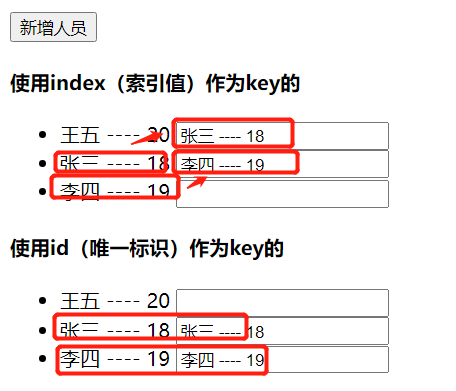

### 4. React应用：基于React脚手架

#### 4.1 使用create-react-app创建react应用

##### 4.1.1 react脚手架

1. xxx脚手架：帮助程序员快速创建一个基于某技术的模板项目
   1. 包含了所有必要的配置信息：语法检查、jsx编译、devServer等
   2. 下载好了所有需要的依赖
   3. 可以直接运行一个简单效果
2. react提供了一个用于创建react项目的脚手架：create-react-app
3. 项目的整体技术架构为：react+webpack+es6+eslint
4. 使用脚手架开发项目的特点：模块化、工程化、组件化

##### 4.1.2 创建并启动项目

 	1. 全局安装：npm install create-react-app -g
 	 	1. 也可以不全局安装，直接使用npx create-react-app创建项目
 	2. 切换到希望创建项目的目录，使用命令：create-react-app 项目名称
 	3. 进入到项目目录: cd 项目名称
 	4. 启动项目: npm start

> 创建一个基于react脚手架的模板项目

##### 4.1.3 react项目文件分析

public：静态源目录，如公共图片、css样式文件等

​	index.html react应用的页面文件，也可以简单的入口文件，但是不严谨，它仅仅包含了一个容器，业务逻辑不在这里

src/index.js 入口文件

```jsx
ReactDOM.render(
  // React.StrictMode，开启react的严格模式，用来检查App组件及App组件的子组件的实现是否合理，和js中的严格模式没有任何关系
  <React.StrictMode>
    <App />
  </React.StrictMode>,
  document.getElementById('root')
);
```

React.StrictMode开启了react的严格模式，主要用来检查App组件及App组件的子组件的实现是否合理，如react组件中是否使用了react不推荐使用的语法、即将被废弃的api等，如字符串形式的ref，react都会给出一些提示信息

```jsx
import React from 'react';
import ReactDOM from 'react-dom';
import './index.css';
import App from './App';
import reportWebVitals from './reportWebVitals';

ReactDOM.render(
  // React.StrictMode，开启react的严格模式，用来检查App组件及App组件的子组件的实现是否合理，和js中的严格模式没有任何关系
  <React.StrictMode>
    <App />
  </React.StrictMode>,
  document.getElementById('root')
);

// If you want to start measuring performance in your app, pass a function
// to log results (for example: reportWebVitals(console.log))
// or send to an analytics endpoint. Learn more: https://bit.ly/CRA-vitals
// 用于记录页面性能的，监测性能
// 框架帮我们记录了性能，那么这些性能怎么利用起来呢，需要再去研究、调研一下
reportWebVitals();
```

reportWebVitals可以实现对react应用的性能监控，那么这些性能数据怎么利用起来呢？还需要再继续学习、研究

**react的执行顺序：**

src/index.js ->app.js->public/index.html

app.js

```jsx
// 这里的{Component}不是解构，这点需要注意，不要理解错了
import React, { Component } from "react";
import Hello from "./Hello";

// Component直接从react导入了，这里就不需要从React派生了
class App extends Component {
    render() {
        return (
            <Hello />
        );
    }
}

export default App;
```

##### 4.1.4 样式的模块化

页面中有多个组件的时候，如果多个组件之间拥有共同的class，那么我们在定义class的时候，就会产生重名的情况，样式就会被覆盖。

这个时候，css的模块化就格外重要。

**那么css的模块化怎么去做呢？**

1. css文件命名

css文件的命名，不要直接以简单的文件意义.css的方式命名，如index.css、list.css等，不要使用这样的命名方式。

模块化css文件的命名，格式如下：文件意义.module.css，如index.module.css、list.module.css、detail.module.css等

2. 模板文件的导入使用变量接收

   ```jsx
   // 通过变量接收模块化的css
   import HelloStyle from "./Hello.module.css";
   ```

3. 为class设置属性的时候，通过对象.属性的方式

   ```jsx
     // 通过点语法为class赋值，设置样式
     <div className={HelloStyle.hello}>
       <h2 className={HelloStyle.title}>Hello,React!我在Hello中</h2>
     </div>
   ```

   下面来看下完整的代码：

   ```jsx
   import React, { Component } from "react";
   // 通过变量接收模块化的css
   import HelloStyle from "./Hello.module.css";
   
   export default class Hello extends Component {
     render() {
       return (
         // 通过点语法为class赋值，设置样式
         <div className={HelloStyle.hello}>
           <h2 className={HelloStyle.title}>Hello,React!我在Hello中</h2>
         </div>
       );
     }
   }
   ```

   

   css模块化之后，各个模块内的css样式，都只在自己的模块内生效，不会影响到其他的模块。

   我们也来看下非模块化css的情况下样式的使用：

   ```jsx
   import React, { Component } from "react";
   // 常规的非模块化的方式引入css
   import "./Style.css";
   
   export default class Style extends Component {
     render() {
       return (
         // 常规模式下，非模块化的使用css选择器为class设置样式
         <div className="style">
           <h2 className="style-title">普通的方式使用非模块化的css</h2>
         </div>
       );
     }
   }
   ```

> 在使用vscode作为react的开发工具时，推荐一个插件：ES7 React/Redux/GraphQL/React-Native snippets，有一些快捷键，挺好用
>
> 安装了这个插件，其他的基本上就可以不装了
>
> filename.module.css,带有module的文件名，导入到jsx中对普通的class是不生效的

##### 4.1.5 react应用中样式应用

react应用中引用样式的方式：

1. 内联方式

   ```jsx
   export default class App extends Component {
       render() {
           return (
               <div>
                   {/* 设置内联样式 */}
                   <h2 style={{fontSize: "32px",height: 46,lineHeight: "46px", color: "#fff", backgroundColor: "#369"}}>app……</h2>
               </div>
           )
       }
   }
   ```

   内联样式

   1. 使用两对{{}}包裹，第一层是react语法中要求的，第二层表示css样式表为对象，需要使用{}包裹
   2. css属性名使用小驼峰命名规则，属性值中有数字的，有的可以直接使用数字如字号，有的不能直接使用数字如行高。为了记忆方便，可以统一记为属性值为字符串值，使用引号包裹
   3. 属性之间使用逗号分隔；

2. 导入外部样式

   ```jsx
   import React, { Component } from "react";
   // 常规方式引入css
   import "./Hello.css";
   
   export default class Hello extends Component {
     render() {
       const { info } = this.props;
       return (
         // 常规方式设置样式
         <div className="hello">
           <h2 className="title">Hello,React!</h2>
           <p className="text">{info}</p>
         </div>
       );
     }
   }
   ```

3. 模块化样式

   css文件名必须是模块名称.module.css的命名规则，如home.module.css,<font color="#f20">中间的module不可省，也不可变更其他名称</font>

   ```jsx
   import React, { Component } from "react";
   // 导入模块化的css
   import WelcomeStyle from "./Welcome.module.css";
   
   export default class Welcome extends Component {
     render() {
       return (
         // 模块化的css设置样式的方式,点语法
         <div className={WelcomeStyle.welcome}>
           <h2 className={WelcomeStyle.tit}>Welcome React!</h2>
           <p className={WelcomeStyle.desc}>模块化css的方式使用样式</p>
         </div>
       );
     }
   }
   ```

4. css-in-js

   有一个插件叫：styled-components

   之后找时间把这个插件的使用方式给补上吧

##### 4.1.6 功能界面的组件化编程流程

1. 拆分组件：拆分界面，抽取组件
2. 实现静态组件，使用组件实现静态页面效果
3. 实现动态组件
   1. 动态显示初始化效果
      1. 数据类型
      2. 数据名称
      3. 组件的数据绑定
   2. 交互：绑定事件、事件监听

#### 4.2 TodoList 案例

react组件在引入组件的时候，良好的实践是先引入第三方库的组件，再引入自己开发的组件、模块。

##### 4.2.1 父子组件之间的通信

组件之间的通信，具体就是指不同组件之间的数据传值。

**父组件传值给子组件**

父组件传值给子组件，通过props的方式

```jsx
  render() {
    const { todos } = this.state;
    return (
      <div className="todo-container">
        <div className="todo-wrap">
          <Header />
          {/* 父组件将todos传递给子组件List，父组件向子组件传值 */}
          <List todos={todos} />
          <Footer />
        </div>
      </div>
    );
  }
```

**子组件向父组件传值**

子组件向父组件传值，通过自定义方法的方式。

父组件可以向子组件通过props的方式传递一个自定义函数，然后子组件中在某种状态的时候调用这个从父组件中传递过来的自定义函数。

```jsx
{/* 父组件 */}
{/* 父组件向子组件传递自定义函数 */}
<Header addTodoTask={this.addTodo} />

{/* 子组件 */}
// 解构赋值，从props中拿到addTodoTask自定义事件
const { addTodoTask } = this.props;

// 为addTodo事件准备参数，对象类型
const todoObj = {
    id: nanoid(),
    name: target.value,
    done: false,
};

// 执行从父组件通过props方式传递过来的自定义函数，触发父组件对该自定义函数的响应事件
addTodoTask(todoObj);
```


##### 4.2.2 生成唯一值

生成唯一值，常用的有以下几种方式：

1. 使用当前时间戳
2. Math.random()生成一个随机数
3. 使用一些工具库，生成一个随机字符串，如uuid、nanoid

使用时间戳的方式，如果在系统中是小范围的使用，应该也不会有什么太大的问题，但是人如果使用量大了，也难免会有两个同时间的操作，那么时间戳就相同了

Math.random()是生成的是0-1之间的随机数，全是小数，感觉有那么点难以满足需求

一些工具库如uuid，nanoid，现在来看是不错的，说是可以生成全球唯一的一个字符串，不会重复。但是具体的实现还是要继续研究、学习，它是怎么保证唯一的。

uuid和nanoid，都有npm包，在前端项目中可以通过npm或者yarn来装使用。nanoid库更小，也是生成的uuid；uuid库相对较大，所以在具体使用的时候，可以选择nanoid库

**使用方式**

以nanoid库为例，先要安装

```bash
npm install nanoid;
```

nanoid对外暴露了nanoid函数，在项目中使用的时候，可以通过直接调用nanoid函数的方式使用

安装之后，在需要使用的文件中先导入nanoid工具库，然后直接调用nanoid函数就可以了

```jsx
// 导入nanoid工具库，可以生成随机、唯一的字符串
import { nanoid } from "nanoid";

const n1 = nanoid();
const n2 = nanoid();
const n3 = nanoid();
console.log(`n1: ${n1}`);
console.log(`n2: ${n2}`);
console.log(`n3: ${n3}`);
```

##### 4.2.3 react中事件

react元素中绑定事件的时候，一定要注意：事件的响应函数一定得是一个函数。也就是说，在react元素中的事件的回调函数，不要加小括号，加了小括号表示要执行的。

当然了事件的回调函数也可以加小括号，但是这个时候需要回调函数返回一个函数，而不能是没有显示的返回函数，或者是默认的返回undefined

```jsx
handleMouse = () => {
    // 返回了一个函数，这个箭头函数做真正的逻辑处理
    return () => {};
};
<li
    {/* 事件的回调函数使用了小括号，表示事件已经执行完了，所以回调函数的响应函数要返回一个函数，让返回函数去做事情 
    	根本的原因是无论什么形式绑定事件，要给事件赋的值一定是个函数就可以了
    */}
    onMouseEnter={this.handleMouse(true)}
    onMouseLeave={this.handleMouse(false)}
    >
</li>
```

##### 4.2.4 checkbox控件的defaultChecked和checked属性

react元素的checkbox控件，在初次渲染的时候，既可以使用defaultChecked属性设置初始值，也可以使用checked属性设置控件的初始状态。

defaultChecked：只有在第一次渲染的时候有用，在控件修改状态的时候它不会生效

checked：初次渲染状态和修改的时候都可用，但是需要和onChange事件配合使用

```jsx
<input
    type="checkbox"
    // checkbox控件的初始状态，可以使用checked，也可以使用defaultChecked，但是使用checked的时候需要配合onChange一起使用
    checked={doneCount === total ? true : false}
    onChange={this.checkAllTodo}
    />
```

### 5. React Ajax

#### 5.1 理解

##### 5.1.1 前置说明

1. React本身只关注界面，并不包含发送ajax请求的代码
2. 前端应用需要通过发送ajax与服务端进行交互
3. react应用中需要集成第三方ajax库

##### 5.1.2 常用的ajax请求库

1. jquery：可以实现发送ajax请求，但不建议使用
2. axios：轻量级，推荐
   1. 封装XMLHttpRequest对象的ajax
   2. promise风格
   3. 可以同时用在浏览器端和nodejs环境中

#### 5.2 axios库

#### 5.3 配置代理

我们知道，异步的ajax请求，存在跨域问题，那么react应用怎么处理跨域问题呢？非常常见的一种做法是使用代理的方式。

**方法一：**

react应用中配置代理的方式，在package.json中配置proxy字段：

```json
"proxy": "http://localhost:5000"
```

代理的意思是，代为搭理，比如react应用本地启动开发服务器启动后，默认端口号是3000，那么开发环境发送请求的时候，正常情况下是通过3000端口发送请求的，但是这里配置了代理后，那么本地开发环境的网络请求，就都被代理到了5000端口去发送请求了。正式通过这种方式，可以规避掉跨域问题。

但是配置了代理服务器后，开发环境的网络请求，就不能直接给5000端口发请求了，而应该给3000端口发请求，然后代理服务器转发到5000端口去向服务器请求数据。实际上，客户端的数据是从本地的代理服务器请求的数据，数据也是从代理服务器给的客户端的。只是中间的代理服务器又做了一些工作，从服务器端拿了次数据。

该方法简单，但是只能配置一个代理

**方法二：**

配置方法复杂，但是使用起来灵活，在src目录下新建setupProxy.js文件，该文件名不可改：

```javascript
const { createProxyMiddleware } = require('http-proxy-middleware');

module.exports = function (app) {
    app.use(
        '/api', // 请求地址中有/api的请求就会触发该转发配置
        createProxyMiddleware({
            target: 'http://localhost:5000', // 请求转发的目标服务器
            /**
             * 控制服务器中收到的请求头中的Host字段的值，该属性加和不加，一般情况下不会影响到服务器下发数据
             * 默认为false
             * 如果设置为true，则服务器中收到的请求头中Host字段值为代理服务器的地址
             * 如果设置为false，则服务器中收到的请求头中的Host为客户端服务器的地址
             * 一般情况下，都会显示设置为true
             */
            changeOrigin: true,
            // 该项必须配置，要将前面通配的/api重置为空，否则服务器中匹配不到响应的服务端路由
            // 重写下请求url
            pathRewrite: {
                '^/api': '' // 将/api 变为 ''
            }
        })
    );
    app.use(
        '/api2',
        createProxyMiddleware({
            target: 'http://localhost:5001',
            changeOrigin: true,
            pathRewrite: {
                '^/api2': '' // 将/api2 变为 ''
            }
        })
    );
};
```

更加详细的信息请参考：https://create-react-app.dev/docs/proxying-api-requests-in-development

#### 5.4 消息订阅-发布机制

1. 工具库：PubSubJs
2. 下载：npm install pubsub-js --save
3. 使用
   1. import PubSub from "pubsub-js"
   2. PubSub.subcribe("delete",function(data){}); // 订阅消息
   3. PubSub.publish("delete",data); // 发布消息

### 6. react-router   路由

路由相关的资料，https://reactrouter.com/docs/en/v6，看这个文档吧，最新的文档

另外：https://react-router.docschina.org/ 这个也可以看，但是文档没有跟上api的最新版本，看起来，有的时候对不上

#### 6.1 相关理解

##### 6.1.1 SPA的理解

1. 单页web应用
2. 整个应用只有一个完整的页面
3. 点击页面中的连接不会刷新页面，只会做页面的局部刷新
4. 数据都需要通过ajax请求获取，并在前端异步渲染

##### 6.1.2 路由的理解

1. 什么是路由

   一个路由就是一个映射关系 key:value

   key为路径，value可能是function或者component

2. 路由分类

   1. 后端路由
      1. 理解:value是function，用来处理客户端提交的请求
      2. 注册路由：router.get(path,function(req,res))
      3. 工作过程：当node接收到一个客户端的请求时，根据请求路径找到匹配的路由，调用路由中的函数来处理请求，返回响应函数
   2. 前端路由
      1. 浏览器端的路由：value是一个component，用于展示页面内容
      2. 注册路由：<Router path="/test" component={Test}
      3. 工作过程：当浏览器的path变为test时，当前路由组件就会变为Test组件

##### 6.1.3 react-router的理解

1. react的一个路由插件库
2. 专门用来实现一个SPA应用
3. 基于React的应用，基本都会用到这个库

#### 6.2 react-router相关API

react-router有三种实现，web应用、react native应用和any（任何形式的应用）。

web开发中，更好的实践是使用react-router-dom实现

##### 6.2.1 内置组件

<BrowserRouter>

<HashRouter>

<Route>

<Redirect>

<Link>

<NavLink>

<Switch>

##### 6.2.2 其他

1. history对象
2. match对象
3. withRouter对象

#### 6.3 基本的路由使用

HTML中靠a实现不同页面之间的跳转

React中靠路由实现不同组件之间的切换、映射，依赖react-router库

react-router-dom，暴露了多个组件，按需引用，使用哪个就导入哪个

```jsx
import { Link, Route, Routes } from "react-router-dom";
{/* 编写路由连接 */}
<Link className="list-group-item" to="/about">
    关于
</Link>
<Link className="list-group-item" to="/home">
    Home
</Link>
{/* 注册路由 */}
<Routes>
    <Route path="/about" element={<About />} />
    <Route path="/home" element={<Home/>} />
</Routes>
```

这里的<Route>标签中的element属性，我记得文档中说的是应该使用component，我但是这里不能使用component属性，而得使用element属性，我没有具体确认是否是react-router的文档没有更新，详情可参考：https://react-router.docschina.org/web/api/Route/component。

在同一个react应用中，所有的路由都要在一个集中的路由器管理下，所以我们可以把这个集中的路由器包裹在最外层

```jsx
// index.js
import { BrowserRouter } from 'react-router-dom';
ReactDOM.render(
  <React.StrictMode>
    <BrowserRouter>
      <App />
    </BrowserRouter>
  </React.StrictMode>,
  document.getElementById('root')
);
```

react应用中的所有路由都已经被集中的路由器的管理下了。

react-router和vue-router一样，也分为hash模式的router和history模式的router

```jsx
import { HashRouter } from 'react-router-dom'; // hash模式，url中会出现#，#后面的内容是hash值，在有http请求的时候，不会向服务器发送
import { BrowserRouter } from 'react-router-dom'; // history模式，url中较美观，不会出现#，但是代码部署的时候需要web服务器做一些处理
```

使用react-router，就会涉及到路由router。

做react开发，一般情况下会将组件分为一般组件和路由组件。

**一般组件**

一般组件，类似

```jsx
<Index />
```

这样的组件，就是一个模块的展示，表示一部分单独功能、样式的集合，就是一个普通的组件。

一般组件，一般情况下会被放置在components目录下，或者当前模块中的componens目录下。

**路由组件**

类似

```jsx
{/* 注册路由 */}
<Routes>
    <Route path="/about" element={<About />} />
    <Route path="/home" element={<Home/>} />
</Routes>
```

这2个组件，分别表示在路由指向的时候渲染的这个组件，它们在react-router中习惯被称为路由组件。

路由组件，在前端工程中，一般会被放置在pages目录下。

**路由组件和一般组件的主要区别**

1. 路由组件和一般组件的区别，除了前面说的可能存放的目录不同

   1. 一般组件：components目录下
   2. 路由组件：pages目录下

2. 使用方式不同：一般组件的使用方式：

   ```jsx
   {/* 一般组件：Header */}
   <Header age={16} />
   ```

   一般组件，除了命名以外，其他的就和一个普通的DOM标签几乎相同

   路由组件的使用方式：

   ```jsx
   <Routes>
       {/* 路由组件：About、Home */}
       <Route path="/about" element={<About />} />
       <Route path="/home" element={<Home/>} />
   </Routes>
   ```

   路由组件都是作为路由空间Route的属性值来使用的

3. 最大的区别：

   1. 一般组件默认不会接收参数，在组件使用的地方有传递了，才会通过props接收

   2. 路由组件默认会接收到许多路由参数，对于我们的日常开发最关注的可能就是是history、location、match

      ```jsx
      {/* 一般组件：Header */}
      <Header age={16} />
      {/* 注册路由 */}
      <Routes>
          {/* 路由组件：About、Home */}
          <Route path="/about" element={<About />} />
          <Route path="/home" element={<Home/>} />
      </Routes>
      ```

      查看组件默认接收参数情况：

      ```jsx
      // Header.jsx
      import React, { Component } from "react";
      
      export default class Header extends Component {
        render() {
          console.log("Header组件默认接收到的参数：",this.props);
          return (
            <div className="page-header">
              <h2>React Router Demo</h2>
            </div>
          );
        }
      }
      
      // Home.jsx
      import React, { Component } from "react";
      
      export default class Home extends Component {
        render() {
          console.log("Home组件默认接收到的参数：", this.props);
          return <div>Home</div>;
        }
      }
      ```

      看效果：

      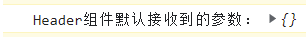

      默认情况是没有接收到任何参数，因为使用的时候没有传递参数

      路由组件（react-router-dom@6.1.1），现在路由组件默认也接收不到参数了，今天查一下，再更新文档

   **react路由的基本使用**

   1. 划分好页面模块、组件：导航区、展示区

   2. 导航部分的a使用Link组件实现

      ```jsx
      <Link className="list-group-item" to="/about">
          关于
      </Link>
      ```

   3. 展示区使用Route标签进行路径和组件匹配

      ```jsx
      <Routes>
          {/* 路由组件：About、Home */}
          <Route path="/about" element={<About />} />
          <Route path="/home" element={<Home />} />
      </Routes>
      ```

   4. <App />最外层使用<BrowserRouter>或者<HashRouter>包裹，让路由统一管理

      ```jsx
      <BrowserRouter>
          <App />
      </BrowserRouter>
      ```

**NavLink**

可以简单理解NavLink为Link的升级版，Link默认可以将路由渲染为a标签,就是一个普通的导航跳转。

NavLink升级了Link组件，那么它升级了什么呢？它升级了与当前导航URL相匹配时可以为当前的导航添加特殊的样式，可以通过设置activeClassName来实现，activeClassName默认的属性值为active。如果项目中使用了bootstrap的时候，需要注意，bootstrap中的当前选中样式也使用了active这个class名。

当前导航高亮效果，可以使用NavLink组件

```jsx
{/* 编写路由连接 */}
<NavLink className={({ isActive }) => isActive ? "nav-item on" : "nav-item" } to="/about">关于 </NavLink>
<NavLink className={({ isActive }) => isActive ? "nav-item on" : "nav-item" } to="/home">Home </NavLink>
```

isActive，可以直接使用，不需要单独声明，nav-item是默认的class名称，on表示高亮的class名称

**封装一个自定义的NavLink组件**

案例中，有多个NavLink组件，我们看到了每个NavLink组件都设置了className属性，代码还有些冗余，那么能不能通过NavLink封装一个自定义的组件呢，以达到减少冗余代码的目标？

```jsx
// MyNavlink.jsx
import React, { Component } from "react";
import { NavLink } from "react-router-dom";

export default class MyNavlink extends Component {
  render() {
    const { to, title } = this.props;
    console.log(this.props);
    return (
      <NavLink className={({ isActive }) => (isActive ? "nav-item on" : "nav-item")} {...this.props} />
    );
  }
}

// App.jsx
 {/* 编写路由连接 */}
<MyNavlink to="/about" title="About" a="1" b="2" c="3">About</MyNavlink>
<MyNavlink to="/home" title="Home">Home</MyNavlink>
```

通过NavLink封装一个自定义的导航组件不那么复杂，但是这里有一个小的知识点，就是标签内容，也可以通过props去传递。

不是自闭和的导航组件：

```jsx
<MyNavlink to="/about" title="About" a="1" b="2" c="3">About</MyNavlink>
```

我们观察一下非自闭和形式的自定义标签

```jsx
import React, { Component } from "react";
import { NavLink } from "react-router-dom";

export default class MyNavlink extends Component {
  render() {
    const { to, title } = this.props;
    // 打印从组件传递过来的props
    console.log(this.props);
    return (
      <NavLink className={({ isActive }) => (isActive ? "nav-item on" : "nav-item")} {...this.props} />
    );
  }
}
```

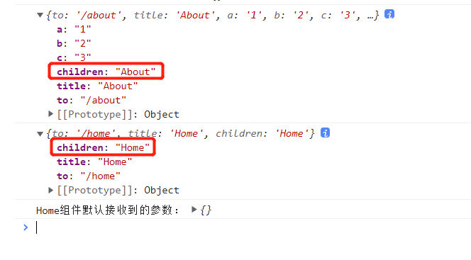

可以看出来，组件传递过来了一个children属性，属性内容是标签内容。

所以，正常情况下，封装自定义导航组件应该是:

```jsx
<NavLink className={({ isActive }) => (isActive ? "nav-item on" : "nav-item")} {...this.props}>{this.props.children}</NavLink>
```

但是我们可以让自定义组件自闭和，然后将children属性赋值给自定义标签属性看下效果：

```jsx
<NavLink className={({ isActive }) => (isActive ? "nav-item on" : "nav-item")} {...this.props} children={this.props.children} />
```


虽然没有显示设置标签内容，给自定义标签设置了一个children属性，组件渲染的时候，直接将children属性值渲染为了标签内容，那么我们根据{...this.props}，children属性也可以省略，最终就是：

```jsx
<NavLink className={({ isActive }) => (isActive ? "nav-item on" : "nav-item")} {...this.props} />
```

然后按照常规的组件调用方式调用就可以了：

```jsx
<MyNavlink to="/about" title="About" a="1" b="2" c="3">About</MyNavlink>
<MyNavlink to="/home" title="Home">Home</MyNavlink>
```

这样使用自定义封装的导航组件，简写了一部分重复的代码，还是按照常规的写法，好了很多。

这个组件的封装的实际意义不大，但是这种组件封装的意识很重要，因为一般情况下，导航应该从后台配置的。

**Switch组件**

在react-router最新的版本(我现在看的react-router-dom@6.2.0)中，已经没有这个组件了。

在react-router-dom@5.3.0之前的版本中，如果出现了这样的代码：

```jsx
<Route path="/about" component={About} />
<Route path="/home" component={Home} />
<Route path="/home" component={Test} />
```

那么当路由跳转到home的时候，会同时渲染Home和Test两个组件内容的,但是如果在路由组件的外面使用<Switch>组件包裹了，那么当匹配到"/home"路由时，就只会匹配到第一个节点的组件，本案例中也就是只会渲染Home组件，不会再渲染Test组件了，对性能来说很有帮助：因为不使用<Switch>组件，当有了匹配路由的组件时，代码还会继续匹配，匹配到了几个组件，就会渲染几个组件的内容，但是使用了<Switch>组件后就只会渲染匹配到的第一个组件。正常情况下，一个路由也就是只会匹配一个组件。

```jsx
<Switch>
    <Route path="/about" component={About} />
    <Route path="/home" component={Home} />
    <Route path="/home" component={Test} />
</Switch>
```

<Switch>组件使用很简单，一般情况下当有2个或以上的路由组件时才去使用，不要滥用。

新版本的react-router(react-router@6.0.0及以上)中，已经没有了这个组件了。因为新版本的react-router的使用方式，已经给去了重了，每个路由组件只会渲染第一个组件

```jsx
<Routes>
    {/* 路由组件：About、Home */}
    <Route path="/about" element={<About />} />
    <Route path="/home" element={<Home />} />
    <Route path="/home" element={<Test />} />
</Routes>
```

案例中为"/home"路由映射了2个组件，我们看页面效果：

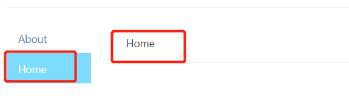

直接不会渲染第一个以下的组件了

**react中样式丢失的问题**

看案例：

```jsx
{/* 编写路由连接 */}
<MyNavlink to="/about">About</MyNavlink>
<MyNavlink to="/home">Home</MyNavlink>

{/* 注册路由 */}
<Routes>
    {/* 路由组件：About、Home */}
    <Route path="/about" element={<About />} />
    <Route path="/home" element={<Home />} />
</Routes>
```

有路由连接，且也注册了路由，在渲染页面的时候，无论是怎么跳转、刷新，都没有任何问题。

现在我们修改下路由：就是在路由前统一加一层公共的path，如/test/about

```jsx
{/* 编写路由连接 */}
<MyNavlink to="/test/about">About</MyNavlink>
<MyNavlink to="/test/home">Home</MyNavlink>
{/* 注册路由 */}
<Routes>
    {/* 路由组件：About、Home */}
    <Route path="/test/about" element={<About />} />
    <Route path="/test/home" element={<Home />} />
</Routes>
```

修改后，页面、组件初次渲染的时候，没有任何问题

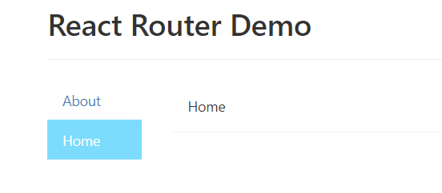

但是我们刷新一下：样式丢了

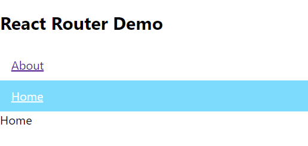

这是什么原因呢？我们看下开发者工具，追踪下资源情况：

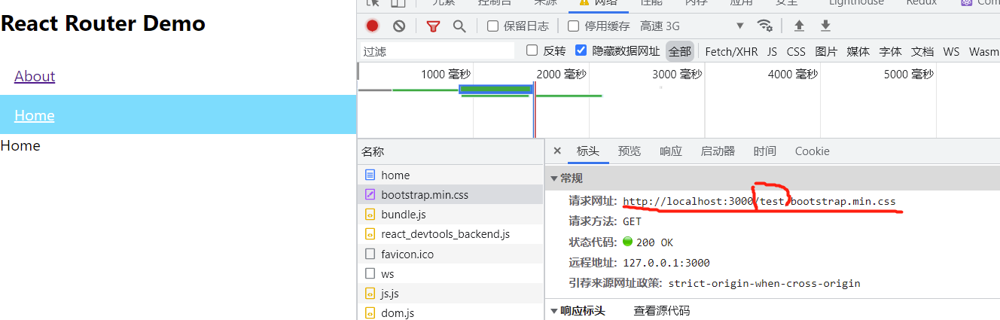

原来请求的css已经不是在根目录下的css了，而是请求到了路由中添加的那层path下了。但是我们的项目目录，是没有path这一层的，所以就请求不到这个资源了。

细心的同学可能会发现，请求的状态码是200，是请求成功了的，那么为什么在没有资源存在的情况下却请求成功了呢？

这是因为react给做的处理，在请求的静态资源不存在的时候，它就默认给返回项目的首页index.html了，所以在请求不存在的css文件时，它实际上返回的是index.html，而不是真正的css，所以状态码的请求状态是200.这个结果也可以从开发者工具中得到验证：

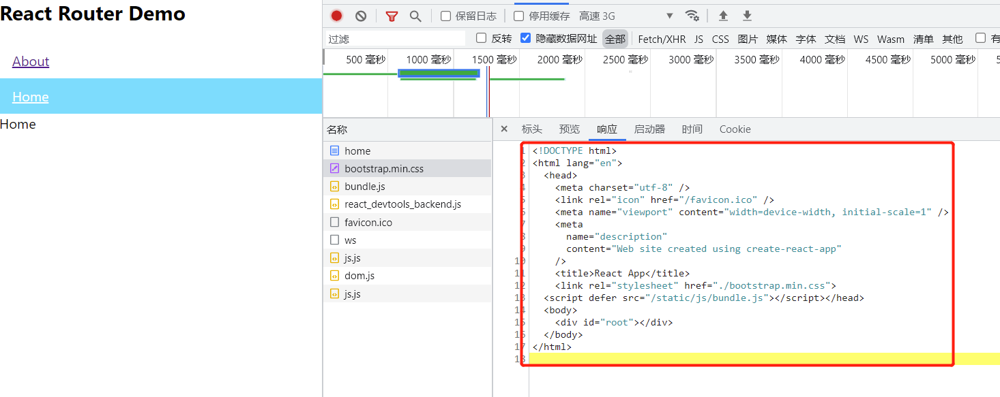

解决办法：

因为是路径带来的问题，所以解决问题的方法上，还是要从解决文件的路径上去着手。

1. 入口文件引用静态资源文件的时候，使用绝对路径

   ```html
       <!-- link标签导入css文件的时候，使用相对路径是一种很不好的实践 -->
       <!-- <link rel="stylesheet" href="./bootstrap.min.css"> -->
   
       <!-- link标签导入css文件的时候，可以使用绝对路径 -->
       <!-- <link rel="stylesheet" href="/bootstrap.min.css"> -->
   ```

2. 使用变量动态匹配

   ```html
   <!-- link标签导入css文件的时候，推荐使用变量匹配 -->
   <link rel="stylesheet" href="%PUBLIC_URL%/bootstrap.min.css">
   ```

   第一种使用绝对路径的方式，在样式丢失的问题上会比使用相对路径好一些，但也不是推荐的实践方式，因为写死了、固定了，不灵活了。

   第二种方式是比较推荐的方式，把路径的匹配交给工具去动态匹配，不会存在由于某些路径、url的变化导致资源文件找不到的问题了

3. 使用Hash路由模式

   前端项目，我比较推荐的是使用history的路由模式，虽然初次配置的时候稍微麻烦了一点，但是url更美观，但是在针对这个样式、静态资源丢失的问题时，使用hash的路由模式也也解决问题。

   因为我们知道hash的路由模式，url中多了一个#，#之后的内容被认为是hash值，在页面刷新的时候是不会带给服务端的，所以无论页面怎么刷新，提交给服务器的资源永远是#之前的部分，其实也就是根目录了，所以也就不存在路径变化的问题了

   ```js
   import { HashRouter } from 'react-router-dom';
   ReactDOM.render(
       <HashRouter>
         <App />
       </HashRouter>,
     document.getElementById('root')
   );
   ```

   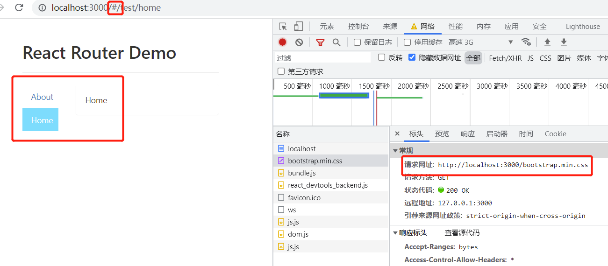

   虽然有这三种方式可以解决多层路径时的样式丢失问题的方案，但是一般的情况下是使用第二种方案，其他的方案了解即可。

   还有就是会存在在入口文件引用样式的问题。

   **路由的严格精准匹配和模糊匹配**

   一般情况下，没有特殊要求，就不使用严格的精准匹配。

   使用严格的精准匹配，也很简单，只需要一个exact属性，boolean值。

   ```jsx
   <Route exact path="/test/home" element={<Home />} />
   ```

**路由重定向**

下面的案例都是以react-router-dom@5.3.0版本为准，因为react-router-dom的6.x版本中，很多元素、控件都有了很大的变化

```jsx
<Redirect to="/about" />
```

页面、组件会重定向到这个Redirect控件指定的路由，类似于服务器端路由的3xx重定向。

更多的情况下，<Redirect>会放在所有路由的最下方，当没有匹配到路由时，去重定向到指定的路由。

#### 6.4 嵌套路由使用

嵌套路由，也称为二级路由。但是如果叫二级路由的话，就会有些人问三级路由、四级路由等。

```jsx
<div>
    {/* 导航区域 */}
    <ul className="nav nav-tabs">
        <li>
            {/* 子组件导航区域指定to属性时，需要同时带上父组件的路由，如/home/news */}
            <MyNavlink to="/home/news">News</MyNavlink>
        </li>
        <li>
            <MyNavlink to="/home/message">Message</MyNavlink>
        </li>
    </ul>
    {/* 注册路由，路由的匹配顺序从父组件开始模糊匹配 */}
    <Switch>
        <Route path="/home/news" component={News} />
        <Route path="/home/message" component={Message} />
        <Redirect to="/home/news" />
    </Switch>
</div>
```

**嵌套路由**

1. 注册子路由，也要带上父路由的path值

   ```jsx
   <Switch>
       <Route path="/home/news" component={News} />
       <Route path="/home/message" component={Message} />
       <Redirect to="/home/news" />
   </Switch>
   ```

   demo中，/home就是父路由的path值，/news、/message是子路由值

2. 路由的匹配是按照路由的注册顺序进行的

   ```jsx
   {/* 父组件：App.jsx */}
   {/* 注册路由 */}
   <Switch>
       <Route path="/about" component={About} />
       <Route path="/home" component={Home} />
       <Redirect to="/about" />
   </Switch>
   
   {/* 子组件Home.jsx */}
   {/* 注册路由，路由的匹配顺序从父组件开始模糊匹配 */}
   <Switch>
       <Route path="/home/news" component={News} />
       <Route path="/home/message" component={Message} />
       <Redirect to="/home/news" />
   </Switch>
   ```

   demo中，路由的匹配顺序先从父组件中注册的路由开始匹配，然后再匹配到子组件中注册的路由。

#### 6.5 向路由组件传递参数数据

##### 6.5.1 通过params方式传递参数

```jsx
{/* 通过params方式传递参数 */}
<ul>
    {message.map((msg) => {
        return (
            <li key={msg.id}>
                {/* 向路由组件通过params传递参数 */}
                <Link to={`/home/message/detail/${msg.id}/${msg.title}`}>{msg.title}</Link>
            </li>
        );
    })}
</ul>
{/* 接收params参数 */}
<Route path="/home/message/detail/:id/:title" component={Detail} />
```

Detail组件中接收params参数的方式：

```jsx
  render() {
    // 通过props方式接收params参数
    // 组件之间传值，基本上就是依赖props
    const { id, title } = this.props.match.params;
    // demo中是几条模拟的数据，实际开发中应该是从服务端下发的动态数据
    const detail = DetailData.find((detailObj) => {
      return detailObj.id === id;
    });
    return (
      <div>
        <ul>
          <li>Id: {id}</li>
          <li>title: {title}</li>
          <li>content：{detail.content}</li>
        </ul>
      </div>
    );
  }
```

params传参方式，清空浏览器缓存刷新，或者重新打开浏览器，页面数据都会保存，不会丢失

##### 6.5.2 search参数

search参数的方式比params方式传递的时候省心，但是接收的时候麻烦些

node中，有一个叫做：querystring的库，可以用来序列化参数。

```jsx
import qs from "querystring";

const obj = {
  name: "Nicholas Zakas",
  age: 18,
};
// stringify方法将对象数据转换成urlencoded编码字符串
console.log(qs.stringify(obj)); // name=Nicholas%20Zakas&age=18

const car = "car='奥拓'&price=9.9";
// parse方法将urlencoded字符串转换成对象
console.log(qs.parse(car)); // {car: "'奥拓'", price: '9.9'}
```

向路由传递search参数以及组件接收search参数方式

```jsx
{/* 向路由组件传递search参数 */}
<Link to={`/home/message/detail/?id=${msg.id}&title=${msg.title}`}>{msg.title}</Link>
{/* 声明接收search参数:search参数无需声明接收,正常注册路由即可 */}
<Route path="/home/message/detail" component={Detail} />

{/* 组件中接收search参数的方式 */}
// 接收search参数
const result = this.props.location.search;
const { id, title } = qs.parse(result.slice(1));
```

向路由传递search参数，传递过程和注册路由的过程都比较省心，但是在组件中接收search参数的时候需要处理一下接收到的参数，相比params参数稍微麻烦了一点。

search传参方式，无论是清空缓存，还是重新打开浏览器，页面数据都不会丢失；

##### 6.5.3 state参数

state参数，是路由参数中的一个参数，不是状态中的state。

state参数的优势，传递的参数不会在浏览器的地址栏中显示，正常情况下的页面刷新，页面数据不会丢失，原因：

1. 使用了BrowserRouter，BrowserRouter实际上操作的是浏览器的history对象，维护的是history对象的API，history对象记录了一些浏览器的操作；

在通过state正常传递了参数后，页面数据表现正常时，如果这个时候清空了缓存，那么再刷新页面，页面数据就会丢失，因为BrowserRouter维护的history对象的数据被清空了，所以在使用state参数的时候需要注意下参数为空时情况的处理。

state方式参数，不光是清空缓存，实际上在浏览器关闭之后重新打开连接，state参数也会丢失，也需要重新获取。原因还是因为BrowserRouter维护的是浏览器的history对象。

```jsx
{/* 向路由传递state参数：state参数需要是对象 */}
<Link to={{ pathname: "/home/message/detail", state: { id: msg.id, title: msg.title }}}>{msg.title}</Link>

{/* 声明接收state参数路由：state参数无需声明接收，正常注册路由即可 */}
<Route path="/home/message/detail" component={Detail} />

{/* 组件中接收state参数 */}
// 接收state参数  由于state参数的特殊性，可能会存在重新打开浏览器或者清空缓存的情况导致参数丢失的问题，所以在处理业务逻辑时需要考虑到参数为空特殊场景的代码处理
const {id,title} = this.props.location.state || {};

// demo中是几条模拟的数据，实际开发中应该是从服务端下发的动态数据
const detail = DetailData.find((detailObj) => {
    return detailObj.id === id;
}) || {};
```

**路由之间传递参数，无论哪种方式的传参方式，都要注意以下3个方面：**

1. 传递参数，也叫携带参数
2. 路由声明时的接收方式
3. 组件接收参数

##### 6.5.4 向路由传递参数总结

1. param参数

   1. 路由连接-携带参数

      ```jsx
      <Link to={`/home/message/detail/${msg.id}/${msg.title}`}>{msg.title}</Link>
      ```

   2. 注册路由-声明接收方式

      ```jsx
      {/* 声明接收params参数 */}
      <Route path="/home/message/detail/:id/:title" component={Detail} />
      ```

   3. 组件接收参数

      ```jsx
      // 通过props方式接收params参数
      const { id, title } = this.props.match.params;
      ```

2. search参数

   1. 路由连接-携带参数

      ```jsx
      {/* 向路由组件传递search参数 */}
      <Link to={`/home/message/detail/?id=${msg.id}&title=${msg.title}`}>{msg.title}</Link>
      ```

   2. 注册路由-无需声明，正常注册路由即可

      ```jsx
      {/* 声明接收search参数:search参数无需声明接收,正常注册路由即可 */}
      <Route path="/home/message/detail" component={Detail} />
      ```

   3. 组件接收参数

      ```jsx
      import qs from "querystring"; // 需要使用qs库序列化参数
      // 接收search参数
      const result = this.props.location.search;
      const { id, title } = qs.parse(result.slice(1));
      ```

   4. 备注：获取到的参数时urlencoded编码字符串，需要使用qs库序列化参数

3. state参数

   1. 路由连接-携带参数

      ```jsx
      {/* 向路由传递state参数：state参数需要是对象 */}
      <Link to={{ pathname: "/home/message/detail", state: { id: msg.id, title: msg.title }}}>{msg.title}</Link>
      ```

   2. 注册路由-无需声明，正常注册路由即可

      ```jsx
      {/* 声明接收state参数路由：state参数无需声明接收，正常注册路由即可 */}
      <Route path="/home/message/detail" component={Detail} />
      ```

   3. 组件接收参数

      ```jsx
      // 接收state参数
      const {id,title} = this.props.location.state || {};
      
      // 接收state参数时数据处理，demo中是几条模拟的数据，实际开发中应该是从服务端下发的动态数据
      const detail = DetailData.find((detailObj) => {
          return detailObj.id === id;
      }) || {};
      ```

   4. 备注：页面刷新也可以保留数据，但是关闭了浏览器之后再次打开，数据丢失，所以需要注意参数丢失时的数据处理

   使用范围多少，大概的是params方式最多、state方式最少吧。

   一般情况下，当需要传递一些比较敏感的数据如手机号等用户信息时，可以使用state的方式传递，保护数据。

   除了state传参方式之外的另外两种方式，路由和参数也可以写为对象形式，但是有点麻烦了，不如我们前面介绍的方式简单，实际使用中就可以直接使用我们前面学习的代码组织形式。

#### 6.6 多种路由跳转方式

react-router-dom客户端路由，支持两种路由模式：push模式和replace模式，默认开启的是push模式，一种压栈操作，所有操作都会留下历史痕迹，当点击浏览器的上一步、下一步时，都可以精确的回到上一步、下一步。

也可以通过replace属性指定replace模式，这样就不会记录每一步的操作步骤了，点击上一步、下一步的时候，直接返回到使用push模式、有记录的位置。

```jsx
{/* 指定replace的路由模式，replace属性值是布尔值，值可省略，当出现replace属性时表示为true，没有该属性时则表示为false */}
<Link replace to={`/home/message/detail/${msg.id}/${msg.title}`}>{msg.title}</Link>
```

##### 6.6.1 编程式导航

在代码业务逻辑中实现路由跳转，就是编程式导航

```jsx
replaceShowMsg = (id,title) => {
    // 这就是编程式导航
    this.props.history.replace(`/home/message/detail/${id}/${title}`);
}
```

编程式导航state方式传参

```jsx
  replaceShowMsg = (id,title) => {
    // 编程式导航，state方式传参
    this.props.history.replace(`/home/message/detail/`,{id,title});
  }
```

编程式导航中的state传参，其实就是传递一个对象参数

编程式路由导航，本质上就是借助了this.props.history对象上的API对操作路由跳转、前进、后退

- this.props.history.push()
- this.props.history.replace()
- this.props.history.go()
- this.props.history.goBack()
- this.props.history.goForward()

##### 6.6.2 withRouter的使用

react中，路由组件具有history、location、match等一些属性、功能。

withRouter可以加工一般组件，让一般组件具备只有路由组件才具有的一些属性，或使用路由组件才具有的一些API，如history、location、

withRouter(Header)的返回值是一个新组件，是经过withRouter加工过的新的组件，这个新的组件具备了路由组件的特性

在一般组件中是不能够使用路由组件中的特有属性的，但是withRouter函数，可以让一般组件具备路由组件的属性，可以让一般组件具备history、location、match属性、功能。

```jsx
import React, { Component } from "react";
import { withRouter } from "react-router-dom";
import "./Header.module.css";

class Header extends Component {
  forward = () => {
    this.props.history.goForward();
  };

  back = () => {
    this.props.history.goBack();
  };

  go = () => {
    this.props.history.go(1);
  };

  render() {
    return (
      <div className="page-header">
        <h2>React Router Demo</h2>
        <div className="btn-area">
          <button className="btn" onClick={this.forward}>
            前进
          </button>
          <button className="btn" onClick={this.back}>
            后退
          </button>
          <button className="btn" onClick={this.go}>
            go
          </button>
        </div>
      </div>
    );
  }
}

export default withRouter(Header);
```

withRouter函数，返回一个组件，返回一个经过withRouter加工的、具有路由组件特性的新组件。

#### 6.7 BrowserRouter和HashRouter

1. 底层原理不同

   BrowserRotuer使用的H5的history api，不兼容IE9及以下版本的IE浏览器

   HashRouter使用的是URL的哈希值

2. url表现形式不同

   BrowserRouter的路径中没有#

   HashRouter的路径中包含#

3. 刷新后对路由state参数的影响

   BrowserRouter没有任何影响，因为state保存在history对象中

   HashRouter刷新后会导致路由的state参数丢失

4. 备注：HashRouter可以用于解决一些路径错误相关的问题

BrowserRouter和HashRouter相比，HashRouter的兼容性更友好一些，但是url不美观。但凡是使用了React、Vue或者Angular做的前端项目，正常情况下也不会要求兼容到IE6或者IE7吧现在。所以，大多数做C端项目来说，我是比较推荐BrowserRouter的，我要把我项目美好的一面呈现给用户。

### 7. redux

#### 7.1 redux理解

##### 7.1.1 学习文档

1. 英文文档   https://redux.js.org/
2. 中文文档  https://www.redux.org.cn/
3. Github  https://github.com/reduxjs/redux

##### 7.1.2 redux是什么？

1. redux是一个专门用来做状态管理的js库（不是react插件库）

2. 它可以用在react、angular和vue中，但是基本上只与react配合使用

   vue中可以使用vuex

   angular中也有自己的实现

3. 作用：集中式管理react应用中多个组件共享的状态

##### 7.1.3 什么情况下需要使用redux

1. 某个组件的状态，需要让其他组件可以随时拿到-共享
2. 一个组件需要改变另一个组件的状态-通信
3. 总体原则：能不用就不用，如果不用实现功能时很吃力就考虑使用

##### 7.1.4 redux工作流程

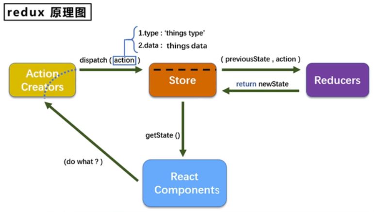


#### 7.2 redux的三个核心概念

##### 7.2.1 action

1. 动作的对象

2. 包含2个属性

   - type：标识属性，值为字符串，唯一，必要属性

   - data：数据属性，值为任意类型，可选

     ```js
     {
         type: "ADD_USER",
         data:{
             name: "Nicholas Zakas",
             age: 18
         }
     }
     ```

##### 7.2.2 reducer

1. 用于初始化、加工状态
2. 加工时，根据旧的state和action，产生新的state的纯函数

##### 7.2.3 store

1. 将state、actions和reducer联系在一起的对象

2. 如何得到此对象？

   ```js
   import {createStore} from "redux"
   import reducer from "./reducers"
   const store = createStore(reducer);
   ```

3. 此对象的功能？

   1. getState()  得到state
   2. dispatch(action) 分发action，触发reducer调用，产生新的state
   3. subscribe(listener) 注册监听，当产生了新的state时，自动调用

#### 7.3 redux的核心API

getState()

store.subscribe()

store.dispatch({type:"",data:xxx})

#### 7.4 使用redux编写应用

安装redux

```bash
npm install redux
```

redux只负责状态的管理，但是状态改变后驱动页面的变化，则需要我们自己写。

redux的使用步骤：

1. 安装

2. src下创建redux文件

   1. -redux redux目录，所有状态相关的文件都放在该目录下
      1. store.js  一般一个项目只有一个store.js，负责状态保存
      2. xxx_reducer.js 专门处理状态的，专人专用，加工和初始化状态

3. stroe.js

   1. 引入redux中的createStroe()函数，创建一个stroe
   2. createStore()调用时传入一个为其服务的reducer
   3. 暴露store对象

4. xxx_reducer.js

   1. reducer的本质是一个函数，接收preState、action，返回加工后的状态
   2. reducer有2个作用：初始化、加工状态
   3. reducer第一次被调用，是store自动触发的
      1. 传递的preState是undefined
      2. 传递的action是一个对象:{type: '@@redux/INIT9.z.w.j.l'} INIT后面的部分是随机的

5. 在入口文件index.js中监测store中状态的改变，一旦发生改变，重新渲染根组件<App />

   > redux只负责管理状态，至于状态改变后驱动页面的变化，则需要我们开发人员自己去编写这部分的业务代码
   
6. 创建constant.js用于使用常量保存变量，以防在编码过程中由于疏忽导致拼写错误的问题。

#### 7.5 redux异步编程

主要是在action部分，action有两种形式：一种是一般的Object对象，另外一种是function函数。

正常情况下，当action是一个一般的Object对象时，那么就是个同步的action；当action是一个function函数时，那么就是个异步action。

```js
// 同步anction，就是指action值为一般Object对象
export const createIncrementAction = data => ({ type: INCREMENT, data });
export const createDecrementAction = data => ({ type: DECREMENT, data });

// 异步action，是指action值为函数的action
export const createIncrementAsyncAction = (data,time) => {
    return () => {
        
    }
}
```

备注：

1. 延迟的异步动作不想交给组件本身去做，就可以交给action去做；

2. 什么时候需要异步action呢？想要对状态进行操作，具体的数据靠异步任务返回时

3. 使用方式

   1. 需要使用applyMiddleware中间件，用来执行中间件，并在store中导入

      ```javascript
      // applyMiddleware用来执行中间件
      import { createStore,applyMiddleware } from "redux";
      ```

      需要使用redux-thunk包，用来支持异步action

      ```bash
      npm install redux-thunk
      ```

   2. 创建action的函数不再返回一个一般对象，而是返回一个函数，该函数中执行异步任务

      ```js
      // count_action.js
      // 异步action，是指action值为函数的action
      // 异步action中，一般都会调用同步action
      // 异步action不是必须要用的，根据业务场景来确定是否需要的
      export const createIncrementAsyncAction = (data,time) => {
          return (dispatch) => {
              setTimeout(()=>{
                  // 联系redux，加工数据
                  // dispatch({type:INCREMENT,data}); // 也可以通过调用同步任务的方式实现
                  dispatch(createIncrementAction(data));
              },time);
          }
      }
      ```

   3. 异步任务执行完成后，分发到一个同步action去操作数据

   4. 异步action不是必须要有的，有可以在组件中去执行异步任务，根据异步任务的结果去分发一个同步的action

      ```js
      // store.js
      /**
       * 该文件专门用于暴露一个store对象，整个应用只有一个store对象
       */
      
      // 引入createStore，专门用于创建redux中最为核心的store对象
      // applyMiddleware用来执行中间件
      import { createStore,applyMiddleware } from "redux";
      // 引入为Count组件服务的reducer
      import countReducer from "./count_reducer";
      // 引入redux-thunk，用于支持异步action
      import thunk from "redux-thunk";
      
      const stroe = createStore(countReducer,applyMiddleware(thunk));
      
      // 暴露store
      export default stroe;
      ```

#### 7.6 react-redux

1. 所有的UI组件都应该使用一个容器组件包裹
2. 容器组件是真正和redux打交道的，里面可以任意使用redux的相关API
3. UI组件中不能使用任何redux的API
4. 容器组件会传递给UI组件：
   1. redux中保存的状态
   2. 用于操作状态的方法
5. 容器组件传递给UI组件的状态、操作状态的方法，均通过props传递

**react-redux基本使用**

1. 明确两个概念

   UI组件：不能使用任何的redux的API，只负责页面的呈现和交互等

   容器组件：负责和redux通信，将结果呈现给UI组件

   ```jsx
   // UI组件，只负责呈现页面效果和交互，不做状态的维护，不和redux通信
   import React, { Component } from "react";
   import CounterStyle from "./Counter.module.css";
   
   export default class Counter extends Component {
     increment = () => {
       const { value } = this.selectNumber;
       let data = value * 1;
       this.props.add(data);
     };
     render() {
       return (
         <div>
           <h3>当前求和为：{this.props.counter}</h3>
           <select ref={(c) => (this.selectNumber = c)}>
             <option value="1">1</option>
             <option value="2">2</option>
             <option value="3">3</option>
           </select>
           <button onClick={this.increment} className={CounterStyle.btn}>
             +
           </button>
           <button onClick={this.decrement} className={CounterStyle.btn}>
             -
           </button>
           <button onClick={this.incrementIfOdd} className={CounterStyle.btn}>
             奇数加
           </button>
           <button onClick={this.incrementAsync} className={CounterStyle.btn}>
             异步加
           </button>
         </div>
       );
     }
   }
   ```

   ```jsx
   // 容器组件：负责和redux通信
   // 引入Counter的UI组件
   import CounterUI from "../../components/Counter/Counter";
   
   // 引入connect用于连接UI组件和redux
   import { connect } from "react-redux";
   import { INCREMENT } from "../../redux/constant";
   
   import { createIncrementAction } from "../../redux/counter_action";
   
   // mapStateToProps函数返回一个对象
   // 返回的对象中的key就作为传递给UI组件的props的key，value就作为传递给UI组件props的value
   // mapStateToProps函数的作用就是用于传递状态
   function mapStateToProps(state) {
     return {
       counter: state,
     };
   }
   
   // mapDispatchToProps函数返回一个对象
   // 返回的对象中的key就作为传递给UI组件的props的key，value就作为传递给UI组件props的value
   // mapDispatchToProps函数的作用就是用于传递操作状态的方法
   function mapDispatchToProps(dispatch) {
     return {
       add: (data) => {
         // 通知redux执行加法操作
         // dispatch({type:INCREMENT,data}); // 直接实现一个action
         dispatch(createIncrementAction(data)); // 调用action
       },
     };
   }
   // 使用connect()()创建并暴露一个容器组件
   export default connect(mapStateToProps, mapDispatchToProps)(CounterUI);
   ```

   

2. 如何创建一个容器组件 — 靠react-redux的connect函数

   connect(mapStateToProps, mapDispatchToProps)(UI组件)

   ​	-mapStateToProps：映射状态，返回一个对象

   ​	-mapDispatchToProps：映射操作状态的方法，返回值是一个对象

   ```jsx
   // 容器组件：src/container/Counter/Counter.jsx
   // 引入Counter的UI组件
   import CounterUI from "../../components/Counter/Counter";
   
   // 引入connect用于连接UI组件和redux
   import { connect } from "react-redux";
   import { INCREMENT } from "../../redux/constant";
   
   import { createIncrementAction } from "../../redux/counter_action";
   
   // mapStateToProps函数返回一个对象
   // 返回的对象中的key就作为传递给UI组件的props的key，value就作为传递给UI组件props的value
   // mapStateToProps函数的作用就是用于传递状态
   function mapStateToProps(state) {
     return {
       counter: state,
     };
   }
   
   // mapDispatchToProps函数返回一个对象
   // 返回的对象中的key就作为传递给UI组件的props的key，value就作为传递给UI组件props的value
   // mapDispatchToProps函数的作用就是用于传递操作状态的方法
   function mapDispatchToProps(dispatch) {
     return {
       add: (data) => {
         // 通知redux执行加法操作
         // dispatch({type:INCREMENT,data}); // 直接实现一个action
         dispatch(createIncrementAction(data)); // 调用action
       },
     };
   }
   // 使用connect()()创建并暴露一个容器组件
   export default connect(mapStateToProps, mapDispatchToProps)(CounterUI);
   
   ```

3. 备注：容器组件中的store是靠props传递过去的，而不是在容器组件中直接引入

   ```jsx
   // App.jsx
   import React, { Component } from 'react';
   import CounterContainer from "./container/Counter/Counter";
   import store from "./redux/store";
   
   export default class App extends Component {
       render() {
           return (
               <div>
                   {/* 给容器组件传递store, props方式，不能在容器组件中直接引入 */}
                   <CounterContainer store={store} />
               </div>
           )
       }
   }
   ```

4. mapDispatchToProps也可以是一个对象

   ```jsx
   export default connect(
     // mapStateToProps
     (state) => ({ counter: state }),
     // mapDispatyToProps
     // 下面为一般的实现，即函数实现方式
     //   (dispatch) => ({
     //     add: (data) => dispatch(createIncrementAction(data)),
     //     reduce: (data) => dispatch(createDecrementAction(data)),
     //     addAsync: (data, time) => dispatch(createIncrementActionAsync(data, time)),
     //   }),
   
     //  mapDispatchToProps的精简写法
     // 就是一个对象
     {
       add: createIncrementAction,
       reduce: createDecrementAction,
       addAsync: createIncrementActionAsync,
     }
   )(CounterUI);
   ```

5. react-redux可做的一些小优化

   1. UI组件和容器组件可以整合为一个文件

   2. 无需自己给容器组件传递store，只需要给最外层的<App />包裹一个<Provider store={store}><App /></Provider>即可。

   3. 使用了react-redux后不需要开发者自己监测redux中状态的改变了，容器组件可以自己完成这个动作

   4. mapDispatchToProps()函数也可以简单的写为一个对象；

   5. 一个组件和redux打交道，需要经过的步骤：

      1. 定义好一个UI组件，但不可以暴露，也就是不通过export导出

      2. 引入connect生成一个容器组件，并暴露，也就是通过export导出，格式如下：

         ```jsx
         connect(mapStateToProps, mapDispatchToProps)(UI组件);
         ```

      3. 在UI组件中通过this.props.xxx读取属性和操作状态

**redux需要处理多个reducer时**

当redux只需要处理一个reducer时，那么创建store的时候，就可以直接把需要处理的reducer传递给store就可以了

```js
const store = createStore(counterReducer, applyMiddleware(thunk));
```

但是一般的情况下，一个项目、应用中可能不只是只有一个reducer，需要处理多个状态，那么这个时候，就需要以对象的形式将多个reducer合并起来，统一传递给store，创建store对象。

combineReducers是一个函数，该函数中传入的对象，就是redux中保存的总的状态对象

```js
const allReducers = combineReducers({
    counter: counterReducer,
    person: personReducer
});
const store = createStore(allReducers, applyMiddleware(thunk));
```

当store中合并了多个reducer时，那么在具体的使用reducer的地方，就要从store中去获取状态对象。

如Counter组件中获取counter状态值，

```jsx
function mapStateToProps(state) {
  return {
    // 这里的state.counter中的counter，是在store中定义的,是这里的counter
    /**
     * const allReducers = combineReducers({
     *    counter: counterReducer,
     *    person: personReducer
     *  });
     */
    counter: state.counter, // 在reducer没有合并之前，在redux中直接存储的数据，reducer合并后，存储在redux中的是一个对象了
  };
}
```

一个组件只要和redux联系，首先就要引入react-redux

```jsx
import { connect } from "react-redux";
```

**不同组件之间的数据共享**

1. 不同组件之间的数据共享，通过redux实现
2. 为每个组件编写reducer、action
3. 重点：不同组件之间的reducer通过combineReducers进行合并，合并后的总状态是一个对象
4. 交给store的是总的reducer，在组件中去状态的时候，需要注意取的是reducer总对象中对应的状态

```jsx
// Counter.jsx
function mapStateToProps(state) {
  return {
    // 这里的state.counter中的counter，是在store中定义的,是这里的counter
    /**
     * const allReducers = combineReducers({
     *    counter: counterReducer,
     *    person: personReducer
     *  });
     */
    counter: state.counter, // 这里的状态，取的是store中reducer中定义的counter属性
    personNum: state.person.length,
  };
}

// store.js
const allReducers = combineReducers({
    counter: counterReducer,
    person: personReducer
});
```

**reducers文件夹下汇总reducers，统一暴露reducers**

```js
//redux/reducers/index.js
import { combineReducers } from "redux";

import counter from "./counter";
import person from "./person";

export default combineReducers({
    counter,
    person
});
```

#### 7.7 使用redux调试工具

redux也有自己的开发者工具，但是使用起来有点麻烦。

不是说我们的项目中使用到了redux，浏览器的开发者工具插件就会高亮，而是需要在代码中引入redux-devtools-extension库并对store做一些处理，才可以使用

```bash
npm install redux-devtools-extension
```

store.js中通过redux-devtools-extension库做一些处理：

```js
// store.js
// 引入redux-devtools-extension
import { composeWithDevTools } from "redux-devtools-extension";
// 使用redux-devtools-extension开发者工具处理
const store = createStore(allReducers, composeWithDevTools(applyMiddleware(thunk)));
```

之后浏览器中的开发者工具就会高亮了

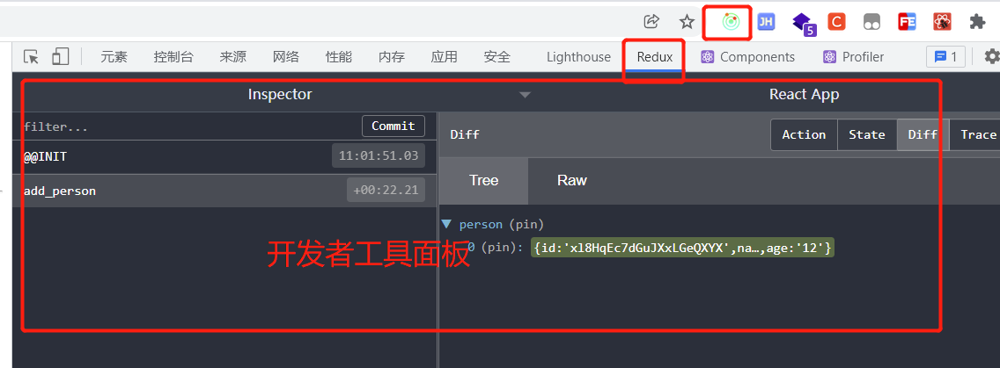

#### 7.8 纯函数和高阶函数

##### 7.8.1 纯函数

1. 一类特别的函数，只要是同样的输入（实参），必定得到同样的输出（返回）
2. 必须遵守一些约束：
   1. 不得改写参数数据
   2. 不会产生任何副作用，例如网络请求，输入和输出设备
   3. 不能调用Date.now()或者Math.random()等时刻会发生变化的方法
3. redux的reducer函数必须要是一个纯函数

##### 7.8.2 高阶函数

1. 一类特别的函数，
   1. 情况1：参数是函数
   2. 情况2：返回值是函数
2. 常见的高阶函数
   1. 定时器设置函数
   2. 常用的数组操作函数方法
      1. forEach
      2. map
      3. filter
      4. reduce
      5. bind
      6. find
   3. promise
   4. react-redux中的connect函数
3. 作用：能实现更加动态、更加可扩展的功能

### 8. 项目部署

一个react项目开发完成之后，需要通过npm run build指令将我们的源代码编译，然后将编译后的代码部署到线上的web服务器，常用的web服务器可以是nginx，可以是tomcat，也可以是apache等任何一个web服务器，当然了，也可以自己写一个，只是一般没有人会这么干。

那么我们的源代码开发完成之后，想在本地模拟下线上运行环境怎么办呢？

可以通过serve库来帮我们实现。

```bash
npm install serve -g # 全局安装
```

然后就可以在终端进入到期望作为服务器根目录的目录，执行serve指令，之后就会开启一个以当前目录为根目录的web服务。

也可以不进入到某个指定目录，而是通过参数的形式指定，就是为了测试一下，没必要那么麻烦。

```bash
PS D:\end\build> serve
   ┌──────────────────────────────────────────────────┐
   │                                                  │
   │   Serving!                                       │
   │                                                  │
   │   - Local:            http://localhost:3000      │
   │   - On Your Network:  http://192.168.3.67:3000   │
   │                                                  │
   │   Copied local address to clipboard!             │
   │                                                  │
   └──────────────────────────────────────────────────┘
```

表示服务已经成功启动

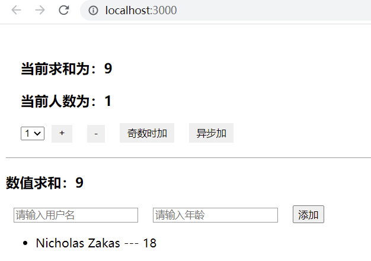

### 9.  附录

#### 9.1 setState

setState更新状态有2种写法

1. setState(stateChange,[callback]) --- 对象式的setState
   1. stateChange为状态改变对象，该对象可以体现出状态的更改
   2. callback是可选的回调函数，它在状态更新完毕、界面也更新完成后被调用
2. setState(updater,[callback]) ---- 函数式的setState
   1. updater为返回stateChange对象的函数
   2. updater可以接收到state和props
   3. callback是可选的回调函数，它在状态更新、界面更新后被调用

总结：

1. 对象式的setState是函数式的setState的简写方式 ----- 语法糖
2. 使用原则：
   1. 如果新状态不依赖原始状态，使用对象式
   2. 如果新状态依赖原始状态，使用函数式
   3. 如果需要在setState()执行后获取最新的状态数据，要再第二个callback函数中获取

react中状态的更新是异步的，如果希望在状态更新完后获取新的状态值，可以通过setState的回调来获取

```js
  increment = () => {
    // 对象式的setState
    const { count } = this.state;
    // 回调函数是可选的，回调函数会在状态更新以及界面更新后执行，可以获取到更新后的状态
    this.setState(
      {
        count: count + 1,
      },
      () => {
        console.log(this.state.count);
      }
    );
    // react中状态的更新是异步的，所以这里同步方式获取修改后的状态是获取不到的
    console.log("21行的输出：", this.state.count); // 0
  };
```

函数式setState

```js
    /**
     * 函数式setState
     * 函数式state可以接收到state和props
     * 函数式setState，也可以有可选的回调
     */
    this.setState(
      (state, props) => {
        return {
          count: count + 2,
        };
      },
      () => {
        console.log(this.state.count);
      }
    );
```


#### 9.2 lazyLoad

#### 9.3 Hooks

#### 9.4 Fragment

#### 9.5 Context

#### 9.6 组件优化

#### 9.7 render props

#### 9.8 错误便捷

#### 9.9 组件通信方式总结
