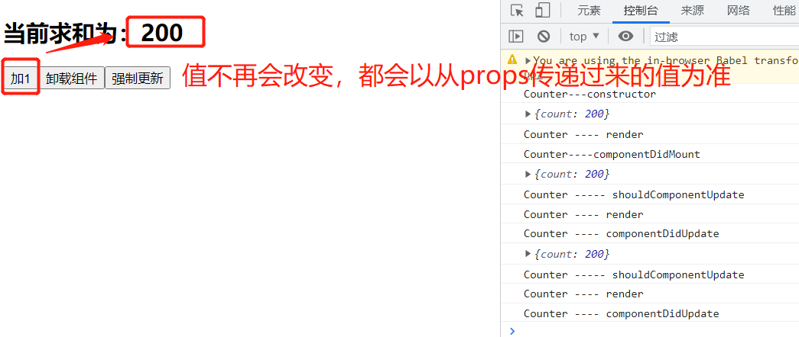

<!-- START doctoc generated TOC please keep comment here to allow auto update -->
<!-- DON'T EDIT THIS SECTION, INSTEAD RE-RUN doctoc TO UPDATE -->
**Table of Contents**  *generated with [DocToc](https://github.com/thlorenz/doctoc)*

- [1. React全家桶](#1-react%E5%85%A8%E5%AE%B6%E6%A1%B6)
  - [1.1 React是什么？](#11-react%E6%98%AF%E4%BB%80%E4%B9%88)
  - [1.2 起源](#12-%E8%B5%B7%E6%BA%90)
  - [1.3 价值](#13-%E4%BB%B7%E5%80%BC)
  - [1.4 React特点](#14-react%E7%89%B9%E7%82%B9)
  - [1.5 学习React的需要准备的JS基础知识](#15-%E5%AD%A6%E4%B9%A0react%E7%9A%84%E9%9C%80%E8%A6%81%E5%87%86%E5%A4%87%E7%9A%84js%E5%9F%BA%E7%A1%80%E7%9F%A5%E8%AF%86)
- [2.React基础](#2react%E5%9F%BA%E7%A1%80)
  - [2.1 基本介绍](#21-%E5%9F%BA%E6%9C%AC%E4%BB%8B%E7%BB%8D)
    - [2.1.1 官网](#211-%E5%AE%98%E7%BD%91)
    - [2.1.2 介绍](#212-%E4%BB%8B%E7%BB%8D)
    - [2.1.3 React特点](#213-react%E7%89%B9%E7%82%B9)
    - [2.1.4 React高效的原因](#214-react%E9%AB%98%E6%95%88%E7%9A%84%E5%8E%9F%E5%9B%A0)
  - [2.2 React基本使用](#22-react%E5%9F%BA%E6%9C%AC%E4%BD%BF%E7%94%A8)
    - [2.2.1 效果](#221-%E6%95%88%E6%9E%9C)
    - [2.2.2 相关js库](#222-%E7%9B%B8%E5%85%B3js%E5%BA%93)
    - [2.2.3 创建虚拟DOM的两种方式](#223-%E5%88%9B%E5%BB%BA%E8%99%9A%E6%8B%9Fdom%E7%9A%84%E4%B8%A4%E7%A7%8D%E6%96%B9%E5%BC%8F)
  - [2.3 React JSX](#23-react-jsx)
    - [2.3.1 效果](#231-%E6%95%88%E6%9E%9C)
    - [2.3.2 JSX](#232-jsx)
    - [2.3.3 渲染虚拟DOM（元素）](#233-%E6%B8%B2%E6%9F%93%E8%99%9A%E6%8B%9Fdom%E5%85%83%E7%B4%A0)
    - [2.3.4 JSX demo](#234-jsx-demo)
  - [2.4 模块与组件和模块化与组件化的理解](#24-%E6%A8%A1%E5%9D%97%E4%B8%8E%E7%BB%84%E4%BB%B6%E5%92%8C%E6%A8%A1%E5%9D%97%E5%8C%96%E4%B8%8E%E7%BB%84%E4%BB%B6%E5%8C%96%E7%9A%84%E7%90%86%E8%A7%A3)
    - [2.4.1 模块](#241-%E6%A8%A1%E5%9D%97)
    - [2.4.2 组件](#242-%E7%BB%84%E4%BB%B6)
    - [2.4.3 模块化](#243-%E6%A8%A1%E5%9D%97%E5%8C%96)
    - [2.4.4 组件化](#244-%E7%BB%84%E4%BB%B6%E5%8C%96)
- [3. React面向组件编程](#3-react%E9%9D%A2%E5%90%91%E7%BB%84%E4%BB%B6%E7%BC%96%E7%A8%8B)
  - [3.1 基本理解和使用](#31-%E5%9F%BA%E6%9C%AC%E7%90%86%E8%A7%A3%E5%92%8C%E4%BD%BF%E7%94%A8)
  - [3.2 组件实例的三大核心属性之一：state](#32-%E7%BB%84%E4%BB%B6%E5%AE%9E%E4%BE%8B%E7%9A%84%E4%B8%89%E5%A4%A7%E6%A0%B8%E5%BF%83%E5%B1%9E%E6%80%A7%E4%B9%8B%E4%B8%80state)
  - [3.3 组件实例的三大核心属性之二：props](#33-%E7%BB%84%E4%BB%B6%E5%AE%9E%E4%BE%8B%E7%9A%84%E4%B8%89%E5%A4%A7%E6%A0%B8%E5%BF%83%E5%B1%9E%E6%80%A7%E4%B9%8B%E4%BA%8Cprops)
  - [3.4 组件实例的三大核心属性之三：refs与事件处理](#34-%E7%BB%84%E4%BB%B6%E5%AE%9E%E4%BE%8B%E7%9A%84%E4%B8%89%E5%A4%A7%E6%A0%B8%E5%BF%83%E5%B1%9E%E6%80%A7%E4%B9%8B%E4%B8%89refs%E4%B8%8E%E4%BA%8B%E4%BB%B6%E5%A4%84%E7%90%86)
    - [3.4.1 理解](#341-%E7%90%86%E8%A7%A3)
    - [3.4.2 使用](#342-%E4%BD%BF%E7%94%A8)
    - [3.4.3 使用ref时注意](#343-%E4%BD%BF%E7%94%A8ref%E6%97%B6%E6%B3%A8%E6%84%8F)
    - [3.4.4 React中的事件处理](#344-react%E4%B8%AD%E7%9A%84%E4%BA%8B%E4%BB%B6%E5%A4%84%E7%90%86)
  - [3.5 收集表单数据](#35-%E6%94%B6%E9%9B%86%E8%A1%A8%E5%8D%95%E6%95%B0%E6%8D%AE)
  - [3.6 组件生命周期](#36-%E7%BB%84%E4%BB%B6%E7%94%9F%E5%91%BD%E5%91%A8%E6%9C%9F)
    - [3.6.1 高阶函数](#361-%E9%AB%98%E9%98%B6%E5%87%BD%E6%95%B0)
    - [3.6.2 函数柯里化](#362-%E5%87%BD%E6%95%B0%E6%9F%AF%E9%87%8C%E5%8C%96)
    - [3.6.3 生命周期](#363-%E7%94%9F%E5%91%BD%E5%91%A8%E6%9C%9F)
  - [3.7 虚拟DOM与DOM diff算法](#37-%E8%99%9A%E6%8B%9Fdom%E4%B8%8Edom-diff%E7%AE%97%E6%B3%95)
- [4. React应用：基于React脚手架](#4-react%E5%BA%94%E7%94%A8%E5%9F%BA%E4%BA%8Ereact%E8%84%9A%E6%89%8B%E6%9E%B6)
- [5. React Ajax](#5-react-ajax)
- [6. react-router](#6-react-router)
- [7. React组件库](#7-react%E7%BB%84%E4%BB%B6%E5%BA%93)
- [8. redux](#8-redux)

<!-- END doctoc generated TOC please keep comment here to allow auto update -->

### 1. React全家桶

React基础

React-router

PubSub 消息管理

Redux 集中式状态管理

Ant-Design UI库

#### 1.1 React是什么？

学习react之前，推荐一个前端资源库的CDN：https://www.bootcdn.cn/

用户构建用户界面的Js库

React只关注视图、只关注页面

React是一个将数据渲染为HTML视图的开源Javascript库

#### 1.2 起源

facebook公司推出的。

facebook2011年部署在newsfeed

2012年部署了Instgram

2013年5月开源了

React被国际上广大互联网一线大厂使用。

#### 1.3 价值

* 原生js开发，效率低，DOM操作繁琐
  * React、Vue等UI库、框架之前的前端开发，是通过DOM API操作UI
* 使用js操作DOM，浏览器会进行大量的重绘重排，严重影响性能；
* 原生js没有组件化解决方案，代码复用率低；

#### 1.4 React特点

* 采用组件式模式、声明式编码，提高开发效率和组件复用率；
* React Native中可以使用React语法进行移动端开发；
* 使用虚拟DOM+优秀的Diff算法，尽量减少与真实DOM的交互；

#### 1.5 学习React的需要准备的JS基础知识

判断this的指向

class（类）

ES6语法规范

npm包管理器

原型、原型链

数组常用方法

模块化

### 2.React基础

#### 2.1 基本介绍

##### 2.1.1 官网

https://reactjs.org/

https://react.docschina.org/

React CDN：https://unpkg.com/

##### 2.1.2 介绍

用于动态构建用户界面的javascript库，只关注视图

由facebook在2013年5月开源

##### 2.1.3 React特点

* 声明式编码
* 组件化编码
* 开用React Native编写原生应用
* 高效：优秀的diff算法和虚拟DOM

##### 2.1.4 React高效的原因

* 使用虚拟DOM，不总是直接操作页面的真实DOM
* DOM的diff算法，最小化的页面重绘

#### 2.2 React基本使用

##### 2.2.1 效果

JSX：开源像写js一样写jsx。jsx本身就是js的一写扩展，多了一些规则而已，可以像写js一样写jsx。

```html
    <!--容器-->
    <div id="app"></div>

    <!--
        引入react库时，注意引入的顺序：
        1. 引入react和辛库
        2. 引入react的扩展库：react-dom,让react具有操作DOM的能力
        3. 再引入扩展工具：babel.min.js
    -->
    <!--引入React核心库-->
    <script src="./js/react.development.js"></script>
    <!--引入react扩展库react-dom,支持react操作DOM-->
    <script src="./js/react-dom.development.js"></script>
    <!--引入babel，将jsx转为js-->
    <script src="./js/babel.min.js"></script>
    <!--
        type写成text/babel，表示这是jsx类型的代码，且使用babel进行转换
        type属性一定要写，默认为js
    -->
    <script type="text/babel">
      // 1. 创建虚拟DOM
      const VDOM = (
        <h1>Hello React</h1>
      ); /* 这里是jsx，不是js中的字符串，不要使用引号 */
      // 2. 渲染虚拟DOM到页面
      ReactDOM.render(VDOM, document.querySelector("#app"));
    </script>
```

效果：


##### 2.2.2 相关js库

react.development.js  react核心库

react-dom.development.js react扩展库，让react具备操作DOM的能力

babel.min.js react的转换工具，可以从https://www.babeljs.cn/setup这里获取

##### 2.2.3 创建虚拟DOM的两种方式

1. 纯js的方式：一般不会用

   ```html
   <!--创建react应用的容器-->
   <div id="app"></div>
   
   <!--引入react库，注意先后顺序：核心库、扩展库-->
   <script src="../js/react.development.js"></script>
   <script src="../js/react-dom.development.js"></script>
   <!--不需要引入转换工具了，因为babel的目标是把jsx转换成js，而现在我们直接使用js，所以不需要转换了-->
   <!-- <script src="../js/babel.min.js"></script> -->
   
   <!--type可以省略了，或者显示设置成text/javascript-->
   <script type="text/javascript">
       // 1. 以js的方式创建虚拟DOM
   
       /**
          * React.createElement()接收3各参数，分别为：
          * 标签名  string
          * 标签属性 object
          * 标签内容 any
          */
       const vd = React.createElement("h1",{id: "js"},"以js的方式创建虚拟DOM");
       // 2. 渲染虚拟DOM到页面
       ReactDOM.render(vd,document.querySelector("#app"));
   </script>
   ```

   

2. JSX方式，推荐使用

   ```html
   <!--创建react应用的容器-->
   <div id="app"></div>
   
   <!--引入react库，注意引入顺序：核心库、扩展库、转换工具-->
   <script src="../js/react.development.js"></script>
   <script src="../js/react-dom.development.js"></script>
   <script src="../js/babel.min.js"></script>
   <script type="text/babel">
         const vd = <h1 id="jsx">使用JSX方式创建虚拟DOM</h1>;
         ReactDOM.render(vd, document.querySelector("#app"));
   </script>
   ```

   

实际代码中，推荐jsx的方式，因为如果有多层标签嵌套的时候，jsx可以直接按照真实的结构去写代码，简单；而js创建虚拟DOM就不一样了，需要多层都通过React.createElement()方法去创建标签。

JSX的主要作用，就是为了创建虚拟DOM，让我们开发代码更简单。

jsx在写的代码片段较长时，可以像写HTML一样进行折行书写，只是这个时候需要把jsx使用()包裹起来.

```html
<!--创建react应用的容器-->
<div id="app"></div>

<!--引入react库，注意引入顺序：核心库、扩展库、转换工具-->
<script src="../js/react.development.js"></script>
<script src="../js/react-dom.development.js"></script>
<script src="../js/babel.min.js"></script>
<script type="text/babel">
      const vd = (
        <h1 id="jsx">
          <span className="text">使用JSX方式创建虚拟DOM</span>
    </h1>
      );
      ReactDOM.render(vd, document.querySelector("#app"));
</script>
```


**关于虚拟DOM**

1. 本质是一般的Object对象；
2. 虚拟DOM本身比较轻量，真实DOM相对较重。因为虚拟DOM主要是为了供react内部使用，够React使用就可以了；但是真实DOM需要考虑兼容很多种场景，有了较多的冗余属性，导致了较多的属性，显得较重；
3. 虚拟DOM最终会被React渲染成真实DOM，呈现在页面上； --- 虚拟DOM是保存在内存中

#### 2.3 React JSX

1. 全称：Javascript XML
2. 是react定义的一种类似xml的js扩展语法：Js + XML
3. 本质是React.createElement(component,props,...children)方法的语法糖
4. 作用：用来简化创建虚拟DOM
   1. 写法：var element = <h1>Hello React JSX</h1>
   2. 注意：
      1. 它不是字符串，也不是HTML、XML标签
      2. 它最终产生的就是一个普通的Object对象
5. 标签名任意：可以是HTML标签或者其他标签

##### 2.3.1 效果

##### 2.3.2 JSX

jsx语法规则

1. 定义jsx时不要使用引号，因为它不是字符串

2. jsx如果需要混用js变量，那么js变量需要使用{}包裹起来，{}内也可以使用js表达式

   1. 标签中混入js表达式时使用{}包裹

3. 通过类来指定样式时，使用className，不要使用class，且属性值不需要使用{}包裹，正常使用引号即可

4. 内联样式，要用style={{key:value}}的形式去写：外层的{}表示要使用js表达式了，内层的{}表示js对象，css的属性本身是key：value的形式

5. 虚拟DOM必须只能有1个根标签

6. 标签必须闭合

7. 标签首字母：

   1. 如果首字母是小写字母，则将标签转换为HTML中的同名元素；如果HTML没有对应的同名元素，则浏览器会报错

      1. 也就是说，jsx中，如果首字母是小写，那么只能使用html中有的元素，html中没有的标签元素，jsx中不要随便使用

   2. 如果大写字母开头，就去渲染对应的组件

      1. 如果组件没有定义，则报错

         ```react
             <style>
               .title {
                 color: #f20;
                 font-size: 32px;
               }
             </style>
           </head>
           <body>
             <!--react应用容器-->
             <div id="app"></div>
         
             <!--导入react库-->
             <script src="../js/react.development.js"></script>
             <script src="../js/react-dom.development.js"></script>
             <script src="../js/babel.min.js"></script>
         
             <script type="text/babel">
               const propId = "msg";
               const data = "Hello React!";
               // 创建虚拟DOM
               const VDOM = (
                 // 只能有1个根元素
                 <div>
                   {/*使用js变量时，要使用{}包裹*/}
                   <h2 id={msg}>
                     {/*
                         内联属性，使用双层的{},外层的{}表示要使用js表达式了，内层的{}表示这是一个对象
                         内联属性如果是多个单词组成，则使用小驼峰的命名规则
                         如果希望通过类（class）来控制样式，需要使用className作为属性名，而不能直接使用class
                     */}
                     <span style={{ padding: "10px", fontStyle: "italic" }}>{data}</span>
                   </h2>
                   {/*标签要闭合，可以自闭和，也可以使用闭合标签*/}
                   <input type="text" />
                   {/*
                         jsx中标签
                             如果首字母小写，则只能使用HTML中有的标签，然后react会将这些jsx标签转换为同名的HTML标签
                             如果首字母大写，react会去渲染对应的组件：如果组件不存在则会报错
                     */}
                   <Card></Card>
                 </div>
               );
         
               // 渲染VDOM到页面
               ReactDOM.render(VDOM, document.querySelector("#app"));
             </script>
         ```

##### 2.3.3 渲染虚拟DOM（元素）

##### 2.3.4 JSX demo

在写jsx时，需要明确js中表达式和语句的概念。

表达式：可以被求值的并产生一个值的js短语，如：a、a+b、fn(2)、arr.map()、function fn(){}等，从案例中可以看到，一个变量、算术运算、函数调用、数组访问、函数定义等，都是表达式；

语句：控制程序走向的语句，如if、for、switch等，都是js语句

<font color="#f20">jsx中，只能使用表达式，不能使用语句。</font>

```react
    <!--react应用容器-->
    <div id="app"></div>

    <!--导入react库-->
    <script src="../js/react.development.js"></script>
    <script src="../js/react-dom.development.js"></script>
    <script src="../js/babel.min.js"></script>

    <script type="text/babel">
      const data = ["Angular", "React", "Vue"];

      const VDOM = (
        <div>
          <h2>前端框架</h2>
          <ul>
            {data.map((item,index) => {
            {/*实际项目中，不要使用index和随机数作为key值，这里仅仅是小的demo演示，可以先不细究这个问题*/}
              return <li key={index}>{item}</li>;
            })}
          </ul>
        </div>
      );

      // 渲染DOM
      ReactDOM.render(VDOM, document.querySelector("#app"));
    </script>
```

#### 2.4 模块与组件和模块化与组件化的理解

##### 2.4.1 模块

前端领域中的模块，指的是js的模块。

1. 理解：向外提供特定功能的js程序，一般情况下就是一个文件就是一个模块
2. 为什么要拆成模块：随着业务逻辑的增加，代码越来越多且越来越复杂
3. 作用：复用js、简化js的编写，提高js的运行效率

前端工程中说的模块化，一般就是指js的模块化。

##### 2.4.2 组件

1. 理解：用来实现局部功能效果的代码和资源的集合
2. 为什么要用组件：页面的功能复杂
3. 作用：复用编码，简化项目编码，提高运行效率

组件和模块相比的区别：

1. 模块指的是js模块
2. 组件，指某个局部效果的所有资源的集合，包括js、html、css、image等所有的资源

##### 2.4.3 模块化

当应用的js都已模块的方式来编写的，这个应用就是一个模块化的应用

##### 2.4.4 组件化

当应用是以多组件的形式实现，这个应用就是一个组件化的应用

### 3. React面向组件编程

#### 3.1 基本理解和使用

react中有两种定义组件的方式：

1. 函数式组件

   就是通过function定义的组件

   定义函数式组件时，函数名的首字母一定要大写，且函数一定要有返回值

   另外在注册组件时，组件的首字母也使用大写，标签要闭合

   ```react
       <!--定义react应用容器-->
       <div id="app"></div>
   
       <!--引入react库-->
       <script src="../js/react.development.js"></script>
       <script src="../js/react-dom.development.js"></script>
       <script src="../js/babel.min.js"></script>
   
       <script type="text/babel">
         // 1. 创建函数式组件
         // 函数名要使用大写
         function Demo() {
           return <h2>Hello React</h2>;
         }
   
         // 2. 渲染组件到页面
         // 组件渲染时，首字母也要使用大写
         ReactDOM.render(<Demo />, document.querySelector("#app"));
       </script>
   ```

2. 类式组件

   通过class定义的组件
   
   React中，如果使用类式组件，需要满足几个条件：
   
   * 那么类需要继承React.Component
   * 必须要实现render函数
   * 必须要有返回值
   
   ```react
      <!--定义react应用的容器-->
       <div id="app"></div>
   
       <!--导入react库-->
       <script src="../js/react.development.js"></script>
       <script src="../js/react-dom.development.js"></script>
       <script src="../js/babel.min.js"></script>
   
       <script type="text/babel">
         // 类式组件必要是继承React.Component
         // 类名，也就是组件名，首字母需要大写
         // react中的组件明明，直接使用大驼峰的命名方式就可以了
         class MyComponent extends React.Component {
           // 必须要实现render函数
           render() {
               /**
                * render是放在哪里的？ ---- 类MyComponent的原型对象上，供实例使用
                * render中的this是谁？ ---- 类MyComponent的实例对象，MyComponent组件实例对象
                */
             // render函数必须要有返回值，返回值其实是jsx
             return <h2>Hello,React的类式组件</h2>;
           }
         }
   
         ReactDOM.render(<MyComponent />, document.querySelector("#app"));
         /**
          * 执行ReactDOM.render(<MyComponent />, document.querySelector("#app"));之后，发生了什么？
          * 1. React解析组件标签，找到了MyComponent组件；
          * 2. 发现组件是用类定义的，随后new出来该实例对象，并通过该实例调用原型上的render方法
          * 3. 将render返回的虚拟DOM转换为真实DOM，随后呈现在页面中
          */
       </script>
   ```

#### 3.2 组件实例的三大核心属性之一：state

**组件实例的三大属性，指的是类组件实例的三大属性：state、refs、props**

**state**

理解：

1. state是组件对象中最重要的属性，值是对象：可以是包含多个key-value的组合
2. 组件被称为“状态机”，通过更新组件的state来更新对应页面的显示：执行render方法，重新渲染组件

注意：

1. 组件中render()方法中的this为组件的实例对象；
2. 组件自定义方法中的this为undefined，如何解决？
   1. 强制绑定this，通过函数对象的bind()方法
   2. 箭头函数：建议使用这种方式，简单
3. 状态数据，不能直接修改或者更新，需要通过react提供的API setState来修改

函数式组件，通过hooks也实现了state、refs和props。

react中组件又可以分为简单组件和复杂组件。

简单组件：无状态的组件称为简单组件；

复杂组件：带有状态的组件称为复杂组件；

**那么什么是状态呢？-state**

状态，就是数据，如name、age、gender、grade等等，

**复习下js中常用的绑定事件的方法**

​    原生js绑定事件常用的3种方法：

​    1. 通过addEventListener()方法绑定

​    2. 通过绑定onclick响应函数绑定

   3. 直接在HTML元素上绑定响应事件

      ```html
      <button id="btn1">按钮1</button>
      <button id="btn2">按钮2</button>
      <button onclick="fn3()">按钮3</button>
      <script>
          /**
           * 原生js绑定事件常用的3种方法：
           * 1. 通过addEventListener()方法绑定
           * 2. 通过绑定onclick响应函数绑定
           * 3. 直接在HTML元素上绑定响应事件
           */
          const btn1 = document.getElementById("btn1");
          btn1.addEventListener("click", () => {
              console.log("按钮1的点击事件执行了");
          });
      
          const btn2 = document.getElementById("btn2");
          btn2.onclick = function () {
              console.log("按钮2的点击事件执行了");
          };
      
          function fn3() {
              console.log("按钮3的事件执行了");
          }
      </script>
      ```

我们知道，react其实就是js，就几乎是完全遵循js的规则做事情。那么react中怎么给元素绑定事件呢？

上面的3种绑定事件的方式，都可以在react中实现，只是react更加推荐的是第三种，就是直接给DOM元素绑定事件。

```react
    <!--定义react应用的容器-->
    <div id="app"></div>

    <!--导入react核心库-->
    <script src="../js/react.development.js"></script>
    <script src="../js/react-dom.development.js"></script>
    <script src="../js/babel.min.js"></script>

    <script type="text/babel">
      // 创建组件
      class Weather extends React.Component {
        constructor(props) {
          super(props);
          // 初始化状态
          this.state = {
            isHot: true,
          };
        }
        render() {
          // return <h2>今天天气{this.state.isHot ? "炎热" : "凉爽"}</h2>;
          // 读取状态
          const isHot = this.state;
          return (
            <h2 id="title" onClick={fnTitle}>今天天气{isHot ? "炎热" : "凉爽"}!</h2>
          );
        }
      }

      // 渲染页面
      ReactDOM.render(<Weather />, document.querySelector("#app"));

      // 测试下react中给元素绑定事件的方法
      // 1. 通过addEventLisnter()给元素绑定事件
      // const title = document.getElementById("title");
      // title.addEventListener("click", function () {
      //   console.log("标题1被点击了");
      // });

      // 2. 尝试通过onclick的方式给元素绑定事件
      // title.onclick = function () {
      //   console.log("标题2被点击了");
      // };

      // 3. 尝试通过直接给DOM元素绑定事件的方式，只需要定义一个函数就可以了
      function fnTitle() {
        console.log("标题3被点击了");
      }
    </script>
```

通过实验，我们可以证明，确实可以通过原生js常用的绑定事件的方法给react元素绑定事件，只是在通过给react元素直接绑定事件的是，需要使用{}包裹事件名，且不带()外的区别。

通过给react元素绑定事件使用onClick={fnTitle}这种方式的原因，是因为在react中，本质上这个表达式是一个赋值语句，那么在赋值的时候把fnTitle函数的返回值赋值给了onClick了，如果给回调函数fnTitle加了()后的fnTitle()的形式，那么就是把函数执行的结果赋值给onClick了，所以在还没有触发点击事件的时候，就已经执行了。

那为什么react中的事件名称和DOM中的事件名称不一样了，把on后面的事件名称改成了大写了呢？因为react对DOM的原生事件都做了一层处理，把DOM中的事件的事件名称都改成了小驼峰的明明方式了

**react中类式组件中的this**

react中状态（state）里的数据，不接受、不能直接修改。

```javascript
changeWeather() {
    this.state.isHot = !this.state.isHot;
    console.log(this.state.isHot);
}
```

如demo中，isHot是存储在状态中的一个数据，但是在原型方法上修改了：this.state.isHot = !this.state.isHot;react是不认可这种修改方式的，所以这里的修改对于react来说是无效的。

react中如果要修改状态，需要借助react的内置API：setState

```javascript
changeWeather() {
    // 状态不能直接修改，所以这里的修改是无效的
    // this.state.isHot = !this.state.isHot;  // 这行代码，是修改不了状态的

    // 要修改状态，需要借助一个react内置的API：setState,且更新是一种合并动作，不是替换
    // 比如这里我只修改了isHot的状态，那么wind的状态是不会被改变的
    const isHot = this.state.isHot;
    this.setState({
        isHot: !isHot,
    });
}
```

react中，构造函数永远只执行一次

render是被执行了1+n次，1是react组件初始化的那次，n是状态更新的次数

react中，只要是合法的更新了状态，就会执行一次render。不执行render，页面不更新

看看精简的代码实现：

```react
    <!--定义react应用的容器-->
    <div id="app"></div>

    <!--导入react核心库-->
    <script src="../js/react.development.js"></script>
    <script src="../js/react-dom.development.js"></script>
    <script src="../js/babel.min.js"></script>

    <script type="text/babel">
      // 创建组件
      class Weather extends React.Component {
        // 初始化状态，直接给属性赋值
        state = {
          isHot: true,
        };

        render() {
          const { isHot } = this.state;
          return (
            <h2 onClick={this.changeWeather}>
              今天天气 {isHot ? "炎热" : "凉爽"}
            </h2>
          );
        }

        // 自定义方法
        /**
         * 主要需要注意changeWeather方法的上下文，即this的指向问题
         * 期望是可以直接将this指向到类的实例对象，如果这里使用了箭头函数，则内部的this会直接找外部作用域
         * 如果没有使用箭头函数，那么就需要在调用时重新绑定下this
         */
        changeWeather = () => {
          const isHot = this.state.isHot;
          this.setState({
            isHot: !isHot,
          });
        };
      }

      // 渲染页面
      ReactDOM.render(<Weather />, document.querySelector("#app"));
    </script>
```

说是简写形式，其实就是利用好js的基础知识，关键是类，以及类中方法的上下文、属性赋值的问题实现。

类中的方法，默认是开启了严格模式

类中的实例属性，可以直接赋值，而不是必须得通过构造方法

一个简单的实践，在react应用中，类式组件中的自定义方法，就都通过赋值语句的形式+箭头函数来实现

```javascript
changeWeather = () => {
    const isHot = this.state.isHot;
    this.setState({
        isHot: !isHot,
    });
};
```

#### 3.3 组件实例的三大核心属性之二：props

props，就是从外部传递给react组件的属性,也就是数据。来看个简单的应用：

```javascript
// 创建组件
class User extends React.Component {
    render() {
        const { name, age, gender } = this.props;
        return (
            <div className="user">
                <ul className="list">
                    <li>姓名：{name}</li>
                    <li>年龄：{age}</li>
                    <li>性别：{gender}</li>
                </ul>
			</div>
		);
	}
}
// 渲染组件到页面
ReactDOM.render(
    <User name="Nicholas Zakas" age="18" gender="男" />,
    document.querySelector("#app")
);
```

在给组件传递props的时候，需要注意：

1. 传递数据类型的合理性

2. 必要字段的必要传递，即必要性

3. 传递默认值

   ```html
      <!--react应用容器-->
       <div id="app"></div>
   
       <!--导入react库-->
       <script src="../js/react.development.js"></script>
       <script src="../js/react-dom.development.js"></script>
       <script src="../js/babel.min.js"></script>
   
       <!--导入prop-types.js，负责对react元素标签属性的类型限定-->
       <script src="../js/prop-types.js"></script>
   
       <script type="text/babel">
         // 创建组件
         class User extends React.Component {
           render() {
             const { name, age, gender } = this.props;
             return (
               <div className="user">
                 <ul className="list">
                   <li>姓名：{name}</li>
                   <li>年龄：{age}</li>
                   <li>性别：{gender}</li>
                 </ul>
               </div>
             );
           }
         }
   
         // 对标签属性进行类型、必要性限制
         User.propTypes = {
           name: PropTypes.string.isRequired,
           gender: PropTypes.string,
           age: PropTypes.number,
         };
   
         // 指定标签默认的属性值
         User.defaultProps = {
           gender: "不详",
           age: 16,
         };
         // 渲染组件到页面
         const user = {
           name: "Hanmeimei",
           age: 18,
           gender: "女",
         };
         ReactDOM.render(
           <User name="Nicholas Zakas" age={20} gender="男" />,
           document.querySelector("#app")
         );
       </script>
   ```

   props是只读的
   
   上面的demo中，我们通过在类组件User的外部，给类User定义属性的方式限制了组件标签属性、类型进行了一些必要性的限制，功能上是实现了，但是在类组件的外部实现了一些对类组件的一些修饰，不太符合类封装的本意，就是对于类的修饰，就放在类的内部，那我们可以通过使用static关键字，将在类组件外部定义在类身上的属性挪到类组件的内部，定义类属性，其功能还是和原来一样
   
   ```html
     <!--react应用的容器-->
       <div id="app"></div>
   
       <!--导入react核心库-->
       <script src="../js/react.development.js"></script>
       <script src="../js/react-dom.development.js"></script>
       <script src="../js/babel.min.js"></script>
       <script src="../js/prop-types.js"></script>
   
       <script type="text/babel">
         class User extends React.Component {
           // 对标签属性、类型进行必要性限制
           // 实现原理：就是将类外部定义在类身上的属性，挪到类的内部，通过static关键字声明成类属性
           static propTypes = {
             name: PropTypes.string.isRequired,
             age: PropTypes.number,
             gender: PropTypes.string,
           };
   
           static defaultProps = {
             name: "Hanmeimei",
             age: 16,
             gender: "不详",
           };
           render() {
             const { name, age, gender } = this.props;
             return (
               <div className="user">
                 <ul className="profile">
                   <li>姓名：{name}</li>
                   <li>年龄：{age}</li>
                   <li>性别：{gender}</li>
                 </ul>
               </div>
             );
           }
         }
   
         const user = {
           name: "Nicholas Zakas",
           age: 18,
           gender: "男",
         };
         ReactDOM.render(
           <User name={user.name} age={user.age} gender={user.gender} />,
           // <User {...user} />,
           document.querySelector("#app")
         );
       </script>
   ```
   
   这也算是props属性的一点点的简写形式吧。
   
   **类式组件中的构造器**
   
   类式组件中的构造器，可以省略。
   
   类式组件中的构造器，主要用于两种情况：
   
   1. 给this.state初始化值；
   
   2. 为事件处理函数绑定实例；
   
      ```javascript
      class User extends React.Component{
          constructor(props) {
              this.state = {
                  isHot: true,
                  isLogin: true,
              };
              this.login = this.login.bind(this);
          }
      
          login(){
      		console.log("这是一个自定义方法，登录了");
          }
          
          render(){
              return (
              	// react元素
              );
          }
      }
      ```
   
      但是在构造器中定义的状态，我可以从构造器中拿出来，构造器中定义的实例方法，也可以通过定义赋值语句加箭头函数的方式去实现：
   
      ```javascript
      class User extends React.Component {
          	// state可以从构造器函数中提取出来
              state = {
                isHot: true,
                isLogin: false,
              };
              // 对属性、类型进行必要性限制
              static propTypes = {
                name: PropTypes.string.isRequired,
                age: PropTypes.number,
                gender: PropTypes.string,
              };
      
              static defaultProps = {
                name: "Hanmeimei",
                age: 16,
                gender: "保密",
              };
      		
          	//不写构造器了，通过赋值语句加箭头函数，实现this的绑定 
              login = () => {
                console.log("登录了");
              };
              
              render() {
                const { name, age, gender } = this.props;
                return (
                  // react元素
                );
              }
            }
      ```
   
      如果在类式组件中想要使用构造器，那么就必须要接收props参数，且在构造器中调用super()方法，且super()方法要传递props参数
   
      ```javascript
      constructor(props) {
          super(props);
          this.state = {
              isHot: true,
              isLogin: true,
          };
          this.login = this.login.bind(this);
      }
      ```
   
      构造器中是否接收props，是否传递给super方法，取决于是否希望在构造器中通过this访问props
   
      <font color="#f20">类式组件中的构造器，能省略就省略</font>
   
      只要说到了实例组件，就和函数式组件没有关系了，因为函数没有实例。
   
      一般说的react的三大实例属性：state、props和refs，都是指类式组件，因为函数式组件没有实例，所以函数式组件中不存在state和refs，但是函数式组件中有props，因为函数可以接收参数，所以它可以接收props。
   
      ```html
          <!--定义react应用容器-->
          <div id="app"></div>
          <!--导入react核心库-->
          <script src="../js/react.development.js"></script>
          <script src="../js/react-dom.development.js"></script>
          <script src="../js/babel.min.js"></script>
          <script src="../js/prop-types.js"></script>
      
          <script type="text/babel">
            function User(props) {
              const { name, age, gender } = props;
              return (
                <div className="user">
                  <ul className="profile">
                    <li>姓名：{props.name}</li>
                    <li>年龄：{props.age}</li>
                    <li>性别：{props.gender}</li>
                  </ul>
                </div>
              );
            }
      
            ReactDOM.render(
              <User name="Nicholas Zakas" age="18" gender="男" />,
              document.querySelector("#app")
            );
          </script>
      ```
   
      函数式组件中是不能使用state、以及类中的static定义的属性的，那么函数式组件怎么实现标签属性和类型的校验呢？给函数式组件的原型扩充属性吧：
   
      ```html
      <!--定义react应用容器-->
          <div id="app"></div>
          <!--导入react核心库-->
          <script src="../js/react.development.js"></script>
          <script src="../js/react-dom.development.js"></script>
          <script src="../js/babel.min.js"></script>
          <script src="../js/prop-types.js"></script>
      
          <script type="text/babel">
            function User(props) {
              const { name, age, gender } = props;
              return (
                <div className="user">
                  <ul className="profile">
                    <li>姓名：{props.name}</li>
                    <li>年龄：{props.age}</li>
                    <li>性别：{props.gender}</li>
                  </ul>
                </div>
              );
            }
      
            User.propTypes = {
              name: PropTypes.string.isRequired,
              age: PropTypes.number,
              gender: PropTypes.string,
            };
      
            User.defaultProps = {
              name: "Hanmeimei",
              age: 16,
              gender: "保密",
            };
      
            const { name, age, gender } = {
              name: "Nicholas Zakas",
              age: 16,
              gender: "男",
            };
      
            ReactDOM.render(
              <User name={name} age={age} />,
              document.querySelector("#app")
            );
          </script>
      ```

**props的技术点**

**理解**

1. 每个组件对象都会有props属性

2. 组件标签的所有属性都会保存在props中

**作用**

1. 通过标签属性从组件外向组件内传递数据
2. 组件内部不能修改props数据

#### 3.4 组件实例的三大核心属性之三：refs与事件处理

##### 3.4.1 理解

组件内的标签可以定义ref属性来标识自己

##### 3.4.2 使用

1. 字符串形式的ref

   ```react
   <!--字符串形式的ref-->
   <input type="text" ref="username" />
   
    <input ref="umsg" onBlur={this.showMsg} type="text" placeholder="失去焦点提示数据" />
   ```

   那么在react中怎么获取string形式的refs呢？

   因为refs是定义在react实例上的属性，所以在类式组件中，可以直接通过this获取refs

   ```react
   let udata = this.refs.udata.value;
   let umsg = this.refs.umsg.value;
   ```

   来看下完整的案例：

   ```html
       <!--创建react应用的容器-->
       <div id="app"></div>
       <!--导入react核心库-->
       <script src="../js/react.development.js"></script>
       <script src="../js/react-dom.development.js"></script>
       <script src="../js/babel.min.js"></script>
       <script src="../js/prop-types.js"></script>
       <script type="text/babel">
         class User extends React.Component {
           showData = () => {
             // refs拿到的是真实的DOM，所以获取真实DOM中input的值的时候，还是通过value属性
             console.log(this.refs.udata.value);
           };
   
           showMsg = () => {
             // 解构拿到真实DOM umsg，然后获取umsg的value
             const { umsg } = this.refs;
             console.log(umsg.value);
           };
           render() {
             return (
               <div>
                 <div className="ipt">
                   <input ref="udata" type="text" placeholder="点击按钮提示数据" />
                 </div>
                 <div className="btn-area">
                   <button onClick={this.showData}>
                     点击我提示左侧输入框的数据
                   </button>
                 </div>
                 <div className="ipt">
                   <input ref="umsg" onBlur={this.showMsg} type="text" placeholder="失去焦点提示数据" />
                 </div>
               </div>
             );
           }
         }
   
         ReactDOM.render(<User />, document.querySelector("#app"));
       </script>
   ```

   string形式的refs，官方已经不再建议使用了，因为string实行的ref存在一些效率问题，可参考：

   

   具体问题可参考：https://github.com/facebook/react/pull/8333#issuecomment-271648615

2. 回调形式的ref

   ```react
   <!--回调形式的ref-->
   <input type="text" ref={(c) => {this.input1 = c}}>
   ```

   回调形式的refs，在回调中定义一个实例属性，将当前元素赋值给实例属性，然后就可以通过js去操作当前元素了

   因为在回调的时候，是将当前元素直接定义在了this上（也就是实例对象上），在react中接收ref的时候，就可以直接在实例对象上接收就可以了，如

   ```javascript
   const { udata } = this;
   ```

   来看完整的实例：

   ```html
   <!--创建react应用容器-->
       <div id="app"></div>
   
       <!--导入react核心库-->
       <script src="../js/react.development.js"></script>
       <script src="../js/react-dom.development.js"></script>
       <script src="../js/babel.min.js"></script>
       <script src="../js/prop-types.js"></script>
   
       <script type="text/babel">
         class User extends React.Component {
           showData = () => {
             // 因为udata实例属性，是在jsx中直接定义在this上的，所以这里接收的时候直接从this接收就可以了
             // 这里的this指向组件实例
             const { udata } = this;
             console.log(udata.value);
           };
   
           showMsg = () => {
             const { umsg } = this;
             console.log(umsg.value);
           };
           render() {
             return (
               <div>
                 <input
                   // 定义一个箭头函数，箭头函数会获取当前元素作为默认参数传递给箭头函数的处理程序
                   // 箭头函数中，会声明一个实例属性，去接收当前元素
                   // 如本案例中，定义了一个udata的实例属性，去接收了当前的input元素
                   // 回调函数的参数名称，我们可以自定义，但是最好的实践是见名知义，这里的c表示current
                   ref={(c) => (this.udata = c)}
                   type="text"
                   placeholder="点击按钮提示数据"
                 />
                 <button onClick={this.showData}>
                   点击按钮提示左侧输入框的数据
                 </button>
                 <input
                   onBlur={this.showMsg}
                   ref={(c) => (this.umsg = c)}
                   type="text"
                   placeholder="失去焦点提示数据"
                 />
               </div>
             );
           }
         }
   
         ReactDOM.render(<User />, document.querySelector("#app"));
       </script>
   ```

   **react中回调形式的ref中回调函数执行次数的问题**

   如果是内联回调形式的ref，那么在界面更新（注意是更新，不是初次渲染）的过程中，即有状态变化render方法重新执行的时候，那么ref的回调函数将被执行两次，第一次传入一个null，第二次才会传入当前的节点DOM。这是因为每次渲染时会创建一个新的函数实例，react清空旧的ref并且设置新的导致的。

   通过将ref的回调函数定义成class的绑定函数的方式可以避免这个内联回调函数被重复调用的问题。

   ref的内联回调函数被重复调用在功能上没有什么问题，只是看起来有点别扭而已。

   看效果，页面初次渲染的时候，ref的内联函数被执行了一次：

   

   只看下render函数吧：

   ```js
   render() {
     const { isHot } = this.state;
     return (
       <div>
         <h2>今天天气{isHot ? "炎热" : "凉爽"}</h2>
   	  {/*内联形式的ref回调函数，组件初始化时执行一次，有状态改变，即render再次执行时会被执行两次，第一次传入null，第二次会传入当前节点*/}
         <input
           type="text"
           ref={(c) => {
             this.udata = c;
             console.log("###", c);
           }}
         />
         <button onClick={this.showData}>点我显示输入的数据</button>
         <button onClick={this.changeWeather}>点我改变天气</button>
       </div>
     );
   }
   ```

   再来看下点击改变天气按钮时的操作：

   

   ref的内联函数执行2次，在功能上说是没有任何问题的，那么有办法解决，不让它执行两次吗？

   办法是有的，前面已经提到了，将ref的回调函数定义成class的绑定函数就可以了。

   ```js
   {/*定义实例对象对象上的函数，就是react文档所说的鼎城class的绑定函数*/}
   saveUdata = (c) => {
       console.log(c);
   };
   
   render() {
     const { isHot } = this.state;
     return (
       <div>
         <h2>今天天气{isHot ? "炎热" : "凉爽"}</h2>
         {/*
         <input
           type="text"
           ref={(c) => {
             this.udata = c;
             console.log("###", c);
           }}
         />*/}
   	  {/*给ref定义一个回调函数，但是函数式定义在了实例对象上的，并不是内联的*/}
         <input type="text" ref={this.saveUdata} />
         <button onClick={this.showData}>点我显示输入的数据</button>
         <button onClick={this.changeWeather}>点我改变天气</button>
       </div>
     );
   }
   ```

   然后再看效果的时候，无论怎么点击改变天气的按钮，ref的回调函数都是只在页面初始化的时候执行了一次，没有多次被执行

   

   贴一下整个案例的代码：

   ```html
       <!--react应用容器-->
       <div id="app"></div>
   
       <!--导入react核心库-->
       <script src="../js/react.development.js"></script>
       <script src="../js/react-dom.development.js"></script>
       <script src="../js/babel.min.js"></script>
       <script src="../js/prop-types.js"></script>
   
       <script type="text/babel">
         class User extends React.Component {
           state = {
             isHot: true,
           };
   
           showData = () => {
             const { udata } = this;
             console.log(udata.value);
           };
   
           changeWeather = () => {
             const { isHot } = this.state;
             this.setState({
               isHot: !isHot,
             });
           };
   
           saveUdata = (c) => {
             console.log(c);
           };
   
           render() {
             const { isHot } = this.state;
             return (
               <div>
                 <h2>今天天气{isHot ? "炎热" : "凉爽"}</h2>
                 {/*
                 <input
                   type="text"
                   ref={(c) => {
                     this.udata = c;
                     console.log("###", c);
                   }}
                 />*/}
                 <input type="text" ref={this.saveUdata} />
                 <button onClick={this.showData}>点我显示输入的数据</button>
                 <button onClick={this.changeWeather}>点我改变天气</button>
               </div>
             );
           }
         }
   
         ReactDOM.render(<User />, document.querySelector("#app"));
       </script>
   ```

3. createRef创建ref容器

   React可以通过createRef()函数创建存放ref标识节点的容器，每个容器只能存放一个节点元素，如果同一个容器被标识在了多个元素节点，那后面标识的元素会覆盖掉前面标识。

   React.createRef()容器返回的容器，是一个名为current的对象。如：

   

   current对象名称不可改，使用的时候直接使用current。获取容器的元素属性方式如下：

   ```js
   this.myRef.current.value
   ```

   由于React.createRef()只能存放一个元素节点，所以有多少个节点使用了ref，就需要定义几个容器，所以会有点感觉不太灵活。

   完整的案例：

   ```html
   <!--创建react应用容器-->
   <div id="app"></div>
   <!--导入react核心库-->
   <script src="../js/react.development.js"></script>
   <script src="../js/react-dom.development.js"></script>
   <script src="../js/babel.min.js"></script>
   <script type="text/babel">
     class User extends React.Component {
       /**
        * React.createRef()执行后返回一个容器，该容器可以存储被ref所标识的节点
        * createRef()函数创建的容器，只能给一个元素使用，专人专用，也就是说createRef()容器不能同时给2个或以上的元素使用
        * 否则先定义的ref会被下面的ref给覆盖
        */
       myRef = React.createRef();
       myRef2 = React.createRef();
       showData = () => {
         console.log(this.myRef);
         console.log(this.myRef.current.value);
       };
   
       showMsg = () => {
         console.log(this.myRef2.current.value);
       };
       render() {
         return (
           <div>
             <input
               type="text"
               ref={this.myRef}
               placeholder="点击按钮提示数据"
             />
             <button onClick={this.showData}>点击按钮提示数据</button>
             <input type="text" ref={this.myRef2} onBlur={this.showMsg} />
           </div>
         );
       }
     }
     ReactDOM.render(<User />, document.querySelector("#app"));
   </script>
   ```

通过refs拿到的节点，是真实的DOM，是已经被React处理完、已经被被转换为真实的DOM。

##### 3.4.3 使用ref时注意

通过上一节的学习，我们知道了react中ref的使用有三种方式，分别为：

1. 字符串形式
2. 内联回调
3. 通过React.createRef()函数创建一个ref容器

这三种方式，现在在项目中都可以使用，都没有任何的问题。

字符串形式的ref，使用最简单，但是有时候会产生一些性能问题，内联回调函数形式的ref，在组件重新渲染的时候会被执行两次；虽然字符串形式和内联回调函数形式有一些问题存在，但是对于我们做项目来说，不会带来实质性的异常，所以说在做项目的时候可以放心的使用，没有任何问题。

现在使用效果最好的是使用React.createRef()函数创建ref是最优秀的，也是react比较推荐的方式。

所以，我们在日常开发中，尽可能的使用React.createRef()函数创建ref容器的方式去使用ref，但是如果接手了老项目，或者自己不留心使用了字符串或者内联回调函数的ref，也不用纠结。

##### 3.4.4 React中的事件处理

1. 通过onXxx属性指定事件处理函数 --- 注意大小写

   1. react使用的是自定义（合成）事件，而不是原生的DOM事件
      1. react对DOM的原生事件都做了一次重新的封装处理，主要是为了兼容性处理
   2. react中的事件是通过事件委托方式处理的-委托给组件最外层元素
      1. 利用了DOM事件处理的冒泡流程，主要是为了事件高效处理的目标

2. 事件通过event.target得到发生事件的DOM对象

   1. 学习ref的时候，ref的官方的文档告诉我们，不要过渡的使用ref，那么什么时候可以省略ref呢？

      1. 发生事件的元素，正好是我们要操作获取值的元素，则可以省略ref

         ```html
         render() {
           return (
             <div>
               <input
                 type="text"
                 ref={this.umsg}
                 onBlur={this.showMsg}
                 placeholder="失去焦点提示数据"
               />
             </div>
           );
         }
         ```

         如这个案例中，我们期望获取input空间的值，同时也是期望在input空间发生onblur事件时做一些事情，那么这个时候input空间的ref就可以省略，可以通过event.target的方式获取到input控件属性

         ```javascript
           class User extends React.Component {
             showMsg = (event) => {
               //   console.log(this.umsg.current.value);
               console.log(event.target.value);
             };
         
             render() {
               return (
                 <div>
                   <input
                     type="text"
                     // ref={this.umsg}
                     onBlur={this.showMsg}
                     placeholder="失去焦点提示数据"
                   />
                 </div>
               );
             }
           }
         ```

#### 3.5 收集表单数据

表单中的组件分类

1. 受控组件

   1. 在页面的所有输入类组件中，如input、checkbox、radio等，随着数据的输入就可以将数据保存在状态中，等到用到这些数据的时候，就从状态中获取数据，这就是受控组件。

      受控组件，类似vue中的双向绑定，react没有实现双向绑定

      ```javascript
        class Login extends React.Component {
          state = {
            username: "",
            password: "",
          };
      
          // 保存用户名到状态中
          saveUsername = (event) => {
            this.setState({
              username: event.target.value,
            });
          };
      
          // 保存密码到状态中
          savePassword = (event) => {
            this.setState({
              password: event.target.value,
            });
          };
      
          // 表单提交
          handleLogin = (event) => {
            event.preventDefault();
            console.log(
              `用户名：${this.state.username}，密码：${this.state.password}`
            );
            console.log(this);
          };
          render() {
            return (
              <form onSubmit={this.handleLogin}>
                用户名：
                <input type="text" onChange={this.saveUsername} name="username" />
                密码：
                <input
                  type="password"
                  onChange={this.savePassword}
                  name="password"
                />
                <button>登录</button>
              </form>
            );
          }
        }
      
        ReactDOM.render(<Login />, document.querySelector("#app"));
      ```

      案例中，输入组件input用户名和密码的值都保存在了状态(state)中了，在用到这些值的时候，是去状态中获取的，而不是直接从input组件中获取的，这时的input组件就是受控组件。

2. 非受控组件

   1. react中，所有的输入类空间，如input、checkbox、radio等，这些控件的值是现用现取，就是非受控组件。

      ```javascript
        class Login extends React.Component {
          handleLogin = (event) => {
            // 阻止表单默认的跳转行为
            event.preventDefault();
            const { username, password } = this;
            console.log(`用户名是: ${username.value}，密码是：${password.value}`);
          };
          render() {
            return (
              <form onSubmit={this.handleLogin}>
                用户名：
                <input
                  type="text"
                  ref={(c) => (this.username = c)}
                  name="username"
                />
                密码：
                <input
                  type="password"
                  ref={(c) => (this.password = c)}
                  name="password"
                />
                <button>登录</button>
              </form>
            );
          }
        }
      
        ReactDOM.render(<Login />, document.querySelector("#app"));
      ```

      案例中是一个登录的小表单，在需要使用input组件来获取用户名和密码的时候，这2个组件的值都是现用现取，所以这里的input就是非受控组件。

3. 表单组件的使用

   表单组件分为了受控组件和非受控组件，在日常的开发中，推荐使用受控组件。

   因为受控组件中，基本可以不使用ref，而非受控组件中，大概的情况是有多少个输入项就要使用多少个的ref，而react并不希望我们在项目中过度的使用ref，所以建议受控组件。

#### 3.6 组件生命周期

##### 3.6.1 高阶函数

**定义**

如果一个函数符合下面两个条件中的任何一个，那这个函数就是高阶函数

1. 若A函数，接收的参数是一个函数，那么A就可以称为高阶函数

       2. 若A函数调用的返回值依然是一个函数，那么A就可以称之为高阶函数

常用的高阶函数有：Promise、setTimeout、setInterval、arr.map()等数组身上的很多方法

##### 3.6.2 函数柯里化

**定义：**通过函数调用继续返回函数的方式，实现多次接收参数最后统一处理的函数编码形式 

```js
      class Login extends React.Component {
        state = {
          username: "",
          password: "",
        };

        saveFormData = (dataType, value) => {
          this.setState({
            [dataType]: value,
          });
        };
        handleLogin = (event) => {
          event.preventDefault();
          const { username, password } = this.state;
          console.log(`用户名：${username},密码：${password}`);
        };
        render() {
          return (
            <form onSubmit={this.handleLogin}>
              用户名：
              <input
                type="text"
                name="username"
                // 这里的重点是onChange事件属性，一定要给它传递一个函数，无论是属性值直接是一个函数，还是调用一个函数的返回值（函数的返回值也要是返回一个函数）
                onChange={(event) => {
                  this.saveFormData("username", event.target.value);
                }}
              />
              密码：
              <input
                type="password"
                name="password"
                onChange={(event) => {
                  this.saveFormData("password", event.target.value);
                }}
              />
              <button>登录</button>
            </form>
          );
        }
      }
      ReactDOM.render(<Login />, document.querySelector("#app"));
```

##### 3.6.3 生命周期

react中，组件绑定到页面上显示出来，称为挂载(mount)，组件从页面中解除绑定，从页面中消失，称为卸载组件(unmount).

生命周期，本质上就是一些在react组件特定阶段自动执行的一些函数，因此生命周期也有其他的一些叫法，如生命周期函数、生命周期钩子函数、生命周期钩子等，但是说的都是一回事，不要被不同的人的不同叫法给迷惑了。

**简单的理解**

1. 组件从创建到销毁，会经历一些特定的阶段；
2. react组件中包含一些列钩子函数（生命周期的回调函数），会在特定的时刻调用；
3. 在定义组件时，会在特定的生命周期回调函数，做特定的事情；

**生命周期函数执行顺序：**

下面是一个主流程

1. constructor 构造器：状态初始化，一般情况下，都可以省略

2. componentWillMount 组件即将要挂载的时候的钩子
3. render 渲染、挂载组件
4. componentDidMount 组件挂载完成之后
5. componentWillUnmount  组件即将卸载的时候，即组件卸载之前

除了主线之外，还有三个流程：

1. 有state修改的时候，流程如下：

   1. shouldComponentUpdate  是否可以让组件更新，默认返回true
   2. componentWillUpdate 组件即将更新
   3. render
   4. componentDidUpdate 组件更新完成
   5. componentWillUnmount 组件即将卸载

2. 强制state修改的时候，流程如下：

   强制更新，指在不更新状态中数据的情况下，强制更新，应该强制更新组件吧，调用的时候使用this.forceUpdate()

   1. componentWillUpdate 组件即将更新
   2. render
   3. componentDidUpdate 组件更新完成
   4. componentWillUnmount 组件即将卸载

2. 父组件render、更新时

   1. componentWillReceiveProps  父组件发生变化时，子组件发生 ---- 组件初次渲染不算
      1. 第一次接收的不算，要是第二次及以上次数的接收到props时才算，社区也有讨论说把这个钩子函数更改为componentWillReceiveNewProps更加合适
   2. shouldComponentUpdate
   3. componentWillUpdate
   4. render
   5. componentDidUpdate
   6. componentWillUnmount
   
   看图示：
   
   
   
   ```html
       <!--react应用容器-->
       <div id="app"></div>
   
       <!--导入react核心库-->
       <script src="../js/react.development.js"></script>
       <script src="../js/react-dom.development.js"></script>
       <script src="../js/babel.min.js"></script>
       <script type="text/babel">
         class Counter extends React.Component {
           constructor(props) {
             console.log("constructor");
             super(props);
             this.state = {
               count: 0,
             };
           }
           // state = {
           //   count: 0,
           // };
   
           add = () => {
             let { count } = this.state;
             this.setState({
               count: count + 1,
             });
           };
   
           forceUpdateComponent = () => {
             this.forceUpdate();
           };
   
           unmountComponent = () => {
             ReactDOM.unmountComponentAtNode(document.querySelector("#app"));
           };
   
           componentWillMount() {
             console.log("componentWillMount");
           }
   
           componentDidMount() {
             console.log("componentDidMount");
           }
   
           componentWillUnmount() {
             console.log("componentWillUnmount");
           }
   
           shouldComponentUpdate() {
             // shouldComponentUpdate 钩子默认返回true，在不显示声明shouldComponentUpdate函数的情况下，都统一、默认返回true
             // 但是只要显示的声明了shouldComponentUpdate，就必须显示的声明返回值，true or false，如果没有返回，则默认返回undefined
             console.log("shoudeComponentUpdate");
             return true;
           }
   
           componentWillUpdate() {
             console.log("componentWillUpdate");
           }
   
           componentDidUpdate() {
             console.log("componentDidUpdate");
           }
           render() {
             console.log("render");
             let { count } = this.state;
             return (
               <div>
                 <h2>当前求和为: {count}</h2>
                 <button onClick={this.add}>加1</button>
                 <button onClick={this.unmountComponent}>卸载组件</button>
                 <button onClick={this.forceUpdateComponent}>强制更新</button>
               </div>
             );
           }
         }
   
         class A extends React.Component {
           // 初始化状态
           state = {
             carName: "奔驰",
           };
   
           changeCar = () => {
             this.setState({
               carName: "奥拓",
             });
           };
           render() {
             return (
               <div>
                 <h3>我是A组件</h3>
                 <button onClick={this.changeCar}>换车</button>
                 <B carName={this.state.carName} />
               </div>
             );
           }
         }
   
         class B extends React.Component {
           componentWillReceiveProps(){
             console.log("B---componentWillReceiveProps");
           }
           render() {
             return (
               <div>
                 <h3>我是B组件</h3>
                 <p>我接收到的车是: {this.props.carName}</p>
               </div>
             );
           }
         }
         ReactDOM.render(<A />, document.querySelector("#app"));
       </script>
   ```

组件的生命周期，也可以从另一个角度来区分，可以从三个方面去看：

1. 初始化阶段：由ReactDOM.render()触发，初次渲染
   1. constructor()
   2. componentWillMount()
   3. render()
   4. componentDidMount()
      1. 常用，经常做一些初始化数据的动作，如发送网络请求、订阅消息、开启定时器等
2. 更新阶段：由组件内部this.setState()或父组件重新render()的时候触发
   1. shouldComponentUpdate()
   2. componentWillUpdate()
   3. render()
      1. 这是个必须要用的周期、钩子，没的选
   4. componentDidUpdate()
3. 卸载组件：由ReactDOM.unmountComponentAtNode()触发
   1. componentWillUnmount()
      1. 常用，经常用来做一些收尾的事情，如关闭定时器、取消订阅消息等

##### 3.6.4 react新版本的生命周期（v17.0.2）

在之前的v16.14.0版本那种的componentWillMount()、componentWillUpdate()、componentWillReceiveProps()三个钩子函数，需要加上前缀：UNSAFE_，之前的生命周期钩子函数就都还可以用。

即v16.14.0及以前版本中带有will的钩子函数都加上UNSAFE_，除了componentWillUnmount钩子函数。

新的生命周期图：


**getDerivedStateFromProps():从props中获取派生状态**

这个声明周期很少使用，只有在及特殊的情况下才会使用，即state的值在任何时候都取决于props。且派生状态会导致代码荣誉，使组件难以维护。了解即可

getDerivedStateFromProps()需要定义成静态的类方法，方法需要返回一个状态对象或者null。正常定义之后，初始状态和修改状态时都不会生效，都会以props为准。

```html
    <!--react应用容器-->
    <div id="app"></div>
    <!--导入react核心库-->
    <script src="../js/v17.0.2/react.development.js"></script>
    <script src="../js/v17.0.2//react-dom.development.js"></script>
    <script src="../js/v17.0.2/babel.min.js"></script>
    <script type="text/babel">
      class Counter extends React.Component {
        constructor(props) {
          console.log("Counter---constructor");
          super(props);
          this.state = {
            count: 0,
          };
        }

        add = () => {
          let { count } = this.state;
          this.setState({
            count: count + 1,
          });
        };

        unMountComponent = () => {
          ReactDOM.unmountComponentAtNode(document.querySelector("#app"));
        };

        static getDerivedStateFromProps(props) {
          console.log(props);
          // return {count: 203};
          return props;
        }
        render() {
          let { count } = this.state;
          return (
            <div>
              <h2>当前求和为：{count}</h2>
              <button onClick={this.add}>加1</button>
              <button onClick={this.unMountComponent}>卸载组件</button>
            </div>
          );
        }
      }
      ReactDOM.render(<Counter count={200} />, document.querySelector("#app"));
    </script>
```



**getSnapshotBeforeUpdate()**:在更新前获取快照值

任何值都可以做为快照值，使用的并不多

```javascript
// getSnapshotBeforeUpdate的返回值，会传递给componentDidUpdate钩子函数
getSnapshotBeforeUpdate() {
    return this.refs.list.scrollHeight;
}
componentDidUpdate(preProps, preState, height) {
    this.refs.list.scrollTop += this.refs.list.scrollHeight - height;
}
```

看全部的demo吧：

```html
   <!--react应用容器-->
    <div id="app"></div>

    <!--导入react核心库-->
    <script src="../js/v17.0.2/react.development.js"></script>
    <script src="../js/v17.0.2/react-dom.development.js"></script>
    <script src="../js/v17.0.2/babel.min.js"></script>

    <script type="text/babel">
      class NewsList extends React.Component {
        // 初始化状态
        state = {
          newsArr: [],
        };

        // 在组件初始化好之后，每1s钟滚动一条新闻
        componentDidMount() {
          setInterval(() => {
            // 获取原始状态
            const { newsArr } = this.state;
            // 模拟一条新闻，正常情况下应该发送一条请求,或者服务端下发一条数据
            const NewsItem = `新闻${newsArr.length + 1}`;

            // 更新状态
            this.setState({
              newsArr: [NewsItem, ...newsArr],
            });
          }, 1000);
        }

        // getSnapshotBeforeUpdate的返回值，会传递给componentDidUpdate钩子函数
        getSnapshotBeforeUpdate() {
          return this.refs.list.scrollHeight;
        }
        componentDidUpdate(preProps, preState, height) {
          this.refs.list.scrollTop += this.refs.list.scrollHeight - height;
        }
        render() {
          let { newsArr } = this.state;
          return (
            <ul className="list" ref="list">
              {newsArr.map((item, index) => {
                return (
                  <li key={index} className="item">
                    {item}
                  </li>
                );
              })}
            </ul>
          );
        }
      }

      ReactDOM.render(<NewsList />, document.querySelector("#app"));
    </script>
```

**生命周期的众多钩子函数中，常用的有：**

render 初始化渲染或更新渲染使用

componentDidMount  开启监听，发送ajax请求

componentWillUnmount 收尾工作，如监听器的移除等

**即将被废弃的钩子函数**

componentWillMount

componentWillReceiveProps

componentWillUpdate

现在使用这几个钩子函数的时候，浏览器中会出现一些警告，但是不确定在未来的某个版本中会移除掉这几个钩子函数。

#### 3.7 虚拟DOM与DOM diff算法

思考下面2个问题：

1. react/vue中的key有什么作用，key的内部实现原理是什么？

2. 为什么遍历列表时，key最好不要用index

虚拟DOM中，key的作用：

1. 简单来说，key是虚拟DOM对象的标识，在更新显示时，key有着非常重要的作用
2. 详细说，当状态中的数据发生变化时，react会根据“新数据”生成新的虚拟DOM,随后新的虚拟DOM和旧的虚拟DOM进行diff比较，其规则如下：
   1. 旧虚拟DOM中找到了与新虚拟DOM相同的key，
      1. 若虚拟DOM中内容没有变，则直接使用之前的真实DOM
      2. 若虚拟DOM中内容变了，则生成新的真实DOM，随后替换掉页面中之前的真实DOM
   2. 旧的虚拟DOM中没有找到与新的虚拟DOM中相同的key
      1. 根据数据创建新的真实DOM，然后渲染到页面

用index作为key，可能会引发一些问题，具体如下：

1. 若对数据进行：逆序添加、逆序删除等破坏顺序的操作时：
   1. 会产生不必要的真实DOM更新->页面效果数据没有任何问题，但是会带来渲染性能的降低
2. 如果结构中还包含输入类的DOM：
   1. 会产生错误的DOM更新，界面会产生一些问题
3. 注意：如果不存在对数据的逆序添加、逆序删除等破坏顺序操作：
   1. 仅仅用于渲染列表展示数据，使用index作为key是没有问题的

在项目中如何正确的使用key呢？

1. 最好是使用每条数据的唯一标识作为key，如id
2. 如果确定仅仅是简单的数据展示，不会发生破坏数据顺序的操作，使用index作为key也没啥问题

```html
    <!--react应用容器-->
    <div id="app"></div>
    <!--导入react核心库-->
    <script src="../js/v17.0.2/react.development.js"></script>
    <script src="../js/v17.0.2/react-dom.development.js"></script>
    <script src="../js/v17.0.2/babel.min.js"></script>
    <script type="text/babel">
      class Person extends React.Component {
        state = {
          person: [
            {
              id: 1,
              name: "张三",
              age: 18,
            },
            {
              id: 2,
              name: "李四",
              age: 19,
            },
          ],
        };

        addPerson = () => {
          const { person } = this.state;
          const p = { id: person.length + 1, name: "王五", age: 20 };
          this.setState({
            person: [p, ...person],
          });
        };

        render() {
          const { person } = this.state;
          return (
            <div>
              <h2>展示人员信息</h2>
              <button onClick={this.addPerson}>新增人员</button>
              <h4>使用index（索引值）作为key的</h4>
              <ul className="person">
                {person.map((person, index) => {
                  return (
                    <li key={index}>
                      {person.name} ---- {person.age} <input type="text" />
                    </li>
                  );
                })}
              </ul>

              <h4>使用id（唯一标识）作为key的</h4>
              <ul className="person">
                {person.map((person, index) => {
                  return (
                    <li key={person.id}>
                      {person.name} ---- {person.age} <input type="text" />
                    </li>
                  );
                })}
              </ul>
            </div>
          );
        }
      }

      ReactDOM.render(<Person />, document.querySelector("#app"));
    </script>
```


看案例：


### 4. React应用：基于React脚手架

### 5. React Ajax

### 6. react-router

### 7. React组件库

### 8. redux
