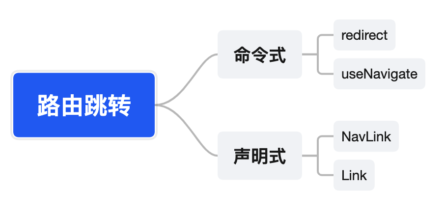
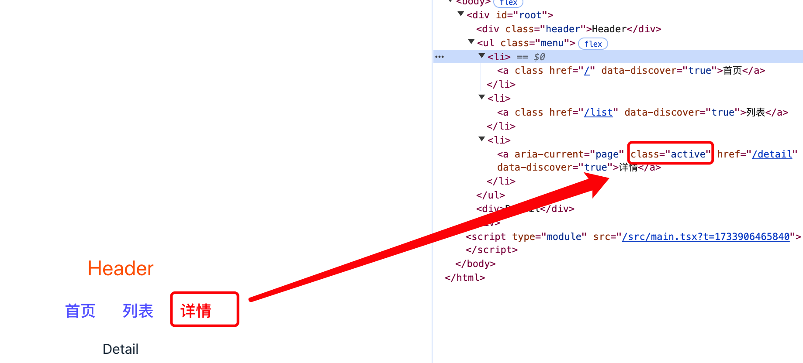

<!-- START doctoc generated TOC please keep comment here to allow auto update -->
<!-- DON'T EDIT THIS SECTION, INSTEAD RE-RUN doctoc TO UPDATE -->
**Table of Contents**  *generated with [DocToc](https://github.com/thlorenz/doctoc)*

- [react项目中接入react-router](#react%E9%A1%B9%E7%9B%AE%E4%B8%AD%E6%8E%A5%E5%85%A5react-router)
- [react项目中导入react-router](#react%E9%A1%B9%E7%9B%AE%E4%B8%AD%E5%AF%BC%E5%85%A5react-router)

<!-- END doctoc generated TOC please keep comment here to allow auto update -->

### react项目中接入react-router

react-router官网：[https://reactrouter.com/](https://reactrouter.com/)

react-router有多种实现，可以在web中，也就是常见的单页面(SPA)中使用，也可以在React Native应用中使用。针对Web中的实现，可以导入react-router-dom,如果希望既可以在web应用中使用过，也可以在react native应用中使用，那么可以直接导入react-router。

### react项目中导入react-router

大多数情况下，是不会在c端的react应用中导入react-router的,因为大部分的C端项目，都是有seo需求的，需要做服务端渲染，做服务端渲染的时候，直接使用react可能不是一个最优的选择。所以在C端项目中，如果使用了react技术栈，我倾向于直接使用next.js,如果使用vue技术栈，则nuxt.js是一个不错的选择；最次的，我搭建一个node的express项目，然后使用react或者vue搭建页面，然后将react或者vue页面编译为html后作为express的模板去使用，这个时候，就已经不需要处理前端路由了，而是使用的node路由。

当然了，这只是一些技术方案的可选择项，有些技术团队可能处于某些原因考虑，也会在C端项目中选择React以及服务端渲染的API去做一些实现，或者使用Vue以及vue的服务端渲染的api去做实现，在技术上可以实现，可以走通，但个人的一些理解，已经开源的、经过社会验证的框架可能效率上以及代码的健壮性上更具有优势。

如果是后端项目，react技术栈的话，个人认为umi是一个很优秀的技术解决方案，该框架以路由为基础、然后配以生命周期完善的插件体系，覆盖从源码到构件产物的每个生命周期，支持各种功能扩展和业务需求。如果是vue技术栈的话，其本身就是一个框架，相对于react来说，我个人觉着在技术选型上要简单一点。因为vue本身包含了丰富的生态系统，vite作为构建工具，本身也提供了丰富的能力，另外有直接vue官方团队维护的pinia状态管理库和路由管理工具vue-router，vue生态本身的这些能力都让vue自己就是一个技术方向的选择。

**回到React项目中，React项目中怎么接入react-router呢？**

首先需要纠正一个误区，尤其是以前接触过vue的同学。如果以前接触过了vue，那么应该都知道vue-router是vue的路由管理库，它只能用在vue中，不能用在react中，也不能用在angular中。但是react-router不同，react-router的定位是前端路由，它不仅可以用在react中，也可以用在vue中，只不过对于react的支持友好程度高一点罢了，再就是vue有了自己的路由管理库vue-router,在vue的项目中，基本不会使用react-router这么一个非官方的外来库。所以很多人就会直接以为react-router就是react的官方路由管理库，其实不是的。react本身就是第一个UI库，然后就没有别的了。其他的如cli工具、路由管理库react-router、状态管理库redux等，都是社区贡献的优秀生态圈。

**React项目中接入react-router**

1. 安装react-router-dom

我们以web应用为例，做web项目，只需要安装web的依赖就可以了。

```bash
pnpm install react-router-dom # 不能添加-D参数，生产环境也需要路由跳转
```

2. 创建layout布局组件

该组件为一个公用的布局组件，如页面的公共的组件、基本的布局，都可以在这个组件中去实现。如果使用过umi，则就是umi中的layouts中的BasicLayout.tsx文件，都是起到了一个基本布局的作用。

```tsx
// src/layouts/layout.tsx
import { FC } from "react";
import { Outlet } from "react-router-dom";
import Header from "../components/Header";

const Layout: FC = () => {
    return (
        <>
            <Header />
            <Outlet />
        </>
    );
};

export default Layout;
```

在layout组件中，使用Outlet作为一个占位符，用来渲染子组件,这个组件是在react-router6开始引入的，之前是好像children。

3. 创建页面组件

创建几个页面组件作为路由组件。

```tsx
// src/pages/home/index.tsx
import { memo } from "react";
import { useNavigate } from "react-router-dom";
import "./index.less";

const Home = () => {
    const navigate = useNavigate();
    // 通过url传参
    const btnHandleClick = () => {
        navigate(`/list?id=16&name=NicholasZakas`);
    };

    // 通过对象传参
    const btnHandleObj = () => {
        navigate("/detail", {
            state: {
                id: 12,
                fromHome: true
            }
        });
    }
    return (
        <>
            <div>Home 首页</div>
            <button className="btn" onClick={btnHandleClick}>url传参</button>
            <button className="btn" onClick={btnHandleObj}>对象传参</button>
        </>
    )
}

export default memo(Home);

// src/pages/list/index.tsx
import { memo } from "react"
import { useLocation, useSearchParams } from "react-router-dom";

const List = () => {
    const location = useLocation();
    console.log('%c [ location ]-6', 'font-size:13px; background:pink; color:#bf2c9f;', location)

    const [searchParams] = useSearchParams();
    
    const username = searchParams.get("name");
    console.log('%c [ username ]-11', 'font-size:13px; background:pink; color:#bf2c9f;', username)
    return (
        <div>List</div>
    )
}

export default memo(List);

// src/pages/detail/index.tsx
import { memo } from "react";
import { useLocation, useSearchParams } from "react-router-dom";

const Detail = () => {
    const location = useLocation();
    console.log('%c [ location ]-6', 'font-size:13px; background:pink; color:#bf2c9f;', location)

    const [searchParams] = useSearchParams();
    const id = searchParams.get("id");
    console.log('%c [ id ]-10', 'font-size:13px; background:pink; color:#bf2c9f;', id)

    return (
        <div>Detail</div>
    )
};

export default memo(Detail);
```

4. 配置路由

在应用的主文件中，一般为入口文件，如main.tsx、App.tsx。

在应用的主文件中配置路由，并将layout组件包裹在需要共享布局的路由之上。

```tsx
import Layout from './layouts/layout';
import { BrowserRouter as Router, Routes, Route } from 'react-router-dom';
import Home from './pages/home';
import List from "./pages/list";
import Detail from './pages/detail';
import './App.css'

function App() {
  return (
    <Router>
      <Routes>
        <Route path='/' element={<Layout />}>
          <Route path="/" element={<Home />} />
          <Route path="/list" element={<List />} />
          <Route path="/detail" element={<Detail />} />
        </Route>
      </Routes>
    </Router>
  )
}

export default App
```

本案例的入口文件为main.tsx，然后在该组件中导入App.tsx，所以本质上也可以直接将路由的配置放在main.tsx中。

5. 添加导航链接

导航链接，可以根据实际项目添加到header、menu或者sidebar组件中，本案例中，将导航链接加到了header组件中了。

导航链接，可以通过Link组件去实现。

```tsx
import { memo } from "react";
import { Link } from "react-router-dom";
import "./index.less";

const Header = () => {
    return (
        <>
            <div className="header">Header</div>
            <ul className="menu">
                <li>
                    <Link to="/">首页</Link>
                </li>
                <li>
                    <Link to="/list">列表</Link></li>
                <li>
                    <Link to="/detail">详情</Link>
                </li>
            </ul>
        </>
    )
}

export default memo(Header);
```

### react-router路由跳转


#### 路由跳转方式

react-router支持多种路由跳转方式，命令式路由跳转和声明式路由跳转。



react-router路由跳转，可参考：[https://reactrouter.com/start/framework/navigating](https://reactrouter.com/start/framework/navigating)

**命令式跳转**

**声明式跳转**

声明式跳转，简单来说就是利用react-router提供都组件去做路由跳转，有两个组件：NavLink、Link

1. NavLink

NavLink可以自动为导航添加激活状态，即为当前导航添加一个active的class。

```tsx
// 导入NavLink组件
import { NavLink } from "react-router-dom";
<ul className="menu">
    <li>
        <NavLink to="/">首页</NavLink>
    </li>
    <li>
        <NavLink to="/list">列表</NavLink>
    </li>
    <li>
        <NavLink to="/detail">详情</NavLink>
    </li>
</ul>
```

NavLink自动的为当前路由导航添加了激活状态。



NavLink除了可以自动添加激活状态以外，它还为className、style和子元素提供了回调函数，在内联样式或某种状态下去渲染元素。说的白话一些，就是react-router为className、style和子元素提供了回调函数，回调函数在当前导航被选中时可以做逻辑处理。

```tsx
<ul>
    <li>
        <NavLink to="/detail" className={({ isActive, isPending }) => [
            isActive ? "isActive" : "",
            isPending ? "isPending" : ""
        ].join(" ")}>详情</NavLink>
    </li>
    <li>
        <NavLink to="/about" style={({ isActive, isPending }) => {
            return {
                fontWeight: isActive ? "bold" : "",
                color: isPending ? "red" : "#369"
            }
        }}>关于我们</NavLink>
    </li>
    <li>
        <NavLink to="/user">
            {
                ({ isActive, isPending }) => (
                    <span className={isActive ? "active" : ""}>用户中心</span>
                )
            }
        </NavLink>
    </li>
</ul>
```
isActive、isPending都是固定的参数，不可修改，不可自定义。除了这2个参数之外还有一个isTransitioning参数。

2. Link

普通的跳转，不需要激活状态，可以使用Link组件。

```tsx
// 组件导入
import { Link } from "react-router-dom";

// 组件跳转，组件可以添加query参数
<ul className="menu">
    <li>
        <Link to="/">首页</Link>
    </li>
    <li>
        <Link to="/list">列表</Link></li>
    <li>
        <Link to="/detail">详情</Link>
    </li>
</ul>
```

3. NavLink和Link的区别

NavLink提供了当前激活状态的样式，Link没有提供这个能力。

如果一个跳转需要有激活状态，那么就使用NavLink,如果一个跳转没有激活状态的诉求，那么使用Link即可。

#### 路由跳转时传参

1. 路由传参

react-router支持两种路由传参方式：

2. 参数接收

### react相关生态

1. react官网: [https://react.dev/](https://react.dev/)

   react中文: [https://zh-hans.react.dev/](https://zh-hans.react.dev/)

2. 脚手架工具vite: [https://cn.vitejs.dev/](https://cn.vitejs.dev/)

3. 路由管理库react-router: [https://reactrouter.com/](https://reactrouter.com/)