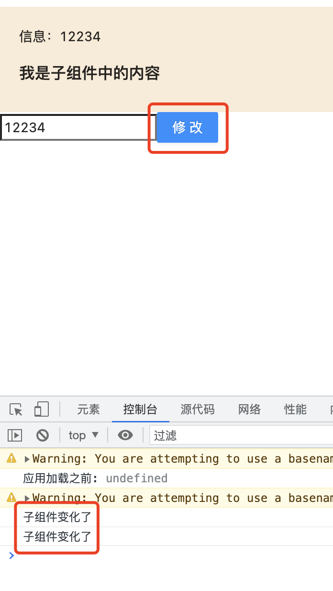

### useEffect副作用介绍

useEffect可以让函数组件也可以进行副作用操作。那么什么是副作用呢？

函数的副作用就是函数除了返回值外对外界环境造成的其他影响。例如我们在执行一个函数的时候，该函数都会影响到一个全局的变量，那么这个对全局变量的影响就是这个函数的副作用。我们期望的是函数可以处理一些逻辑，我传递给函数一些参数，函数给我返回一些数据，把影响范围控制在函数内部就行。但是实际情况是函数的执行影响到了全局的变量,所以这个函数就产生了除了本身以外返回值外的函数外界的值的作用，就是副作用了。

**在React中的副作用大体上可以分为两类：**

1. 一类是调用浏览器的API

这一类如使用addEventListender来添加事件的监听函数、使用clientWidth等浏览器API获取DOM元素的尺寸等；

2. 一类是发起的获取服务器数据的异步网络请求

这一类的副作用，如组件挂载后去异步获取数据。

**函数式组件中的useEffect和类组件中的生命周期的关系？**

useEffect，是一个钩子函数，有一些地方对这个钩子函数的称呼上，称其为side-effect。如果我们了解过类组件，那么useEffect，大致上相当于componentDidMount、componentDidUpdate、componentWillUnmount这3个周期的组合。

componentDidMount: 组件挂载

componentDidUpdate: 组件更新

componentWillUnmount: 组件即将卸载

### useEffect的使用方式

useEffect有2个参数，语法：

```ts
useEffect(() => {
    effect,
    return () => {
        cleanup
    }
}, []);
```

useEffect可以接收2个参数：

1. 第一个参数，是一个函数，该函数中可以做一些副作用处理，如异步请求数据、设置定时器等，该函数可以返回一个函数(也可以不返回)，返回函数内用来执行清理相关的操作，如清除定时器、解绑事件等。

2. 第二个参数：依赖项，是一个数组，用来控制effect的执行时机。

### useEffect的各种调用场景

1. 没有依赖项

组件每次渲染都会调用，组件中的任何状态的变化都会引起组件的重新渲染,如状态变化了、父组件传递给子组件的props变了，子组件都会重新渲染，都会引起子组件中useEffect的变化。

```ts
import React, { memo, ReactNode, FC, useEffect } from "react";
import styles from "./index.less";
interface BoxProps {
    children: ReactNode;
    msg: string;
}

const Box: FC<BoxProps> = ({ children,msg }) => {
    useEffect(() => {
        console.log("子组件变化了");
    });
    return (
        <>
            <h3>box子组件</h3>
            <div className={styles.boxContainer}>
                <p>信息：{msg}</p>
                {children}
            </div>
        </>
    )
}

export default memo(Box);
```


2. 依赖项中有监听值

当依赖项中有监听的值时，在页面初始化时和依赖项发生变化时effect执行

```tsx
import React, { memo, ReactNode, FC, useEffect } from "react";
import styles from "./index.less";
interface BoxProps {
    children: ReactNode;
    msg: string;
}

const Box: FC<BoxProps> = ({ children,msg }) => {
    useEffect(() => {
        console.log("子组件变化了");
    },[msg]); // 有依赖项
    return (
        <>
            <h3>box子组件</h3>
            <div className={styles.boxContainer}>
                <p>信息：{msg}</p>
                {children}
            </div>
        </>
    )
}

export default memo(Box);
```



3. 依赖项数组为空数组时

当依赖项为空数组时，只有在页面初始化时执行一次

```tsx
import React, { memo, ReactNode, FC, useEffect } from "react";
import styles from "./index.less";
interface BoxProps {
    children: ReactNode;
    msg: string;
}

const Box: FC<BoxProps> = ({ children,msg }) => {
    useEffect(() => {
        console.log("子组件变化了");
    },[]); // 依赖项为空数组
    return (
        <>
            <h3>box子组件</h3>
            <div className={styles.boxContainer}>
                <p>信息：{msg}</p>
                {children}
            </div>
        </>
    )
}

export default memo(Box);
```


4. 清除副作用--以定时器为例

```tsx
import React, { memo, ReactNode, FC, useEffect } from "react";
import styles from "./index.less";
interface BoxProps {
    children: ReactNode;
    msg: string;
}

const Box: FC<BoxProps> = ({ children,msg }) => {
    useEffect(() => {
        let timer = setInterval(() => {
            console.log("这里是一个定时器");
        },1000);
        return () => {
            console.log("在组件下一次渲染前执行该清理函数，清除副作用");
            clearInterval(timer);
        }
    },[msg]); // 这里有依赖项，当依赖项触发的时候，定时器会被清理，重新执行
    return (
        <>
            <h3>box子组件</h3>
            <div className={styles.boxContainer}>
                <p>信息：{msg}</p>
                {children}
            </div>
        </>
    )
}

export default memo(Box);
```


### useEffect的执行时机

useEffect的执行时机，主要取决于它的依赖项：

1. 没有依赖数组：每次渲染后执行；

2. 空依赖数组：只在组件挂载和卸载时执行；

3. 有依赖数组：在组件挂载和依赖数组中的值发生了变化时执行。