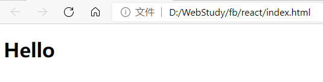

### 项目创建

创建项目有两种方式：

1. 使用create-react-app集成工具创建

关于create-react-app，可以参考

```bash
npm install create-react-app -g  需要全局安装
create-react-app reactproject 通过create-react-app工具创建reactproject项目
```
在使用create-react-app工具创建了项目后，就可以使用基于node、webpack的工具来管理项目了。

2. 网页中直接引入脚本

```html
<!--引入react、babel-->
    <script src="./js/react.production.min.js"></script>
    <script src="./js/react-dom.production.min.js"></script>
    <script src="./js/babel.js"></script>

<!--也可以使用在线的-->
    <script src="https://unpkg.com/react@^16/umd/react.production.min.js"></script>
    <script src="https://unpkg.com/react-dom@16.13.0/umd/react-dom.production.min.js"></script>
    <script src="https://unpkg.com/babel-standalone@6.26.0/babel.js"></script>

    <div id="root"></div>
    <script type="text/babel">
        class App extends React.Component {
            render() {
                return <h1>Hello</h1>
            }
        }
        ReactDOM.render(<App />, document.getElementById("root"));
    </script>
```

> unpkg.com/是由联合国儿童基金会维护的一个npm上所有内容的快速全球内容交付网络。也就是说npm上所有的包，都可以通过该服务访问和加载到。格式如下： unpkg.com/:package@:version/:file

这样就轻松实现了一个react的应用，可以直接通过访问页面的方式直接访问就可以了：




### 学习重点

React，是一个关注UI的前端库，在学习React的时候，我们重点关注元素和组件。一旦我们掌握了元素和组件的精髓，那么我们便可以在React的世界中游刃有余。

另外一个重点是基础知识。基础是一切的一切，没有稳定的根基，建其了高楼也可能会由于根基不稳而倒塌。