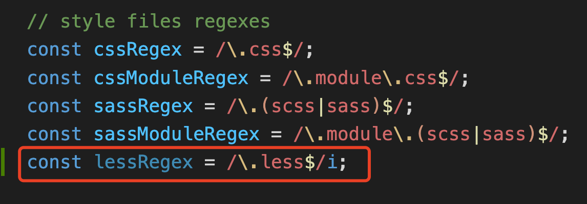

<!-- prettier-ignore -->
<!-- START doctoc generated TOC please keep comment here to allow auto update -->
<!-- DON'T EDIT THIS SECTION, INSTEAD RE-RUN doctoc TO UPDATE -->


- [1. 简单了解React](#1-%E7%AE%80%E5%8D%95%E4%BA%86%E8%A7%A3react)
  - [1.1 声明式](#11-%E5%A3%B0%E6%98%8E%E5%BC%8F)
  - [1.2 一次学习，随处编写](#12-%E4%B8%80%E6%AC%A1%E5%AD%A6%E4%B9%A0%E9%9A%8F%E5%A4%84%E7%BC%96%E5%86%99)
- [2. React 工具链](#2-react-%E5%B7%A5%E5%85%B7%E9%93%BE)
  - [2.1 通过Create React App创建react项目](#21-%E9%80%9A%E8%BF%87create-react-app%E5%88%9B%E5%BB%BAreact%E9%A1%B9%E7%9B%AE)
- [3. react 编程思想](#3-react-%E7%BC%96%E7%A8%8B%E6%80%9D%E6%83%B3)
  - [3.1 jsx 语法](#31-jsx-%E8%AF%AD%E6%B3%95)
  - [3.2 样式](#32-%E6%A0%B7%E5%BC%8F)
  - [3.3 数据显示](#33-%E6%95%B0%E6%8D%AE%E6%98%BE%E7%A4%BA)
- [4. 条件渲染](#4-%E6%9D%A1%E4%BB%B6%E6%B8%B2%E6%9F%93)
- [5. 列表渲染](#5-%E5%88%97%E8%A1%A8%E6%B8%B2%E6%9F%93)
- [6. 事件处理](#6-%E4%BA%8B%E4%BB%B6%E5%A4%84%E7%90%86)
- [7. 使用hooks(钩子)](#7-%E4%BD%BF%E7%94%A8hooks%E9%92%A9%E5%AD%90)
- [8. 状态(state)](#8-%E7%8A%B6%E6%80%81state)
- [9.绘制用户界面](#9%E7%BB%98%E5%88%B6%E7%94%A8%E6%88%B7%E7%95%8C%E9%9D%A2)
  - [9.1 create-react-app项目支持less](#91-create-react-app%E9%A1%B9%E7%9B%AE%E6%94%AF%E6%8C%81less)
  - [9.2 react eject后报错Using `babel-preset-react-app` requires that you specify `NODE_ENV` or `BABEL_ENV` env](#92-react-eject%E5%90%8E%E6%8A%A5%E9%94%99using-babel-preset-react-app-requires-that-you-specify-node_env-or-babel_env-env)

<!-- END doctoc generated TOC please keep comment here to allow auto update -->

### 1. 简单了解React

#### 1.1 声明式

React[https://zh-hans.reactjs.org/](https://zh-hans.reactjs.org/),是一个 facebook 退出的开源UI库，聚焦在UI层，在前端构建用户界面，React和传统前端技术的优势是可以创建组件，这个组件是可自定义、可复用的HTML元素，可以更快、更高效的构建用户界面。另外，React还可以使用state和props简化数据的存储和处理方式。

> 新版的文档：https://reactjs.bootcss.com

#### 1.2 一次学习，随处编写

无论现在项目使用的什么技术栈，随时都可以引入React 开发新的特性而不需要重新编写、开发现有代码。React 还可以使用 Nodejs 进行服务端渲染，也可以使用React Native 进行原生移动应用的开发。

React是一个UI库，可以帮助我们以组件的方式拆解并组织UI代码，这就意味着React不负责路由或数据管理，对于这些功能，我们需要使用第三方工具库或者我们自己实现。React本身给我们提供的功能比较专一，但是相对的给我们的选择性就更多了，使用起来更灵活了。一般情况下，我们开发者大概有两种选择方案：

1. 使用最小设置的工具链，根据需求情况按需增加功能；

2. 使用功能完备的框架，常用的功能都已经内置了；

### 2. React 工具链

对于刚刚接触React的开发者，React 的官方团队建议开发者们使用 Create React App，Create React App 内置了完备的工具链，构建的应用入门简单。对于刚开始接触React的开发者，建议使用工具链，主要是因为工具链有助于：

1. 创建大量的文件和组件；

2. 使用来自 npm 的第三方工具库；

3. 及早的检测到开发中的错误；

4. 开发时能实时编辑 css 和 js；

5. 针对生产环境优化输出文件；

#### 2.1 通过Create React App创建react项目

```bash
npx create-react-app projectname
```

### 3. react 编程思想

react应用程序是由组件组成的，组件是UI的组成部分，拥有自己的逻辑和外观。一个组件可以小可以到一个按钮，大可以到一个整个页面。

React组件就是javascript函数，这类函数返回由标签语言编写的用户界面。

```jsx
// MyButton.jsx
function MyButton() {
  const buttonClick = () => {
    console.log("按钮被点击了");
  };
  return <button onClick={buttonClick}>Clike Me!</button>;
}

export default Mybutton;
```

也可以使用下面的一种方式声明组件：

```jsx
// Input.jsx
const Input = () => {
  return <input placeholder="请输入文字" />;
};

export default Input;
```

引入react组件，使用import关键字就可以了，如

```jsx
import MyButton from "./components/MyButton";
import Input from "./components/Input";

function App() {
  return (
    <div className="App">
      <MyButton></MyButton>
      <Input />
    </div>
  );
}

export default App;
```

> React组件的名称必须以大写字母开头，HTML标签必须全是小写字母。

#### 3.1 jsx 语法

jsx 在形式上很像html,但是在语法要求上，比html更加严格，比如<br />这类的自闭合标签，必须要主动闭合，并且同一个组件，只能有一个根组件，即每个组件或return语句的返回值，最顶层只能有一个并列的标签。

```jsx
const User = () => {
  return (
    <>
      <label>用户名：</label>
      <input placeholder="请输入用户名" />
      <br />
      <label>密码：</label>
      <input placeholder="请输入密码" />
      <br />
      <button>重置</button>&nbsp;&nbsp;<button>登录</button>
    </>
  );
};

export default User;
```

如示例，User 组件只有一个根标签<></>,当然了，也可以使用其他的根组件如<div></div>,但是不能让下面的多个input、label并列都作为根组件。

#### 3.2 样式

在react中，通过className属性为元素指定css类，它和html中的class属性是等价的。

```jsx
import "./user.css";
const User = () => {
  return (
    <>
      <label className="lb">用户名：</label>
      <input className="ipt" placeholder="请输入用户名" />
      <br />
      <label className="lb">密码：</label>
      <input className="ipt" placeholder="请输入密码" />
      <br />
      <button className="btn btn-reset">重置</button>
      <button className="btn btn-confirm">登录</button>
    </>
  );
};

export default User;
```

这是最常规的引入样式的方式，可以使样式直接生效。

但是这种方式，有一个弊端，就是它会污染全局样式，比如原本希望一个在Input组件中生效的样式，现在影响到了 User组件，对User组件中的元素也常生了影响。那么怎么可以规避这种情况呢？

使用模块化的方式，即样式文件以组件名+.module+文件扩展名来作为整个的样式文件名，如Input.module.css，样式文件导入的时候，也以模块的方式导入，如import style from "./Input.module.css",在给元素的 className赋值的时候，也是以模块化变量的方式去赋值，如<input className={style.ipt} placeholder="请输入文字" />

```jsx
import style from "./Input.module.css";

const Input = () => {
  return <input className={style.ipt} placeholder="请输入文字" />;
};

export default Input;
```

这样,Input 组件中input元素的className,元素的class属性会被构建工具编码命名，这样，虽然在开发时表面上和其他组件使用的是同一个class名称，但是经过构建工具的构建之后，就已经是不同的名字了，如Input组件在编码时命名style.ipt,我们看下经过构建工具构建之后的名称：


#### 3.3 数据显示

jsx中允许使用HTML标签，也可以使用js变量，但是在使用js变量的时候，必须要使用{}包裹起来，且不能加引号。通过jsx的这个能力，我们可以很轻松的将数据展示到页面上呈现给用户。

```jsx
import { useState } from "react";
import style from "./UserList.module.css";
const UserList = () => {
    const UserList = [
        {
            id: 1,
            name: "Nicholas Zakas"
        },
        {
            id: 2,
            name: "Axel Rauschmayer"
        },
        {
            id: 3,
            name: "technology"
        }
    ];
    const [title, setTitle] = useState("React第一课");
    return (
        <>
            <h3>{title}</h3>
            <ul className={style.user}>
                {
                    UserList.map(item => {
                        return <li key={item.id}>{item.name}</li>
                    })
                }
            </ul>
        </>
    );
}

export default UserList;
```

如果如下：


jsx中除了使用普通的js变量，当然了，是需要通过{}包裹起来，其他的只要是动态的数据，即不是固定写死的数据，也都可以出现在jsx中，当然了，条件是一样的，需要使用{}包裹，所以，有的情况下，就会出现两层的{}，第一层的{}是jsx自己的，表示里面的数据是动的，不是固定写死的数据了，里面的一层{}是数据本身的，如数据可能是一个对象格式的，所以就出现了两层的{}.

```jsx
import portrait from "../assets/images/0db6b.jpeg";
const user = {
    name: "Katharine Houghton Hepburn",
    portrait: portrait,
    imageSize: 100
};

const Profile = () => {
    return (
        <>
            <h2>{user.name}</h2>
            
        </>
    );
}

export default Profile;
```

### 4. 条件渲染

react中，没有用于书写条件表达式的特殊语法，在常规的逻辑处理中，只需要使用常规的js条件表达式即可。

```jsx
import { useState } from "react";

const Login = () => {
    let [logined, setLogined] = useState(false);
    let [loginText, setLoginText] = useState("登录");
    let renderContent;

    if (logined) {
        renderContent = <>
            <div>已登录，请继续欣赏!</div>
        </>;
    } else {
        renderContent = <>
            <div>未登录，请登录！</div>
        </>;
    }

    const login = () => {
        if (logined) {
            setLogined(false);
            setLoginText("登录");
        } else {
            setLogined(true);
            setLoginText("退出");
        }
    }
    return (
        <>
            {renderContent}
            <button onClick={login}>{loginText}</button>
        </>
    );
}

export default Login;
```

上面的案例，可以通过条件选择符的方式简化一下：

```jsx
const Login = () => {
    let [logined, setLogined] = useState(false);

    return (
        <>
            {logined ? <Loged /> : <UnLoged />}
        </>
    );
}

export default Login;
```

如果在没有条件分支的情况下，还可以简化一下语法，即使用逻辑与(&&)运算符

> 先简单普及下逻辑与：a && b,在a为true的情况下，返回b，否则返回a

```jsx
import { useState } from "react";

const Login = () => {
    let [logined, setLogined] = useState(true);
    return (
        <>
          {logined && <div>已登录，请尽情游赏!</div>}
        </>
    );
}

export default Login;
```

也可以将上面案例中的组件，提出去：

```jsx
import { useState } from "react";

const Login = () => {
    let [logined, setLogined] = useState(true);
    return (
        <>
          {logined && <Loged />}
        </>
    );
}

export default Login;
```

### 5. 列表渲染

列表渲染，和前面提到的数据渲染基本是一样的。只是有两点需要注意一下，就是可遍历的数据，一般都是数组或者具有可遍历特点的类数组，在遍历的时候一般会使用map方法，再一点需要注意的是遍历的元素，需要加上key属性，且key属性值不要使用索引值，而应该使用当前数据的唯一值。

```jsx
import style from "./product.module.css";
const products = [
    {
        title: "Cabbage",
        id: 1
    },
    {
        title: "Garlic",
        id: 2
    },
    {
        title: "Apple",
        id: 3
    },
    {
        title: "Pen",
        id: 4
    }
];


const Products = () => {
    const ListItems = products.map(product => <li key={product.id}>{product.title}</li>);
    return (
        <ul className={style.product}>
            {ListItems}
        </ul>
    )
}
export default Products;
```

如案例中，遍历元素li添加了key元素，且key元素值是数据的唯一值，不是数组遍历时的索引值。

在数据的遍历中，还可以根据数据特点，做一些数据的处理：

```jsx
import style from "./product.module.css";
const products = [
    {
        title: "Cabbage",
        id: 1,
        isFruit: false
    },
    {
        title: "Garlic",
        id: 2,
        isFruit: false
    },
    {
        title: "Apple",
        id: 3,
        isFruit: true
    },
    {
        title: "Pen",
        id: 4,
        isFruit: false
    }
];


const Products = () => {
    const ListItems = products.map(product =>
        <li
            key={product.id}
            style={{ color: product.isFruit ? "green" : "red" }}>
            {product.title}
        </li>
    );
    return (
        <ul className={style.product}>
            {ListItems}
        </ul>
    )
}
export default Products;
```

### 6. 事件处理

我们可以通过在组件内部声明事件处理程序函数来响应事件。

1. react中事件的命名，采用小驼峰的方式；

2. 在使用jsx语法时传入一个函数作为事件处理函数，而不是像在HTML中一样传入一个字符串；

3. 在React中与HTML事件的另一点不同是在阻止默认行为的时候：HTML中阻止默认行为，可以通过返回false的方式；但是在react中需要显示的调用preventDefault方法

```jsx
const Link = () => {
    const handleClick = (e) => {
        e.preventDefault();
        console.log("clicked");
    }
    return (
        <a href="https://www.baidu.com" onClick={handleClick}>百度</a>
    );
}

export default Link;
```

在事件处理程序handleClick后面没有(),在调用的时候，不需要调用它，只需要将事件传递下去就可以了，当点击onClick事件被触发的时候，React将调用事件处理程序。

### 7. 使用hooks(钩子)

以use开头的函数被称为hooks。

useState是React自己内置的hook，开发者也可以通过现有的hooks来定制自己的hooks。

hooks本质上说，就是函数，但是它和常规的普通函数相比，又更加的严格。开发者只能在组件的最顶层调用hooks，如果想进入到hooks内部的条件或者循环那么可以通过抽象组件的方式来实现。

```jsx
import { useState } from "react";

// 子组件
const Count = ({ count, handleClick }) => {
    return <button onClick={handleClick}>{count}</button>
}

// 父组件
const CountGroup = () => {
    const [count, setCount] = useState(0);
    const handleClick = () => {
        setCount(count + 1);
    }

    return (
        <>
            <h4>多个组件共享状态</h4>
            <Count count={count} handleClick={handleClick} />
            <Count count={count} handleClick={handleClick} />
            <Count count={count} handleClick={handleClick} />
        </>
    );
}

export default CountGroup;
```

案例中，父组件通过props将count状态和handleClick事件处理函数传递给子组件，这种通过“状态提升”的方式实现了不同组件之间的状态共享。


> React是单向的数据流，从顶层组件流向底层组件。

### 8. 状态(state)

状态就是应用程序需要记住的最小变化的数据集。构建状态的最重要的原则是保持DRY(Don't repeat yourself)。

怎么确定状态(state)呢？

1. 如果原始数据是作为props传入的，那么它不是state

2. 如果数据是随着时间的变化而保持不变，则不是状态

3. 如果一条数据可以根据当前组件中的状态(state)或者props来计算出来，那么这条数据不是状态

React有两种类型的模型数据：props和state。

- props其实就是传递给函数的参数。

- state就像是一个组件的内存

在确定了应用程序的最小状态后，接着就需要确定哪个组件需要或者负责更改和拥有该状态。

> React是单向的数据流，数据沿着组件的层次结构从父组件传递到子组件。

到了这里，那么怎么确认某个组件应该拥有什么状态(state)就是接下来需要做的事情了。对于刚接触react的开发者来说，有一定的挑战，但是可以按照下面的步骤，作为一个参考：

1. 识别基于该状态(state)呈现某些内容的每个组件；

2. 找到它们最近的公共父组件；

3. 确认状态的设置位置

  - 一般情况下，可以将状态(state)设置到它们公共的父组件中；

  - 也可以将状态(state)设置在它们公共的某个上级组件中；

  - 如果找不到存放该状态有意义的组件，那么就新建一个仅用来保存该状态的组件，并将其作为这些组件的公共父组件

  
### 9.绘制用户界面

React应用程序是有一个个的组件组合而成，所以合理拆分、构建组件，在React应用中就尤为重要。

一个React组件就是一个javascript函数，并且可以向函数中添加一些标记、符号，组件小到可以是一个按钮、一个输入框，大到可以是一整个页面。

#### 9.1 create-react-app项目支持less

> 这是一个小插曲，项目中使用less等预处理器，感觉比css稍微方便一点。

1. 先还原webpack配置

```bash
npm run eject # 暴露出来webpack配置
```

在执行npm run eject的时候，需要把代码都提交了，不能有没有untracked、stash状态的文件，如果有，要么把这戏文件先复制出去备份，要么就是把这些文件提交了。否则不能正常执行npm run eject.

2. 安装less、less-loader

```bash
npm install less less-loader --dev
```

3. webpack中配置

找到config/webpack.config.js文件，添加一个less文件的匹配规则



其实就找到了css和sass的匹配规则，然后复制一条出来，修改成匹配less类型文件的就看可以了

```js
const lessRegex = /\.less$/i;
```

3. 配置less处理器的处理规则

还是在config/webpack.config.js文件中，先找到sass的配置规则，然后复制一份，修改成less的即可


找到了后，直接复制就可以了，然后修改一下：


代码如下：

```js
{
    test: lessRegex,
    use: getStyleLoaders(
    {
        importLoaders: 3,
        sourceMap: isEnvProduction
        ? shouldUseSourceMap
        : isEnvDevelopment,
        modules: {
        mode: 'local',
        getLocalIdent: getCSSModuleLocalIdent,
        },
    },
    'less-loader'
    ),
},
```

到现在为止，对less的配置已经全部完成了。从上面的配置过程来看，除了还原webpack配置之外，其他的都是直接复制的sass的配置，然后简单修改下即可，相对简单。

#### 9.2 react eject后报错Using `babel-preset-react-app` requires that you specify `NODE_ENV` or `BABEL_ENV` env

在配置less的过程中，出了一个小插曲，就是在npm run eject后，通过import代码导入less样式文件的时候，出现了异常提示：

> 不仅仅是导入less样式，而是异常信息会出现在一个文件的第一个import的地方。


主要意思就是说在使用babel-preset-react-app的时候，需要明确的提供一个NODE_ENV或者BABEL_ENV变量，变量的合法值为development、test或者production。具体出现异常的位置在：node_modules/babel-preset-react-app/index.js，那我们就直接找到这个文件吧。

```js
'use strict';
const create = require('./create');
module.exports = function (api, opts) {
  const env = process.env.BABEL_ENV || process.env.NODE_ENV;
  return create(api, opts, env);
};
```

找到这个文件之后，去掉注释，其实这个文件并没有什么特别多的功能，就是调用了一个create方法，既然这里异常了，那我们就给env再添加一个选项吧：

```js
'use strict';
const create = require('./create');
module.exports = function (api, opts) {
  const env = process.env.BABEL_ENV || process.env.NODE_ENV || 'development';
  return create(api, opts, env);
};
```

这样，重启下vscode，就没有报错了。

> 不解决这个问题，也不影响代码的正常执行，只是看着编辑器上老是有个红色的提示，感觉别扭，就解决一下。

#### 9.3 组件管理

可以在一个文件中声明多个组件，但是一个组件中声明多个组件，就不好管理了，管理成本加大，所以最优秀的实践是在一个文件中只管理一个组件，然后组件通过import和export导入、导出组件，然后实现在一个组件中可以使用别的组件，当前组件也可以被其他组件去使用。

```jsx
import Profile from "./profile";
import style from "./Gallery.module.less";
const Gallery = () => {
    return (
        <div className={style.gallery}>
            <h3>出色的演员</h3>
            <Profile />
            <Profile />
            <Profile />
        </div>
    );
}

export default Gallery;
```

如案例，通过import导入了Profile组件，然后又通过export default将自己给导出了。

##### 9.3.1 组件的创建

组件是React应用的核心概念之一，它是构建React应用的基石。

在HTML中，我们通过div、p、span、img、article等HTML标签来组件网页结构，然后配合css来描绘出样式，并结合js来给予网页交互的能力。那么到了React应用中，最根本的，其实也还是HTML的这些标签，只不过React给我们提供了一种能力，能够让我们基于这些最基本的HTML标签，来构建自定义的标签。这些基于最基本的HTML标签构建的自定义标签，就是组件。

**组件定义**

前面已经提到了，React组件，其实就是一个javascript函数(以前在学习react的时候，还提倡类式组件，现在已经不提倡使用类式组件了，都提倡使用函数式组件，如果刚开始接触react，就忘了类式组件，就当没有类式组件就可以了)，它可以小到一个按钮、输入框，大可以到一个页面。

1. 第一步：导出(export)组件

export default 前缀是一个标准的javascript语法，并不是react专属的语法，可以简单理解为该语法在React组件中标明了一个主函数(main function),以便将来调用该组件的地方导入(import).

2. 定义函数(组件)

定义函数组件，其实在定义的时候，和定义普通的函数式没有区别的，只是在实现的时候，有些区别。

3. 添加UI标签

这里没有说添加HTML标签，因为虽然最基础是HTML标签，但是可能还会有一些导入的其他一些自定义组件，就不一定是HTML标签了，我这里就统一称为了UI标签了。

这个地方，也是组件函数和普通函数有区别的地方，组件函数是需要将UI标签返回的，是需要return出去的，且只能有一个平级的根标签。

这3个步骤，就已经描述清楚了定义一个React组件的全部过程，看一个案例：

```jsx
import style from "./Profile.module.less";
import portrait from "../assets/images/0db6b.jpeg";
const user = {
    name: "Katharine Houghton Hepburn",
    portrait: portrait,
    imageSize: 100
};

const Profile = () => {
    return (
        <div className={style.profile}>
            <h2>{user.name}</h2>
            
        </div>
    );
}

export default Profile;
```

> 关于导出函数(组件)和定义函数，也可以拆分为2个步骤：定义组件和导出组件。其实，我认为单独拆分成2个步骤，可能理解成本呢会更低一点。


到此为止，我们已经了解了怎么去定义一个组件了，下面就该学习怎么去使用组件了。

**使用组件**

其实前面在定义组件部分也提到过了，定义组件使用了export default将组件导出了，就是为了在使用组件的地方使用import导入组件。

> 在使用自定义组件的时候，需要注意下自定义组件，要全部以大写字母开头，HTML标签全部为小写字母。

##### 9.3.2 组件的导入(import)和导出(export)