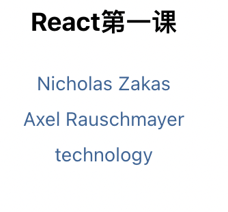

<!-- prettier-ignore -->
<!-- START doctoc generated TOC please keep comment here to allow auto update -->
<!-- DON'T EDIT THIS SECTION, INSTEAD RE-RUN doctoc TO UPDATE -->


- [1. 简单了解React](#1-%E7%AE%80%E5%8D%95%E4%BA%86%E8%A7%A3react)
  - [1.1 声明式](#11-%E5%A3%B0%E6%98%8E%E5%BC%8F)
  - [1.2 一次学习，随处编写](#12-%E4%B8%80%E6%AC%A1%E5%AD%A6%E4%B9%A0%E9%9A%8F%E5%A4%84%E7%BC%96%E5%86%99)
- [2. React 工具链](#2-react-%E5%B7%A5%E5%85%B7%E9%93%BE)
  - [2.1 通过Create React App创建react项目](#21-%E9%80%9A%E8%BF%87create-react-app%E5%88%9B%E5%BB%BAreact%E9%A1%B9%E7%9B%AE)
- [3. react 编程思想](#3-react-%E7%BC%96%E7%A8%8B%E6%80%9D%E6%83%B3)
  - [3.1 jsx 语法](#31-jsx-%E8%AF%AD%E6%B3%95)
  - [3.2 样式](#32-%E6%A0%B7%E5%BC%8F)
  - [3.3 数据显示](#33-%E6%95%B0%E6%8D%AE%E6%98%BE%E7%A4%BA)

<!-- END doctoc generated TOC please keep comment here to allow auto update -->

### 1. 简单了解React

#### 1.1 声明式

React[https://zh-hans.reactjs.org/](https://zh-hans.reactjs.org/),是一个 facebook 退出的开源UI库，聚焦在UI层，在前端构建用户界面，React和传统前端技术的优势是可以创建组件，这个组件是可自定义、可复用的HTML元素，可以更快、更高效的构建用户界面。另外，React还可以使用state和props简化数据的存储和处理方式。

> 新版的文档：https://reactjs.bootcss.com

#### 1.2 一次学习，随处编写

无论现在项目使用的什么技术栈，随时都可以引入React 开发新的特性而不需要重新编写、开发现有代码。React 还可以使用 Nodejs 进行服务端渲染，也可以使用React Native 进行原生移动应用的开发。

React是一个UI库，可以帮助我们以组件的方式拆解并组织UI代码，这就意味着React不负责路由或数据管理，对于这些功能，我们需要使用第三方工具库或者我们自己实现。React本身给我们提供的功能比较专一，但是相对的给我们的选择性就更多了，使用起来更灵活了。一般情况下，我们开发者大概有两种选择方案：

1. 使用最小设置的工具链，根据需求情况按需增加功能；

2. 使用功能完备的框架，常用的功能都已经内置了；

### 2. React 工具链

对于刚刚接触React的开发者，React 的官方团队建议开发者们使用 Create React App，Create React App 内置了完备的工具链，构建的应用入门简单。对于刚开始接触React的开发者，建议使用工具链，主要是因为工具链有助于：

1. 创建大量的文件和组件；

2. 使用来自 npm 的第三方工具库；

3. 及早的检测到开发中的错误；

4. 开发时能实时编辑 css 和 js；

5. 针对生产环境优化输出文件；

#### 2.1 通过Create React App创建react项目

```bash
npx create-react-app projectname
```

### 3. react 编程思想

react应用程序是由组件组成的，组件是UI的组成部分，拥有自己的逻辑和外观。一个组件可以小可以到一个按钮，大可以到一个整个页面。

React组件就是javascript函数，这类函数返回由标签语言编写的用户界面。

```jsx
// MyButton.jsx
function MyButton() {
  const buttonClick = () => {
    console.log("按钮被点击了");
  };
  return <button onClick={buttonClick}>Clike Me!</button>;
}

export default Mybutton;
```

也可以使用下面的一种方式声明组件：

```jsx
// Input.jsx
const Input = () => {
  return <input placeholder="请输入文字" />;
};

export default Input;
```

引入react组件，使用import关键字就可以了，如

```jsx
import MyButton from "./components/MyButton";
import Input from "./components/Input";

function App() {
  return (
    <div className="App">
      <MyButton></MyButton>
      <Input />
    </div>
  );
}

export default App;
```

> React组件的名称必须以大写字母开头，HTML标签必须全是小写字母。

#### 3.1 jsx 语法

jsx 在形式上很像html,但是在语法要求上，比html更加严格，比如<br />这类的自闭合标签，必须要主动闭合，并且同一个组件，只能有一个根组件，即每个组件或return语句的返回值，最顶层只能有一个并列的标签。

```jsx
const User = () => {
  return (
    <>
      <label>用户名：</label>
      <input placeholder="请输入用户名" />
      <br />
      <label>密码：</label>
      <input placeholder="请输入密码" />
      <br />
      <button>重置</button>&nbsp;&nbsp;<button>登录</button>
    </>
  );
};

export default User;
```

如示例，User 组件只有一个根标签<></>,当然了，也可以使用其他的根组件如<div></div>,但是不能让下面的多个input、label并列都作为根组件。

#### 3.2 样式

在react中，通过className属性为元素指定css类，它和html中的class属性是等价的。

```jsx
import "./user.css";
const User = () => {
  return (
    <>
      <label className="lb">用户名：</label>
      <input className="ipt" placeholder="请输入用户名" />
      <br />
      <label className="lb">密码：</label>
      <input className="ipt" placeholder="请输入密码" />
      <br />
      <button className="btn btn-reset">重置</button>
      <button className="btn btn-confirm">登录</button>
    </>
  );
};

export default User;
```

这是最常规的引入样式的方式，可以使样式直接生效。

但是这种方式，有一个弊端，就是它会污染全局样式，比如原本希望一个在Input组件中生效的样式，现在影响到了 User组件，对User组件中的元素也常生了影响。那么怎么可以规避这种情况呢？

使用模块化的方式，即样式文件以组件名+.module+文件扩展名来作为整个的样式文件名，如Input.module.css，样式文件导入的时候，也以模块的方式导入，如import style from "./Input.module.css",在给元素的 className赋值的时候，也是以模块化变量的方式去赋值，如<input className={style.ipt} placeholder="请输入文字" />

```jsx
import style from "./Input.module.css";

const Input = () => {
  return <input className={style.ipt} placeholder="请输入文字" />;
};

export default Input;
```

这样,Input 组件中input元素的className,元素的class属性会被构建工具编码命名，这样，虽然在开发时表面上和其他组件使用的是同一个class名称，但是经过构建工具的构建之后，就已经是不同的名字了，如Input组件在编码时命名style.ipt,我们看下经过构建工具构建之后的名称：


#### 3.3 数据显示

jsx中允许使用HTML标签，也可以使用js变量，但是在使用js变量的时候，必须要使用{}包裹起来，且不能加引号。通过jsx的这个能力，我们可以很轻松的将数据展示到页面上呈现给用户。

```jsx
import { useState } from "react";
import style from "./UserList.module.css";
const UserList = () => {
    const UserList = [
        {
            id: 1,
            name: "Nicholas Zakas"
        },
        {
            id: 2,
            name: "Axel Rauschmayer"
        },
        {
            id: 3,
            name: "technology"
        }
    ];
    const [title, setTitle] = useState("React第一课");
    return (
        <>
            <h3>{title}</h3>
            <ul className={style.user}>
                {
                    UserList.map(item => {
                        return <li key={item.id}>{item.name}</li>
                    })
                }
            </ul>
        </>
    );
}

export default UserList;
```

如果如下：



jsx中除了使用普通的js变量，当然了，是需要通过{}包裹起来，其他的只要是动态的数据，即不是固定写死的数据，也都可以出现在jsx中，当然了，条件是一样的，需要使用{}包裹，所以，有的情况下，就会出现两层的{}，第一层的{}是jsx自己的，表示里面的数据是动的，不是固定写死的数据了，里面的一层{}是数据本身的，如数据可能是一个对象格式的，所以就出现了两层的{}.

```jsx
import portrait from "../assets/images/0db6b.jpeg";
const user = {
    name: "Katharine Houghton Hepburn",
    portrait: portrait,
    imageSize: 100
};

const Profile = () => {
    return (
        <>
            <h2>{user.name}</h2>
            
        </>
    );
}

export default Profile;
```

### 4. 条件渲染

react中，没有用于书写条件表达式的特殊语法，在常规的逻辑处理中，只需要使用常规的js条件表达式即可。

```jsx
import { useState } from "react";

const Login = () => {
    let [logined, setLogined] = useState(false);
    let [loginText, setLoginText] = useState("登录");
    let renderContent;

    if (logined) {
        renderContent = <>
            <div>已登录，请继续欣赏!</div>
        </>;
    } else {
        renderContent = <>
            <div>未登录，请登录！</div>
        </>;
    }

    const login = () => {
        if (logined) {
            setLogined(false);
            setLoginText("登录");
        } else {
            setLogined(true);
            setLoginText("退出");
        }
    }
    return (
        <>
            {renderContent}
            <button onClick={login}>{loginText}</button>
        </>
    );
}

export default Login;
```

上面的案例，可以通过条件选择符的方式简化一下：

```jsx
const Login = () => {
    let [logined, setLogined] = useState(false);

    return (
        <>
            {logined ? <Loged /> : <UnLoged />}
        </>
    );
}

export default Login;
```

如果在没有条件分支的情况下，还可以简化一下语法，即使用逻辑与(&&)运算符

> 先简单普及下逻辑与：a && b,在a为true的情况下，返回b，否则返回a

```jsx
import { useState } from "react";

const Login = () => {
    let [logined, setLogined] = useState(true);
    return (
        <>
          {logined && <div>已登录，请尽情游赏!</div>}
        </>
    );
}

export default Login;
```

也可以将上面案例中的组件，提出去：

```jsx
import { useState } from "react";

const Login = () => {
    let [logined, setLogined] = useState(true);
    return (
        <>
          {logined && <Loged />}
        </>
    );
}

export default Login;
```

### 5. 列表渲染

列表渲染，和前面提到的数据渲染基本是一样的。只是有两点需要注意一下，就是可遍历的数据，一般都是数组或者具有可遍历特点的类数组，在遍历的时候一般会使用map方法，再一点需要注意的是遍历的元素，需要加上key属性，且key属性值不要使用索引值，而应该使用当前数据的唯一值。

```jsx
import style from "./product.module.css";
const products = [
    {
        title: "Cabbage",
        id: 1
    },
    {
        title: "Garlic",
        id: 2
    },
    {
        title: "Apple",
        id: 3
    },
    {
        title: "Pen",
        id: 4
    }
];


const Products = () => {
    const ListItems = products.map(product => <li key={product.id}>{product.title}</li>);
    return (
        <ul className={style.product}>
            {ListItems}
        </ul>
    )
}
export default Products;
```

如案例中，遍历元素li添加了key元素，且key元素值是数据的唯一值，不是数组遍历时的索引值。

在数据的遍历中，还可以根据数据特点，做一些数据的处理：

```jsx
import style from "./product.module.css";
const products = [
    {
        title: "Cabbage",
        id: 1,
        isFruit: false
    },
    {
        title: "Garlic",
        id: 2,
        isFruit: false
    },
    {
        title: "Apple",
        id: 3,
        isFruit: true
    },
    {
        title: "Pen",
        id: 4,
        isFruit: false
    }
];


const Products = () => {
    const ListItems = products.map(product =>
        <li
            key={product.id}
            style={{ color: product.isFruit ? "green" : "red" }}>
            {product.title}
        </li>
    );
    return (
        <ul className={style.product}>
            {ListItems}
        </ul>
    )
}
export default Products;
```

### 6. 事件处理

我们可以通过在组件内部声明事件处理程序函数来响应事件。

1. react中事件的命名，采用小驼峰的方式；

2. 在使用jsx语法时传入一个函数作为事件处理函数，而不是像在HTML中一样传入一个字符串；

3. 在React中与HTML事件的另一点不同是在阻止默认行为的时候：HTML中阻止默认行为，可以通过返回false的方式；但是在react中需要显示的调用preventDefault方法

```jsx
const Link = () => {
    const handleClick = (e) => {
        e.preventDefault();
        console.log("clicked");
    }
    return (
        <a href="https://www.baidu.com" onClick={handleClick}>百度</a>
    );
}

export default Link;
```

在事件处理程序handleClick后面没有(),在调用的时候，不需要调用它，只需要将事件传递下去就可以了，当点击onClick事件被触发的时候，React将调用事件处理程序。