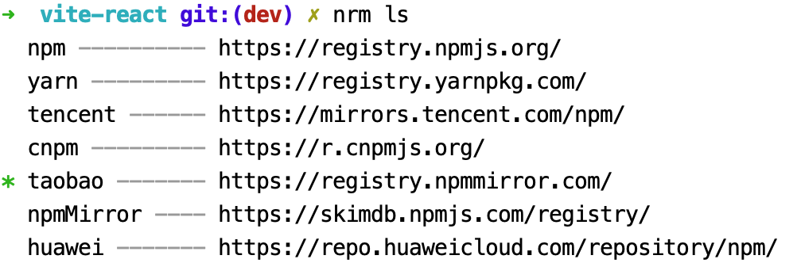

### 老项目升级到react19

参考链接:[升级到React19](https://react.dev/blog/2024/04/25/react-19-upgrade-guide)

React19之前发布过一个react18.3的版本，这个react18.3在功能上和react18.2相同，但是添加了一些可能会被弃用的API的警告，以及React19可能会带来的一些更改的内容。

所以如果是老版本React在升级react19的时候，建议先升级到18.3，然后再从18.3升级到19.

### 升级到React19的步骤

#### 安装

安装新版本的React和React DOM

```bash
npm install --save-exact react@^19.0.0 react-dom@^19.0.0
# or
yarn add --exact react@^19.0.0 react-dom@^19.0.0
```

安装Typescript支持

```bash
npm install --save-exact @types/react@^19.0.0 @types/react-dom@^19.0.0
# or
yarn add --exact @types/react@^19.0.0 @types/react-dom@^19.0.0
```

> 安装之前，可以先指定一下npm镜像的源。

默认情况下，npm使用的是https://registry.npmjs.org/这个源，有的时候国内的网络环境对这个镜像可能会很慢，导致依赖安装失败。淘宝技术团队搭建了一个镜像https://npmmirror.com/，网络环境相对较好，平常可以使用这个镜像源。

**淘宝镜像源**

网站地址：https://npmmirror.com/

这是一个完整都npmjs.com镜像，这是一个npmjs.com的只读版本，大多数情况下是与官方保持同步的，可以放心使用。

可以通过以下方式指定镜像源

1. 使用npm配置更改镜像源

```bash
npm config set registry https://registry.npmmirror.com/
```

2. 项目根目录下新建.npmrc文件，然后在.npmrc文件中指定镜像源

```bash
# .npmrc
registry=https://registry.npmmirror.com/
```

3. 通过nrm来管理镜像源

关于nrm的详细介绍可参考[nrm](../node/nrm.md)

```bash
nrm use tabao
nrm ls
  npm ---------- https://registry.npmjs.org/
  yarn --------- https://registry.yarnpkg.com/
  tencent ------ https://mirrors.tencent.com/npm/
  cnpm --------- https://r.cnpmjs.org/
* taobao ------- https://registry.npmmirror.com/
  npmMirror ---- https://skimdb.npmjs.com/registry/
  huawei ------- https://repo.huaweicloud.com/repository/npm/
```


#### 修改代码

#### 重大变更

1. 删除了已经弃用的React API

- 删除了propTypes和defaultProps函数

PropTypes已经在2017年4月份(v15.5.0)中弃用了。

React19将在包中删除propType检查，并且使用了的这些检查将被忽略。如果项目中有在使用propType做类型检查，那么可以迁移到Typescript或其他的类型检查。

另外还将在函数组件中删除ES6默认参数。现在暂时还没有ES6默认参数的替代方案，因此defaultProps将继续支持类组件。

> 无论是PropType还是defaultProps，我在项目中几乎都没有使用到过，因为项目中都使用到了ts，所以个人感觉，这2个属性，可以忽略不计。如果接手了老项目，使用到了这2个接口的地方，可以升级下ts吧。

- 删除了ReactDOM.render()

ReactDOM.render()已于2022年3月(v18.0.0)弃用。在React19中，在代码中移除了ReactDOM.render(),需要在使用到这个api的地方更改为ReactDOM.createRoot().

这个API大多使用在项目的入口文件中

```tsx
// ReactDOM.render()
import {render} from "react-dom";
render(<App />, document.getElementById("root"));

// ReactDOM.createRoot()
import { createRoot } from "react-dom/client";
const root = createRoot(document.getElementById("root"));
root.render(<App />);
```

#### 新的弃用

#### 显著变化

#### Typescript变更