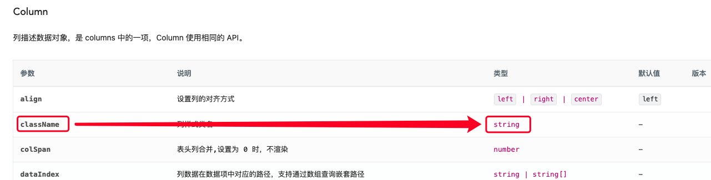
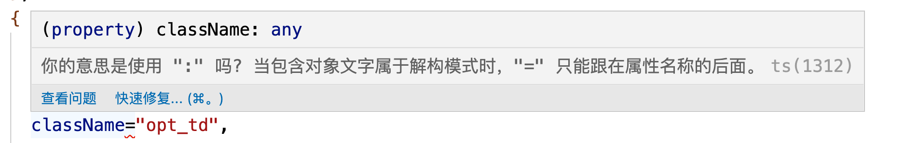

### 速记属性 "className" 的范围内不存在任何值。请声明一个值或提供一个初始值设定项

环境：mac

项目概况：umijs+antd

使用的组件：table

问题描述：在使用表格时，配置列属性时，使用了className属性，结果报错了,看配置代码：

```ts
  const columns: ColumnsType<UserType> = [
    // ……
    {
      title: "操作",
      key: "id",
      width: 130,
      className="opt_td",
      render: (_, record: UserType) => (
        <div>
          <Button type='link' className={style.opt_btn} onClick={() => { handleEdit(record.id) }}>编辑</Button>
          <Popconfirm
            title="确认要删除吗?"
            onConfirm={() => { handleDel(record.id) }}
            onCancel={handleCancel}
            okText="确认"
            cancelText="取消"
          >
            <Button type="link">删除</Button>
          </Popconfirm>
        </div>
      )
    }
  ];
```
看API提示：



根据API文档提示的，className为string类型，我也赋值为一个string类型，如代码所示，但是在运行时还是报错了：



在我实在想不到问题根源的时候，突然发现className="opt_td"这里的=了，这里不应该是=，而应该是冒号，属性/值是key/value格式的。

粗心害死人，没有把我害死，但是让我在这个无聊的问题上，浪费了半个多小时。