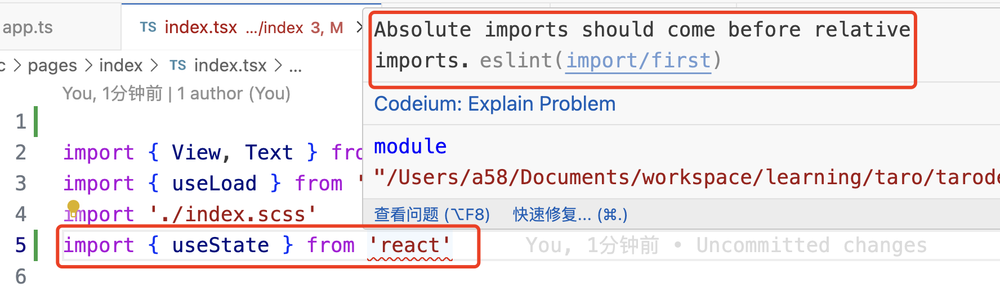

### Absolute imports should come before relative

绝对引入需要在相对引入之前引入。看demo：

```tsx
import { View, Text } from '@tarojs/components'
import { useLoad } from '@tarojs/taro'
import './index.scss'
import { useState } from 'react'
```

编辑器中最后一行给出了异常提示：



**解决方案：**

移动useState的引入顺序，将对useState的引入移动到前面：

```tsx
import { useState } from 'react'
import { View, Text } from '@tarojs/components'
import { useLoad } from '@tarojs/taro'
import './index.scss'
```

异常提示消失。

可能是为了保证项目本身框架中代码的优先级吧，要先引入第三方的组件、库，在引入项目本身框架、自定义组件。

> 这个提示可以不解决，因为这是一个eslint给出的提示，也可以通过修改eslint规则来屏蔽该规则给出的提示。

eslint规则关闭掉该规则的方式：

```json
"import/first": "off"
```