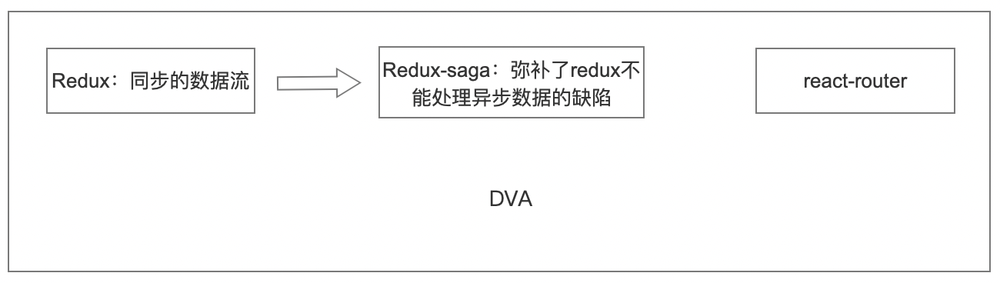
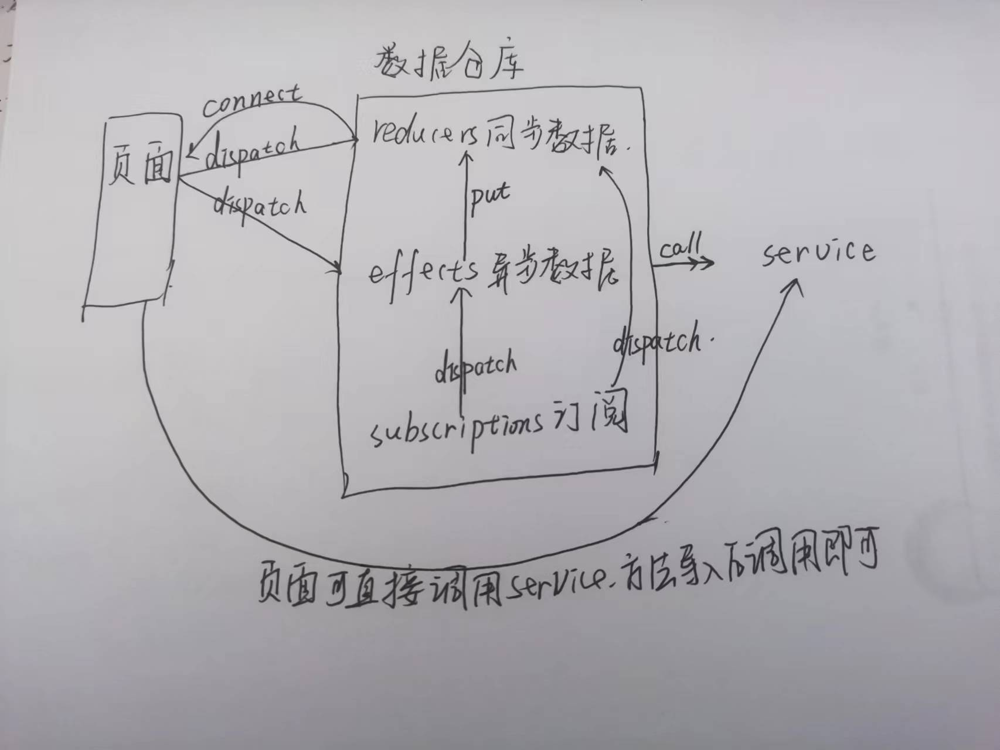

<!-- START doctoc generated TOC please keep comment here to allow auto update -->
<!-- DON'T EDIT THIS SECTION, INSTEAD RE-RUN doctoc TO UPDATE -->
**Table of Contents**  *generated with [DocToc](https://github.com/thlorenz/doctoc)*

- [1. dva是什么？](#1-dva%E6%98%AF%E4%BB%80%E4%B9%88)
- [2. 简单了解下dva的工作流](#2-%E7%AE%80%E5%8D%95%E4%BA%86%E8%A7%A3%E4%B8%8Bdva%E7%9A%84%E5%B7%A5%E4%BD%9C%E6%B5%81)
- [3. dva的组成](#3-dva%E7%9A%84%E7%BB%84%E6%88%90)
- [10. 常见问题](#10-%E5%B8%B8%E8%A7%81%E9%97%AE%E9%A2%98)

<!-- END doctoc generated TOC please keep comment here to allow auto update -->

### 1. dva是什么？

dva是一个基于redux和redux-saga的数据流方案。

我们先简单了解下react的数据方案历史。

redux:专门处理数据流向和存储，提出了store的概念，redux考虑到了数据，但是只是同步数据，没有考虑异步场景。

redux-saga:弥补了redux不能处理异步数据的缺陷。

dva：本质上是和redux、redux-saga和react-router的整合，没有做什么额外的功能。

dva和redux、react-router的关系可参考下图:



我们都知道，react是一个UI库，它自己本身只关注UI层面的事情，其他的周边生态如路由、数据等管理和存储等，都没有做，聚焦UI。这就是react的特点，这也就导致了react的技术社区比较活跃，每个技术团队都可以有自己的实现，在带来了技术活跃的同时，也有一点不好的地方，就是技术混乱，没有统一的标准。这对于一个前端开发者来说尤其是一个刚接触react的开发者来说，非常的不友好。

由于React专注于UI，没有考虑数据存储的实现，那么社区就出现了各种各样的数据存储方案，其中比较知名的是redux ------ 很多人都以为redux是针对react的数据流方案，其实不是的。redux也可以在vue中处理好数据流问题，只是redux是在react中获得了较大的成功，再加上vue有自己的vuex数据流方案，就让很多人误以为redux就是针对react的数据流方案。

redux无疑在react中取得了较大的成功，但是redux有一点不足，就是它只考虑到、实现了同步的数据流，没有考虑到异步场景下的数据流的问题，于是就出现了redux-saga，redux-saga解决了异步的数据流方案。

那么dva呢，是一个基于redux和redux-saga的数据流方案，并且还内置了react-router和fetch，简化了一些开发体验。所以，很多人也将dva看作是一个轻量级的应用框架。

### 2. 简单了解下dva的工作流

可以看下下图：



从图片我们可以看出来，数据仓库中有同步数据、异步数据和订阅(subscription).

> 严格来讲，订阅是不属于数据仓库范畴的，而是属于页面的，只是为了代码的便于代码的管理而归属到了数据仓库。

dva的数据工作流，页面可以调用数据仓库中的同步数据和异步数据，但是数据仓库只能以同步的reducer将数据返回给页面。

### 3. dva的组成

dva，其实就是一个对象，这个对象主要包含了几个部分：

namespace、state、reducers、effects、subscriptions。其中，reducers、effects和subscriptions中都是函数。一个完整的dva示例如下：

```ts
const UserModel = {
    namespace: 'users',
    state: {

    },
    reducers:{

    },
    effects:{

    },
    subscriptions:{

    }
};

export default UserModel;
```


### 10. 常见问题

1. 模块“"umi"”没有导出的成员“Reducer”

在umi项目中使用dva的时候，从umi中导出Reducer、Effect、Subscription的时候，给出了异常提示：

```ts
模块“"umi"”没有导出的成员“Reducer”
模块“"umi"”没有导出的成员“Effect”
模块“"umi"”没有导出的成员“Subscription”
```

正常来说不会有这样的异常提示的，既然文档说了可以按照这种方式导出，那么umi中应该就暴露了这些接口。那我们在项目中遇到了这样的问题怎么办呢？

刚遇到问题的时候，也从网上查询了很多的解决方案，但是有的生效解决问题了，有的在一些人的项目中解决问题了，但是在其他人的项目中就不行，所以也不好说哪种方案就一定能解决问题，但是既然遇到问题了，就可以尝试从下面几个方面尝试下:

- 重启编辑器：把编辑器退出，重新启动；

- 重新启动项目服务：停止当前的服务，然后重新yarn start

- 删除src/.umi文件，重新启动项目

- 重新配置下tsconfig.json中的paths

项目默认的配置如下：
```json
"paths": {
    "@/*": ["src/*"],
    "@@/*": ["src/.umi/*"]
},
```

将路径修改为当前目录下的src:

```json
"paths": {
    "@/*": ["./src/*"],
    "@@/*": ["./src/.umi/*"]
},
```

各种方案都有解决问题的，但是各种方案，也有没有解决问题的场景，所以我们就从这几种思路中尝试着解决下。