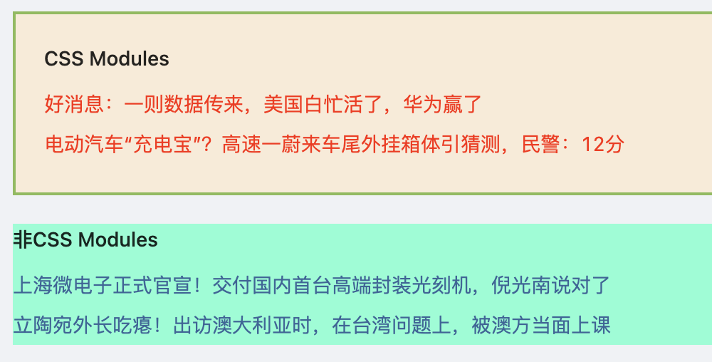

<!-- START doctoc generated TOC please keep comment here to allow auto update -->
<!-- DON'T EDIT THIS SECTION, INSTEAD RE-RUN doctoc TO UPDATE -->
**Table of Contents**  *generated with [DocToc](https://github.com/thlorenz/doctoc)*

- [1.Umi 简介](#1umi-%E7%AE%80%E4%BB%8B)
- [2. 快速上手](#2-%E5%BF%AB%E9%80%9F%E4%B8%8A%E6%89%8B)
- [3. umi基础](#3-umi%E5%9F%BA%E7%A1%80)
  - [3.1 配置](#31-%E9%85%8D%E7%BD%AE)
    - [3.1.1 路由配置](#311-%E8%B7%AF%E7%94%B1%E9%85%8D%E7%BD%AE)
    - [3.1.2 路由跳转](#312-%E8%B7%AF%E7%94%B1%E8%B7%B3%E8%BD%AC)
    - [3.1.3 环境变量](#313-%E7%8E%AF%E5%A2%83%E5%8F%98%E9%87%8F)
    - [3.1.4 样式和图片文件](#314-%E6%A0%B7%E5%BC%8F%E5%92%8C%E5%9B%BE%E7%89%87%E6%96%87%E4%BB%B6)

<!-- END doctoc generated TOC please keep comment here to allow auto update -->

### 1.Umi 简介

Umi，是蚂蚁金服的底层、可扩展的企业级前端应用框架，以路由为基础，支持配置路由和约定式路由，保证路由的功能完备。

**Umi 的特点**

1. 可扩展：umi 实现了完整的生命周期，并使其插件化，umi 内部功能也全由插件完成，另外也支持插件和插件集，以满足功能和垂直域的分层需求；

2. 开箱即用：umi 内置了路由、构建、部署、测试等，仅需一个依赖即可上手开发，并且还提供针对 React 的集成插件集，内涵丰富的功能，可满足大部分的开发需求；

3. 企业级：蚂蚁内部以及阿里、优酷、网易、飞猪、口碑等公司的大量应用实践，值得信赖；

4. 大量自研：包含微前端、组件打包、文档工具、请求库、hooks、数据流等，满足日常的周边需求；

5. 完备路由：同时支持配置式路由和约定式路由，同时保证功能的完备性，比如动态路由、嵌套路由、权限路由等；

6. 面向未来：在满足需求开发的同时，也在实时保持对新技术的探索，如 dll 提速、modern mode、webpack@5、自动化 external、bundle less 等；

**不适合 Umi 的场景**

1. 需要兼容 IE8 以及更低版本的浏览器

2. 需要支持 16.8.0 以下版本的 React

3. 需要跑在 Node 10 以下版本的环境

4. 有很强的 webpack 自定义需求和主观意愿

5. 需要选择不同的路由方案

**插件和插件集**


Umi 支持插件和插件集，不同的插件集合到一起形成各种插件集，不同的插件集又可以支持不同的业务类型。

**配置式路由和约定式路由**

umi 同时支持配置式路由和约定式路由，配置式路由是大部分用户在使用的，是向现实的妥协，因为它功能强大；约定式路由是在努力的，因为它更加的优雅、简洁。

**.umi 临时文件**

.umi临时文件被称为整个umi项目的发动机，项目的入口文件、路由等都在这里，这些文件是由 umi 内部插件及第三方插件生成的。

.umi临时文件生成在src目录下

在.umi 目录下通常可以看到这样的目录/文件：

```markdown
.umi
├─umi.ts  // 入口文件
├─plugin-request
|       └request.ts
├─plugin-model
|      ├─Provider.tsx
|      ├─runtime.tsx
|      ├─useModel.tsx
|      ├─helpers
|      |    ├─constant.tsx
|      |    ├─dispatcher.tsx
|      |    └executor.tsx
├─plugin-initial-state
|          ├─Provider.tsx
|          ├─exports.ts
|          ├─runtime.tsx
|          ├─models
|          |   └initialState.ts
├─plugin-helmet
|       └exports.ts
├─core
|  ├─devScripts.ts
|  ├─history.ts
|  ├─plugin.ts
|  ├─pluginConfig.d.ts
|  ├─pluginRegister.ts
|  ├─polyfill.ts
|  ├─routes.ts
|  └umiExports.ts
├─.cache
|   ├─babel-loader
|   |      ├─0395cb2cefdacebd957375d458411a10.json.gz
|   |      ├─0dc2e049637a87e86d6a661a38dd651a.json.gz
|   |      ├─10402cd3212c5aa97f851abca1d23a18.json.gz
|   |      ├─112abf79079ca5a84012e798bd69353e.json.gz
|   |      ├─1c8e28554df70209c71e20b895c992e8.json.gz
```

.umi 临时文件是 umi 框架非常重要的一部分，框架和插件会根据我们的代码生成临时文件，原来一部分在项目中的调试、脏乱差的部分都移动到了这里；

我们可以在.umi 中调试代码，但是不要提交到.git，因为这个目录是临时文件，每次启动 umi 时都会删除之前的临时文件并重新生成新的临时文件。

### 2. 快速上手

通过yarn快速创建项目

> umi团队建议使用yarn作为umi项目中管理npm依赖的工具。

```bash
yarn create @umijs/umi-app
yarn create v1.22.17
[1/4] 🔍  Resolving packages...
[2/4] 🚚  Fetching packages...
[3/4] 🔗  Linking dependencies...
[4/4] 🔨  Building fresh packages...

success Installed "@umijs/create-umi-app@3.5.20" with binaries:
      - create-umi-app
[#################################################] 49/49Copy:  .editorconfig
Write: .gitignore
Copy:  .prettierignore
Copy:  .prettierrc
Write: .umirc.ts
Copy:  mock/.gitkeep
Write: package.json
Copy:  README.md
Copy:  src/pages/index.less
Copy:  src/pages/index.tsx
Copy:  tsconfig.json
Copy:  typings.d.ts
✨  Done in 1.44s.
```

表示已经通过yarn成功的创建了一个基于当前目录umi1的umi项目，其默认的项目目录结构如下：

```markdown
umi1
├─.editorconfig
├─.prettierignore
├─.prettierrc
├─.umirc.ts
├─README.md
├─package.json
├─tsconfig.json
├─typings.d.ts
├─src
|  ├─pages
|  |   ├─index.less
|  |   └index.tsx
├─mock
```

**安装依赖**

```bash
xxx@xxxx umi1 % yarn
yarn install v1.22.17
info No lockfile found.
****** # 这里省略了步骤，没有粘贴过程提示信息
[4/4] 🔨  Building fresh packages...
success Saved lockfile.
$ umi generate tmp
Browserslist: caniuse-lite is outdated. Please run:
npx browserslist@latest --update-db

Why you should do it regularly:
https://github.com/browserslist/browserslist#browsers-data-updating
✨  Done in 58.96s.
```

**项目启动**

```bash
xxx@xxxx umi1 % yarn start
yarn run v1.22.17
$ umi dev
Browserslist: caniuse-lite is outdated. Please run:
npx browserslist@latest --update-db

Why you should do it regularly:
https://github.com/browserslist/browserslist#browsers-data-updating
Starting the development server...

✔ Webpack
  Compiled successfully in 4.40s

 DONE  Compiled successfully in 4399ms                                                                                                                                                        下午10:58:58


  App running at:
  - Local:   http://localhost:8000 (copied to clipboard)
  - Network: http://192.168.3.78:8000
```

项目已经成功启动，可以通过http://localhost:8000去访问看效果：


### 3. umi基础

#### 3.1 配置

umi，在.umirc.ts或者config/config.ts中进行配置，简单的配置，可以直接在.umirc.ts中进行配置，如果复杂的配置，可以在config/config.ts中进行配置，支持ES6.

常见的配置:

```ts
import { defineConfig } from 'umi';

// 路由组件
const Index = '@/pages/index';
const List = '@/pages/list/index';

export default defineConfig({
  nodeModulesTransform: {
    type: 'none',
  },
  layout: {},
  routes: [
    { path: '/', component: Index },
    {path: '/list', component: List}
  ],
  fastRefresh: {},
  history:{
    type: 'hash'
  },
  mfsu: {} // 启用mfsu
});
```

##### 3.1.1 路由配置

1. 工程化配置

工程化配置，就是把路由信息单独配置成一个路由文件。默认的配置中，route是配置到了.umirc.ts中的，在项目中，建议把router部分抽离出去

```ts
// src/roiter/router.ts
const router: any = [
    {
        path: "/",
        component: "@/pages/index"
    },
    {
        path: "/list/",
        component: "@/pages/list/index"
    }
  ]
  
export default router;
```

在.umirc.ts中导入路由信息

```ts
import { defineConfig } from 'umi';
// 路由
import router from './src/router/router';

export default defineConfig({
  nodeModulesTransform: {
    type: 'none',
  },
  routes: router
});
```

2. 约定式路由

约定式路由，就是文件路径就是路由，不需要手写配置，通过目录和文件极其命名分析路由配置

```markdown
./src/pages
├── detail
│   └── index.tsx
├── index.less
├── index.tsx
└── list
    └── index.tsx
```

如这样的文件目录，会得到如下的路由：

```ts
const router: any = [
    {
        path: "/",
        component: "@/pages/index"
    },
    {
        path: "/list/",
        component: "@/pages/list/index"
    },
    {
        path: "/detail",
        component: "@/pages/detail/index"
    }
  ]
  
export default router;
```

>  约定式路由，要先注释掉.umirc.ts文件中的routes配置

```ts
import { defineConfig } from 'umi';
export default defineConfig({
  nodeModulesTransform: {
    type: 'none',
  },
  // routes: router, // 约定谁路由，要注释掉routes配置项
});
```

**以下条件、规则的文件不会被注册为路由**

- 以.或者_开头的文件或目录

- 以d.ts结尾的类型文件

- 以test.ts、spec.ts、e2e.ts结尾的测试文件，同样适用于js、jsx和tsx文件

- components和component目录

- utils和util目录

- 不是.js、.jsx、.ts和.tsx文件

- 文件内容不包含jsx或tsx元素

3. 配置子路由

配置子路由，需要有一个这些子路由组件的公共通用组件,如

```markdown
./user
├── account
│   └── index.tsx
├── index.tsx
├── profile
│   └── index.tsx
└── ucenter
    └── index.tsx
```

案例中，user模块有几个子模块，每个模块都有自己的路由，即都是user模块的子路由，那么./user/index.tsx就是这些子路由的公共通用组件。在这个公共通用的组件中，通过props.children来渲染子路由。

```tsx
export default (props:any) => {
    return <div style={{padding: '20px'}}>
        <h4>大个人中心就是大</h4>
        {/* 具有子路由的公共组件中，路由跳转时需要使用全路径 */}
        <a href="/user/profile">个人档案</a>
        <br />
        <a href="/user/ucenter">小的里面的个人中心</a>
        <br />
        {/* 通过props.children来渲染子路由 */}
        {props.children}
        </div>
}
```

子路由中，路由的跳转可以通过绝对的路由，即完全的路由如/user/profile。

> 各位看官先不用纠结案例中的a跳转的合理性，我这里只是为了图省事，就没有写路由跳转，用a模拟了下；正常情况下，如果不是编程式路由导航跳转，会使用Link组件实现路由的跳转。

##### 3.1.2 路由跳转

1. 命令式路由跳转

通过umi内置的history插件实现编程式路由跳转

```tsx
import { history } from "umi";
export default (props:any) => {
    // 编程式路由跳转
    const changeProfile = () => {
        history.push("profile");
    }

    // 编程式路由跳转
    const improvePersonalData = () => {
        history.push("account");
    }
    return <div style={{padding: '20px'}}>
        <h4>大个人中心就是大</h4>
        <button onClick={changeProfile}>去修改个人档案</button>
        <button onClick={improvePersonalData}>完善个人资料</button>
        {/* 通过props.children来渲染子路由 */}
        {props.children}
        </div>
}
```

**编程式路由跳转携带参数**

都是query参数，会显示到浏览器地址栏

```tsx
// 跳转到指定路由
history.push("profile");

// 跳转到指定路由并携带URL(query)参数,浏览器地址栏会显示
history.push("profile?key=sun");

// 通过对象方式传递参数，显示到浏览器地址栏
history.push({
    pathname: "account",
    query: {
        from: "moon"
    }
});
```
2. 配置式路由跳转：通过Link组件

Link组件只适用单页应用内部的跳转，如果是外部的地址跳转，需要使用a标签

Link组件是umi内置组件，直接导入使用即可。

Link组件，也可以携带参数，直接在path后拼接即可

```tsx
import { Link } from "umi"; // 导入Link组件
export default function DetailPage(){
    return <div className="detail">
        <h4>详情页</h4>
        <ul>
            <li>
                <Link to="/">首页</Link>
            </li>
            <li>
                {/* Link组件页可以携带参数，直接拼接即可，会在浏览器地址栏显示 */}
                <Link to="/list?from=detail">列表页</Link>
            </li>
        </ul>
    </div>
}
```

##### 3.1.3 环境变量

1. 设置环境变量，执行命令时添加

```bash
# mac
PORT=9000 yarn start # 设置在9000端口上启动服务

# windows
set PORT=9000 yarn start # 设置在9000端口上启动服务
```

上面的方式，区分了mac和windows环境，可以通过cross-env来抹平这个差异

使用cross-env插件，可以通过npm或者yarn安装，然后在packge.json中的start指令中配置cross-env关键字就可以了。

```bash
yarn add cross-env --dev
```

package.json中的scripts脚本中配置启动脚本：

```json
"start": "cross-env PORT=9000 umi dev", // 在windows上和mac上都生效，设置在9000端口上启动服务
```

2. 生成器工具  generate

umi generate <type> <name> [options]

umi generate page pagename 默认生成一组名称为pagename.js的react文件和pagename.css的样式文件，且js文件中会直接引入css文件。如pagename.js文件：

```bash
xx@xxxxx umi1 % umi generate page t1
Browserslist: caniuse-lite is outdated. Please run:
npx browserslist@latest --update-db

Why you should do it regularly:
https://github.com/browserslist/browserslist#browsers-data-updating
Write: src/pages/t1.js
Write: src/pages/t1.css
```

下面来看模板文件t1.js代码：

```js
import React from 'react';
import styles from './t1.css';

export default function Page() {
  return (
    <div>
      <h1 className={styles.title}>Page t1</h1>
    </div>
  );
}
```

```bash
umi generate page pagename --typescript  # 生成一个模板文件为ts为扩展名和一个样式文件以.css为扩展名的文件
umi generate page pagename --less # 生成一个模板文件以.js为扩展名和一个以.less为扩展名的样式文件
umi generate page pagename --typescript --less # 生成一个以.ts为扩展名的模板文件和一个以.less为扩展名的样式文件
```

3. umi plugin  查看当前项目使用到的所有umi插件

语法  umi plugin <type> [opitons]

当前type就支持一个list,options可选key

```bash
xx@xxxxx umi1 % umi plugin list --key
Browserslist: caniuse-lite is outdated. Please run:
npx browserslist@latest --update-db

Why you should do it regularly:
https://github.com/browserslist/browserslist#browsers-data-updating

  Plugins:

    - @umijs/preset-built-in [key: builtIn] (preset)
    - @umijs/preset-react [key: react] (preset)
    - ./node_modules/umi/node_modules/@@/registerMethods [key: registerMethods]
    - ./node_modules/umi/node_modules/@@/routes [key: routes]
    - ./node_modules/umi/node_modules/@@/generateFiles/core/history [key: history]
    - ./node_modules/umi/node_modules/@@/generateFiles/core/plugin [key: plugin]
    - ./node_modules/umi/node_modules/@@/generateFiles/core/polyfill [key: polyfill]
    - ./node_modules/umi/node_modules/@@/generateFiles/core/routes [key: routes]
    - ./node_modules/umi/node_modules/@@/generateFiles/core/umiExports [key: umiExports]
    - ./node_modules/umi/node_modules/@@/generateFiles/core/configTypes [key: configTypes]
    - ./node_modules/umi/node_modules/@@/generateFiles/umi [key: umi]
    - ./node_modules/umi/node_modules/@@/features/404 [key: 404]
    - ./node_modules/umi/node_modules/@@/features/alias [key: alias]
    - ./node_modules/umi/node_modules/@@/features/analyze [key: analyze]
    ……
```

不使用可选的参数key，就没有了后面的显示key了

```bash
xx@xxxx umi1 % umi plugin list
Browserslist: caniuse-lite is outdated. Please run:
npx browserslist@latest --update-db

Why you should do it regularly:
https://github.com/browserslist/browserslist#browsers-data-updating

  Plugins:

    - @umijs/preset-built-in (preset)
    - @umijs/preset-react (preset)
    - ./node_modules/umi/node_modules/@@/registerMethods
    - ./node_modules/umi/node_modules/@@/routes
    - ./node_modules/umi/node_modules/@@/generateFiles/core/history
    - ./node_modules/umi/node_modules/@@/generateFiles/core/plugin
    - ./node_modules/umi/node_modules/@@/generateFiles/core/polyfill
    - ./node_modules/umi/node_modules/@@/generateFiles/core/routes
    - ./node_modules/umi/node_modules/@@/generateFiles/core/umiExports
    - ./node_modules/umi/node_modules/@@/generateFiles/core/configTypes
    - ./node_modules/umi/node_modules/@@/generateFiles/umi
    - ./node_modules/umi/node_modules/@@/features/404
    - ./node_modules/umi/node_modules/@@/features/alias
    ……
```

4. umi webpack查看umi使用的webpack配置

使用方式：

umi webpack [options]

```bash
xxx@xxxx umi1 % umi webpack --rule=images
Browserslist: caniuse-lite is outdated. Please run:
npx browserslist@latest --update-db

Why you should do it regularly:
https://github.com/browserslist/browserslist#browsers-data-updating
{
  test: /\.(png|jpe?g|gif|webp|ico)(\?.*)?$/,
  use: [
    {
      loader: '/Users/xxx/Documents/workspace/umi/umi1/node_modules/@umijs/deps/compiled/url-loader/cjs.js',
      options: {
        limit: 10000,
        name: 'static/[name].[hash:8].[ext]',
        esModule: false,
        fallback: {
          loader: '/Users/xxx/Documents/workspace/umi/umi1/node_modules/@umijs/deps/compiled/file-loader/cjs.js',
          options: { name: 'static/[name].[hash:8].[ext]', esModule: false }
        }
      }
    }
  ]
}
```
一个简单的使用案例，查看了下umi使用的关于webpack对于images的配置信息。

#### 3.2 样式文件

umi默认支持了less预处理器，如果想使用css，则直接将.less修改为css即可，同样适用。

> umi本身没有内置sass和stylus，如果有需要，可以通过chainWebpack或者umi插件的形式进行配置。一般请下，less就满足需求了，没有必要再去进行配置sass或者stylus了。

1. global.less 全局样式

umi中约定src/global.less为全局样式，如果存在该文件，则会被自动引入到入口文件最前面，自动生效，不需要开发者手动引入。

> 如果项目在运行期间新增了global.less,那么需要重新启动一下服务器以使全局global.css生效；

> 在低版本的umi项目,如果是在项目运行期间新增了global.less,可能会需要重启服务,我没有遇到过这种情况.但是在较新版本的umi项目中,如果是在项目期间新增了global.less,则不需要重启服务,新增的全局样式会自动生效.

2. CSS Modules

umi可以自动识别css modules的使用，而样式文件名中可以没有.module标识，在样式导入时会进行加以区分即可。

```tsx
import { useState } from "react";
import { Link,history } from "umi"
// 以CSS Modules的方式导入
import style from "./detail.less";
// 非CSS Modules的方式导入样式
import from "./detail-base.less";
export default function DetailPage(){
    return <div className={style.detail}>
        <div className={style.box}>
            <div className={style.text}>
                <h4>CSS Modules</h4>
                <p>好消息：一则数据传来，美国白忙活了，华为赢了</p>
                <p>电动汽车“充电宝”？高速一蔚来车尾外挂箱体引猜测，民警：12分</p>
            </div>
        </div>

        <div className="box">
                <div className="text">
                    <h4>非CSS Modules</h4>
                    <p>上海微电子正式官宣！交付国内首台高端封装光刻机，倪光南说对了</p>
                    <p>立陶宛外长吃瘪！出访澳大利亚时，在台湾问题上，被澳方当面上课</p>
                </div>
            </div>
    </div>
}
```



从效果图以及代码来分析，css modules和非css modules，在样式文件的建立上没有什么特殊的要求，不像在react中，文件名中需要有.module标识，在umi中，只需要在导入时做一些区分，以及在应用时使用不同的方式。

```tsx
// 以CSS Modules的方式导入
import style from "./detail.less";
// 非CSS Modules的方式导入样式
import from "./detail-base.less";

{/* CSS Modules模式的样式引用 */}
<div className={style.box}>
    <div className={style.text}>
        <h4>CSS Modules</h4>
        <p>好消息：一则数据传来，美国白忙活了，华为赢了</p>
        <p>电动汽车“充电宝”？高速一蔚来车尾外挂箱体引猜测，民警：12分</p>
    </div>
</div>
{/* 非CSS Modules模式的样式引用 */}
<div className="box">
    <div className="text">
        <h4>非CSS Modules</h4>
        <p>上海微电子正式官宣！交付国内首台高端封装光刻机，倪光南说对了</p>
        <p>立陶宛外长吃瘪！出访澳大利亚时，在台湾问题上，被澳方当面上课</p>
    </div>
</div>
```

#### 3.3 图片

umi模板中使用图片，可以通过require动态导入固定图片，也可以使用接口下发的图片src属性。

```tsx
<div className={style.pic}>
    {/* 图片需要使用require导入，可以是相对路径 */}
    
</div>
<div className={style.pic}>
    
</div>
<div className={style.pic}>
    {/* 图片可以使用接口下发的地址作为src的属性值 */}
    
</div>
<div className={style.pic}>
    {/* 图片路径，可以是相对路径，也可以是绝对路径，使用绝对路径的时候可以使用别名@，@指向src目录 */}
    
</div>
```

在通过相对路径引入图片的时候，如果图片的质量小于10kb，会被编译成base64，否则会被创建为独立的图片文件。也可以通过umi配置设置不同尺寸标准：

```ts
// 配置图片质量编译为base64，单位为字节，默认为10000，10kb
inlineLimit: 10000
```


**模板中使用svg**

使用svg的方式,和使用图片的方式相同

```tsx
<div className={style.pic_area}>
    <div className="pic">
        {/* 导入svg */}
        
    </div>
    <div className="text"></div>
</div>
```