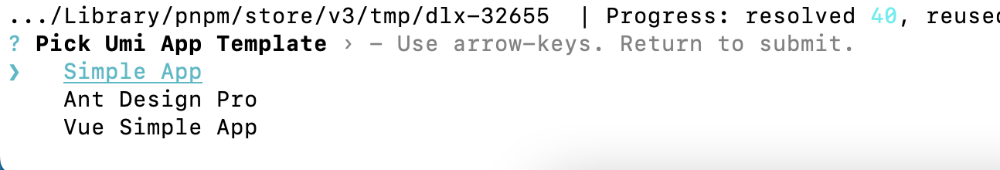
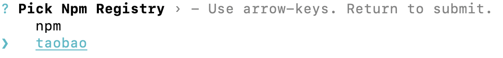
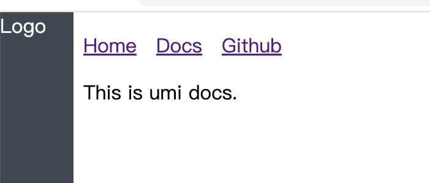

<!-- START doctoc generated TOC please keep comment here to allow auto update -->
<!-- DON'T EDIT THIS SECTION, INSTEAD RE-RUN doctoc TO UPDATE -->
**Table of Contents**  *generated with [DocToc](https://github.com/thlorenz/doctoc)*

- [1. UMI中使用ant design布局](#1-umi%E4%B8%AD%E4%BD%BF%E7%94%A8ant-design%E5%B8%83%E5%B1%80)
- [2. 菜单和边栏](#2-%E8%8F%9C%E5%8D%95%E5%92%8C%E8%BE%B9%E6%A0%8F)
- [3. Footer](#3-footer)

<!-- END doctoc generated TOC please keep comment here to allow auto update -->

### 1. UMI中使用ant design布局

1. 创建几个基本的umi项目

版本：umi4

```bash
# 创建一个umi4项目
pnpm dlx create-umi
```

- 模板选择：选择Simple App，最基础的app



- npm客户端选择

可以选择pnpm，选择其他的如npm、cnpm、yarn都是可以的

- 选择npm仓库

这里我选择了taobao，选择npm官网的，也是正常的，只要网络环境可以就没问题。



接下来就是创建项目了，这个速度很快，基本上半分钟左右的时间。

国内环境可以使用pnpm+taobao源，使用它们俩组合，可以自动安装依赖。项目创建完成后，可以直接启动项目，如果选择了其他的源，注意安装一下依赖。

2. 安装ant design和图标库

umi4，没有内置antd，需要单独安装。

```bash
pnpm install antd @ant-design/icons
```

3. 配置antd插件

```ts
import {defineConfig} from "umi";

export default defineConfig({
    plugins:[
        require.resolve("@umijs/plugins/dist/antd")
    ],
    antd:{} // 开启antd插件功能
})
```

需要强调的是，在配置了antd插件后，需要开启下插件功能。

4. 新增/编辑布局页面

我们就拿修改项目的布局页面作为例子吧。

页面：src/layouts/index.tsx

```tsx
// 导入antd
import {Layout} from "antd";
import { Link, Outlet } from 'umi';
import styles from './index.less';
// 解构出几个大的布局模块：Header、Footer、Content、Sider
const {Header,Content,Footer,Sider} = Layout;

export default function BaseLayout() {
  return (
    // 使用antd布局模块进行页面布局
    <Layout>
      <Sider className={styles.fixedSider} width="60">
        <div className="log">Logo</div>
      </Sider>
      <Layout>
        <Header>
          <div className={styles.navs}>
            <ul>
              <li>
                <Link to="/">Home</Link>
              </li>
              <li>
                <Link to="/docs">Docs</Link>
              </li>
              <li>
                <a href="https://github.com/umijs/umi">Github</a>
              </li>
            </ul>
          </div>
        </Header>
      <Outlet />
      </Layout>
    </Layout>
  );
}
```

到此为止，umi4通过antd来布局的效果，已经完成



### 2. 菜单和边栏

### 3. Footer

```tsx
<Footer className={styles.footer}>
    版权所有,违者必究
</Footer>
```

这个简单，没有什么技术点