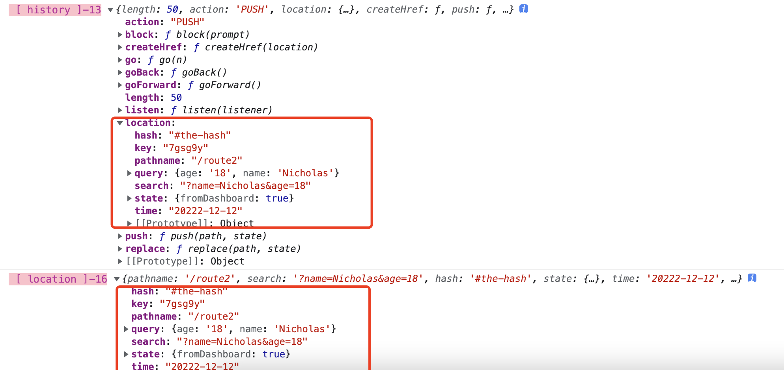

<!-- START doctoc generated TOC please keep comment here to allow auto update -->
<!-- DON'T EDIT THIS SECTION, INSTEAD RE-RUN doctoc TO UPDATE -->
**Table of Contents**  *generated with [DocToc](https://github.com/thlorenz/doctoc)*

- [1. umi项目中页面跳转传递及接收参数](#1-umi%E9%A1%B9%E7%9B%AE%E4%B8%AD%E9%A1%B5%E9%9D%A2%E8%B7%B3%E8%BD%AC%E4%BC%A0%E9%80%92%E5%8F%8A%E6%8E%A5%E6%94%B6%E5%8F%82%E6%95%B0)
- [2. Link组件方式页面跳转，并实现参数的传递和接收](#2-link%E7%BB%84%E4%BB%B6%E6%96%B9%E5%BC%8F%E9%A1%B5%E9%9D%A2%E8%B7%B3%E8%BD%AC%E5%B9%B6%E5%AE%9E%E7%8E%B0%E5%8F%82%E6%95%B0%E7%9A%84%E4%BC%A0%E9%80%92%E5%92%8C%E6%8E%A5%E6%94%B6)
  - [2.1 Link组件实现常规页面跳转，不传递和接收参数](#21-link%E7%BB%84%E4%BB%B6%E5%AE%9E%E7%8E%B0%E5%B8%B8%E8%A7%84%E9%A1%B5%E9%9D%A2%E8%B7%B3%E8%BD%AC%E4%B8%8D%E4%BC%A0%E9%80%92%E5%92%8C%E6%8E%A5%E6%94%B6%E5%8F%82%E6%95%B0)

<!-- END doctoc generated TOC please keep comment here to allow auto update -->

### 1. umi项目中页面跳转传递及接收参数

umi项目中页面之间跳转，可以通过两种方式实现：

1. 路由组件：Link组件

Link组件，是umi内置的组件，可以用在umi项目中的单页面之间的跳转。

```tsx
<Link to="/route1">页面1</Link>
```

> <font color="#f20">如果umi项目中需要跳转到外部链接，那么需要使用a标签。</font>

2. js事件跳转

通过事件响应的方式实现页面之间的跳转.

```tsx
const toPage2 = () => {
    history.push("/route2");
}

<button onClick={toPage2}>通过点击事件跳转到页面2</button>
```

### 2. Link组件方式页面跳转，并实现参数的传递和接收

#### 2.1 Link组件实现常规页面跳转，不传递和接收参数

Link组件在实现常规页面之间的跳转，当不需要携带和接收参数的时候，和HTML中的a元素的使用方式类似，只是a元素的标签名更改为Link，a元素的href属性更改为to属性。

Link组件，只可在umi项目内的单页面之间进行跳转，不能实现从项目内的单页面跳转到项目外的链接。如果在一个umi项目内需要跳转到项目外部的链接，请使用a元素。

> react项目中，可以使用任意的HTML标签元素，并不是说在react项目中，就只能使用react元素，或者在umi项目中，就只能使用umi给我们封装好的一些组件。

因为是最为常规的页面之间的跳转，所以其实现和使用也比较简单。

```tsx
<Link to="/route2">页面2</Link>
```

Link，和HTML标记a元素标签等价，to属性和a元素中的href属性等价，这样，就可以实现一个页面的跳转。

**新标签页打开页面**

在不使用类似React、Vue等前端框架做前端开发的时候，通过标签a实现页面之间的跳转，默认是在当前页面打开，如果需要在新标签打开页面的时候，可以给a标签添加一个target属性，设置为_blank即可。那么现在使用了React中的Link标签，怎么实现新标签页打开页面呢？

其实，React-router中的Link以及umi的Link，都是基于a标签做的一些封装，最终体现出来的，也是a标记。其实说了那么多，可以归结为一句话，就是在使用Link组件想从新标签页打开页面的时候，也可以直接给Link组件添加一个target属性，设置为_blank即可，就可以实现新标签页打开了。

```tsx
<Link to="/route2" target="_blank">新标签页打开页面2</Link>
```

#### 2.2 Link组件实现携带参数的页面跳转和参数接收

**Link组件实现携带参数的页面跳转**

Link组件携带参数实现页面的跳转，常用的有2种方法：

1. 使用query参数

前面我们已经了解到，使用Link组件实现页面跳转时如果不需要携带参数，那么Link组件的to属性值可以是一个字符串。

但是如果使用Link组件实现页面跳转需要携带参数时，那么to属性就不能是一个简单的字符串了，而需要是一个对象了，对象包括要跳转的目标路由、请求参数query，query是一个对象，该对象为页面跳转时携带的参数。

```tsx
// 不携带参数的Link组件跳抓链接
<Link to="/route2">页面2</Link>

// 通过query参数携带参数的Link组件实现页面跳转
<Link
    to={{
    pathname: '/route2',
    query: {
        name: 'Simpson',
        age: 12,
        gender: 'Male',
    },
    }}
>
    Link组件通过query对象携带参数
</Link>
```

**使用Link组件，也可以通过search参数**

在使用Link组件时，也可以通过serach参数拼接参数。通过search参数拼接参数时，参数是字符串拼接的方式，而不像query参数传参时直接时直接是一个对象。

```tsx
<Link
    to={{
    pathname: '/route2',
    search: '?name=Nicholas&age=18',
    hash: '#the-hash',
    state: { fromDashboard: true },
    time: '20222-12-12',
    }}
>
    Link组件添加参数到页面2,带有search
</Link>
```

从案例可以看出，使用了search来拼接参数。通过search方式来拼接参数时，最前面有一个？需要注意，不能漏掉。

search方式拼接参数，个人感觉没有query的方式简单、明了。

> Link组件携带参数时，其底层是通过Location API接口来实现的,在使用Link组件传递参数时，Location API支持的属性，在Link组件传递参数时都可以使用。

**在Link组件进行页面跳转的过程中，也可以添加其他其定义参数，在目标页面中参数接收时都可以作为Location对象的属性接收**

无论是query方式还是search拼接参数的方式传递参数，最终都是通过hisroty或location来接收参数的。

> history中包含了location对象，也可以将location对象看作是history的一个属性。histroy中的location属性接收的数据，和使用location对象自己接收的数据完全相同。

在umi中，我们可以使用useHistory和useLocation这2个hooks来接收Link组件传递过来的参数。

> umi中，还有一个useParams这个hooks来接收参数，只是useParams可以用来接收动态路由参数，接收不到Link传递的参数。

```tsx
const history = useHistory();
console.log('%c [ history ]-13', 'font-size:13px; background:pink; color:#bf2c9f;', history)

const location = useLocation();
console.log('%c [ location ]-16', 'font-size:13px; background:pink; color:#bf2c9f;', location)
```

uesHistory和useLocation都可以接收到参数，具体效果如下:



2. 在url中拼接参数

在使用Link组件的时候，to属性不光可以简单的赋值一个路由，也可以为路由拼接参数，就像通过get方式请求接口一样。

**页面接收通过Link组件跳转时携带的参数**