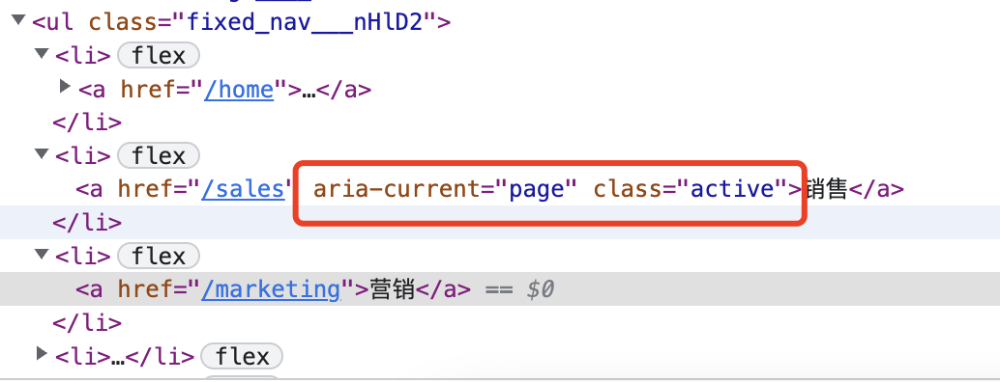

### 当前路由状态激活

实际项目中经常会遇到类似的效果，就是当前路由点击后显示当前路由的激活状态，视觉效果上可能就是一个高亮的效果。

react-router中给封装了NavLink这个组件，可以记录当前路由状态，如果是当前路由，那么可以为当前路由设置一些样式，来实现高亮的效果。

```tsx
import { NavLink } from "umi";
<ul className={styles.fixed_nav}>
    {
    sidebarJSON.primary.map(item => {
        return (
        <li key={item.key}>
            <NavLink to={item.key} className={({ isActive }) => isActive ? 'active' : undefined}>{item.name}</NavLink>
        </li>
        )
    })
    }
</ul>
```

isActive是NavLink组件中的参数参数，不需要我们声明，直接使用即可。

