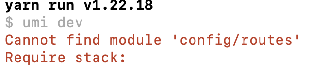

### Cannot find module 'config/routes'

umi3项目中，我把路由配置部分单独抽离出来到config/routes.ts中了。大概的代码如下：

```ts
const routes = [
    {
        path: "/",
        component: "@/layouts",
        routes:[
            {
                path: "/home",
                title: "首页",
                component: "@/pages/index"
            },
        ]
    }
];

export default routes;
```

从这段代码来看，应该是没有什么问题，声明了一个路由以及当前路由的一个字路由，然后以默认导出的方式将路由信息导出，只需要在需要引用的地方import就可以了。

但是我在.umirc.ts文件中导入后，项目编译时报错了，提示找不到routes模块。



我在.umirc.ts中，通过import routes的方式导入，当我输入到routes的时候，编辑器直接给我出了提示config/routes,有了快捷提示，我就直接敲回车输入了。引入代码如下：

```tsx
import routes from 'config/routes';
```

引入方式，我看着也没有什么问题，虽然代码不是完全的一个字母一个字母敲出来的，是编辑器的智能提示后快捷键入的，然后我也能通过route变量直接跳转到引用的config/routes文件，我认为这里也是没有问题的。

但是就是在这样的情况下，我在编译项目的时候，直接就给错误了：


上面对导入routes模块说了那么多，因为问题就出在这里了，导入文件的路径问题。只要把导入文件的路径，改成全路径就可以了，相对路径或者绝对路径都可以，但是在前端项目内，我是使用相对路径更多，基本上不怎么使用绝对路径。修改成完全的、没有省略的相对路径就可以了：

```tsx
import routes from './config/routes';
```

这样就可以了，再也没有报错问题了。

### 不要随便使用简略的写法

这个问题给我个提示，不要随便使用简写的方式。其实在不加./的时候，在html和css中，都尝试过，没有发现过问题。然后在es6中发现了这个问题，可能以前没有使用编辑器的智能推荐，比较规矩的键入了./的相对路径吧。

在前端项目中，相对路径场景下，还是老老实实的按照标准格式书写，不要使用一些简写的方式吧。今天因为这个额路径问题，浪费了我半天的时间。