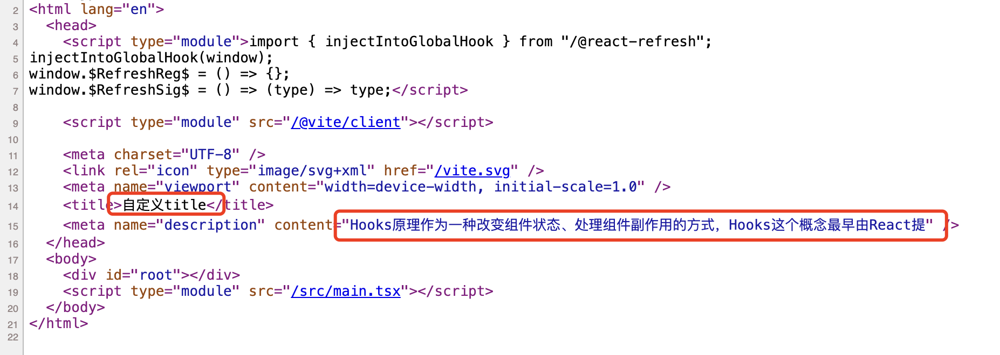

## vite搭建前端工程

### vite简介

#### 预构建

- 将非ESM规范的代码转换为ESM规范的代码,另外就是将第三方依赖内部的多个文件合并为一个,减少http请求数量
- vite在一开始将应用中的模块分为依赖和源码两类:
  - 依赖部分:指在代码中用到的第三方模块,如vue、axios、react、lodash等,vite使用esbuild在应用启动时对于依赖部分进行预构建依赖;
  - 源码部分:日常项目开发时我们自定义的.js、.jsx、.vue等文件,这部分代码会在运行时被编译,但是并不会进行任何的打包动作,vite将以原生ESM方式的提供源码;
- 开发环境中,vite让浏览器接管了部分打包程序的工作,vite只需要在浏览器请求源码时进行转换并按需提供源码.根据情景动态导入代码,即只有在当前屏幕上显示时才会被处理;
- 在生产环境中,vite利用rollup对代码进行打包处理,并配合着tree-shaking、懒加载和chunk分割为浏览器提供最后的代码资源;

#### esbuild

- vite是使用esbuild来做预构建和内容转换的,同等规模的项目,使用esbuild可以将打包速度提升10-100倍;
- esbuild是一款基于go开发的javascript打包工具,其最大的特征就是快,核心目标就是开创构建工具性能的新时代,同时创建一个易于使用的现代构建工具;
- esbuild支持多种模块格式,包括commonjs、es6模块、AMD等,使得它适用于任何类型的js项目;

#### 缓存

- 在vite中,缓存是一个非常重要的概念,因为缓存可以明显提升开发服务器热重载的速度
- vite使用了两级缓存:一级是内存中的模块缓存,二级是基于文件系统的缓存
  - 内存中的模块缓存:vite会将每个模块的转换结果保存在内存中,以便在开发中快速访问
  - 基于文件系统的缓存:vite会将转换过的文件存储在node_modules/.vite/文件夹中,并且会在文件系统中缓存这些文件的依赖和变化
- packge.json中的依赖项、包管理器中的package-lock.json和vite.config.js中的相关字段发生变化时,vite均会进行重新预构建
- 更改缓存位置的配置方式:

```js
// vite.config.js
export default defineConfig({
  cacheDir: "./.cache"
})
```

#### 模块热重载HMR

- HMR全称叫做Hot Module Replacement,即热模块替换或者热模块更新
- HMR的作用就是在页面更新的时候,直接把页面中发生变化的模块替换为新的模块,同时不会影响其他模块的工作
- vite本身实现了一套HMR系统,它是基于原生ESM模块规范来实现的,在文件发生变化时vite会侦测到相应ES模块的变化,从而触发相应的api,实现模块的局部刷新
- vite通过import.meta.hot对象暴露手动HMR API

### 基础配置

#### 配置文件

- vite会自动解析项目根目录下的vite.config.js配置文件(也支持ts扩展名)
- 基础的配置: vite.config.js

```js
// vite.config.js
import { defineConfig } from "vite"; // 从vite导入defineConfig工具函数做配置,可以和开发工具配合做智能提示
export default defineConfig({
  // 配置项
})
// 也可以是另外一种写法
export default {
  // 配置项
}
```

配置文件,两种定义方式,都可以

- vite指令也可以通过--config显示的指定配置文件,而不是必须使用默认的vi te.config.js配置文件

```bash
vite --config my-config.js # 指定了一个自定义的配置文件
```

#### vite-plugin-html

- vite-plugin-html是一个旨在提供对html提供灵活控制的插件,通过该插件,开发者可以在html模板中插入动态数据、自定义meta标签、甚至可以根据不同的环境进行HTML的定制,它使得vite项目中的html文件处理的更加灵活和可定制化,极大的提升了开发效率
- 该插件需要单独安装

```bash
pnpm install vite-plugin-html -D # 开发时依赖即可
```

- 功能

  - 动态注入变量:通过将数据注入到HTML中,开发者可以灵活的控制页面标题、描述等元数据

  - 环境特定内容:支持根据不同环境动态注入不同的内容,例如在开发和生产环境注入不同的meta内容

  - 模板解析:该插件支持基于ejs等模板引擎对HTML文件进行解析、从而在HTML中使用条件逻辑和循环

  - 通过vite创建的react项目,使用案例可参考如下:

    ```js
    // vite.config.js
    import { defineConfig } from 'vite'
    import react from '@vitejs/plugin-react-swc'
    import { createHtmlPlugin } from 'vite-plugin-html'
    
    // https://vite.dev/config/
    export default defineConfig({
      plugins: [
        react(),
        createHtmlPlugin({
          inject: {
            data: {
              title: "自定义title",
              description: "Hooks原理作为一种改变组件状态、处理组件副作用的方式，Hooks这个概念最早由React提"
            }
          }
        })
      ],
    })
    ```

    ```html
    <!-- 项目根目录下的index.hmtl模板文件 -->
    <!doctype html>
    <html lang="en">
      <head>
        <meta charset="UTF-8" />
        <link rel="icon" type="image/svg+xml" href="/vite.svg" />
        <meta name="viewport" content="width=device-width, initial-scale=1.0" />
        <title><%= title %></title>
        <meta name="description" content="<%= description %>" />
      </head>
      <body>
        <div id="root"></div>
        <script type="module" src="/src/main.tsx"></script>
      </body>
    </html>
    ```

    效果如下:

    

#### 别名配置

#### 打包配置

#### css处理

#### css配置

#### 环境变量

#### 开发服务器

### 插件

#### @vitejs/plugin-vue2

#### @vitejs/plugin-vue

#### @vitejs/plugin-legacy

#### vite-plugin-mock

### 配置文件汇总

#### vite.config.js