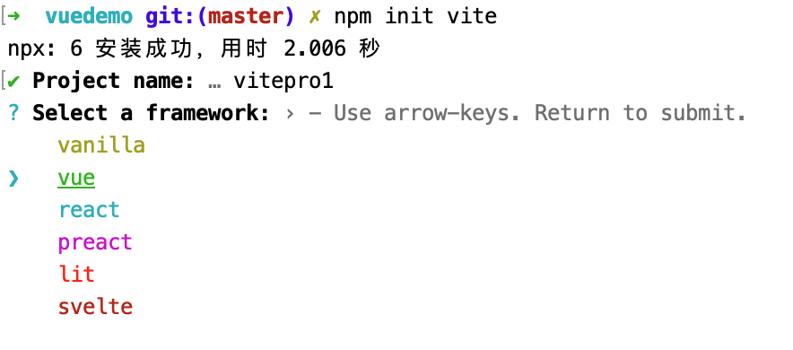

### 1. vite介绍

### 2. vite2创建项目(工程)

创建项目,参考官网上的介绍,有3种方式:

1. 使用npm

   ```bash
   npm init vite
   ```

   执行了初始化项目的指令后,根据提示进行选择就可以了.项目的创建速度很快.

   

   为了学习使用,选择vue.

   从创建项目的过程观察,通过npm创建vite项目速度非常的快,项目的创建过程,几乎不需要消耗什么时间.就是一个键盘的敲击时间.

   项目创建完成之后,安装了依赖之后,运行一下.

   先看下package.json

   ```json
   {
     "name": "vitepro1",
     "version": "0.0.0",
     "scripts": {
       "dev": "vite --open",
       "build": "vite build",
       "serve": "vite preview"
     },
     "dependencies": {
       "vue": "^3.2.16"
     },
     "devDependencies": {
       "@vitejs/plugin-vue": "^1.9.3",
       "vite": "^2.6.4"
     }
   }
   ```

   很简单,使用vite启动项目,和使用webpack启动项目是一样的.默认的dev启动项目是没有--open的,这里也是和webpack一样,可以自定义配置.配置后执行npm run dev就可以自动打开浏览器就看效果了.

2. 使用yarn

   ```bash
   yarn creae vite
   ```

   使用yarn创建vite项目,和npm除了开始使用的指令不同,后续的完全一样,项目创建的速度也是非常的快.

3. 使用pnpm

通过上面的3种方式,都可以指定一些模板去创建项目

```bash
pnpm create vite
```

pnpm是一个新的包管理工具,可以在这里查看关于pnpm的一些介绍:[pnpm介绍及使用](../pnpm/pnpm.md).

**vite支持创建基于内置模版的项目**

到目前为止,vite已经预设的模板有:

vanilla、vanilla-ts

vue、vue-ts

react、react-ts

preact、preact-ts

lit、lit-ts

svelte、svelte-ts

```bash
# 使用npm6.x创建基于模版的vite项目
npm init vite projectname --template vue

# 使用npm7.x创建基于模板的vite项目   使用npm7.x,需要额外的双横线
npm init vite projectname -- --template vue

# 使用yarn创建基于模板的项目
yarn create vite projectname --template vue

# 使用pnpm创建基于模板的项目  注意有额外的双横线
pnpm create vite projectname -- --template vue
```

更多的关于create-vite的技术细节,可以参考:https://github.com/vitejs/vite/tree/main/packages/create-vite

### 3. vite2的主要变化

配置选项的变化:vue特有选项、创建选项、css选项、jsx选项等

别名行为等变化:不再要求/开头或者结尾

Vue支持:通过插件的方式支持, 通过@vitejs/plugin-vue插件支持,jsx通过@vitejs/plugin-jsx支持

React支持

HRM API变化

清单格式变化

插件API重新设计

#### 3.1 Vue支持

Vue的支持,也是通过插件实现,和其他框架、库一视同仁.

来看一些关于vite的简单配置

vite的配置,在项目根目录中的vite.config.js中进行配置

```js
import { defineConfig } from 'vite';
import vue from '@vitejs/plugin-vue';
import path from "path"; // 在有关路径设置的时候需要单独引入path模块

// https://vitejs.dev/config/
export default defineConfig({
  css:{},
  esbuild:{},
  // 配置别名
  alias:{
    "@":path.resolve(__dirname,"src"),
    "views": path.resolve(__dirname,"src/views"),
    "components": path.resolve(__dirname,"src/components"),
    "apis": path.resolve(__dirname,"src/apis"),
    "routes": path.resolve(__dirname,"src/routes")
  },
  plugins: [vue()]
})
```

常用的配置,我可能会选择关于CSS、别名、esbuild(打包)、预处理器(css.preprocessorOptions)等的一些配置,其他的一些不常用的配置,可以使用默认提供的就可以.

**vite配置智能提示小技巧**

因为vite本身附带了Typescript类型,所以在vite配置的时候,可以通过IDE和jsdoc来配合智能提示

通过defineConfig工具函数实现智能提示 ---- vite2.x中,项目创建时就已经把这个工具函数给默认的添加上了.如果不使用这个工具函数,那么配置方式是:

```js
import { defineConfig } from 'vite';
import vue from '@vitejs/plugin-vue';
import path from "path"; // 在有关路径设置的时候需要单独引入path模块

// https://vitejs.dev/config/
export default {
  css:{},
  esbuild:{},
  // 配置别名
  alias:{
    "@":path.resolve(__dirname,"src"),
    "views": path.resolve(__dirname,"src/views"),
    "components": path.resolve(__dirname,"src/components"),
    "apis": path.resolve(__dirname,"src/apis"),
    "routes": path.resolve(__dirname,"src/routes")
  },
  plugins: [vue()]
}
```

使用defineConfig工具函数后,导出一个函数

```js
import { defineConfig } from 'vite';
import vue from '@vitejs/plugin-vue';
import path from "path"; // 在有关路径设置的时候需要单独引入path模块

// https://vitejs.dev/config/
export default defineConfig({
  css:{},
  esbuild:{},
  // 配置别名
  alias:{
    "@":path.resolve(__dirname,"src"),
    "views": path.resolve(__dirname,"src/views"),
    "components": path.resolve(__dirname,"src/components"),
    "apis": path.resolve(__dirname,"src/apis"),
    "routes": path.resolve(__dirname,"src/routes")
  },
  plugins: [vue()]
})
```

### 4. 项目基础架构搭建

### 5. 路由

### 6. 状态管理

### 7. 样式组织

### 8. UI库

### 9. 基础布局

### 10. 动态导航

### 11. 数据服务

### 12. 复杂业务处理

### 13. 项目打包、部署
