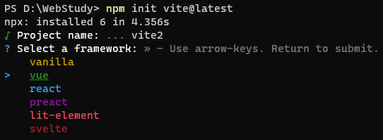
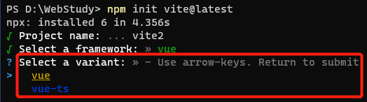
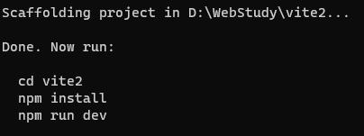

### 通过vite.js搭建项目

> 默认我都使用npm作为包管理工具，个人习惯原因，除了个别场景，我们搭建的项目或者环境已经给我们内置好了yarn工具，我不排斥yarn，纯属个人习惯原因。

> 注意：node版本要求，nodejs版本不低于12.0.0

创建项目

```bash
# 使用最新版本的vite创建项目
npm init vite@latest
```

通过vite创建项目的过程非常简单，过程分为3个步骤：

1. 输入项目名字：直接输入即可

2. 选择一个js框架，vite给我们内置了几个常用、流行的js框架供我们选择,这些框架有：vanilla、vue、react、preact、lit-element、svelte



3. 选择开发语言：默认是js，可以选择ts



通过键盘上的上下箭头选择即可

选择完了开发语言后项目即创建完成，接下来就可以进行正常的项目操作了，该安装依赖包的安装依赖包，安装了依赖包的就可以业务开发、功能开发、项目运行了。项目创建完成之后，会有操作提示，脚手架还是很友好的。

