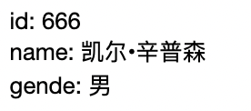

### v-for遍历number

做前端开发，尤其是技术栈是vue的前端开发，应该都使用过v-for循环，且频率比较高。总的来说，v-for经常用在4种情况下遍历数据。

1. v-for遍历普通数组

普通数组，就是一般的数组，数值类型可以是数值类型、字符串类型等一些基本类型，如下面的数据格式：

```ts
arr: ["apple", "banana", "tomato"],
```

2. v-for遍历对象数组

其实对象数组类型，也是数组类型，只是数组项的类型稍微有些特殊，这些数组的项是对象，但是其本质还是数组。如下面的数据格式类型：

```ts
user: [
{
    id: 1,
    name: "Nicho",
},
{
    id: 2,
    name: "Matt Frisbie",
},
{
    id: 3,
    name: "Richard Blum",
},
],
```

3. v-for遍历对象

在使用v-for遍历对象的时候，遍历的是这个对象中的属性和值。遍历的时候，可以提供一个参数，为对象的属性值；也可以提供2个参数，分别为对象的属性值和属性名。2个参数：第一个参数为属性值，第二个参数为属性值。

```ts
obj: {
    id: 666,
    name: "凯尔•辛普森",
    gende: "男"
}
```

当提供一个参数遍历，则参数默认为属性值：

```ts
    <ul>
      <li v-for="item in obj" :key="item">{{ item }}</li>
    </ul>
```


v-for遍历对象的时候，可以提供2个参数，参数分别为属性值和属性名:

```ts
<ul>
    <li v-for="(value, name) in obj" :key="value">{{ name }}: {{ value }}</li>
</ul>
```



4. v-for遍历数值

遍历数值，在vue的文档中称为遍历值范围，接收的值是一个整数类型。


除了上述的4种常用的情况下，还有一种特殊的情况，也可以使用v-for进行数据的遍历，但是本质上也是遍历上述4种了类型中的一种，只不过是经过函数处理过后的返回值。