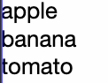
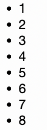
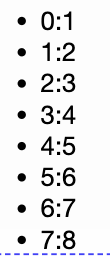

### v-for遍历number

做前端开发，尤其是技术栈是vue的前端开发，应该都使用过v-for循环，且频率比较高。总的来说，v-for经常用在4种情况下遍历数据。

1. v-for遍历普通数组

普通数组，就是一般的数组，数值类型可以是数值类型、字符串类型等一些基本类型，如下面的数据格式：

```ts
arr: ["apple", "banana", "tomato"],
```

v-for遍历常规的普通数组：

```ts
<ul>
    <li v-for="item in arr" :key="item">{{ item }}</li>
</ul>
```



2. v-for遍历对象数组

其实对象数组类型，也是数组类型，只是数组项的类型稍微有些特殊，这些数组的项是对象，但是其本质还是数组。如下面的数据格式类型：

```ts
user: [
{
    id: 1,
    name: "Nicho",
},
{
    id: 2,
    name: "Matt Frisbie",
},
{
    id: 3,
    name: "Richard Blum",
},
],
```

v-for遍历对象数组：

```ts
<ul>
    <li v-for="item in user" :key="item.id">{{ item.name }}</li>
</ul>
```


3. v-for遍历对象

在使用v-for遍历对象的时候，遍历的是这个对象中的属性和值。遍历的时候，可以提供一个参数，为对象的属性值；也可以提供2个参数，分别为对象的属性值和属性名。2个参数：第一个参数为属性值，第二个参数为属性值。

```ts
obj: {
    id: 666,
    name: "凯尔•辛普森",
    gende: "男"
}
```

当提供一个参数遍历，则参数默认为属性值：

```ts
    <ul>
      <li v-for="item in obj" :key="item">{{ item }}</li>
    </ul>
```


v-for遍历对象的时候，可以提供2个参数，参数分别为属性值和属性名:

```ts
<ul>
    <li v-for="(value, name) in obj" :key="value">{{ name }}: {{ value }}</li>
</ul>
```


4. v-for遍历数值

遍历数值，在vue的文档中称为遍历值范围，接收的值是一个整数类型。

```ts
<ul>
    <li v-for="n in 8" :key="n">{{ n }}</li>
</ul>
```

v-for在遍历数值范围的时候，也是可以接受一个参数，也可以接受2个参数：

接收1个参数：遍历变量从1开始。

```ts
<ul>
    <li v-for="n in 8" :key="n">{{ n }}</li>
</ul>
```



接收2个参数：2个参数分别为遍历变量和遍历索引，遍历变量从1开始，索引从0开始。

```ts
<ul>
    <li v-for="(n, key) in 8" :key="key">{{key}}:{{ n }}</li>
</ul>
```



除了上述的4种常用的情况下，还有一种特殊的情况，也可以使用v-for进行数据的遍历，但是本质上也是遍历上述4种了类型中的一种，只不过是经过函数处理过后的返回值。

如有下面的一组数据：

```ts
nums: [1, 2, 3, 4, 5],
```

我们期望得到这组数据中的全部偶数。一般情况下，我们可以通过计算属性，计算出这组数据里面的偶数，然后再进行遍历，可以得到最终期望的获取偶数的结果。

```ts
computed: {
    evenNums: function () {
        return this.nums.filter((num) => num % 2 === 0);
    },
},

// 遍历计算属性
<ul>
    <li v-for="item in evenNums" :key="item">{{ item }}</li>
</ul>
```

出了使用计算属性以外呢，v-for也可以直接遍历一个函数，当然了函数需要是一个具有返回可遍历值的函数。如有这么一组数据：

```ts
sets: [1, 2, 3, 4, 5, 6, 7, 8, 9, 10],
```

我还是期望得到这组数据中的偶数，我可以使用even函数来返回sets这组数据中的偶数：

```ts
methods: {
    even(number) {
        return number.filter((item) => item % 2 === 0);
    },
},
```

那么在使用v-for遍历的时候，直接遍历even函数即可，因为even函数返回了一组数值范围，所以v-for遍历的本质上，就是遍历的一个数值。

```vue
<ul>
    <li v-for="item in even(sets)" :key="item">{{ item }}</li>
</ul>
```

表面上遍历了一个函数，本质上还是前面提到的4种遍历数据格式种的一种。

### 使用v-for遍历时注意事项

在vue的开发中，虽然使用v-for语法糖，在列表渲染上给我们提供了很大的遍历，但是也有一些小细节需要注意：

1. 在每个循环项上都加上一个key属性，提高性能

    * key属性只能是number或者string类型；

    * key的属性值不使用index、随机数：文档上说的是不建议使用index，我们可以养成良好的习惯、严格要求自己，直接不使用index、随机数作为key

    * key属性通过vue语法的属性绑定的方式指定key的值；

    * key的属性值可以使用数据中的id等表示唯一值的字段值；

2. 父子组件之间通过props传值：每个组件都有自己独立的作用域，任何数据都不会自动的传递到其他组件中：兄弟组件、父子组件都不会发生自动的数据传递，只能通过特定形式的数据传递方式去传值、通信。