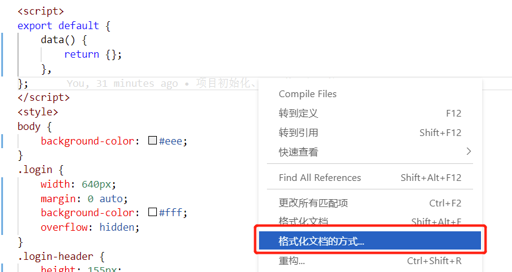

### vscode中使用vetur格式化工具设置vue文件缩进为4个空格

vscode默认的格式化，缩进为2个空格，我自从写代码开始就一直设置缩进为4个空格的习惯，现在的2个空格，从心里上过不去。我安装了vetur格式化工具。

首先我们选择默认的格式化工具，随便打开一个.vue文件，点击右键，从快捷列表中选择“格式化文档的方式”来选择默认的格式化工具，



从已经安装的格式化工具中选择一个工具，我选择“vetur”


设置缩进

文件 - 首选项 - 设置，打开设置(json)


在settings.json中添加一项配置：

```javascript
"vetur.format.options.tabSize": 4
```

如图所示，到此已经配置完成，经过测试，在vue文件中格式化有效。

