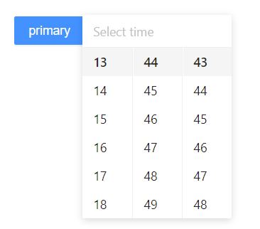

### vue3接入antd-design-vue报错:Uncaught TypeError: Cannot read property 'use' of undefined

在浏览器控制台查看异常信息，给出了上面的报错,详细的信息如下：

```bash
Trigger.js?88ee:16 Uncaught TypeError: Cannot read property 'use' of undefined
    at eval (Trigger.js?88ee:16)
    at Module../node_modules/ant-design-vue/es/vc-trigger/Trigger.js (chunk-vendors.js:1357)
    at __webpack_require__ (app.js:82)
    at d (app.js:82)
    at eval (index.js:2)
    at Module../node_modules/ant-design-vue/es/vc-trigger/index.js (chunk-vendors.js:1360)
    at __webpack_require__ (app.js:82)
    at d (app.js:82)
    at eval (SelectTrigger.js:8)
    at Module../node_modules/ant-design-vue/es/vc-select/SelectTrigger.js (chunk-vendors.js:1099)
```

然后再看下编译控制台，也同样给出了异常信息的提示，

```bash
PS D:\xxx> npm run serve

> vue3@0.1.0 serve D:\xxx
> vue-cli-service serve

99% end closing watch compilation INFO  Starting development server...
99% done plugins FriendlyErrorsWebpackPlugin

 WARNING  Compiled with 1 warning                                                                           上午11:49:03

 warning  in ./node_modules/ant-design-vue/es/_util/openAnimation.js

export 'default' (imported as 'Vue') was not found in 'vue' (possible exports: BaseTransition, Comment, Fragment, KeepAlive, Static, Suspense, Teleport, Text, Transition, TransitionGroup, callWithAsyncErrorHandling, callWithErrorHandling, camelize, capitalize, cloneVNode, compile, computed, createApp, createBlock, createCommentVNode, createHydrationRenderer, createRenderer, createSSRApp, createSlots, createStaticVNode, createTextVNode, createVNode, customRef, defineAsyncComponent, defineComponent, defineEmit, defineProps, devtools, getCurrentInstance, getTransitionRawChildren, h, handleError, hydrate, initCustomFormatter, inject, isProxy, isReactive, isReadonly, isRef, isVNode, markRaw, mergeProps, nextTick, onActivated, onBeforeMount, onBeforeUnmount, onBeforeUpdate, onDeactivated, onErrorCaptured, onMounted, onRenderTracked, onRenderTriggered, onUnmounted, onUpdated, openBlock, popScopeId, provide, proxyRefs, pushScopeId, queuePostFlushCb, reactive, readonly, ref, registerRuntimeCompiler, render, renderList, renderSlot, resolveComponent, resolveDirective, resolveDynamicComponent, resolveTransitionHooks, setBlockTracking, setDevtoolsHook, setTransitionHooks, shallowReactive, shallowReadonly, shallowRef, ssrContextKey, ssrUtils, toDisplayString, toHandlerKey, toHandlers, toRaw, toRef, toRefs, transformVNodeArgs, triggerRef, unref, useContext, useCssModule, useCssVars, useSSRContext, useTransitionState, vModelCheckbox, vModelDynamic, vModelRadio, vModelSelect, vModelText, vShow, version, warn, watch, watchEffect, withCtx, withDirectives, withKeys, withModifiers, withScopeId)
```

在main.js中的引入代码，应该也没有问题：

```javascript
import { createApp } from 'vue'
import App from './App.vue'
import Antd from "ant-design-vue";
import "ant-design-vue/dist/antd.css";

const app = createApp(App);
app.use(Antd).mount('#app');
```

全量、全局的引入方式出现了异常，那我尝试下使用局部引入的方式引入，即我需要使用哪个组件就引入哪个组件。结果还是报异常信息了，无论是通过局部引用组件，还是通过babel的方式按需引入组件的方式，都尝试过了，都会报出异常信息。这是啥情况呢？我记得从一些文档上已经看到了，说ant-design-vue支持了vue3，可为什么我的项目就是运行不起来呢？

我们不妨静下心来分析下给出来的异常信息，

```bash
export 'default' (imported as 'Vue') was not found in 'vue' (possible
```

导出、导入方式的变化，Vue2中Vue默认被导出了，而到了Vue3中没有被默认导出，就出现了上面报出来的异常信息，这里我们基本可以断定了，当前的这个ant-design-vue版本暂时不支持Vue3.我看下项目中安装的ant-design-vue版本，"ant-design-vue": "^1.7.5",进入到安装包里，确认了，是1.7.5。既然这个版本不支持Vue3，我们去ant-design-vue的文档去看看吧[https://github.com/vueComponent/ant-design-vue/releases](https://github.com/vueComponent/ant-design-vue/releases)。

从github上ant-design-vue项目看到，1.7.5之后直接进入了2.0.0版本，且测试版本和rc版本都发布的比较频繁且长时间都没有release版本，由此我又个大胆的推想，就是ant-design-vue是从2.0.0开始支持vue3，于是我尝试更新下ant版本，结果OK了。我安装的最新的版本2.1.4.

我还是使用全局的引入方式，使用的按钮的demo已经成功的运行了。我再尝试个其他的组件，时间控件吧。



结果印证了我的猜测，所以我们在使用升级了vue3选择UI库时，不能直接按照默认的来选择，默认的不一定是最新的版本，但应该是最新的稳定版本吧。或许一些原因或者使用量的问题，也不会将最新的稳定版本设置为默认版本，我们需要根据我们的诉求，了解下第三方库的不同版本之间的差异来选择合适的版本来引入。

> vue的UI库，使用量最大的就是ant-design-vue和elementUI，当前看了下支持Vue3的element，当前已经有了很丰富的组件了，但是还是在测试版本，测试版本已经发布到42个版本了。

