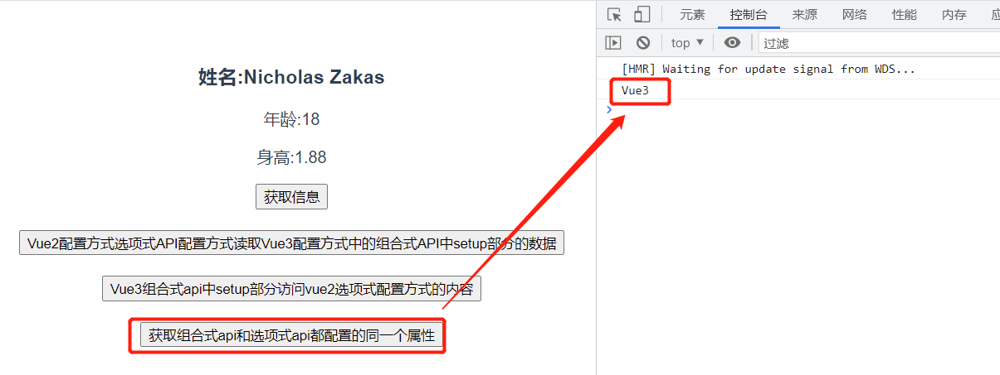
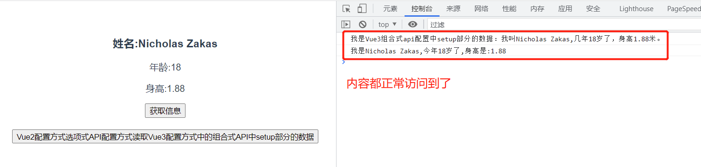
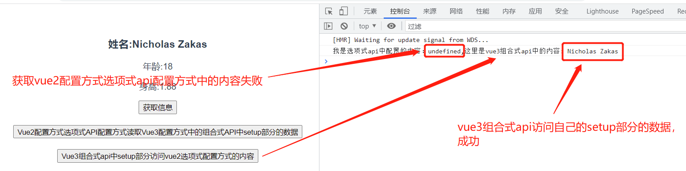

<!-- START doctoc generated TOC please keep comment here to allow auto update -->
<!-- DON'T EDIT THIS SECTION, INSTEAD RE-RUN doctoc TO UPDATE -->

**Table of Contents** _generated with [DocToc](https://github.com/thlorenz/doctoc)_

- [1. 简介](#1-%E7%AE%80%E4%BB%8B)
  - [1.1 发布](#11-%E5%8F%91%E5%B8%83)
  - [1.2 Vue3 带来了什么](#12-vue3%E5%B8%A6%E6%9D%A5%E4%BA%86%E4%BB%80%E4%B9%88)
  - [1.3 源码的升级](#13-%E6%BA%90%E7%A0%81%E7%9A%84%E5%8D%87%E7%BA%A7)
  - [1.4 友好的兼容 Typescript](#14-%E5%8F%8B%E5%A5%BD%E7%9A%84%E5%85%BC%E5%AE%B9typescript)
  - [1.5 新特性](#15-%E6%96%B0%E7%89%B9%E6%80%A7)
    - [1.5.1 Composition API(组合式 API)](#151-composition-api%E7%BB%84%E5%90%88%E5%BC%8Fapi)
    - [1.5.2 新的内置组件](#152-%E6%96%B0%E7%9A%84%E5%86%85%E7%BD%AE%E7%BB%84%E4%BB%B6)
    - [1.5.3 其他改变](#153-%E5%85%B6%E4%BB%96%E6%94%B9%E5%8F%98)
- [2.创建 Vue3 项目](#2%E5%88%9B%E5%BB%BAvue3%E9%A1%B9%E7%9B%AE)
  - [2.1 使用@vue/cli 创建 vue3 项目](#21-%E4%BD%BF%E7%94%A8vuecli%E5%88%9B%E5%BB%BAvue3%E9%A1%B9%E7%9B%AE)
  - [2.2 使用 vite 创建 vue3 项目](#22-%E4%BD%BF%E7%94%A8vite%E5%88%9B%E5%BB%BAvue3%E9%A1%B9%E7%9B%AE)

<!-- END doctoc generated TOC please keep comment here to allow auto update -->

### 1. 简介

#### 1.1 发布

2020.9.18 Vue3.0 发布

RFC：请求修改意见稿

https://github.com/vuejs/rfcs/tree/master/active-rfcs rfcs

Vue3 https://github.com/vuejs/vue-next/

#### 1.2 Vue3 带来了什么

打包大小减小了 41%

初次渲染快了 55%，更新渲染快 133%

内存使用减少了 54%

……

#### 1.3 源码的升级

使用 Proxy 代替 Object.defineProperty 实现响应式

重写虚拟 DOM 和 Tree-Shaking

……

> Tree-Shaking,是一个术语，不是什么库。webpack 本身支持 treeshaking

#### 1.4 友好的兼容 Typescript

Vue3 可以更加友好的支持 Typescript

#### 1.5 新特性

##### 1.5.1 Composition API(组合式 API)

setup 配置

ref 与 reactive

watch 与 watchEffect

provide 与 inject

##### 1.5.2 新的内置组件

Fragment

Teleport

Suspense

##### 1.5.3 其他改变

新的生命周期钩子

data 选项应始终被声明为一个函数

移除 keyCode 支持 v-on 修饰符

### 2.创建 Vue3 项目

两种方式创建 Vue3 项目

#### 2.1 使用@vue/cli 创建 vue3 项目

使用@vue/cli 创建 vue3 项目，要求@vue/cli 的版本是 4.5.0 以上版本

查看@vue/cli 版本

```bash
PS D:\> vue -V
@vue/cli 4.5.14
PS D:\> vue --version
@vue/cli 4.5.14
```

两种方式都可以查看@vue/cli 版本。从结果上来看，我的机器是满足要求的。

通过@vue/cli 创建 vue 项目，就是使用 webpack 构建项目。

创建项目

```bash
vue create vue3projectname
```

通过@vue/cli 创建好项目，可以直接进入项目启动服务运行，不需要单独安装 npm 包，因为在创建项目的时候，就已经把 npm 包都已经安装好了。

#### 2.2 使用 vite 创建 vue3 项目

```bash
# 使用npm创建项目
npm init vite

# 使用yarn创建项目
yarn create vite

# 使用pnpm创建项目
pnpm create vite
```

vite 创建项目,默认没有给安装好 npm 包,需要项目创建好之后,自己去手动的执行 npm install 安装 npm 包.所以在创建项目的时候,感觉是 vite 更快了.

但是一般情况下,不讨论项目的创建速度,而是去讨论项目创建完成后,服务的启动速度和编译速度.

vite:下一代的前端构建工具

**vite 的优势:**

1. 开发环境中,无需打包,可快速冷启动;
2. 轻量快速的热重载(HMR)
3. 真正的按需编译,不再等待整个应用编译完成;

vite 动态引入,动态分析,先准备好服务器,再去加载需要的模块

webpack:先准备好模块,然后再去准备服务器.

### 3. vue3 分析

vue3 中,不能再继续使用 Vue2 的构造函数了.

例如在 Vue3 中,不能通过导入 Vue 的方式,然后通过 new Vue 的方式创建 Vue 的实例了.

```js
import Vue from "vue";
import App from "./App.vue";

new Vue({
  render: (h) => h(App),
}).mount("#app");
s;
```

在 vue2 中,这样的代码应该没啥问题,但是<font color="#f20">到了 Vue3 中,这样的代码是绝对不允许的.</font>

Vue3 中,没有实现 Vue 的构造函数,而是通过 createApp 工厂函数去创建 Vue 实例的.

Vue3 中正确的创建 Vue 实例、挂载组件的方式为:

```js
import { createApp } from "vue";
import App from "./App.vue";

createApp(App).mount("#app");
```

> 工厂函数的特点:不能通过 new 来实例化对象,只需直接调用就可以了.

**Vue3 的特点:**

1. 组件可以没有根标签了,但是加上也没有任何问题
   1. Vue2 中的组件,必须要有一个根组件

#### 3.1 安装 vue 开发者工具(浏览器上)

现在(2021.11.9)vue3 的开发者工具还不完善,还在 beta 阶段,不过也不要纠结,有了总比没有好.感恩吧.

### 4.常用 Composition API 组合式 API

什么是组合式 api 呢?先学习,最后再悟什么是组合式 api 吧.

组合式 api.谁跟谁组合，组合什么呢？什么叫组合式呢？ ---- 刚开始的时候不好理解，学习了 hooks 就会好理解一些了。

组合式 api 有什么优势呢，相比于传统的选项式 api。

#### 4.1 setup

1. vue3 中新增的一个配置项,值为一个函数

2. setup 是所有组合式 API 表演的舞台:没有 setup,其他的 api 没有合适的地方去写

   1. setup 是所有其他 api 学习的起点开始学，因为如果不先学习 setup，其他的 api 内容都没有地方写，就跟演员失去了舞台一样

3. 组件中所用到的:数据、方法、计算属性、生命周期钩子函数、watch 等,都要配置在 setup 中

4. setup 函数的两种返回值:

   1. 对象:如果返回一个对象,则对象中的属性、方法,在模板中均可以直接使用 ----- 重点关注

   2. 渲染函数:如果返回一个渲染函数,则可以自定义渲染内容 ------ 了解即可

      ```js
        setup() {
          // setup函数还可以返回一个渲染函数，可以参考vue2中入口文件的实例化Vue对象的时候的实现
          // 表示把后面的数据渲染到前面的h3标签
          return () => h("h3", "我是渲染函数带来的数据");
        }
      ```

   > setup 函数一定要有返回值：这个不是 setup 函数特有的，是所有的函数都有的。只是有的函数不需要返回，只在函数执行过程中改变了一些状态、数据，最后返回一个 void，js 中可以忽略这个返回的 void 而已。

5. 注意

   1. 尽量不与 vue2.x 配置混用

      1. Vue2.x 配置(data、methods、computed……)可以访问 setup 中的属性、方法

      2. setup 中不能访问 Vue2.x 中的配置(data、methods、computed……)

      3. 如果有重名,setup 优先

         vue3 中，可以同时使用 vue2 中使用的选项式 api 配置方式进行配置和 Vue3 组合式 api 方式配置，那么如果两种配置方式都使用了，且配置了相同的数据名，那么以哪个为准呢？以 vue3 中组合式 api 配置方式中的配置为准。

         ```vue
         <button
           class="btn"
           @click="getSameProps"
         >获取组合式api和选项式api都配置的同一个属性</button>
         <script>
         export default {
           name: "App",
           data() {
             return {
               info: "Vue2",
             };
           },
           methods: {
             getSameProps() {
               console.log(this.info);
             },
           },
           // 先测试一下setup,不考虑响应式
           setup() {
             // 定义数据
             let info = "Vue3";
         
             // 让setup有返回值, 返回值可以在组件中直接使用
             return {
               info,
             };
           },
         };
         </script>
         ```

         案例中同时定义了 info 这个属性。

         最终结果返回了：Vue3，说明了如果同时采用两种配置方式的 api，且有了重名的数据，那么最终就会以组合式 Api 中 setup 中的数据为准

         

   2. setup 不能是一个 async 函数,因为返回值不能再是 return 的对象,而是 promise,模板看不到 return 对象中的属性

setup 中定义的数据、方法,都必须通过 return 返回,被返回后,可以直接在模板中使用.

return 返回的方法,类似 vue2 中 methods 部分定义的方法.

```vue
<template>
  <!--vue3中,可以没有根标签了,但是也可以写,加根标签没有任何问题-->
  <!--根标签是否添加,可以根据实际的场景需要,有时为了性能,可以减少标签嵌套层级,就不加了,但是也有一些特别场景必须需要有这么一个层级,加上也不纠结-->
  <h3>姓名:{{ user.name }}</h3>
  <p>年龄:{{ user.age }}</p>
  <p>身高:{{ user.height }}</p>
  <button @click="sayHello">获取信息</button>
</template>

<script>
export default {
  name: "App",
  // 先测试一下setup,不考虑响应式
  setup() {
    // 定义数据
    let user = {
      name: "Nicholas Zakas",
      age: 18,
      height: 1.88,
    };
    let username = "yan";
    // 定义方法
    function sayHello() {
      console.log(`我是${user.name},今年${user.age}岁了,身高是:${user.height}`);
    }

    // 让setup有返回值,返回值可以在组件中直接使用
    return {
      user,
      username,
      sayHello, // setup返回的方法,类似vue2中methods配置的方法
    };
  },
};
</script>
```

##### 4.1.1 Vue3 中可以使用 Vue2 的配置方式进行组件配置，但是不建议混用

```vue
<script>
export default {
  name: "App",
  // 使用了选项式的组合方式
  data() {
    return {
      msg: "Hello,Vue3!",
    };
  },
  methods: {
    getMsg() {
      console.log(this.msg);
    },
  },
  // 先测试一下setup,不考虑响应式
  setup() {
    // 定义数据
    let user = {
      name: "Nicholas Zakas",
      age: 18,
      height: 1.88,
    };
    let username = "yan";
    // 定义方法
    function sayHello() {
      // 注意这里的变量不需要this，如this.user.name，因为是作用域的原因：setup就是一个函数，具有函数的作用域
      console.log(`我是${user.name},今年${user.age}岁了,身高是:${user.height}`);
    }

    // 让setup有返回值, 返回值可以在组件中直接使用
    return {
      user,
      username,
      sayHello, // setup返回的方法,类似vue2中methods配置的方法
    };
  },
};
</script>
```

如代码，同时使用了选项式 API 方式和组合式 API 的方式，两种方式也可以并存，也可以只使用其中的任意一种，都没有任何问题，都可以正常使用。

但是<font color="#f20">非常的不建议两种 API 的方式混合使用</font>

##### 4.1.2 Vue2 配置方式中的配置可以读取 Vue3 setup 函数中配置的数据、方法

```js
  methods: {
    getMsg() {
      // 读取Vue3 组合式api配置中setup中的数据、方法
      // 都正常执行了，说明选项式api方式可以读取到组合式api中setup部分定义的数据、方法
      console.log(`我是Vue3组合式api配置中setup部分的数据：我叫${this.user.name},几年${this.user.age}岁了，身高${this.user.height}米。`);
      this.sayHello();
    }
  },
```

看效果：



##### 4.1.3 Vue3 中 setup 函数读取不到 Vue2 配置方式中配置的数据、方法

```js
// Vue3组合式api访问vue2配置方式选项式api配置的内容、方法
function getOptions() {
  console.log(
    `我是选项式api中配置的内容：${this.msg},这里是vue3组合式api中的内容: ${user.name}`
  ); // 我是选项式api中配置的内容：undefined,这里是vue3组合式api中的内容: Nicholas Zakas
}
```



#### 4.2 ref 函数

作用:定义一个响应式的数据

语法: const xxx = ref(initValue);

1. 创建一个包含响应式数据的<font color="#f20">引用对象(reference对象,简称ref对象)</font>
2. JS中操作数据:xxx.value
3. 模版中绑定数据:直接使用插值语法,不需要value,直接 {{xxx}}

**注意**

1. ref可以接收基本的数据类型,也可以接收对象类型数据;
2. 基本的数据类型:响应式的实现是通过object.defineProperty()的get和set完成的
3. 引用的对象类型:内部通过Vue3种的新函数reactive函数来实现的
   1. ref加工引用的对象类型时,最底层上是通过proxy来实现的,但是vue3将proxy实现的这个部分封装成了一个reactive函数.所以也可以说ref实现对象类型的响应式,是通过reactive函数实现的.

之前在学习vue2时，也用到过ref，但那会的ref是一个标签属性，是为了标识元素的，类似于元素的ID、class等属性。

现在vue3中学习的ref，是一个函数，主要是处理响应式数据的函数。

vue3中，我们想实现一个数据的响应式，需要把响应式的数据通过ref函数处理

```js
// 导入ref函数，直接从vue解构了
import { ref } from "vue";
export default {
    setup() {
        // 要响应式的数据，使用ref函数处理了，
        let username = ref("Nicholas Zakas");
        let age = ref(18);

        return {
            username,
            age
        };
    }
}
```

如果要实现数据的响应式，仅仅通过ref函数处理还不行

经过ref函数处理的数据，会返回一个引用实现对象（引用实现的实例对象，简称引用实现对象）。所以在修改数据的时候，不能是直接修改数据，而是通过修改数据的.value属性。

```<js
function changeUserInfo() {
    username.value = "Kobe";
    age.value = 26;
    console.log(username);
    console.log(age);
    console.log(`修改后的信息:姓名：${username.value},年龄：${age.value}`);
}
```

<font color="#f20">对于基本的数据类型，是上面的处理方式。</font>


