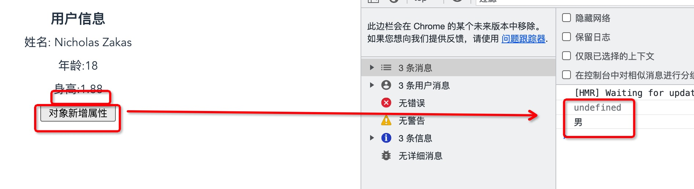
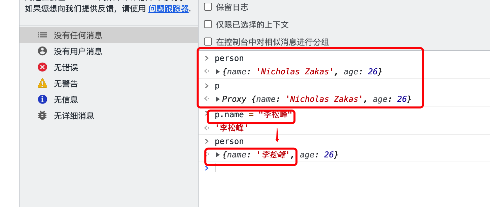

<!-- START doctoc generated TOC please keep comment here to allow auto update -->
<!-- DON'T EDIT THIS SECTION, INSTEAD RE-RUN doctoc TO UPDATE -->

- [1. 简介](#1-%E7%AE%80%E4%BB%8B)
  - [1.1 发布](#11-%E5%8F%91%E5%B8%83)
  - [1.2 Vue3 带来了什么](#12-vue3-%E5%B8%A6%E6%9D%A5%E4%BA%86%E4%BB%80%E4%B9%88)
  - [1.3 源码的升级](#13-%E6%BA%90%E7%A0%81%E7%9A%84%E5%8D%87%E7%BA%A7)
  - [1.4 友好的兼容 Typescript](#14-%E5%8F%8B%E5%A5%BD%E7%9A%84%E5%85%BC%E5%AE%B9-typescript)
  - [1.5 新特性](#15-%E6%96%B0%E7%89%B9%E6%80%A7)
    - [1.5.1 Composition API(组合式 API)](#151-composition-api%E7%BB%84%E5%90%88%E5%BC%8F-api)
    - [1.5.2 新的内置组件](#152-%E6%96%B0%E7%9A%84%E5%86%85%E7%BD%AE%E7%BB%84%E4%BB%B6)
    - [1.5.3 其他改变](#153-%E5%85%B6%E4%BB%96%E6%94%B9%E5%8F%98)
- [2.创建 Vue3 项目](#2%E5%88%9B%E5%BB%BA-vue3-%E9%A1%B9%E7%9B%AE)
  - [2.1 使用@vue/cli 创建 vue3 项目](#21-%E4%BD%BF%E7%94%A8vuecli-%E5%88%9B%E5%BB%BA-vue3-%E9%A1%B9%E7%9B%AE)
  - [2.2 使用 vite 创建 vue3 项目](#22-%E4%BD%BF%E7%94%A8-vite-%E5%88%9B%E5%BB%BA-vue3-%E9%A1%B9%E7%9B%AE)
- [3. vue3 分析](#3-vue3-%E5%88%86%E6%9E%90)
  - [3.1 安装 vue 开发者工具(浏览器上)](#31-%E5%AE%89%E8%A3%85-vue-%E5%BC%80%E5%8F%91%E8%80%85%E5%B7%A5%E5%85%B7%E6%B5%8F%E8%A7%88%E5%99%A8%E4%B8%8A)
- [4.常用 Composition API 组合式 API](#4%E5%B8%B8%E7%94%A8-composition-api-%E7%BB%84%E5%90%88%E5%BC%8F-api)
  - [4.1 setup](#41-setup)
    - [4.1.1 Vue3 中可以使用 Vue2 的配置方式进行组件配置，但是不建议混用](#411-vue3-%E4%B8%AD%E5%8F%AF%E4%BB%A5%E4%BD%BF%E7%94%A8-vue2-%E7%9A%84%E9%85%8D%E7%BD%AE%E6%96%B9%E5%BC%8F%E8%BF%9B%E8%A1%8C%E7%BB%84%E4%BB%B6%E9%85%8D%E7%BD%AE%E4%BD%86%E6%98%AF%E4%B8%8D%E5%BB%BA%E8%AE%AE%E6%B7%B7%E7%94%A8)
    - [4.1.2 Vue2 配置方式中的配置可以读取 Vue3 setup 函数中配置的数据、方法](#412-vue2-%E9%85%8D%E7%BD%AE%E6%96%B9%E5%BC%8F%E4%B8%AD%E7%9A%84%E9%85%8D%E7%BD%AE%E5%8F%AF%E4%BB%A5%E8%AF%BB%E5%8F%96-vue3-setup-%E5%87%BD%E6%95%B0%E4%B8%AD%E9%85%8D%E7%BD%AE%E7%9A%84%E6%95%B0%E6%8D%AE%E6%96%B9%E6%B3%95)
    - [4.1.3 Vue3 中 setup 函数读取不到 Vue2 配置方式中配置的数据、方法](#413-vue3-%E4%B8%AD-setup-%E5%87%BD%E6%95%B0%E8%AF%BB%E5%8F%96%E4%B8%8D%E5%88%B0-vue2-%E9%85%8D%E7%BD%AE%E6%96%B9%E5%BC%8F%E4%B8%AD%E9%85%8D%E7%BD%AE%E7%9A%84%E6%95%B0%E6%8D%AE%E6%96%B9%E6%B3%95)
  - [4.2 ref 函数](#42-ref-%E5%87%BD%E6%95%B0)
  - [4.3 reactive](#43-reactive)
  - [4.4 Vue3 中的响应式原理](#44-vue3%E4%B8%AD%E7%9A%84%E5%93%8D%E5%BA%94%E5%BC%8F%E5%8E%9F%E7%90%86)

<!-- END doctoc generated TOC please keep comment here to allow auto update -->

### 1. 简介

#### 1.1 发布

2020.9.18 Vue3.0 发布

RFC：请求修改意见稿

https://github.com/vuejs/rfcs/tree/master/active-rfcs rfcs

Vue3 https://github.com/vuejs/vue-next/

#### 1.2 Vue3 带来了什么

打包大小减小了 41%

初次渲染快了 55%，更新渲染快 133%

内存使用减少了 54%

……

#### 1.3 源码的升级

使用 Proxy 代替 Object.defineProperty 实现响应式

重写虚拟 DOM 和 Tree-Shaking

……

> Tree-Shaking,是一个术语，不是什么库。webpack 本身支持 treeshaking

#### 1.4 友好的兼容 Typescript

Vue3 可以更加友好的支持 Typescript

#### 1.5 新特性

##### 1.5.1 Composition API(组合式 API)

setup 配置

ref 与 reactive

watch 与 watchEffect

provide 与 inject

##### 1.5.2 新的内置组件

Fragment

Teleport

Suspense

##### 1.5.3 其他改变

新的生命周期钩子

data 选项应始终被声明为一个函数

移除 keyCode 支持 v-on 修饰符

### 2.创建 Vue3 项目

两种方式创建 Vue3 项目

#### 2.1 使用@vue/cli 创建 vue3 项目

使用@vue/cli 创建 vue3 项目，要求@vue/cli 的版本是 4.5.0 以上版本

查看@vue/cli 版本

```bash
PS D:\> vue -V
@vue/cli 4.5.14
PS D:\> vue --version
@vue/cli 4.5.14
```

两种方式都可以查看@vue/cli 版本。从结果上来看，我的机器是满足要求的。

通过@vue/cli 创建 vue 项目，就是使用 webpack 构建项目。

创建项目

```bash
vue create vue3projectname
```

通过@vue/cli 创建好项目，可以直接进入项目启动服务运行，不需要单独安装 npm 包，因为在创建项目的时候，就已经把 npm 包都已经安装好了。

#### 2.2 使用 vite 创建 vue3 项目

```bash
# 使用npm创建项目
npm init vite

# 使用yarn创建项目
yarn create vite

# 使用pnpm创建项目
pnpm create vite
```

vite 创建项目,默认没有给安装好 npm 包,需要项目创建好之后,自己去手动的执行 npm install 安装 npm 包.所以在创建项目的时候,感觉是 vite 更快了.

但是一般情况下,不讨论项目的创建速度,而是去讨论项目创建完成后,服务的启动速度和编译速度.

vite:下一代的前端构建工具

**vite 的优势:**

1. 开发环境中,无需打包,可快速冷启动;
2. 轻量快速的热重载(HMR)
3. 真正的按需编译,不再等待整个应用编译完成;

vite 动态引入,动态分析,先准备好服务器,再去加载需要的模块

webpack:先准备好模块,然后再去准备服务器.

### 3. vue3 分析

vue3 中,不能再继续使用 Vue2 的构造函数了.

例如在 Vue3 中,不能通过导入 Vue 的方式,然后通过 new Vue 的方式创建 Vue 的实例了.

```js
import Vue from "vue";
import App from "./App.vue";

new Vue({
  render: (h) => h(App),
}).mount("#app");
s;
```

在 vue2 中,这样的代码应该没啥问题,但是<font color="#f20">到了 Vue3 中,这样的代码是绝对不允许的.</font>

Vue3 中,没有实现 Vue 的构造函数,而是通过 createApp 工厂函数去创建 Vue 实例的.

Vue3 中正确的创建 Vue 实例、挂载组件的方式为:

```js
import { createApp } from "vue";
import App from "./App.vue";

createApp(App).mount("#app");
```

> 工厂函数的特点:不能通过 new 来实例化对象,只需直接调用就可以了.

**Vue3 的特点:**

1. 组件可以没有根标签了,但是加上也没有任何问题
   1. Vue2 中的组件,必须要有一个根组件

#### 3.1 安装 vue 开发者工具(浏览器上)

现在(2021.11.9)vue3 的开发者工具还不完善,还在 beta 阶段,不过也不要纠结,有了总比没有好.感恩吧.

### 4.常用 Composition API 组合式 API

什么是组合式 api 呢?先学习,最后再悟什么是组合式 api 吧.

组合式 api.谁跟谁组合，组合什么呢？什么叫组合式呢？ ---- 刚开始的时候不好理解，学习了 hooks 就会好理解一些了。

组合式 api 有什么优势呢，相比于传统的选项式 api。

#### 4.1 setup

1. vue3 中新增的一个配置项,值为一个函数

2. setup 是所有组合式 API 表演的舞台:没有 setup,其他的 api 没有合适的地方去写

   1. setup 是所有其他 api 学习的起点开始学，因为如果不先学习 setup，其他的 api 内容都没有地方写，就跟演员失去了舞台一样

3. 组件中所用到的:数据、方法、计算属性、生命周期钩子函数、watch 等,都要配置在 setup 中

4. setup 函数的两种返回值:

   1. 对象:如果返回一个对象,则对象中的属性、方法,在模板中均可以直接使用 ----- 重点关注

   2. 渲染函数:如果返回一个渲染函数,则可以自定义渲染内容 ------ 了解即可

      ```js
        setup() {
          // setup函数还可以返回一个渲染函数，可以参考vue2中入口文件的实例化Vue对象的时候的实现
          // 表示把后面的数据渲染到前面的h3标签
          return () => h("h3", "我是渲染函数带来的数据");
        }
      ```

   > setup 函数一定要有返回值：这个不是 setup 函数特有的，是所有的函数都有的。只是有的函数不需要返回，只在函数执行过程中改变了一些状态、数据，最后返回一个 void，js 中可以忽略这个返回的 void 而已。

5. 注意

   1. 尽量不与 vue2.x 配置混用

      1. Vue2.x 配置(data、methods、computed……)可以访问 setup 中的属性、方法

      2. setup 中不能访问 Vue2.x 中的配置(data、methods、computed……)

      3. 如果有重名,setup 优先

         vue3 中，可以同时使用 vue2 中使用的选项式 api 配置方式进行配置和 Vue3 组合式 api 方式配置，那么如果两种配置方式都使用了，且配置了相同的数据名，那么以哪个为准呢？以 vue3 中组合式 api 配置方式中的配置为准。

         ```vue
         <button
           class="btn"
           @click="getSameProps"
         >获取组合式api和选项式api都配置的同一个属性</button>
         <script>
         export default {
           name: "App",
           data() {
             return {
               info: "Vue2",
             };
           },
           methods: {
             getSameProps() {
               console.log(this.info);
             },
           },
           // 先测试一下setup,不考虑响应式
           setup() {
             // 定义数据
             let info = "Vue3";
         
             // 让setup有返回值, 返回值可以在组件中直接使用
             return {
               info,
             };
           },
         };
         </script>
         ```

         案例中同时定义了 info 这个属性。

         最终结果返回了：Vue3，说明了如果同时采用两种配置方式的 api，且有了重名的数据，那么最终就会以组合式 Api 中 setup 中的数据为准

         

   2. setup 不能是一个 async 函数,因为返回值不能再是 return 的对象,而是 promise,模板看不到 return 对象中的属性

setup 中定义的数据、方法,都必须通过 return 返回,被返回后,可以直接在模板中使用.

return 返回的方法,类似 vue2 中 methods 部分定义的方法.

```vue
<template>
  <!--vue3中,可以没有根标签了,但是也可以写,加根标签没有任何问题-->
  <!--根标签是否添加,可以根据实际的场景需要,有时为了性能,可以减少标签嵌套层级,就不加了,但是也有一些特别场景必须需要有这么一个层级,加上也不纠结-->
  <h3>姓名:{{ user.name }}</h3>
  <p>年龄:{{ user.age }}</p>
  <p>身高:{{ user.height }}</p>
  <button @click="sayHello">获取信息</button>
</template>

<script>
export default {
  name: "App",
  // 先测试一下setup,不考虑响应式
  setup() {
    // 定义数据
    let user = {
      name: "Nicholas Zakas",
      age: 18,
      height: 1.88,
    };
    let username = "yan";
    // 定义方法
    function sayHello() {
      console.log(`我是${user.name},今年${user.age}岁了,身高是:${user.height}`);
    }

    // 让setup有返回值,返回值可以在组件中直接使用
    return {
      user,
      username,
      sayHello, // setup返回的方法,类似vue2中methods配置的方法
    };
  },
};
</script>
```

##### 4.1.1 Vue3 中可以使用 Vue2 的配置方式进行组件配置，但是不建议混用

```vue
<script>
export default {
  name: "App",
  // 使用了选项式的组合方式
  data() {
    return {
      msg: "Hello,Vue3!",
    };
  },
  methods: {
    getMsg() {
      console.log(this.msg);
    },
  },
  // 先测试一下setup,不考虑响应式
  setup() {
    // 定义数据
    let user = {
      name: "Nicholas Zakas",
      age: 18,
      height: 1.88,
    };
    let username = "yan";
    // 定义方法
    function sayHello() {
      // 注意这里的变量不需要this，如this.user.name，因为是作用域的原因：setup就是一个函数，具有函数的作用域
      console.log(`我是${user.name},今年${user.age}岁了,身高是:${user.height}`);
    }

    // 让setup有返回值, 返回值可以在组件中直接使用
    return {
      user,
      username,
      sayHello, // setup返回的方法,类似vue2中methods配置的方法
    };
  },
};
</script>
```

如代码，同时使用了选项式 API 方式和组合式 API 的方式，两种方式也可以并存，也可以只使用其中的任意一种，都没有任何问题，都可以正常使用。

但是<font color="#f20">非常的不建议两种 API 的方式混合使用</font>

##### 4.1.2 Vue2 配置方式中的配置可以读取 Vue3 setup 函数中配置的数据、方法

```js
  methods: {
    getMsg() {
      // 读取Vue3 组合式api配置中setup中的数据、方法
      // 都正常执行了，说明选项式api方式可以读取到组合式api中setup部分定义的数据、方法
      console.log(`我是Vue3组合式api配置中setup部分的数据：我叫${this.user.name},几年${this.user.age}岁了，身高${this.user.height}米。`);
      this.sayHello();
    }
  },
```

看效果：


##### 4.1.3 Vue3 中 setup 函数读取不到 Vue2 配置方式中配置的数据、方法

```js
// Vue3组合式api访问vue2配置方式选项式api配置的内容、方法
function getOptions() {
  console.log(
    `我是选项式api中配置的内容：${this.msg},这里是vue3组合式api中的内容: ${user.name}`
  ); // 我是选项式api中配置的内容：undefined,这里是vue3组合式api中的内容: Nicholas Zakas
}
```


#### 4.2 ref 函数

作用:定义一个响应式的数据

语法: const xxx = ref(initValue);

1. 创建一个包含响应式数据的<font color="#f20">引用对象(reference 对象,简称 ref 对象)</font>
2. JS 中操作数据:xxx.value
3. 模版中绑定数据:直接使用插值语法,不需要 value,直接 {{xxx}}

**注意**

1. ref 可以接收基本的数据类型,也可以接收对象类型数据;
2. 基本的数据类型:响应式的实现是通过 object.defineProperty()的 get 和 set 完成的
3. 引用的对象类型:内部通过 Vue3 种的新函数 reactive 函数来实现的
   1. ref 加工引用的对象类型时,最底层上是通过 proxy 来实现的,但是 vue3 将 proxy 实现的这个部分封装成了一个 reactive 函数.所以也可以说 ref 实现对象类型的响应式,是通过 reactive 函数实现的.

之前在学习 vue2 时，也用到过 ref，但那会的 ref 是一个标签属性，是为了标识元素的，类似于元素的 ID、class 等属性。

现在 vue3 中学习的 ref，是一个函数，主要是处理响应式数据的函数。

vue3 中，我们想实现一个数据的响应式，需要把响应式的数据通过 ref 函数处理

```js
// 导入ref函数，直接从vue解构了
import { ref } from "vue";
export default {
  setup() {
    // 要响应式的数据，使用ref函数处理了，
    let username = ref("Nicholas Zakas");
    let age = ref(18);

    return {
      username,
      age,
    };
  },
};
```

如果要实现数据的响应式，仅仅通过 ref 函数处理还不行

经过 ref 函数处理的数据，会返回一个引用实现对象（引用实现的实例对象，简称引用实现对象）。所以在修改数据的时候，不能是直接修改数据，而是通过修改数据的.value 属性。

```<js
function changeUserInfo() {
    username.value = "Kobe";
    age.value = 26;
    console.log(username);
    console.log(age);
    console.log(`修改后的信息:姓名：${username.value},年龄：${age.value}`);
}
```

<font color="#f20">对于基本的数据类型，是上面的处理方式。</font>

对于对象类型的响应式处理,最底层上是通过 Proxy 来实现的,只是在 Vue3 种,将 proxy 这部分的实现封装成了一个 reactive 函数,所以也可以说是通过 reactive 函数实现的.

对象类型实现响应式,只需要对象的 value 就可以了,不需要对象属性的 value

```js
function changeObj() {
  // 修改对象中的数据,只需要取对象的.value属性,而不需要取属性的.value
  job.value.type = "Java开发工程师";
  job.value.salary = "16k";
  console.log(job.value);
}
```

#### 4.3 reactive

reactive:响应、反应,在 Vue 中,我们更关注其中的响应数据的含义.

**作用:**<font color="#f20">定义对象类型</font>的响应式数据 ---- 不要定义基本数据类型的响应式数据,基本类型的响应式数据定义,使用 ref

**语法**

const 代理对象 = reactive(源对象): 通过这种方式接收一个对象,或者数组,返回一个代理对象(Proxy 的实例对象,简称 Proxy 对象)

reactive:定义的响应式数据是深层次的

reactive 内部基于 Proxy 实现,通过代理对象操作源对象内部的数据进行操作

**和 ref 的区别**

ref 可以定义任何数据类型的响应式数据

> ref 也可以处理对象类型数据的响应式,但是 ref 底层也是调用了 reactive 函数去实现的

reactive,只能定义对象类型的响应式数据,不能用来定义基本类型的响应式数据

#### 4.4 Vue3 中的响应式原理

**Vue2 中的响应式**

实现原理:

1. 对象类型:通过 Object.defineProperty()对属性的读取、修改进行拦截(也叫做数据劫持)

2. 数组类型:通过重写、更新数组的一系列方法来实现拦截(对数组的变更方法进行了包裹)

   ```js
   Object.defineProperty(data, "count", {
     set() {},
     get() {},
   });
   ```

**存在的问题**

1. 新增属性、删除属性,界面不会更新

2. 直接通过下标修改数组,界面不会自动更新

   ```vue
   <template>
     <div class="reactive">
       <h3>用户信息</h3>
       <ul>
         <li>姓名: {{ person.username }}</li>
         <li>年龄:{{ person.age }}</li>
         <li>身高:{{ person.height }}</li>
         <li v-if="person.gender">性别:{{ person.gender }}</li>
       </ul>
       <ul class="btn-area">
         <li>
           <button class="btn" @click="addGenderAttr">对象新增属性</button>
         </li>
       </ul>
     </div>
   </template>
   
   <script>
   export default {
     name: "Reactive",
     data() {
       return {
         person: {
           username: "Nicholas Zakas",
           age: 18,
           height: 1.88,
         },
       };
     },
     methods: {
       // 为数据person添加一个性别属性
       addGenderAttr() {
         console.log(this.person.gender); // undefined
         this.person.gender = "男"; // 发现这种方式,数据是改了,但是没有响应式的修改界面
         console.log(this.person.gender); // 男
       },
     },
   };
   </script>
   ```

   如图所示:

   

   那怎么可以动态的添加一个属性并响应式的显示到界面上呢?

   对于动态添加对象的属性,并响应式的显示到界面上,Vue2 提供了两种方法(也可以说是一种方法):

   1. 使用 Vue.set(target,property/index,value):向响应式对象添加属性,并确保这个属性是响应式的,且触发视图的更新

   2. vm.$set(target,property/index,value): 这个方法是 Vue.set()的一个别名,只是不用动态的导入 Vue 了.

   ```js
   // 为数据person添加一个性别属性
   addGenderAttr(){
     // 通过Vue.set()向响应式对象动态添加属性,并触发视图的更新
     Vue.set(this.person,"gender","男");
   }
   ```

   这种方式需要注意导入 Vue.效果如图:

   

   还有另外一种方式,就是使用 Vue.set()的别名,v m.$set()

   ```js
   // 为数据person添加一个性别属性
   addGenderAttr(){
     // console.log(this.person.gender); // undefined
     // this.person.gender = "男"; // 发现这种方式,数据是改了,但是没有响应式的修改界面
     // console.log(this.person.gender); // 男
   
     // 通过Vue.set()向响应式对象动态添加属性,并触发视图的更新
     // Vue.set(this.person,"gender","男");
   
     // 通过vm.$set()的方式向响应式对象动态添加属性,并触发视图更新
     this.$set(this.person,"gender","女");
   }
   ```

   通过 vm.$set()的方式,不需要导入 Vue. 看效果:

   

**数组和对象的修改基本相同,只是数组比对象多了一个响应式的方法,splice(),也可以实现数组的响应式变更元素**

```js
changeFirstFruit(){
  // 通过vm.$set()和Vue.set()都可以实现数组元素的修改
  // this.$set(this.fruits,0,"哈密瓜");
  // Vue.set(this.fruits,0,"哈密瓜");

  // 主要是看通过slice实现数组的响应式
  this.fruits.splice(0,1,"哈密瓜");
}
```

上面的几种方式,都可以实现数组的响应式变化

**Vue3 的响应式**

实现原理:

1. 通过 Proxy(代理):拦截对象中任意属性的变化,包括:属性值的读写、属性的添加、属性的删除等
2. 通过 Reflect(反射):对被代理对象(源对象)的属性进行操作
3. Proxy和Reflect的文档:
  1. Proxy: https://developer.mozilla.org/zh-CN/docs/Web/JavaScript/Reference/Global_Objects/Proxy
  2. Reflect: https://developer.mozilla.org/zh-CN/docs/Web/JavaScript/Reference/Global_Objects/Reflect


Vue3 中,只要是通过 reactive 包裹的对象、数组,都可以直接添加、删除对象属性、数组元素.

```js
<template>
    <div class="userinfo">
        <h4>用户基本信息</h4>
        <ul class="profile">
            <li>姓名：{{ user.username }}</li>
            <li>年龄：{{ user.age }}</li>
            <li v-if="user.height">身高：{{ user.height }}</li>
            <li v-if="user.job">工作:{{user.job}}</li>
        </ul>
        <ul class="btn-area">
            <li>
                <button class="btn" @click="changeProfile">修改用户信息</button>
            </li>
            <li>
                <button class="btn" @click="addJob">给用户添加一个工作的属性</button>
            </li>
            <li>
                <button class="btn" @click="removeHeight">移除掉身高属性</button>
            </li>
        </ul>
        <h4>水果</h4>
        <ul class="fruits">
            <li v-for="(item,index) in fruit" :key="index">{{item}}</li>
        </ul>
        <ul class="btn-area">
            <li>
                <button class="btn" @click="changeFirstFruit">将第一个水果改为桃子</button>
            </li>
            <li>
                <button class="btn" @click="removeLastFruit">将最后一个水果删除掉</button>
            </li>
        </ul>
    </div>
</template>
<script>
import { reactive } from '@vue/reactivity';
export default {
    name: "Reactive",
    setup() {
        let user = reactive({
            username: "Nicholas Zakas",
            age: 18,
            height: 1.88
        });

        let fruit = reactive(["苹果","西瓜","哈密瓜"]);

        function changeProfile() {
            user.username = "Hanmeimei";
            user.age = 26;
            user.height = 2.01
            console.log(user);
        }
        function addJob(){
            user.job = "人民教师";
        }

        function removeHeight(){
            delete user.height;
        }

        function changeFirstFruit(){
            fruit[0] = "桃子";
        }

        function removeLastFruit() {
            fruit.pop();
        }

        return {
            user,
            changeProfile,
            addJob,
            removeHeight,
            fruit,
            changeFirstFruit,
            removeLastFruit
        };
    }
}
</script>
```

基本的实现,就是和原生的对象、数组的操作是一致的.简单测试下即可.

##### 4.3.1 Vue的响应式原理

**vue2的响应式原理**

Vue2中的响应式,主要是通过新建一个对象,然后通过object.defineProperty()来劫持对象属性的方式实现,看过程案例:

```js
// vue2中响应式的实现
        let person = {
            name: "Nicholas Zakas",
            age: 18
        };

        
        // Vue2中的响应式怎么实现呢?
        // 先建一个空对象,然后再通过Object.defineProperty(),通过getter、setter来拦截数据
        let p = {};
        Object.defineProperty(p,"name",{
            configurable: true,
            get(){ // 当读取name属性时调用
                return person.name
            },
            set(value){ // 当给name属性赋值的时候使用
                console.log("响应式name来了,改下代码就可以了");
                person.name = value;
            }
        });
        Object.defineProperty(p,"age",{
            configurable: true,
            get(){
                return person.age;
            },
            set(value){
                console.log("响应式age来了,改下代码就可以了");
                person.age = value;
            }
        });
```

当然了这里的案例,只是个简单的模拟,没有做代码的封装,响应式部分其实就是案例中的console.log()打印部分,替换成响应式的实现就可以了.

**vue3的响应式实现**

在学习vue3的响应式之前,先了解下ES6中的Proxy.

Proxy,就按照字面量的意思去理解,就是代理,可以做一个代理.如可以让p代理person.对p的操作,都会映射到person的身上.

```js
const person = {
  name: "Nicholas Zakas",
  age: 26
};

let p = new Proxy(person,{});
```

我们把这段代码拿在浏览器中运行一下:



从结果上来看,对p进行了属性值的修改,但结果是p对应的person对象的属性值也发生了改变.

```js
// 模拟vue3的响应式实现
const person = {
  name: "Nicholas Zakas",
  age: 26
};

let p = new Proxy(person,{
  // 第二个参数,是一个对象
  // 第一个参数:源对象,即被代理的对象,如案例中是person
  // 第二个参数:操作的属性,如取name,那么propName就是name;如果取了age,那么propName就是age
  get(target,propName){
    console.log(`我读取了${propName}属性`);
    // 返回当前操作的属性值
    // 这里取属性值,使用了中括号语法,注意不能使用点语法,因为点语法需要是已经声明的、明确的变量,而这里的变量是不确认的某个具体的变量
    return target[propName];
  },
  // set操作,要比get操作多一个参数,即要赋值的具体值
  // 前2个参数和get相同
  // set可以捕获修改和添加属性的变化
  set(target,propName,value){
    console.log(`有人修改了p身上的${propName}属性,该去做响应式、更新界面了!`);
    target[propName] = value;
  },

  // 删除属性
  // 删除属性的方法参数,和get方法相同
  deleteProperty(target,propName){
    console.log(`有人删除了p身上的${propName}属性,该去做响应式、更新界面了`);
    return delete target[propName];
  }
});
```

Vue3中的响应式的实现方式,大概就是这样的.

也许会有人有疑惑,其实我不做后面的实现,只用一个对象代理了源对象,对于新对象的操作,都能捕获到,源对象上也会做响应的修改.那位什么还要重复实现呢?

为了响应式,让数据发生变化的时候,界面也可以同步更新.做后面的实现,就是为了捕获对象属性的变化,在对象属性发生变化的时候,让界面去更新.

代码案例中的console.log()都是应该做响应式界面的操作.

**拦截对象中数据的变化**

我们知道可以通过Object.defineProperty()的方式拦截对象中属性的变化,包括获取属性或者修改属性(包括删除、新增),那我们来看一下Object.defineProperty()的另外一个场景,就是重复修改属性的场景:

```js
// 通过Object.defineProperty()实现
Object.defineProperty(obj,"c",{
  get(){
    return "Object.defineProperty()";
  }
});

Object.defineProperty(obj,"c",{
  get(){
    return "再次定义Object.defineProperty()"
  }
});
```

代码中,我们通过Object.defineProperty()重复定义了两个相同的属性,看运行结果:


我们可以得出一个结论,就是Object.defineProperty()不能重复定义同一个属性,如果重复定义了,就会报异常,代码终止运行.

如果是简单的小应用还好,但是如果是庞大、复杂的系统,就会致命了.

ES6中还有另外一种技术方案,也可以实现拦截对象属性的变化:Reflect.

> 现在ECMA组织有计划将Object的API移植到Reflect.什么意思呢?就是说只要是Object有的API、功能,Reflect都有.基于这个事实,我们可以尝试使用Reflect.defineProperty()

我们使用Reflect实现一下定义对象属性的功能:

```js
// 通过Reflect.defineProperty()实现
const r1 = Reflect.defineProperty(obj,"c",{
  get(){
    return 3;
  },
  set(){}
});
console.log(`r1: ${r1}`); // r1: true
const r2 = Reflect.defineProperty(obj,"c",{
  get(){
    return 4;
  }
});
console.log(`r2: ${r2}`); // r2: false
```

来看下运行结果:


Reflect重复定义了同一个属性,但是代码的运行并没有报错,只是返回了一个Boolean值.

那么这种情况不仅会引起疑问:重复定义了都不给报错,那还能行,我怎么知道有没有重复定义很多的属性,我怎么知道哪个定义生效了?

我们应该发现了,通过Reflect.defineProperty()定义属性,都有一个Boolean类型的返回值,正常定义的返回了true,重复定义的地方返回了false,那我们可以通过Reflect.defineProperty()返回值来确认是否正常定义了.

再进一步,我们应该也会想到,Reflect.defineProperty()重复定义了属性,也没有中断代码的运行,且有返回值.其实这种方式在开发中,有着很大的优势:

1. 可以根据代码执行的返回值做不同的逻辑判断
2. 适合逻辑复杂的、或者框架、工具类型的功能方法中,更加友好

**那么我们在Vue3中的响应式,是不是也可以将通过-Object.defineProperty()实现的响应式替换为Reflect.defineProperty()呢?**

非常的可以.

```js
// 通过Reflect.defineProperty()拦截对象属性的变化模拟Vue3的响应式
let person = {
  name: "Nicholas Zakas",
  age: 18
};

// 将响应式实现中的寻找目标的地方都更改为Reflect实现
let p = new Proxy(person,{
  get(target,propName){
    console.log(target,propName);
    console.log(`我来读取p对象的${propName}属性了.`);
    // return target[propName];
    return Reflect.get(target,propName);
  },
  set(target,propName,value){
    console.log(`我来修改p对象的${propName}属性了,值为${value}`);
    // target[propName] = value;
    Reflect.set(target,propName,value);
  },
  deleteProperty(target,propName){
    console.log(`我来删除p对象的${propName}属性了`);
    // return delete target[propName];
    return Reflect.deleteProperty(target[propName]);
  }
});
```

这样,vue3的响应式的实现的模拟方法又进了一步.

#### 4.5 对比reactive和ref

1. 从定义数据的角度对比
   1. ref用来定义基本的数据类型
   2. reactive用来定义引用数据类型数据:对象、数组
   3. 备注:ref也可以定义引用类型数据(对象、数组),内部会自动通过reactive转换为代理对象
2. 从原理角度对比
   1. ref通过Object.defineProperty()的get与set来实现响应式(数据劫持)
   2. reactive通过Proxy来实现响应式(数据劫持),并通过Reflect草走源对象内部的数据
3. 从使用角度对比
   1. ref定义的数据,操作数据需要.value,读取数据模板中不需要.value
   2. reactive定义的数据:操作数据与读取数据,均不需要.value

#### 4.6 setup的两个注意点

##### 4.6.1 回顾vue2中父子组件传值的一些知识点

**子组件通过定义props来接收从父组件传递过来的数据**

1. 子组件不定义props也可以接收从父组件传递过来的数据,只是这个时候从父组件传递过来的数据,会被子组件的$attrs拿到;
2. 子组件如果只定义了部分props接收从父组件传递过来的数据,那么定义的数据还是会被正常挂载到子组件实例上,从父组件传递过来的没有在子组件中被定义的props,这些数据还是会被子组件的$attrs接收
3. 如果子组件定义了props,那么这些属性可以在子组件模板中直接使用;如果子组件没有定义的props,则不能直接在子组件的模板中使用没有定义的props;
   1. 但是如果知道了从父组件传递过来的数据的prop,也可以通过{{$attrs.prop}}的方式在子组件模板中渲染数据,只不过有点麻烦

**slot**

主要再回顾下vue2中的插槽slot,slot其实就是一个占位的作用,别的没有什么实质的行为和功能.

使用slot时,有一点需要注意的就是在给slot传递内容时,我记得以前的vue的版本(具体什么版本不记得了,也可能是记错了)中,只能通过template传递内容,后来的vue版本中去掉了这个限制.

那么现在可以通过什么给slot传递内容呢?普通的HTML标记都可以,也可以使用template.

使用template和普通的HTML标记的区别是:

1. 使用template:template在DOM结构中仅仅是一个标识,不会占用DOM的层级
2. 使用普通的HTML标记:会增加一层DOM层级.

因此,在一些对性能有极致要求的时候,可以使用template,或者也可以简单的记住:给slot传值,就只使用template也可以 .


##### 4.6.2 setup函数

setup函数在beforeCreate之前执行,在setup中不要使用this.因为setup是在beforeCreate之前执行,使用this找不到组件实例的.

setup函数,能且只能接收2个参数:分别为props、context.

props:从父组件传递过来的数据

context:上下文

props,是被处理了的Proxy,context,就是一个普通的Object对象.


props被处理成的Proxy,没有什么好说的,重点来看下context.


context对象,重点的会关注这3个属性:attrs、emit、slots.

attrs:相当于Vue2中的$attrs,如果定义了props,就会有props接收数据,如果没有定义props,则会使用框架提供的$attrs来接收数据

emit:提交事件,注意,少了$.

```vue
<!--setup函数父组件-->
<template>
    <div class="user">
        <h3>Setup函数测试的父组件</h3>
        <user-profile
            school="美华大学"
            job="Teacher"
            @showUserInfo="showUserInfo"
        ></user-profile>
    </div>
</template>

<script>
import UserProfile from "./SetupChild.vue";
export default {
    components: {
        UserProfile,
    },
    setup() {
        function showUserInfo(data) {
            console.log("父组件调用函数了");
            console.log(data);
        }
        return {
            showUserInfo,
        };
    },
};
</script>

<!--setup函数子组件-->
<template>
    <div class="profile">
        <h3>用户信息</h3>
        <h4>姓名:{{person.name}}</h4>
        <p>年龄:{{person.age}}</p>
        <p v-if="school">学校:{{school}}</p>
        <p v-if="job">工作:{{job}}</p>
        <button @click="commitUserInfo">提交用户信息</button>
    </div>
</template>

<script>
import { reactive } from "vue";
export default {
    props: ["school", "job"],
    setup(props,context) {
        let person = reactive({
            name: "Nicholas Zakas",
            age: 18,
        });

        function commitUserInfo() {
            console.log("提交用户信息了");
            context.emit("showUserInfo", person); // 注意这里是使用了context提交的自定义事件,emit没有$
        }
        return {
            person,
            commitUserInfo,
        };
    },
};
</script>
```

**slot**

Vue3中的插槽的使用方式,和vue2中有点小区别.

Vue2中使用slot:

```vue
<!--Vue2中使用slot,使用下面的方式,slot属性值是slot的name属性值-->
<template slot="student">
	<div class="student">我是一个学生,通过slot传递的数据</div>
</template>
```

vue3中使用slot的方式

```vue
<!--Vue3不再兼容Vue2中 slot=""这种方式了  v-slot属性值,还是子组件中定义的slot的name属性-->
<template v-slot:student>
	<div class="student">我是一个学生,通过slot传递的数据</div>
</template>
```

slot的使用,是vue3和vue2的一个有区别的地方,建议在vue3中,就直接使用v-slot:name,不要再想着slot=""了.


> 今天在调试代码时,代码给了一个警告: [Vue warn]: Property "xxx" was accessed during render but is not defined on instance. 
>
> 看了半天代码,调试了各种方法,还是给这个警告,最后即将崩溃的时候,突然意识到了父组件给子组件传值的时候,props使用了v-bind,就是:.有时候很简单的一个问题,一下子就蒙圈了.

