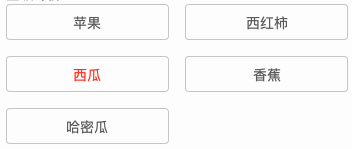

### vue实现点击切换激活当前项的方法

实际项目中，经常会有这样的需求：有多个选项，点击其中一项就选中当前项，其他项取消激活状态，在视觉上的表现就是选中状态高亮，取消激活状态就是没有了高亮效果。如图：



看全代码：

```jsx
<template>
  <ul class="label-list">
    <li
      v-for="(item, index) in labelList"
      :key="index"
      :class="{ active: flag===index }"
      @click="lableEvaluation(index)"
    >
      {{ item }}
    </li>
  </ul>
</template>

<script lang="ts">
export default {
  name: "label",
  props: {
    labelList: {
      type: Array,
      default: "",
    },
  },
  data() {
    return {
      flag: -1
    };
  },
  methods: {
    lableEvaluation(num:number){
        this.flag = num;
    }
  },
};
</script>
<style lang="less" scoped>
.label-list {
  display: flex;
  flex-wrap: wrap;
  width: 720px;
  li {
    text-align: center;
    font-size: 28px;
    color: #666;
    width: 326px;
    height: 72px;
    line-height: 72px;
    margin: 0 34px 32px 0;
    border: 1px solid #ccc;
    border-radius: 8px;
    &.active {
      color: #ff4d13;
    }
  }
}
</style>
```