### Vue技术体系

> 本文所有内容都是以Vue2为基础的，如果有内容和现在的Vue3有区别的，请大家注意。

1. 认识Vue.js

2. Vue基础语法

3. 组件化开发

4. Vue-cli详解：构建工具，基于webpack

5. vue-router：路由，前端路由，相对于后端路由

6. Vuex：状态管理

7. 网络封装

vue项目中常用axios，注意axios不是一个单词，它是由多个单词组成的缩写

8. 项目实践

9. 项目部署

10. vuejs原理

    1. 响应式原理(双向绑定原理)
    2. vuejs源码


###　简单认识vuejs

首先要安装vuejs，使用、学习任何一种框架，都首先要安装这个框架。

**vue是一个渐进式框架，那么什么是渐进式呢？**

可以将vue作为应用的一部分嵌入到应用中，可以带来丰富的交互体验：可以将一个老的项目逐步使用Vue重构；

**Vue全家桶：**

包括：Vue核心、Vue-router、Vuex

**Vue的特点**

1. 解耦视图和数据

2. 可复用的组件

3. 前端路由技术

4. 状态管理

5. 虚拟DOM

**怎么去学习Vue？**

可以没有React、jQuery、Angular的丰富知识；

但是需要CSS、HTML、Javascript的基础知识；

> jQuery正在逐渐退出历史舞台，github已经放弃了jquery了。

### vuejs安装

安装方式有很多种，我们可以根据项目实际情况去选择合适的方式：

1. CDN的方式：一般在重构老项目、或者本地学习的时候，会用，而在一个全新的vue项目中，是不会使用的；

2. 下载到本地，放到项目中去引入；

3. NPM安装：这是用的最多的、最理想的工具，功能也最强大

> 前面的2种方式，基本不会使用，了解下就可以了。

### 响应式，什么是响应式呢？

响应式就是数据发生了改变的时候，界面会自动跟着同步改变，这就是响应式。

### vue指令

v-for:遍历，vue语法

v-on: 监听事件，可简写为@,如v-on:click监听click事件，v-on:del 监听del事件

```html
 <h3>当前计数：{{counter}}</h3>
 <!--注意这里是直接操作变量++、--  -->
 <!--这种方式虽然可以实现数据的变化效果，但是不利于数据和展现的分离，具体可以看下面的一种方式-->
<button v-on:click="counter++">+</button>
<button v-on:click="counter--">-</button>

<script src="../js/vue.js"></script>
<script>
    let app = new Vue({
        el: "#app",
        data: {
            counter: 0
        }
    });
</script>
```

实现如下图所示的计数器效果：

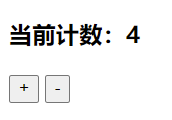

**实现计数器的另一种方式**

```html
    <div id="app">
        <h3>当前计数：{{counter}}</h3>
        <!--这里通过vue指令监听了按钮的点击事件，具体的操作在vue对象里面操作-->
        <button v-on:click="add">+</button>
        <button v-on:click="sub">-</button>
    </div>
    <script src="../js/vue.js"></script>
    <script>
        let app = new Vue({
            el: "#app",
            data: {
                counter: 0
            },

            //这里又学到了vue的一个新属性：methods
            methods: {
                add() {
                    this.counter++;
                },
                sub() {
                    this.counter--;
                }
            }
        });
    </script>
```

实现的效果和上图的一样，就不再贴效果图了。

> @click是v-on:click的语法糖，就是后者的一种简写形式，那为什么叫语法糖呢？就是给你一种简写的形式，让你体会到简写的甜头，就像吃了糖一样，因为这是写代码的语法，所以就是语法上给你一些甜头，就成了语法糖了。

### MVVM

M：Model，指代数据层，一般情况下都是从api请求来的数据，特殊场景下也有静态数据，如一个对象、一个数组，或者是一个json文件；

V：View，Dom，展示层，也可以简单的理解为就是HTML部分；

VM：ViewModel，视图模型层，是View和Model之间的桥梁，指的就是Vue。

MVVM之间的关系可以简单的理解为下图：

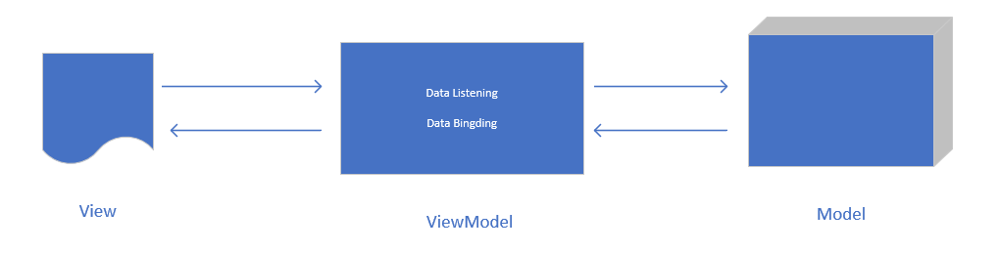

这张图不好看，大概意思到了。

从这张图上，我们可以看到，VM是View和Model之间的一个桥梁，它主要做了两件事情，一件事情是Data Listening（数据监听），另一件事情是Data Binding（数据绑定）。从前面我们可以了解到，VM其实主要就是指Vue，Vue在这里的两件事情，其实就是在监听View的数据变化，然后将变化的结果回传给Model；另外就是将Model的数据绑定到View上。Vue通过这种机制实现了数据的双向绑定。

> 一般情况下，Model都不会在VM中的data属性中，而是从api请求来的数据，或者是一个外部的变量，或者是一个json文件，但是在VM中可以通过this来调用这些数据，这是什么原因呢？这是因为在Model和VM之间有一层代理，做了这种关联关系，我们会在后面的知识中介绍这种关联关系。

### Vue对象实例化时的参数：options

通过上面的学习，我们已经熟悉了options中的3个参数：el、data、methods

el：String | Element，绑定要被Vue管理的元素

data：Object | function，在Vue实例中，需要是个Object，但是在组建中个，data就必须是个函数；

methods：{[key:string]: Function}，是一个对象，放置方法（函数）。

```javascript
methods: {
    // 可以是对象字面量的属性赋值的形式
    add: function () {
        this.counter++;
    },
    sub: function () {
        this.counter--;
    },

    // 也可以是ES6中新增的方式
    increament(){
        this.counter++;
    },
    subscribe(){
        this.counter--;
    }
}
```

> 这里需要注意，尽量不要在methods中使用箭头函数，因为箭头函数中的this指向的不是Vue实例，而是父级作用域的上下文。

data可以是对象，也可以是函数，当data在Vue实例中的时候，data就是一个对象；当data在一个组件中的时候，data就是一个函数。看demo：

```html
<!--如这样的场景，data在一个Vue实例中-->
    <div id="app">
        <h3>当前计数：{{counter}}</h3>
        <!-- <button v-on:click="counter++">+</button>
        <button v-on:click="counter--">-</button> -->
        <button v-on:click="add">+</button>
        <button v-on:click="sub">-</button>
    </div>
    <script src="../js/vue.js"></script>
    <script>
        // 实例化Vue实例
        let app = new Vue({
            el: "#app",
            data: { // data在Vue实例中，data值是一个对象
                counter: 0
            },
            methods: {
                add: function () {
                    this.counter++;
                },
                sub: function () {
                    this.counter--;
                }
            }
        });
    </script>
```

再来看一个组件demo：

```html
<!--这是一个Vue组件的例子-->
<template>
    <div class="hello">
        <h2>{{ uname }}</h2>
    </div>
</template>

<script>
export default {
    name: "HelloWorld",
    // data在一个vue组件中个，这里的data是一个函数，而不是一个对象
    data() {
        return {
            uname: "Nicholas",
        };
    },
};
</script>
```


#### 方法和函数有什么区别？什么时候叫方法，什么时候叫函数？

* 方法：method
* 函数：function

方法和函数，在js中的功能基本上一致的，没有什么实质性的区别。但是方法一般和类的实例有关联的，在类中定义的称为方法；不是在类中定义的，通过function关键词定义的具有一定目的功能的代码的组合，称为函数。

在一些语言中，是没有函数的概念的，如强类型语言java中，它是纯面向对象语言，在java中只有方法的概念，没有函数的概念。只有在js这门特殊的语言中，既有函数的概念，又有方法的概念，它们的区别就是定义的环境的不同。

### Vue的生命周期

Vue的生命周期，一个应用从诞生到销毁的整个周期。

> Vue的声明周期原理，和现在前端应用的生命周期概念很相同，如React、小程序。

生命周期的意义，就是说一个应用从诞生到结束，分为了多个阶段，每个阶段都有自己需要完成的事情，也有一些事情是只能在某个阶段去完成，其他的阶段完成不了该阶段才能做的事情。如在Vue应用中，DOM被挂载到Vue之前，Vue是不能操作DOM的，因为Vue还没有和DOM产生关联关系，Vue不具备操作DOM的能力。

**Vue有这样的生命周期**

我从vue文档中截取了一个生命周期的图例：


从这张图中，我们可以看到Vue的生命周期分为了8个阶段，分别为：

beforeCreate、created、beforeMount、mounted、beforeUpdate、updated、beforeDestroy、destroyed，其中mounted和update、beforeUpdate这2个周期循环往复。这些周期，我们不需要一次性全部记住，但是需要有个生命周期的概念、印象，知道、了解Vue应用是有生命周期的，且在不同的阶段做不同的事情。

一般情况下，会在created阶段做网络请求。

Vue应用中，组件也是有生命周期的，其周期基本和Vue的生命周期相同，只是在实际应用中有一点稍微不同的是，Vue一般是不会有destroyed这个阶段的，但是组件基本都会有这个阶段。

> 这里不是说Vue不具有destroyed阶段，而是说应用场景比较少，组件应用场景比较多。

### vscode创建模板文件

这是一个快捷方式，和Vue没有什么关系，只是最近几天在学习vue，在学习的过程中总是多次创建带有vue一些公共代码的html文件。那么我有没有办法也像创建一个空的HTML文件那样，在新建的文件中输入一个!就可以快速生成一个带有一些公共代码的HTML文档呢？我使用vscode编辑器。

结果当然是有的。

打开vscode左下角设置，然后选择用户代码片段，会出现一个代码片段文件的选择列表，这里我们选择html，然后就会出现一个html.json文件，这个json文件有一大堆的英文,就是介绍怎么创建模板文件的方法，这部分代码可以留着，也可以删了，然后将我们的代码文件放进去就可以了。

> 贴我们自己代码片段的时候，主要要转下码。我们的代码只是一个属性值，否则就会被解析成html文档被渲染了。

这里我从网上找了一个demo，大家参考下吧：

```json
{
	"vue_learn_template":{
        "prefix": "vue",
        "body": [
            "<!DOCTYPE html>",
            "<html lang=\"en\">",
            "<head>",
            "\t<meta charset=\"UTF-8\">",
            "\t<meta name=\"viewport\" content=\"width=device-width, initial-scale=1.0\">",
            "\t<meta http-equiv=\"X-UA-Compatible\" content=\"ie=edge\">",
            "\t<title>Document</title>",
            "\t<script src=\"../js/vue.js\"></script>",     
            "</head>\n",
            "<body>",
            "\t<div id =\"app\"> </div>\n",
            "\t<script>",
            "\t //创建Vue实例",
            "\t var vm = new Vue({",
            "\t\tel: '#app',",
            "\t\tdata: {},",
            "\t\tmethods: {}",
            "\t });",
            "\t</script>",
            "</body>\n",
            "</html>"
        ],
        "description": "vue创建文件的模板" // 模板代码片段
    }
}
```

这样当我们在创建一个新的空html文件是输入vue就会出现我们刚才创建的模板，回车后就有了预设的文档了。提效了很多。

### Vue模板语法

1. 插值操作

2. 绑定属性

3. 计算属性

4. 事件监听

5. 条件判断

6. 循环遍历

7. 阶段案例

8. v-model

插值操作，指的是data中的一些数据，插入到DOM中，专业术语称为mustache，也称为双大括号({{}})语法。

**v-once**

v-once:该指令指定当前数据只能被渲染一次，标签上的数据不再随着数据的改变而改变了.也就是说，该指令指定的组件，只能被渲染一次，之后的数据的变化，都会跳过该组件或元素。在特殊场景下，可以用于优化渲染性能。

```html
    <div id="app">
        <h3>{{msg}}</h3>
        <h3 v-once>{{msg}}</h3>
    </div>

    <script>
        //创建Vue实例,得到 ViewModel
        let app = new Vue({
            el: '#app',
            data: {
                msg: "Hello World!"
            },
            methods: {}
        });
    </script>
```

渲染效果如下图：

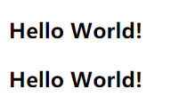

从渲染结果可以看到2条数据都被正常的渲染出来了，然后我们在开发者工具调试下：

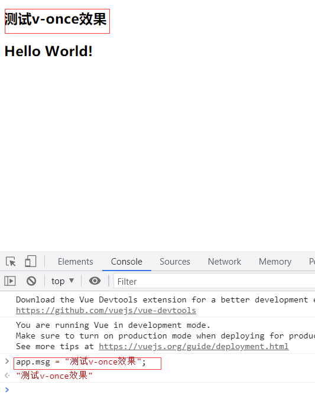

虽然我们在开发者工具修改了msg的属性值，但是只有第一个h3随着数据的改变而改变了值，第二个h3并没有出现我们想像中的结果，没有随着数据的改变而自动重新渲染。这正是因为v-once指令起到了作用。

**v-html**

v-html指定的元素，vue会将其作为当前元素的innerHTML。插入的内容，会按照普通的HTML进行插入，vue不会将其作为vue模板进行编译。

> 在网页中动态插入HTML是很危险的，可能会导致XSS攻击，所以只可以在非常信任的元素上使用v-html,否则不要使用。

> 另外在单文件的模板组件文件中，scoped的样式不会作用于v-html内部，因为v-html部分的HTML没有被vue的模板编译器进行处理。

```html
    <div id="app">
        <h3 v-html="url"></h3>
        <h3>
            <a :href="surl">CSDN</a>
        </h3>
    </div>

    <script>
        //创建Vue实例,得到 ViewModel
        let app = new Vue({
            el: '#app',
            data: {
                msg: "Hello Vue!",
                url: '<a href="https://www.baidu.com">百度一下</a>',
                surl: "https://www.csdn.net"
            },
            methods: {}
        });
    </script>
```

如demo所示，两个链接都可以正常的显示出来。

**v-text**

v-text,和v-html类似，只是功能是替换当前元素的innerText，其功能在一些场景上，和mustache语法(双大括号语法)功能相同，都可以将文本渲染到DOM上，但是实际编码中很少使用v-text,因为v-text不够灵活，它会覆盖当前元素的文本，有些场景是需要拼接，而不能直接覆盖。

```html
    <div id ="app"> 
        <h3>{{msg}},Vue！</h3>
        <h3 v-text="msg">,Vue!</h3>
    </div>

    <script>
     //创建Vue实例,得到 ViewModel
     let app = new Vue({
        el: '#app',
        data: {
            msg: "Hello"
        },
        methods: {}
     });
    </script>
```

demo中就展示出了实际的问题，第一个h3通过mustache语法实现了data数据和静态数据的拼接，完美的实现了Hello Vue！的数据展示，但是第一个h3就直接将已经存在的Vue！覆盖了，只显示了Hello。很明显，这不是我们想要的。所以v-text知道这个属性就可以了，很少使用。

**v-pre**

原样输出，vue会跳过被这个指令指定的元素和它的子元素的编译过程。

跳过大量没有指令的节点会加快编译速度。

```html
    <div id="app">
        <h2>{{msg}}</h2>
        <!--原样输出了，没有对{{}}进行编译-->
        <h2 v-pre>{{msg}}</h2>
    </div>

    <script>
        //创建Vue实例,得到 ViewModel
        let app = new Vue({
            el: '#app',
            data: {
                msg: "Hello Vue!"
            },
            methods: {}
        });
    </script>
```

**v-cloak**

指令保持在元素上直到元素被Vue关联上。

vue项目中，在vue的el关联元素没有被vue关联上时，vue中的data是不不会被绑定到DOM上的，那么在网页中显示的可能就是一些没有数据的标签，如{{msg}}、{{username}}等等，就是没有data中的数据，如果实例化vue的代码执行的时间很长，在页面DOM被浏览器解析了很久才执行到实例化vue，那么网页就是很长的一段时间都在显示一些vue的指令，对用户来说体感不够友好。v-cloak的作用就是给el关联的元素在vue代码执行之前添加v-cloak这么一个属性，在DOM和vue做了关联之后该属性消失，然后配合css一起使用[v-cloak]{dislay:none;}，指定在DOM在关联vue之前是display:none；不被显示的状态的，使用体感会好很多。

> 在实际项目场景中，该指令一般不会用到。

```html
    <div id="app">
        <h3>{{msg}}</h3>
    </div>
    <script>
        //创建Vue实例,得到 ViewModel
        setTimeout(function () {
            let app = new Vue({
                el: '#app',
                data: {
                    msg: "Hello Vue!"
                },
                methods: {}
            });
        }, 3000);
    </script>
```

如代码，正常情况下是这样的效果：

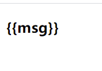

网页刚开始渲染的时候，直接显示出了vue数据模板，直到DOM和Vue做了关联之后。然后我们看给DOM添加上v-cloak指令后的效果：

```html
    <div id="app" v-cloak>
        <h3>{{msg}}</h3>
    </div>
    <!--style标签位置不一定要和DOM在一起-->
    <style>
        [v-cloak] {
            display: none;
        }
    </style>
    <script>
        //创建Vue实例,得到 ViewModel
        setTimeout(function () {
            let app = new Vue({
                el: '#app',
                data: {
                    msg: "Hello Vue!"
                },
                methods: {}
            });
        }, 3000);
    </script>
```


网页刚开始渲染的时候，DOM和Vue没有关联，页面显示的是空白，直到DOM和Vue做了关联后，才正常的显示了正常需要渲染的内容，体感好了很多。

### v-bind 动态属性绑定

在实际项目中，很多地方的属性我们是不能直接在代码中写成固定的，比如一个图片列表中的图片src属性，文字列表中的href属性。不光是图片列表还是文字列表，一般情况下都是循环遍历出来的内容，所以我们需要给图片的src和a的href设置成动态属性。

```html
    <div id ="app">
        <ul class="list">
            <li><a href="https://www.baidu.com">百度</a></li>
            <li><a href="https://wwww.qq.com">QQ</a></li>
            <li><a href="https://www.163.com">163</a></li>
        </ul>    
    </div>
```

比如这样的列表，这里我们展示了3条内容链接，但是在很多场景下，并不是只展示3条，而是数量都是不固定的，每个地方需要显示的条数都不同，即便在同一个模块，不同的条件展示的数量也会有所不同，所以我们就不能写成固定数量的链接。我们希望在Vue项目中能够实现这样的功能，vue给我们提供了v-bind指令，可以实现动态属性绑定。

```html
<ul class="list">
    <li v-for="item in list"><a v-bind:href="item.url">{{item.title}}</a></li>
</ul>
<script>
        //创建Vue实例,得到 ViewModel
        let app = new Vue({
            el: '#app',
            data: {
                list: [
                    {
                        title: "百度",
                        url: "https://www.baidu.com"
                    },
                    {
                        title: "163",
                        url: "https://www.163.com"
                    },
                    {
                        title: "QQ",
                        url: "https://www.qq.com"
                    },
                    {
                        title: "淘宝",
                        url: "https://www.taobao.com"
                    },
                    {
                        title: "搜狐",
                        url: "https://www.sohu.com"
                    }
                ]
            },
            methods: {}
        });
    </script>
```

实际的场景应该就是这样子的，有很多的链接，数量不固定，内容不知，服务端给客户端下发的内容，是在一定规则下的内容，客户端只要求服务端下发的内容是按照一定格式的即可。demo中，我们把ur通过v-bind指令给动态的绑定到了DOM元素上。

那么我们不给DOM的属性添加v-bind可以吗？肯定是不可以的，不添加v-bind指令，说明该属性就是一个普通的HTML属性，它是不会解析vue数据的，只有添加了v-bind指令后，vue在执行的过程中，就会解析该属性，属性值会被当作是一个变量从vue中去检索，然后赋值给该属性。另外，mustache语法也不可以赋值给v-bind指令指定的属性值。mustache语法是插入内容的，不是给属性赋值的。像<h2>{{msg}}</h2>这里的是内容，而<hr :title="msg">{{msg}}</h2>中的title是属性，且title被v-bind指令指定，它的值就是一个动态的值。

**v-bind动态绑定class**

专门介绍动态绑定class，并不是因为class和其他属性有什么特别的地方，而仅仅是因为class的使用频率较高。

v-bind:可以绑定任意类型的值，可以是字符串，也可以是对象。vue对class和style的解析，做了特别的增强，v-bind值除了可以是表达式、字符串外，也可以是对象、数组。

```html
    <div id="app">
        <h3 :class="{active:isActive,link:isLinked}">Hello Vue!</h3>
    </div>
```

demo中class属性的值就是一个对象，对象中属性的值是一个boolean类型值，当boolean类型值为true时，该class就生效，boolean类型值为false时，该class失效。

```html
    <div id="app">
        <h3 :class="{active:isActive,link:isLinked}">Hello Vue!</h3>
    </div>

    <script>
        //创建Vue实例,得到 ViewModel
        let app = new Vue({
            el: '#app',
            data: {
                isActive: true,
                isLinked: true
            },
            methods: {}
        });
    </script>

    <style>
        .active {
            font-size: 32px;
        }

        .link {
            color: #369;
        }
    </style>
```

我们可以添加按钮，来演示这个效果：

```html
    <div id="app">
        <h3 :class="{active:isActive,link:isLinked}">Hello Vue!</h3>
        <button @click="btnClick">active切换</button>
    </div>

    <script>
        //创建Vue实例,得到 ViewModel
        let app = new Vue({
            el: '#app',
            data: {
                isActive: true,
                isLinked: true
            },
            methods: {
                btnClick:function(){
                    this.isActive = !this.isActive; // 给isActive取反，就不用记录当前的状态了
                }
            }
        });
    </script>

    <style>
        .active {
            font-size: 32px;
        }

        .link {
            color: #369;
        }
    </style>
```

vue中，我们既可以给一个DOM元素添加一个普通的class属性，也可以通过v-bind动态绑定class类，实际项目上，这两种方式都是合法、有效的。一般情况下，当某个class是一定会有的，不会根据外部条件的变化而变化的部分，就可以直接给一个静态的普通的class，当有有些class可能会随着外部条件的变化而变化的，我们就通过v-bind来动态绑定class。静态固定的class和通过v-bind动态绑定的class是可以共存的，代码在解析的时候，是一个合并的操作，而不是覆盖。

vue中动态绑定class有两种方式，一种为对象语法，一种为数组语法。

对象语法，就是上面刚刚了解到的，数组语法，其实和对象语法基本相同，只是将{}改成了[].

数组语法，一般是用在class类名比较多的情况下，看demo：

```html
    <div id="app">
        <h2 v-bind:class='["active","line","vixited"]'>{{msg}}</h2>
    </div>
```

元素h2有多个class，这里将class放置到一个数组中管理。效果如下图：

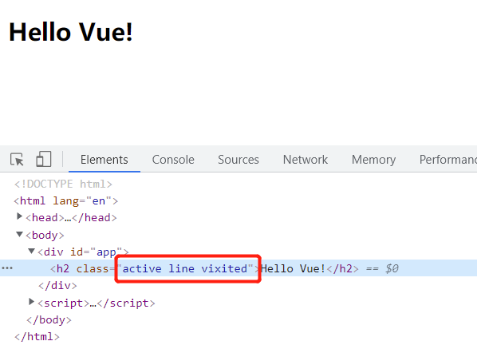

从新学一门技术上来讲，我们有了多种class的绑定形式，会有一定的新鲜感，但是一般不会用到。如果这些class是固定的话，我们可以直接这些class赋值给class属性就了，但是如果会根据外部场景切换class，我们可以将这些class封装到一个方法中，比现在直接在DOM中赋值要更加灵活些。

```html
    <div id="app">
        <h2 v-bind:class='["active","line","vixited"]'>{{msg}}</h2>
        <h2 v-bind:class="getClasses()">{{msg}}</h2>
    </div>

    <script>
        //创建Vue实例,得到 ViewModel
        let app = new Vue({
            el: '#app',
            data: {
                msg: "Hello Vue!",
                active: "active",
                line: "line",
                visited: "visited"
            },
            methods: {
                getClasses() {
                    return [this.active, this.line, this.visited];
                }
            }
        });
    </script>
```

两种class的绑定方式，效果是相同的：

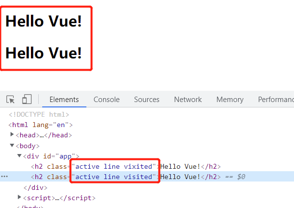

通过方法获取class列表的方式，对象语法也有同样的实现：

```html
    <div id="app">
        <h2 v-bind:class="{active:isActive,line: isLined,visited: isVisited}">{{msg}}</h2>
        <h2 v-bind:class="getClasses()">{{msg}}</h2>
        <button @click="btnClick">active切换</button>
    </div>

    <script>
        //创建Vue实例,得到 ViewModel
        let app = new Vue({
            el: '#app',
            data: {
                msg: "Hello Vue!",
                isActive: true,
                isLined: true,
                isVisited: true
            },
            methods: {
                btnClick: function () {
                    this.isActive = !this.isActive; // 给isActive取反，就不用记录当前的状态了
                    this.isVisited = !this.isVisited;
                },
                // 把class封装到方法中，通过方法来返回对象语法的class列表
                getClasses() {
                    return {
                        active: this.isActive,
                        line: this.isLined,
                        visited: this.isVisited
                    };
                }
            }
        });
    </script>
```

对象语法和数组语法的class绑定，基本是一致的，就是封装数据的时候注意下数据类型就可以了。

> 需要注意的是，动态绑定的class通过方法获取class列表的时候，方法名都加了小括号。但我们在其他的地方见到事件响应的方法的时候，方法名没有加小括号。那么什么时候方法名需要加小括号，什么时候不需要加？先留个悬念吧。

**动态绑定style**

v-bind可以动态绑定DOM属性，前面介绍了增强的class，除了增强了动态绑定class，也增强了style。增强的style和class基本相同，也同时支持对象语法和数组语法。和动态绑定class稍微不同的是，style的本身就是对象类型的，本身就是key:value形式的，不过这里的key，在css中有的是多个单词组成的，单词之间用-链接，在v-bind绑定的style的对象语法中，css属性中由多个单词拼接而成以-拼接的属性，可以使用驼峰形式，如fontSize，当然也可以像在普通的css中一样使用-链接。

```html
    <div id="app">
        <!--普通内联css-->
        <h2 style="font-size: 36px;">{{msg}}</h2>
        <!--动态绑定style的对象语法-->
        <h2 :style="{fontSize: '24px', color: 'red'}">{{msg}}</h2>
        <!--动态绑定style的数组语法-->
        <h2 :style="[color,fz]">{{msg}}</h2>
        <!--动态绑定style，通过方法获取对象语法-->
        <!--方法getStyleByObj的小括号后面不要有分号-->
        <h2 :style="getStyleByObj()">{{msg}}</h2>
        <!--动态绑定style，通过方法获取数组语法-->
        <h2 :style="getStyleByArray()">{{msg}}</h2>
    </div>

    <script>
        //创建Vue实例,得到 ViewModel
        let app = new Vue({
            el: '#app',
            data: {
                msg: "Hello Vue!",
                color: { color: "#369" },
                fz: { fontSize: "40px" }
            },
            methods: {
                getStyleByObj() {
                    return {
                        fontSize: "60px",
                        color: "#659"
                    };
                },
                getStyleByArray() {
                    return [this.color, this.fz];
                }
            }
        });
    </script>
```

**计算属性**

一般情况下，当需要使用的数据，需要经过一些计算、处理后的，或者是需要依赖其他的数据变化而变化的数据时，也就是说需要使用经过处理后的数据的返回值时，我们就可以使用计算属性。

计算属性，本质上是属性，但是形式上和方法相同，形式上就是一个函数。

因为计算属性本质上是一个属性，所以一般在给计算属性起名字时，不给名字加动词，而方法、函数名一边都会有一个动词；在mustache语法中使用时，也不需要给计算属性名加小括号，虽然它的表现是一个函数，但是在mustache语法中使用方法时就需要给方法名加上小括号。

```html
    <div id="app">
        <!--mustache语法除了可以变量插值，也可以使用方法，方法名需要加小括号-->
        <h2>{{getFullName()}}</h2>

        <!--计算属性：计算属性不需要加小括号-->
        <h2>{{fullName}}</h2>
    </div>

    <script>
        //创建Vue实例,得到 ViewModel
        let app = new Vue({
            el: '#app',
            data: {
                firstName: "Nicholas",
                lastName: "Zakas"
            },
            computed:{
                // 计算属性命名，不加动词，计算属性本质上还是属性，虽然表现上是一个函数
                fullName(){
                    // return this.firstName + " " + this.lastName;  // 这种方式也可以，也还只是变量的拼接方式不同
                    return `${this.firstName} ${this.lastName}`;
                }
            },
            methods: {
                getFullName(){
                    // return this.firstName+ " " +this.lastName; // 这种方式也可以，就是拼接变量
                    return `${this.firstName} ${this.lastName}`;
                }
            }
        });
    </script>
```

仅仅从上面demo来看，想了解下计算属性，已经有了大概的认识，但是计算属性的优势没有体现出来。实际场景中，可能使用计算属性就是一个非常优秀的实践，比如下面的demo，有很多书，我想显示这些书的总价。正常的思维应该是封装一个方法，让这个方法去给我计算这些书的总价。封装方法计算性价这个思路非常好。

但是我们刚刚了解到了计算属性，那么是不是使用计算属性比使用方法更优秀呢？这个得了解了计算属性和方法的区别后才能知道，但是现在可以说的是，计算属性，在依赖值没有变化的时候，那这个属性（也可以说是一个方法）无论被调用几次，它都只执行依次，但是方法就不同了，方法是调用一次就执行依次。计算属性有一个缓存的优势。

```html
    <div id="app">
        <h2>总价：{{totalPrice}}</h2>
        <h3>总价：{{allPrice}}</h3>
    </div>

    <script>
        //创建Vue实例,得到 ViewModel
        let app = new Vue({
            el: '#app',
            data: {
                books: [
                    {id: 1, name: "Javascript高级程序设计", price: 119},
                    {id: 2, name: "Es6标准入门",price: 89},
                    {id: 3,name: "Nodejs实战",price: 129},
                    {id: 4,name: "中国近代史纲要",price: 49}
                ]
            },
            computed: {
                // 两种计算总价的计算属性，只是使用了不同的js的基本功能
                // 这是最普通的一种遍历
                totalPrice() {
                    let result = 0;
                    for (let i = 0; i < this.books.length; i++) {
                        result += this.books[i].price;
                    }
                    return result;
                },

                // 这里使用了es6的reduce方法，数组变量，数据归并，
                allPrice() {
                    return this.books.reduce(function (prev, cur, index, arr) {
                        return prev + cur.price;
                    }, 0);
                }
            },
            methods: {}
        });
    </script>
```

**计算属性的setter和getter**

> 计算属性是有缓存的

为什么计算舒心是按照属性的方式使用，而不是按照函数的方式去使用呢？

计算属性，本质上是属性，所以就会有获取属性值和设置属性值的情况,计算属性内部有getter和getter机制实现属性的设置值和获取值。可参考下面的demo：

```html
    <div id="app">
        <h2>{{fullName}}</h2>
    </div>
    <script>
        //创建Vue实例,得到 ViewModel
        let app = new Vue({
            el: '#app',
            data: {
                firstName: "Nichoalas",
                lastName: "Zakas"
            },
            computed: {
                fullName: {
                    set(newValue) {
                        this.firstName = newValue.split(" ")[0];
                        this.lastName = newValue.split(" ")[1];
                    },
                    get() {
                        return this.firstName + " " + this.lastName;
                    }
                }
            },
            methods: {}
        });
    </script>
```

不过在一般的情况下，计算属性只需要获取值，很少有给计算属性赋值的情况，所以一般在实现getter和setter的时候，会省略setter，只留下getter。大多数场景会省略setter，但是不代表不能设置setter。

> 默认情况下，计算属性是没有实现setter方法的，也就是说，我们只能获取属性值，而不能给属性赋值。

```html
    <div id="app">
        <h2>{{fullName}}</h2>
    </div>
    <script>
        //创建Vue实例,得到 ViewModel
        let app = new Vue({
            el: '#app',
            data: {
                firstName: "Nichoalas",
                lastName: "Zakas"
            },
            computed: {
                fullName(){
                    return this.firstName + " " + this.lastName;
                }
            },
            methods: {}
        });
    </script>
```

如demo所示，计算属性fullName是默认方式，默认方式只实现了getter，无论是从开发者工具中调试，还是代码中给计算属性fullName赋值，都不行，无论何种方式都不能给计算属性赋值，因为默认形式下的计算属性，实际上是getter方法，缺省了setter方法，所以没有办法重新设置值。那么我们有没有办法修改这个属性的值呢？当然有了，显示的实现setter方法。

```html
    <div id="app">
        <h2>{{fullName}}</h2>
    </div>
    <script>
        //创建Vue实例,得到 ViewModel
        let app = new Vue({
            el: '#app',
            data: {
                firstName: "Nichoalas",
                lastName: "Zakas"
            },
            computed: {
                fullName: {
                    set(newValue) {
                        this.firstName = newValue.split(" ")[0];
                        this.lastName = newValue.split(" ")[1];
                    },
                    get() {
                        return this.firstName + " " + this.lastName;
                    }
                }
            },
            methods: {}
        });
    </script>
```

这样，我们就可以修改计算属性的值了。

**计算属性和methods对比**

基本上使用计算属性的地方，也都有使用methods实现，那么计算属性和methods有什么区别呢？看demo：

```html
    <div id="app">
        <!--我们分别执行计算属性和methods方法的获取全名的方法，执行计算属性就是注释掉methods部分，执行methods就注释掉计算属性部分，我们看到执行计算属性部分的时候，计算属性函数执行了1次，而methods执行了4次-->
        <!--计算属性-->
        <h2>{{fullName}}</h2>
        <h2>{{fullName}}</h2>
        <h2>{{fullName}}</h2>
        <h2>{{fullName}}</h2>
        <!--methods-->
        <h2>{{getFullName()}}</h2>
        <h2>{{getFullName()}}</h2>
        <h2>{{getFullName()}}</h2>
        <h2>{{getFullName()}}</h2>
    </div>

    <script>
        //创建Vue实例,得到 ViewModel
        let app = new Vue({
            el: '#app',
            data: {
                firstName: "Nicholas",
                lastName: "Zakas"
            },
            computed: {
                fullName() {
                    console.log();
                    console.log("计算属性：fullName");
                    return this.firstName + " " + this.lastName;
                }
            },
            methods: {
                getFullName() {
                    console.log("methods:getFullName()");
                    return this.firstName + " " + this.lastName;
                }
            }
        });
    </script>
```

从demo中，表面的现象是多次获取同样的值，计算属函数性执行了一次，methods执行了多次。说明了：计算属性的缓存能力，依赖值没有变化的时候，多获取同一个值只执行依次；而methods则会执行多次。

那么什么时候使用计算属性，什么时候使用methods呢？

在一些值需要经过处理后展示的时候，就可以使用计算属性，如需要显示一些商品的总价的时候，我们可以通过计算属性去计算；而需要相应监听事件的时候，我们就使用methods，如一个点击事件的处理函数、一个敲击回车键的响应事件等等，都可以使用methods。

**事件监听**

指令：v-on  绑定事件监听器  缩写：@   预期：function   参数：event

```html
    <div id="app">
        <h2>{{counter}}</h2>
        <!--正常的全拼写法-->
        <button v-on:click="increment">+</button>
        <button v-on:click="decrement">-</button>
        <hr>
        <!--语法糖写法-->
        <button @click="increment">+</button>
        <button @click="decrement">-</button>
    </div>

    <script>
        //创建Vue实例,得到 ViewModel
        let app = new Vue({
            el: '#app',
            data: {
                counter: 0
            },
            methods: {
                increment(){
                    this.counter++;
                },
                decrement(){
                    this.counter--;
                }
            }
        });
    </script>
```

**v-on参数**

1. 不需要参数的情况：

    - 在事件监听时，响应监听事件的方法后，可没有小括号，但是也可以有；
    - 但如果在mustache语法中做插值操作时，方法后的小括号不可省；

```html
    <div id ="app">
        <!--mustache中，方法小括号不可省-->
        <h2>{{initCounter()}}</h2>
        <!--响应监听事件的方法，没有参数的情况下，方法名后的小括号可以省略，也可以加上，效果相同-->
        <button @click="btn1Click()">button1</button>
        <button @click="btn1Click">button1-1</button>
    </div>

    <script>
     //创建Vue实例,得到 ViewModel
     let app = new Vue({
        el: '#app',
        data: {
            counter: 0
        },
        methods: {
            btn1Click(){
                console.log("按钮1被点击了");
            },
            initCounter(){
                let num = this.counter + 2;
                return num;
            }
        }
     });
    </script>
```

    - 在事件定义时，写方法时省略了小括号，但是方法本身是需要一个小括号的，这个时候，vue会默认将浏览器产生的event事件作为参数传递到方法中，这个时候再调用方法的时候，不加参数，就默认把event参数传递给方法了
      
      - 同样的场景，如果在方法调用时，给方法加上了小括号，那么传递给方法的就是一个undefined

```html
        <!--在事件定义时，写方法时省略了小括号，但是方法本身是需要一个小括号的，这个时候，vue会默认将浏览器产生的event事件作为参数传递到方法中，这个时候再调用方法的时候，不加参数，就默认把event参数传递给方法了-->
        <button @click="btn2Click">button2</button>

        <!--这个时候方法调用时加上了小括号，方法在执行时的参数就是undefined-->
        <button @click="btn2Click()">button2</button>
    </div>

    <script>
     //创建Vue实例,得到 ViewModel
     let app = new Vue({
        el: '#app',
        data: {
            counter: 0
        },
        methods: {
            btn1Click(){
                console.log("按钮1被点击了");
            },
            btn2Click(name){
                console.log(name); // name没有打印出来，PointerEvent {isTrusted: true, pointerId: 1, width: 1, height: 1, pressure: 0, …}  把当前的事件给打印了出来，说明在没有给命名方法传递参数的时候，vue就将浏览器的默认事件传递给了方法
            },
            initCounter(){
                let num = this.counter + 2;
                return num;
            }
        }
     });
    </script>
```

> 前端中，在响应事件监听的函数中，会默认传递给函数一个event

2. 方法定义时需要event（浏览器事件）参数，也需要一个其他的参数，那么在方法调用时怎么获取到浏览器的事件(event)呢？vue给我们提供了：$event,可以帮我们手动获取浏览器事件

```html
<!--方法定义时需要一个event参数，也需要一个其他的参数,这个时候可以通过$event手动获取浏览器事件-->
<button @click="btn3Click(abc,$event)">button3</button>
<script>
    //创建Vue实例,得到 ViewModel
    let app = new Vue({
        el: '#app',
        data: {
            counter: 0,
            abc: "Hello"
        },
        methods: {
            btn3Click(abc, event) { // 方法调用的地方，通过$event将事件传递给了方法
                console.log("+++++++", abc, event);
            }
        }
    });
</script>
```

**v-on修饰符**

* .stop 阻止事件继续传播，传播包括向上的冒泡和向下的捕获

```html
    <div id="app">
        <div @click="divClick">
            <!--不添加.stop修饰符，点击按钮的同时会触发div的点击事件，加上.stop修饰符，会阻止按钮的点击事件向上冒泡-->
            <button @click.stop="btnClick">button</button>
        </div>
    </div>

    <script>
        //创建Vue实例,得到 ViewModel
        let app = new Vue({
            el: '#app',
            data: {},
            methods: {
                divClick() {
                    console.log("Div被点击了");
                },
                btnClick() {
                    console.log("button被点击了");
                }
            }
        });
    </script>
```

在原生js中，阻止事件冒泡的方式需要调用js的stopPropagation()方法，可看demo：

```html
    <div class="box">
        <div class="btn-area" id="btnArea">我是button包裹元素
            <button id="btn">button</button>
        </div>
    </div>

    <script>
        let btnArea = document.getElementById("btnArea");
        let btn = document.getElementById("btn");
        btn.addEventListener("click", function (e) {
            console.log("按钮被点击");
            // 阻止调用相同事件的传播：传播包括向上的冒泡和向下的捕获
            e.stopPropagation();
        });
        btnArea.addEventListener("click", function () {
            console.log("div被点击");
        });
    </script>
```

* .prevent：阻止默认行为

一些DOM元素都是有默认行为的，如a元素点击后是会进行跳转的，form元素会默认向目标服务器提交数据等，但是在一些场景中，我们并不希望这些元素进行这些默认的行为，而是希望我们能够主动控制这些元素的行为，那么在vue项目中个，我们可以给这些元素的事件添加.prevent修饰符。

```html
<!--阻止默认事件:元素a，点击后默认是要跳转出去的，但是在点击事件中添加了.prevent修饰符后，就不会进行跳转动作了-->
<a href="https://www.baidu.com" target="_blank" @click.prevent="aClick">百度</a>
    <script>
//创建Vue实例,得到 ViewModel
let app = new Vue({
    el: '#app',
    data: {},
    methods: {
        aClick() {
            console.log("元素a被点击了");
        }
    }
});
</script>
```

原生js中阻止默认行为的方法,需要调用事件对象的preventDefault()方法，看demo：

```html
<a href="https://www.baidu.com" target="_blank" id="link">百度</a>
<script>
    let link = document.getElementById("link");
    link.addEventListener("click",function(event){
        console.log("元素a被点击了");
        event.preventDefault();
    });
</script>
```

* once:指定事件只执行一次

特殊的场景下，我们需要某个事件只能被执行依次，这个时候就可以使用.once修饰符。现在没有想到什么场景，就先把功能演示一下吧。

```html
<!--这个按钮只能执行一次点击事件-->
<button @click.once="btnClickOnce">.once修饰符</button>
    <script>
//创建Vue实例,得到 ViewModel
let app = new Vue({
    el: '#app',
    data: {},
    methods: {
        btnClickOnce(){
            console.log("这个按钮只能被执行一次点击事件");
        }
    }
});
</script>
```

* 按键修饰符：就是监听键盘上按键的事件，可以通过绑定按键码和按键别名来绑定按键，指定只有在绑定的按键在该事件才去执行响应函数。不过现在按键码（keyCode）已经废弃了，新版本的浏览器可能会不支持，我们只需要了解通过按键别名的方式就可以了。

```html
<!--默认情况下，所有按键的按键松开事件都会执行响应函数，加上了.enter修饰符后，只有在回车键松开的时候，才会执行响应函数-->
<input type="text" @keyup.enter="keyUp">
    <script>
//创建Vue实例,得到 ViewModel
let app = new Vue({
    el: '#app',
    data: {},
    methods: {
        keyUp(){
            console.log("keyUp事件执行了");
        }
    }
});
</script>
```

除了上面介绍的几个修饰符之外，还有其他的一些修饰符，可以参考下官方文档：[vue2中的事件修饰符https://cn.vuejs.org/v2/guide/events.html#%E4%BA%8B%E4%BB%B6%E4%BF%AE%E9%A5%B0%E7%AC%A6](https://cn.vuejs.org/v2/guide/events.html#%E4%BA%8B%E4%BB%B6%E4%BF%AE%E9%A5%B0%E7%AC%A6)、[vue3中的事件修饰符：https://vue3js.cn/docs/zh/guide/events.html#%E4%BA%8B%E4%BB%B6%E4%BF%AE%E9%A5%B0%E7%AC%A6](https://vue3js.cn/docs/zh/guide/events.html#%E4%BA%8B%E4%BB%B6%E4%BF%AE%E9%A5%B0%E7%AC%A6) 粗略的扫了一眼，没有发现什么差异。

### v-if

v-if，控制元素是否被渲染，和v-if配对使用的v-else-if、v-else，v-else-if用的场景很少，因为在DOM做条件判断，不如在js代码中做逻辑判断更顺畅。语法比较简单，直接看demo吧：

```html
<div id="app">
    <h2 v-if="score >= 90">优秀</h2>
    <h2 v-else-if="score >= 80">良好</h2>
    <h2 v-else-if="score >= 60">及格</h2>
    <h2 v-else>不及格</h2>
</div>

<script>
    //创建Vue实例,得到 ViewModel
    let app = new Vue({
        el: '#app',
        data: {
            score: 96
        },
        methods: {}
    });
</script>
```

demo中，我们使用了v-if、v-else-if、v-else，但是这并不是一种很好的实践，因为DOM中大量的逻辑判断，我们可以放在js中：

```html
<div id="app">
    <h2>{{results}}</h2>
</div>

<script>
    //创建Vue实例,得到 ViewModel
    let app = new Vue({
        el: '#app',
        data: {
            score: 46,
            result: "优秀"
        },
        computed: {
            results() {
                let score = this.score;
                let result = "优秀";
                if (score >= 90) {
                    result = "优秀";
                } else if (score >= 80) {
                    result = "良好";
                } else if (score >= 60) {
                    result = "及格";
                } else {
                    result = "不及格";
                }
                return result;
            }
        },
        methods: {}
    });
</script>
```

一个简单的逻辑切换的demo，切换用户的登录状态。现在需要登录的系统，一般都会优先使用手机号登录，或者再使用账号登录，我们看下简单的实现：

```html
<div id="app">
    <div class="login-mobile" v-if="isMobile">手机号登录</div>
    <div class="login-acc" v-else>账号登录</div>
    <button @click="changeLoginTYpe">{{loginType}}</button>
</div>

<script>
    //创建Vue实例,得到 ViewModel
    let app = new Vue({
        el: '#app',
        data: {
            loginType: "账号登录",
            isMobile: true
        },
        methods: {
            changeLoginTYpe() {
                this.isMobile = !this.isMobile;
                if (this.isMobile) {
                    this.loginType = "账号登录";
                } else {
                    this.loginType = "手机号登录";
                }
            }
        }
    });
</script>
```

vue中，如果有经过逻辑判断展示不同的DOM的时候，vue并不是直接切换不同逻辑需要展示的DOM，而是会先通过diff算法判断已经展示的DOM和即将要展示的DOM的区别，生成虚拟DOM，然后将即将要展示的DOM的和已经展示DOM的不同的地方，转换到已经展示的DOM上，然后再渲染到浏览器上。因为vue的这种操作原理，所以有的场景，比如前后两种逻辑都有输入框的时候，已经在前一个逻辑中输入了一些文字，在切换了逻辑后，那么这些已经输入的文字，会被原样的带到切换后的逻辑中的输入框中。

如登录方式的切换demo：

```html
    <div id="app">
        <!--手机号方式登录-->
        <div class="login-mobile" v-if="isMobile">
            <label for="mobile">手机号：</label>
            <input type="text" id="mobile" placeholder="请输入手机号">
        </div>
        <!--账号方式登录-->
        <div class="login-acc" v-else>
            <label for="acc">用户名：</label>
            <input type="text" id="acc" placeholder="请输入用户名">
        </div>
        <button @click="changeLoginType">切换为{{loginType}}</button>
    </div>

    <script>
        //创建Vue实例,得到 ViewModel
        let app = new Vue({
            el: '#app',
            data: {
                isMobile: true,
                loginType: "账号方式登录"
            },
            methods: {
                changeLoginType() {
                    this.isMobile = !this.isMobile;
                    if (this.isMobile) {
                        this.loginType = "账号方式登录";
                    } else {
                        this.loginType = "手机号登录";
                    }
                }
            }
        });
    </script>
```

效果如图：

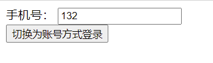

我们点了按钮后，效果如下：

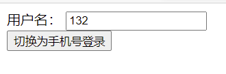

> 输入框输入的内容，在切换了登录方式后，原样带了过去，是因为vue的内部处理，有一个比较明显的表现：就是两种登录方式的DOM结构相同，只是内部的一些属性值不同。如果DOM结构不同了，vue的diff算法就不会认为它们相同了，值也就带不过去了。

虽然vue这样的处理，在性能上有了一定程度的提升，但是我们在实际的业务场景上，并不是我们想要的，我们并不想要它能够直接输入之前输入过的内容。那怎么办呢？

直接给输入框加一个属性key即可。

```html
    <div id="app">
        <!--手机号方式登录-->
        <div class="login-mobile" v-if="isMobile">
            <label for="mobile">手机号：</label>
            <input type="text" id="mobile" placeholder="请输入手机号" key="mobile">
        </div>
        <!--账号方式登录-->
        <div class="login-acc" v-else>
            <label for="acc">用户名：</label>
            <input type="text" id="acc" placeholder="请输入用户名" key="acc">
        </div>
        <button @click="changeLoginType">切换为{{loginType}}</button>
    </div>

    <script>
        //创建Vue实例,得到 ViewModel
        let app = new Vue({
            el: '#app',
            data: {
                isMobile: true,
                loginType: "账号方式登录"
            },
            methods: {
                changeLoginType() {
                    this.isMobile = !this.isMobile;
                    if (this.isMobile) {
                        this.loginType = "账号方式登录";
                    } else {
                        this.loginType = "手机号登录";
                    }
                }
            }
        });
    </script>
```

新的demo和原来的相比，只有在两个input空间中加了个key属性，就解决了我们当前的问题了。

**v-show**

v-show，控制元素是否显示，用法和v-if相同，属性值是一个Boolean值。

```html
    <div id ="app">
        <h2 v-show="isShow">{{msg}}</h2>
    </div>

    <script>
     //创建Vue实例,得到 ViewModel
     let app = new Vue({
        el: '#app',
        data: {
            msg: "Hello Vue!",
            isShow: true
        },
        methods: {}
     });
    </script>
```

**v-show和v-if的区别以及选用哪个**

1. v-if: 指定元素是否渲染，是否添加到DOM中；

2. v-show：指定元素是否展示，是否展示指的是元素已经被渲染到了DOM中，而已经渲染到DOM中的元素是否被看到；

3. v-show:指定的元素，本质上是通过css样式display：none/block来控制元素是否展示的，所以它控制的是样式；

```html
    <div id ="app">
        <!--当isShow被修改为false时，该元素直接没有被渲染到DOM中-->
        <h2 v-if="isShow" id="vif">{{msg}}</h2>
        <!--当isShow被修改为false时，该元素通过display：none；隐藏掉了-->
        <h2 v-show="isShow" id="vshow">{{msg}}</h2>
    </div>

    <script>
     //创建Vue实例,得到 ViewModel
     let app = new Vue({
        el: '#app',
        data: {
            msg: "Hello Vue!",
            isShow: true
        },
        methods: {}
     });
    </script>
```

效果可以在开发者工具中修改isShow来看效果。

那我们在项目中应该怎么选用v-if和v-show呢？

v-if:当一个模块中需要切换的频率很低，比如只有一次时，我们可以选择v-if。v-if指定元素是否被渲染，切换频率低，减少被渲染的元素可以减小页面的质量，减少初次渲染的代码量，一定程度上可以提升页面的加载性能；

v-show：当一个模块会被频繁的切换时，可以选择v-show。v-show指定的元素是是否被展示，它们已经被完全的渲染了出来，只是通过css样式的display属性来控制了是否展示。所以在选择v-show时，初次的渲染时可能会有一定的影响，但是后续不论多少次的模块切换，都不会重新加载，使用体验会更顺畅。

### v-for遍历属组和数组

v-for可以遍历数组和对象，语法比较简单。

**遍历数组**

格式：(item,index) 可以遍历到数组的项和当前数组项的索引.

遍历数组的时候，既可以遍历两个项，也可以遍历一个项:

遍历两个项的时候，则分别为数组项、当前数组项的索引;

当遍历一个项的时候，则为数组项

```html
    <div id="app">
        <ul>
            <!--如果遍历了两个值，则分别为数组项、当前项的索引-->
            <li v-for="(item,index) in fruits">{{index + 1}}-{{item}}</li>
        </ul>
        <ul>
            <!--如果只遍历了一个项，则为数组项-->
            <li v-for="item in fruits">{{item}}</li>
        </ul>
    </div>

    <script>
        //创建Vue实例,得到 ViewModel
        let app = new Vue({
            el: '#app',
            data: {
                fruits: ["Apple", "Pear", "Peach"]
            },
            methods: {}
        });
    </script>
```

**遍历对象**

v-for还可以遍历对象，有3重格式:

1. v-for="value in obj": 遍历的项为当前对象的各属性值

```html
    <div id="app">
        <!--只遍历一个值：则为当前对象的各属性值-->
        <ul>
            <!--遍历中使用了个item变量，名称可以自定义，这里实际表示的是当前对象的属性的value-->
            <li v-for="item in author">{{item}}</li>
        </ul>
    </div>

    <script>
        //创建Vue实例,得到 ViewModel
        let app = new Vue({
            el: '#app',
            data: {
                author: {
                    name: "Nicholas Zakas",
                    age: 26,
                    job: "Programmer"
                }
            },
            methods: {}
        });
    </script>
```

看效果：

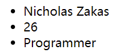

2. v-for="(value,key) in obj"：遍历的项分别为当前对象各属性值、各属性的key

```html
    <div id="app">
        <!--遍历2个值：则为当前对象的各属性值、各属性key-->
        <ul>
            <li v-for="(value,key) in author">{{key}}：{{value}}</li>
        </ul>
    </div>

    <script>
        //创建Vue实例,得到 ViewModel
        let app = new Vue({
            el: '#app',
            data: {
                author: {
                    name: "Nicholas Zakas",
                    age: 26,
                    job: "Programmer"
                }
            },
            methods: {}
        });
    </script>
```

看效果图：

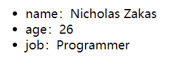

3. v-for="(value,key,index) in obj"：遍历的项分别为当前对象个属性的值、各属性的key、各属性的索引

```html
    <div id="app">
        <!--遍历对象3个值，分别为对象各属性值、个属性key、各属性索引-->
        <ul>
            <li v-for="(value,key,index) in author">{{index}}-{{key}}：{{value}}</li>
        </ul>
    </div>

    <script>
        //创建Vue实例,得到 ViewModel
        let app = new Vue({
            el: '#app',
            data: {
                author: {
                    name: "Nicholas Zakas",
                    age: 26,
                    job: "Programmer"
                }
            },
            methods: {}
        });
    </script>
```

效果图：

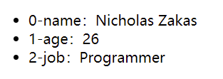

**v-for绑定和不绑定key的区别**

> 在v-for遍历中，key要保持唯一性，一般不要使用index，使用index对性能的帮助几乎没有，不能保证key的唯一；

**检查数组的更新**

vue中数据是响应式的，那么数组中的哪些方法是响应式的，哪些数组的方法做不到响应式呢？

1. 通过push方法修改数组可以做到响应式

```html
   <div id="app">
        <ul>
            <li v-for="(item,index) in letters">{{item}}</li>
        </ul>
        <button @click="btnClick">动态添加元素</button>
    </div>

    <script>
        //创建Vue实例,得到 ViewModel
        let app = new Vue({
            el: '#app',
            data: {
                letters: ["a", "b", "c", "d"]
            },
            methods: {
                btnClick(){
                    this.letters.push("ffff");
                }
            }
        });
    </script>
```

当我们点击按钮的时候，添加的元素可以直接响应式的渲染到页面上，可以直接看到效果。

2. 通过数组索引值修改数组是不能响应式的

```html
    <div id="app">
        <ul>
            <li v-for="(item,index) in letters">{{item}}</li>
        </ul>
        <button @click="btnClick">动态添加元素</button>
    </div>

    <script>
        //创建Vue实例,得到 ViewModel
        let app = new Vue({
            el: '#app',
            data: {
                letters: ["a", "b", "c", "d"]
            },
            methods: {
                btnClick(){
                    // 通过数组索引修改数组，不能直接响应式的渲染到页面上，但是数据确实是已经修改过了
                    this.letters[0] = "修改了数组第一个元素";
                }
            }
        });
    </script>
```

通过数组索引的方式修改了数组后，修改后的数据没有响应式的渲染到页面上，但是数据确实是已经被修改了

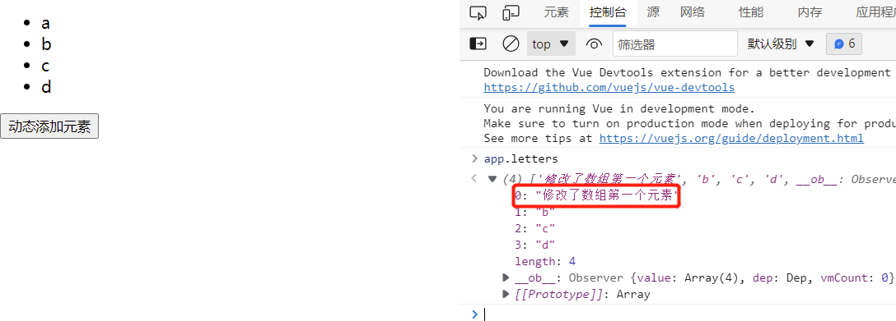

**那么我们还是想通过索引来修改数组，怎么办呢？**

有两种办法：

1. 使用splice方法

```javascript
this.letters.splice(0, 1, "qq"); // 通过元素替换的方式
```

> 虽然还有下面一种方法，但是推荐使用这种方法，因为还是更加直观的在修改数组。

2. 使用Vue.set()方法

```javascript
Vue.set(this.letters, 0, "vip");
```


**数组的下列方法，可以响应式的渲染到页面上：**

1. push：从数组尾部添加元素

2. pop：元素尾部移除，删除数组最后一个元素

```html
    <div id="app">
        <ul>
            <li v-for="(item,index) in letters">{{item}}</li>
        </ul>
        <button @click="btnClick">动态添加元素</button>
    </div>

    <script>
        //创建Vue实例,得到 ViewModel
        let app = new Vue({
            el: '#app',
            data: {
                letters: ["a", "b", "c", "d"]
            },
            methods: {
                btnClick(){
                    // pop 元素尾部移除
                    // this.letters.pop();
                }
            }
        });
    </script>
```

3. shift：元素头部移除，删除数组第一个元素

```html
    <div id="app">
        <ul>
            <li v-for="(item,index) in letters">{{item}}</li>
        </ul>
        <button @click="btnClick">动态添加元素</button>
    </div>

    <script>
        //创建Vue实例,得到 ViewModel
        let app = new Vue({
            el: '#app',
            data: {
                letters: ["a", "b", "c", "d"]
            },
            methods: {
                btnClick(){
                    // shift 元素头部移除
                    this.letters.shift();
                }
            }
        });
    </script>
```

4. unshift:在数组最前面添加元素

```html
   <div id="app">
        <ul>
            <li v-for="(item,index) in letters">{{item}}</li>
        </ul>
        <button @click="btnClick">动态添加元素</button>
    </div>

    <script>
        //创建Vue实例,得到 ViewModel
        let app = new Vue({
            el: '#app',
            data: {
                letters: ["a", "b", "c", "d"]
            },
            methods: {
                btnClick(){
                    // unshift 在数组头部添加元素
                    this.letters.unshift("kkk","lll","mmm"); // unshift可以头部添加多个元素，也可以添加1个元素
                }
            }
        });
    </script>
```

5. splice

这个方法，功能有点多，既可以插入元素、也可以删除元素，还可以替换元素。

splice(start,):

start：插入元素、删除元素、替换元素的起始位置

第2个参数：

- 要删除或者替换元素的个数，第2个元素为要删除元素的个数；如果第2个参数没有传，那么会从起始元素之后的元素全部删除；

如果只有1个参数，则参数表示起始位置，从起始位置之后的所有元素都要被删除；起始位置从索引0开始；

```html
    <div id="app">
        <ul>
            <li v-for="(item,index) in letters">{{item}}</li>
        </ul>
        <button @click="btnClick">动态添加元素</button>
    </div>

    <script>
        //创建Vue实例,得到 ViewModel
        let app = new Vue({
            el: '#app',
            data: {
                letters: ["a", "b", "c", "d", "e"]
            },
            methods: {
                btnClick() {
                    // 只有1个参数
                    this.letters.splice(2); // 留下a、b，之后的字母全部被删除

                }
            }
        });
    </script>
```

如果是有2个参数，在第一个参数是起始位置，第2个参数是要删除的元素的个数；

```html
   <div id="app">
        <ul>
            <li v-for="(item,index) in letters">{{item}}</li>
        </ul>
        <button @click="btnClick">动态添加元素</button>
    </div>

    <script>
        //创建Vue实例,得到 ViewModel
        let app = new Vue({
            el: '#app',
            data: {
                letters: ["a", "b", "c", "d", "e"]
            },
            methods: {
                btnClick() {
                    // 只有1个参数
                    this.letters.splice(1, 2); // 从b开始删除2个字母，最后结果为a、d、e

                }
            }
        });
    </script>
```

如果有2个以上的参数，则第一个参数为起始位置，第2个参数为要替换元素的数量，后面的参数为替换的元素(也可以理解为：第一个参数为起始位置，没有变化，第2个参数为要删除的元素的个数，后面的元素为要重新插入的元素)，无论是哪种描述和理解，最终的结果都是相同的，就是一些位置的元素成了新的元素，原来的元素没有了

```html
    <div id="app">
        <ul>
            <li v-for="(item,index) in letters">{{item}}</li>
        </ul>
        <button @click="btnClick">动态添加元素</button>
    </div>

    <script>
        //创建Vue实例,得到 ViewModel
        let app = new Vue({
            el: '#app',
            data: {
                letters: ["a", "b", "c", "d", "e"]
            },
            methods: {
                btnClick() {
                    // 只有1个参数
                    this.letters.splice(1, 2, "m", "n"); // "a", "m", "n", "d", "e"
                }
            }
        });
    </script>
```

只要splice的参数超过了3个，那么第1个参数，就是起始位置不会变，第2个参数是要变动的元素的个数，后面的元素无论多少，都会插入到从起始位置开始的地方，元素多了就多插入，元素少了就少插入

```html
   <div id="app">
        <ul>
            <li v-for="(item,index) in letters">{{item}}</li>
        </ul>
        <button @click="btnClick">动态添加元素</button>
    </div>

    <script>
        //创建Vue实例,得到 ViewModel
        let app = new Vue({
            el: '#app',
            data: {
                letters: ["a", "b", "c", "d", "e"]
            },
            methods: {
                btnClick() {
                    // 只有1个参数
                    this.letters.splice(1, 3, "m", "n", "k", "l"); // 'a', 'm', 'n', 'k', 'l', 'e'
                }
            }
        });
    </script>
```

6. sort

7. reverse

数组的这些方法，可以直接将修改后的数据渲染到页面上。


**数据遍历的一个小demo**

有一组数组，第一条数据永远展示为红色，其余数据点击的时候变为红色，点击后第一条数据也还是红色保持不变.

```html
<style>
    .active,
    .isFirst {
        color: #f20;
    }

    .fruits li {
        cursor: pointer;
    }
</style>
<div id="app">
    <ul class="fruits">
    <!--这里是用了动态class去绑定，去控制样式为红色的class是否绑定到元素上面-->
        <li v-for="(item,index) in fruits" :Key="item"
            :class="{active: currentIndex === index, isFirst: index === 0}" @click="liClick(index)">{{item}}</li>
    </ul>
</div>

<script>
    //创建Vue实例,得到 ViewModel
    let app = new Vue({
        el: '#app',
        data: {
            fruits: ["Apple", "Peach", "Pear", "Banana", "Potato"],
            currentIndex: 0
        },
        methods: {
            liClick(index) {
                this.currentIndex = index;
            }
        }
    });
</script>
```

**过滤器**

过滤器，也是个函数

> 过滤器，既然也是个函数，那么它和methods以及computed有什么区别呢？

### v-model

前面学过了mustache语法，将数据绑定到普通的DOM元素上的时候，我们通过v-bind指令，或者通过语法糖的形式，那么将数据和表单绑定的时候，可以通过专用指令v-model，v-model可以实现表单和数据的双向绑定。

> 数据和普通DOM元素绑定，用mustache语法；数据和表单绑定的时候，用v-model.

```html
    <div id="app">
        <input type="text" v-model="msg">
        <h2>{{msg}}</h2>
    </div>

    <script>
        //创建Vue实例,得到 ViewModel
        let app = new Vue({
            el: '#app',
            data: {
                msg: "Hello Vue!"
            },
            methods: {}
        });
    </script>
```

就这么简单的就实现了表单和数据的双向绑定。双向绑定，指的是表单数据的变化，会映射到data中数据的变化，同样，data中数据的变化也会在表单中体现出来。看demo：

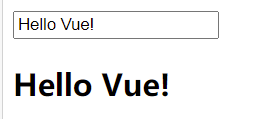

我们在表单输入框中输入文字的时候，下面对应的内容会跟着变化，说明表单中数据的变化已经响应到了data数据；我们在开发者工具中通过修改app.msg来修改值，修改后的值也直接在表单中体现了出来，说明表单通过v-model实现了和数据的双向绑定。

**那么表单是怎么通过v-model实现的双向绑定呢？**

表单通过v-model实现了表单和数据的双向绑定，其实是做了两件事情，我们也可以简单的认为v-model是做的这两件事的一个语法糖。

1. 首先通过v-bind质量将数据和表单的value属性进行绑定；

2. 通过监听表单（以输入控件input为例）的input事件，实现数据的变化。

通过上述两件事情，就实现了表单和数据的双向绑定。

```html
    <div id="app">
        <!--通过v-bind指令实现了数据和表单value属性的绑定，通过监听input控件的input输入事件，实现了input控件修改后的value和data的改变-->
        <!--通过v-bind和value属性的绑定、监听input控件的输入事件input实现了表单和数据的双向绑定-->
        <input type="text" :value="msg" @input="valueChange">
        <h3>换一种方式：@input="msg = $event.target.value"</h3>
        <input type="text" :value="msg" @input="msg = $event.target.value">
        <h2>{{msg}}</h2>
    </div>

    <script>
        //创建Vue实例,得到 ViewModel
        let app = new Vue({
            el: '#app',
            data: {
                msg: "Hello Vue!"
            },
            methods: {
                valueChange(event) {
                    this.msg = event.target.value;
                }
            }
        });
    </script>
```

v-model的双向绑定，除了可以应用到input，也同样适用textarea控件。

```html
    <div id="app">
        <textarea v-model="msg"></textarea>
        <textarea :value="msg" @input="valueChange"></textarea>
        <h2>{{msg}}</h2>
    </div>

    <script>
        //创建Vue实例,得到 ViewModel
        let app = new Vue({
            el: '#app',
            data: {
                msg: "Hello Vue!"
            },
            methods: {
                valueChange(event) {
                    this.msg = event.target.value;
                }
            }
        });
    </script>
```

**v-model和radio的配合使用**

v-model和radio配合使用的时候，同一组radio需要绑定同一个变量，这样就可以实现radio的单选效果。

如果我们期望有默认的选中值，如性别选择中期望默认选择“男”，我们就可以直接在数据中定义变量值为“男”就可以了。

另外就是在常规的HTML中，在同一个选项组中，需要使用name属性来标识，但是在vue中，如果使用了v-model绑定数据了，那么只需要这个选项组中绑定了同一个变量就可以了，那么属性可以省略。当然了，不缺省name属性也是完全可以的。

```html
    <div id="app">
        <ul>
            <li>
                <label for="male">
                    <input type="radio" name="gender" value="男" v-model="sex" id="male">男
                </label>
            </li>
            <li>
                <label for="female">
                    <input type="radio" name="gender" value="女" v-model="sex" id="female">女
                </label>
            </li>
        </ul>
        <h3>你选择了：{{sex}}</h3>
    </div>

    <script>
        //创建Vue实例,得到 ViewModel
        let app = new Vue({
            el: '#app',
            data: {
                sex: "男"
            },
            methods: {}
        });
    </script>
```

**v-model和checkbox的配合使用**

checkbox一般情况下，有两种使用场景，一种是单选的可反选形式，如是否同意隐私协议，然后才可以进行下一步之类的场景；另一种就是真正的多选了，如收集用户的爱好、多个可选条件中选择适合自己的选项等。

单选场景下，一般会通过v-model绑定一个Boolean值，来确认是否选中了；在多选的场景下，一般情况下会通过v-model绑定一个数组，来收集已经选择的项。

```html
    <div id="app">
        <!--单选复选，如是否同意协议、隐私协议之类的-->
        <div class="single">
            <label for="is-agree">
                <input type="checkbox" v-model="isAgree" id="is-agree">是否同意
            </label>
            <h2>你的选择：{{isAgree}}</h2>
            <button :disabled="!isAgree">下一步</button>
        </div>
        <!--多个项目选择-->
        <div class="multi">
            <h3>你有什么爱好？</h3>
            <div class="hobby">
                <input type="checkbox" value="足球" v-model="hobbies">足球
                <input type="checkbox" value="篮球" v-model="hobbies">篮球
                <input type="checkbox" value="羽毛球" v-model="hobbies">羽毛球
                <input type="checkbox" value="跳绳" v-model="hobbies">跳绳
                <input type="checkbox" value="看电影" v-model="hobbies">看电影
            </div>
            你选择的爱好：{{hobbies}}
        </div>
    </div>

    <script>
        //创建Vue实例,得到 ViewModel
        let app = new Vue({
            el: '#app',
            data: {
                isAgree: false,
                hobbies: []
            },
            methods: {}
        });
    </script>
```

**v-model之select**

select和checkbox基本相同，也有单选和复选的使用场景。

> vue中，select的默认选项，是通过数据来控制，通过v-model绑定的变量的默认值，就是select控件的默认值，而不是通过select控件的selected属性控制默认选项。

```html
    <div id="app">
        <!--单选场景-->
        <div class="single">
            <select v-model="city">
                <option value="全部">全部</option>
                <option value="河北">河北</option>
                <option value="山东">山东</option>
                <option value="北京">北京</option>
            </select>
            <h3>你选择的城市是：{{city}}</h3>
        </div>
        <!--多选场景-->
        <div class="multi">
            <select v-model="cities" multiple>
                <option value="全部">全部</option>
                <option value="河北">河北</option>
                <option value="山东">山东</option>
                <option value="北京">北京</option>
            </select>
            <h3>你选择了:{{cities}}</h3>
        </div>
    </div>

    <script>
        //创建Vue实例,得到 ViewModel
        let app = new Vue({
            el: '#app',
            data: {
                city: "全部", // 单选场景下，使用字符串，本demo中给了一个默认值，在vue中，给select一个默认值，是在数据中给定默认值，而不是通过select控件的selected属性
                cities: ["北京"] // 给一个默认的选项
            },
            methods: {}
        });
    </script>
```

**v-model之值绑定**

vue中有这么一个概念叫值绑定，看文档看的云里雾里，没有看的很明白，这里将我的一些理解，以案例的形式简单描述一下。

比如我们经常会见到图中的场景，就是选择城市区域。

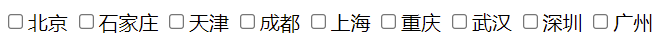

在做这样的技术实现的时候，如果我们不做好技术实现方案，可能就直接把这样的几个城市直接写死到代码中了，像这样：

```html
        <label for="北京">
            <input type="checkbox" id="北京" value="北京" v-model="cities">北京
        </label>
        <label for="石家庄">
            <input type="checkbox" id="石家庄" value="石家庄" v-model="cities">石家庄
        </label>
        <label for="天津">
            <input type="checkbox" id="天津" value="天津" v-model="cities">天津
        </label>
        <label for="成都">
            <input type="checkbox" id="成都" value="成都" v-model="cities">成都
        </label>
        <h4>你选择了的城市有：{{cities}}</h4>
    </div>

    <script>
        //创建Vue实例,得到 ViewModel
        let app = new Vue({
            el: '#app',
            data: {
                cities: []
            },
            methods: {}
        });
    </script>
```

这里先不要纠结id属性的合理性。然后绑定下v-model,我们就实现了选中城市数据的绑定，能获取到页面中选中的城市数据。效果看起来很完美。

但是很多时候，这些城市数据并不是固定的，而是这些城市数据都是从后台系统中配置的，我后台系统中配置了新的城市，新的城市就需要展示出来，已经展示的城市不需要了，就不需要在页面中展示了。那我们不能说每次有城市数据变化的时候，都要提新需求，来次代码开发上线流程吧。明显的不合理。我们更加期望的是城市从后台数据，在后台控制城市数据的展示与否。那么上面的实现方式就不那么灵活了。

我们直接看实现方式吧：

```html
    <div id="app">
        <!--v-model值绑定-->
        <div>
            <label :for="item" v-for="item in originCities">
                <input type="checkbox" :id="item" :value="item" v-model="cities">{{item}}
            </label>
            <h4>你选择了:{{cities}}</h4>
        </div>
    </div>

    <script>
        //创建Vue实例,得到 ViewModel
        let app = new Vue({
            el: '#app',
            data: {
                originCities: ["北京", "石家庄", "天津", "成都", "上海", "重庆", "武汉", "深圳", "广州"],
                cities: []
            },
            methods: {}
        });
    </script>
```

现在的实现方案，已经满足了业务方的需求。

我们通过一个变量保存原始城市数据（当然了，是从服务端获取的），然后以此为依据遍历出来所有的城市数据。然后再通过v-model绑定选中的城市，实现了选中的值和DOM元素的绑定。

可能我的这种理解不科学，但是理解起来更容易一些。

**v-model修饰符**

.lazy

默认情况下，通过v-model绑定的表单，和数据双向绑定，是时时响应的，好处是只要一方有了数据的变化，我在另一个端就能即刻发现数据的变动，但是也有一个不好的地方，就是有的场景下，我并不希望这种变化是时时的，而是希望能够在表单输入完成的时候，再发生一次表单和数据的绑定、交互。这个时候，只要给v-model添加一个修饰符.lazy就可以了。

```html
    <div id ="app">
        <input type="text" v-model.lazy="msg">
        <h2>{{msg}}</h2>    
    </div>

    <script>
     //创建Vue实例,得到 ViewModel
     let app = new Vue({
        el: '#app',
        data: {
            msg: "Hello Vue!"
        },
        methods: {}
     });
    </script>
```

v-model添加了.lazy修饰符后，只有在失去焦点或者敲击回车时才会发生数据的交互。

.number

在一些表单输入中，我们希望输入数字类型。我们知道，如果期望输入的值是number类型，那么将input的type属性设置成number就可以了。但是在vue中绑定了v-model属性后，就有问题了。v-model绑定的变量，默认都都是string类型，如果我们希望v-model绑定的变量是number类型的，那么给v-model添加.number修饰符就可以了。

```html
    <div id ="app">
        <input type="number" v-model="age">
        <h2>你的年龄：{{age}} - {{typeof age}}</h2>
    </div>

    <script>
     //创建Vue实例,得到 ViewModel
     let app = new Vue({
        el: '#app',
        data: {
            age: 12
        },
        methods: {}
     });
    </script>
```

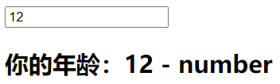

看demo，默认情况下，我们可以看到age字段是number类型，应该是没问题的，但是只要我们在输入框重新输入一个数字，那么这个修改后的数字，就变成了string类型了。这也印证了我们上面的结论，v-model绑定的变量，默认都是string类型。那么接下来就需要解决问题了，就是希望默认展示的是number类型的，修改后的数字，也是number类型的，只需要给v-model添加.number修饰符即可。

```html
    <div id ="app">
        <input type="number" v-model.number="age">
        <h2>你的年龄：{{age}} - {{typeof age}}</h2>
    </div>

    <script>
     //创建Vue实例,得到 ViewModel
     let app = new Vue({
        el: '#app',
        data: {
            age: 12
        },
        methods: {}
     });
    </script>
```

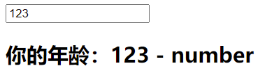

.trim

在input输入框输入内容的时候，有些时候可能由于输入的疏忽，或者操作失误，或者设备的原因，可能会在开始输入或者结束输入的时候，会多出来一些空格，如下案例：

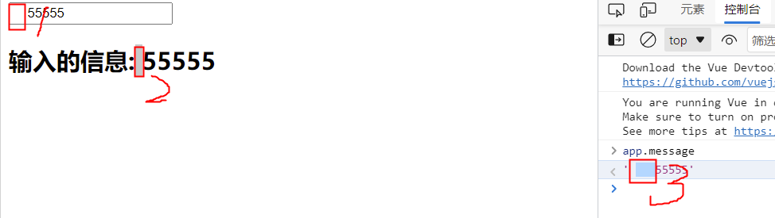

在输入的时候，多输出了一些空格，虽然在浏览器中展示的时候，只展示了一个空格的位置（如图中2的位置，浏览器在展示字符串的时候，默认给移除掉了开始和结尾的空格，当有多个空格的时候，只保留一个展示），但是实际上是多个空格存在的（如图中3的位置）。一些场景中，我们并不希望这些空格存在，而不仅仅是展示了一个就可以了。只需要给v-model添加.trim修饰符就可以了。

```html
    <div id="app">
        <!--trim-->
        <input type="text" v-model.trim="message">
        <h2>输入的信息:{{message}}</h2>
    </div>

    <script>
        //创建Vue实例,得到 ViewModel
        let app = new Vue({
            el: '#app',
            data: {
                msg: "Hello Vue!",
                age: 12,
                message: ""
            },
            methods: {}
        });
    </script>
```

添加了.trim修饰符后，输入框在开始和结束输入的空格，在输入框失去焦点后，都会自动消失，数据也不会保存这些开始和结束位置的空格。

### 组件化

vue中的组件，大致上可以分为3个步骤：

1. 创建组件的构造器对象：通过调用Vue.extend()方法

```javascript
    // 1. 创建组件的构造器对象
    const cpnConstructor = Vue.extend({
        template: `
        <div>
            <h2>标题标题标题</h2>
            <p>内容内容内容内容</p>
        </div>
    `
    });
```

2. 注册组件：通过调用Vue.component()方法

```javascript
    // 2. 注册组件
    Vue.component("MyComponent", cpnConstructor);
```

3. 使用组件

第2步骤确定的标签名，就像普通的HTML标记一样使用就可以了。

* 如果定义的标签名是多个单词组成，单词之间以-分隔，则标签使用时可以直接使用；也可以每个单词开始字母大写，单词之间以-分隔的形式使用；
  
```javascript
// 该组件名，可以<my-component></my-component>、<My-Component></My-Component>两种方式使用
Vue.component("my-component", cpnConstructor);
```

* 如果定义的标签名由多个单词组成，单词之间没有分隔线：
  * 如果单词都是小写字母
    * 则使用时可以直接使用；
    * 也可以大驼峰的形式使用
  
  ```javascript
    // 组件名多个单词、全部小写拼接而成，则可以<MyComponent></MyComponent>、<mycomponent></mycomponent>方式使用
    Vue.component("mycomponent", cpnConstructor);
  ```

  * 如果自定义的标签名的多个单词就是以大驼峰的形式命名的，那么在使用时就需要以分割线-分隔的形式使用；

```html
    <div id="app">
        <my-component></my-component>
    </div>

    <script>
        // 1. 创建组件的构造器对象
        const cpnConstructor = Vue.extend({
            template: `
            <div>
                <h2>标题标题标题</h2>
                <p>内容内容内容内容</p>
            </div>
        `
        });

        // 2. 注册组件
        // 注册组件的组件名：MyComponent，大驼峰形式，使用形式只能是：<my-component></my-component>
        Vue.component("MyComponent", cpnConstructor);
        //创建Vue实例,得到 ViewModel
        let app = new Vue({
            el: '#app',
            data: {},
            methods: {}
        });
    </script>
```
    * 组件名，当有多个单词组成时，不允许大驼峰+分割线的形式命名

```javascript
// 这种命名方式是不允许的，
Vue.component("My-Component", cpnConstructor);
```

### 全局组件和局部组件

全局组件，指可以在多个Vue实例下使用的组件；

局部组件，指只可以在当前实例下使用的组件；

> 一般情况下，一个应用只会有一个Vue实例，不会有多个。

**怎么注册全局组件？**

前面我们已经注意到了，Vue中的组件使用大概可以分为3个步骤：

1. 创建组件构造器，通过Vue.extend()方法

2. 注册组件，通过Vue.component()方法

3. 使用组件，主要是注意下不同的命名方式。

这里我们看第2步，注册组件，一般铜鼓Vue.component()方法注册的组件，就都是全局组件，全局组件，是可以在多个Vue实例中去使用的

```html
    <div id="app">
        <my-component></my-component>
    </div>

    <!--my-component组件在新的Vue实例中使用-->
    <div id="app2">
        <my-component></my-component>
    </div>
    <script>
        // 1. 创建vue组件构造器
        const myCpnConstructor = Vue.extend({
            template: `
                <div class="box">
                    <h2>模块标题</h2>
                    <p>模块内容</p>
                </div>
            `
        });
        // 2. 注册组件
        // 这种方式注册的组件，都是全局组件，它可以在多个Vue实例下使用，再实例化一个app2的实例，可以看下效果
        const myCpn = Vue.component("my-component", myCpnConstructor);
        //创建Vue实例,得到 ViewModel
        let app = new Vue({
            el: '#app',
            data: {},
            methods: {}
        });

        // 一个新的Vue实例，全局组件my-component也可以在新的Vue实例中使用
        let app2 = new Vue({
            el: "#app2"
        });
    </script>
```

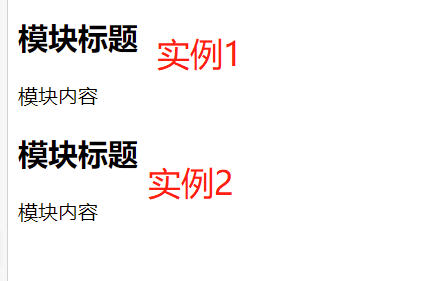

**怎么注册局部组件？**

我们已经知道了直接通过Vue.component()方法注册的组件为全局组件，可以在多个Vue实例中去使用，但有时候我并不想注册全局组件，我只想注册的一些组件只能在指定的Vue实例下去使用。

只需要在指定的Vue实例下注册组件就可以了，可以通过components参数指定。

```html
    <div id="app">
        <my-component></my-component>
        <!--组件newsCpn是实例app的局部组件，只能在该实例下使用-->
        <news-cpn></news-cpn>
    </div>

    <!--my-component组件在新的Vue实例中使用-->
    <div id="app2">
        <my-component></my-component>
        <!--组件newsCpn是实例app的局部组件，在实例app2中是没法正常使用的-->
        <news-cpn></news-cpn>
    </div>
    <script>
        // 1. 创建vue组件构造器
        const myCpnConstructor = Vue.extend({
            template: `
                <div class="box">
                    <h2>模块标题</h2>
                    <p>模块内容</p>
                </div>
            `
        });
        // 2. 注册组件
        // 这种方式注册的组件，都是全局组件，它可以在多个Vue实例下使用，再实例化一个app2的实例，可以看下效果
        const myCpn = Vue.component("my-component", myCpnConstructor);

        // 创建一个局部组件构造器
        // 无论是全局组件还是局部组件，只是注册组件的位置发生了变化，但是组件的使用步骤没有改变，该创建组件构造器的还是要创建
        const localConstructor = Vue.extend({
            template: `
                <div class="box">
                    <h2>局部组件标题</h2>
                    <p>局部组件内容局部组件内容</p>
               </div>
            `
        });
        //创建Vue实例,得到 ViewModel
        let app = new Vue({
            el: '#app',
            data: {},
            methods: {},
            components: {
                // 在当前实例app下注册了局部组件newsCpn，该组件只能在实例app下使用，其他vue实例下不可用
                newsCpn: localConstructor
            }
        });

        // 一个新的Vue实例，全局组件my-component也可以在新的Vue实例中使用
        let app2 = new Vue({
            el: "#app2"
        });
    </script>
```

**父组件和子组件**

在项目中，组件拆分的颗粒化程度不同，有的一些场景，一个组件可能会包含其他的一些组件，如组件A中可能会包含使用了组件B，那么我们就称A为父组件，组件B为子组件，组件A和组件B互为父子组件。

```html
    <div id="app">
        <!--页面中只使用了组件cpnC2，但结果是两个组件的内容都被正常的渲染了出来-->
        <cpn-c2></cpn-c2>
    </div>

    <script>
        const cpnC1 = Vue.extend({
            template: `
                <div class="box">
                    <h2>组件1标题</h2>
                    <p>组件1内容组件1内容</p>
                </div>
            `
        });
        const cpnC2 = Vue.extend({
            template: `
                <div class="box">
                    <h2>组件2标题</h2>
                    <p>组件2内容组件2内容</p>
                    <cpn-c1></cpn-c1>
                </div>
            `,
            // 一个组建中又注册了另外一个组件
            // 当前组件cpnC2为父组件，注册的新组建cpnC1为子组件，组件cpnC2和组件cpnC1互为父子组件
            components: {
                cpnC1: cpnC1
            }
        });
        //创建Vue实例,得到 ViewModel
        let app = new Vue({
            el: '#app',
            data: {},
            methods: {},
            components: {
                cpnC2: cpnC2
            }
        });
    </script>
```

### 注册组件的语法糖

前面我们学到了，在VUE中使用组件，有3个步骤：

1. 通过Vue.extend()方法创建组件的构造器；

2. 通过Vue.component()方法来注册组件；

3. 使用组价，使用组件的过程中需要注意一些注册的组件名和组件使用时的命名方式。

虽然现在的3个步骤，很清晰明了，对于开始学习Vue的时候来说，学习起来容易，但是在实际使用中，总会感觉有些繁琐，于是实践中会把第1步和第2步合并为一步，Vue也给我们提供了这样的能力，Vue.component()第2个参数传入一个构造器，或者传入一个对象，传入对象参数时会自动调用Vue.extend()参数。

```html
    <div id ="app">
        <my-cpn></my-cpn>
        <my-cpn2></my-cpn2>
    </div>

    <script>
        // 第2个参数，传入了一个选项对象，会自动调用Vue.extend()方法，也称为组件的语法糖
        // 语法糖形式，注册的全局组件
        Vue.component("my-cpn",{
            template:`
                <div class="box">
                    <h2>语法糖的标题</h2>
                    <p>组件语法糖的内容</p>
                </div>
            `
        });
     //创建Vue实例,得到 ViewModel
     let app = new Vue({
        el: '#app',
        data: {},
        methods: {},
        components:{
            // 语法糖格式注册了局部组件
            "my-cpn2":{
                template:`
                    <div class="box">
                        <h2>语法糖注册局部组件标题</h2>
                        <p>语法糖注册局部组件内容</p>    
                    </div>
                `
            }
        }
     });
    </script>
```

**组件模板抽离**

前面我们已经熟悉了Vue中模板的使用方法，可以分为3个步骤，分别通过Vue.extend()创建组件构造器、Vue.component()注册组件，最后使用；之后我们也了解到了3个步骤可以合并为2个步骤，就是创建组件构造器这个步骤可以省略掉，而直接给Vue.component()方法传递选项参数，当然了，底层的实现还是调用了Vue.extend()方法。无论这两种方法，都有一个共性，就是组件的DOM结构都写到了js代码中，感觉代码乱乱的，而且在Js代码中写HTML结构代码，没有提示（我现在没有发现，不知道是不是我没有找到合适的插件）：

```html
    <div id="app">
        <my-cpn></my-cpn>
    </div>

    <script>
        // 创建组件的构造器
        // 组件构造器中，是js代码中掺杂了HTML结构代码，输入时没有智能提示，还有点乱，如果能将HTML结构代码分离出去，写代码就友好了
        let cpnC = Vue.extend({
            template: `
                <div class="box">
                    <h2>组件标题</h2>
                    <p>组件内容</p>
                </div>
            `
        });

        // 注册全局组件
        Vue.component("my-cpn", cpnC);
        //创建Vue实例,得到 ViewModel
        let app = new Vue({
            el: '#app',
            data: {},
            methods: {}
        });
    </script>
```

那我们是否可以把HTML结构代码从js代码中给分离出来呢？当然是有的，常用的有两种方式吧：

1. 通过script标签，设置script标签的type为text/x-template，以及设置id属性，在Vue.component()注册组件的时候，通过给template属性赋值前面script标签的ID即可

2. 通过template标签，设置id属性，也是在Vue.component()注册组件的时候，通过template属性关联template标签id

```html
    <div id="app">
        <my-cpn></my-cpn>
        <box></box>
        <news></news>
    </div>

    <!--第一种分离出Vue组件的方式：通过script标记，设置type="text/x-template",并设置id属性，和组件注册时的template属性关联-->
    <script type="text/x-template" id="box">
        <div class="box">
            <h2>组件分离第一种方式标题</h2>
            <p>组件分离第一种方式内容</p>
        </div>
    </script>

    <!--通过template标记声明组件，设置id属性-->
    <template id="news">
        <ul class="list">
            <li>我是一个抽离出来的组件-新闻列表</li>
            <li>我是一个抽离出来的组件-新闻列表</li>
            <li>我是一个抽离出来的组件-新闻列表</li>
        </ul>
    </template>
    <script>
        // 创建组件的构造器
        // 组件构造器中，是js代码中掺杂了HTML结构代码，输入时没有智能提示，还有点乱，如果能将HTML结构代码分离出去，写代码就友好了
        let cpnC = Vue.extend({
            template: `
                <div class="box">
                    <h2>组件标题</h2>
                    <p>组件内容</p>
                </div>
            `
        });

        // 注册全局组件
        Vue.component("my-cpn", cpnC);

        // 通过script标记分离组件方式注册组件
        Vue.component("box", {
            template: "#box"
        });

        // 通过template组件分离方式注册组件
        Vue.component("news", {
            template: "#news"
        });
        //创建Vue实例,得到 ViewModel
        let app = new Vue({
            el: '#app',
            data: {},
            methods: {}
        });
    </script>
```

> 一般项目中，不会使用这种方式进行组件的开发，但是了解这些方式，对于Vue的学习、组件的使用是有很大帮助的。

**组件里怎么动态显示数据**

经过对组件的学习，已经体会到了组件给我们的带来的便利，但是现在还有一个小问题，就是前面我们学习组件，组件中的内容都是写的固定的，那么组件能不能能动态绑定数据呢？

我们尝试下给组件访问下Vue实例中的数据

```html
    <div id="app">
        <my-cpn></my-cpn>
    </div>

    <template id="box">
        <div class="box">
            <!--通过mustache语法将顶层Vue实例中的数据title绑定到了组件中-->
            <h2>{{title}}</h2>
            <p>我是组件内容</p>
        </div>
    </template>

    <script>
        Vue.component("my-cpn", {
            template: "#box"
        });
        //创建Vue实例,得到 ViewModel
        let app = new Vue({
            el: '#app',
            data: {
                // 在Vue实例中声明了一个变量，将其绑定到组件中
                title: "我是组件标题"
            },
            methods: {}
        });
    </script>
```

运行代码，发现不行，报错了：

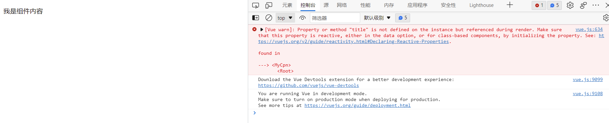

案例给我们证实了一点，就是组件不能访问顶层Vue实例中的数据的。

> 即便在技术上可以实现组件访问顶层Vue实例中的数据，也不建议这么做。一个项目中，组件的数量很多，我们不能将组件中应用到的数据都放到顶层的Vue中，因为这样就会增大顶层的Vue实例的质量，不利于代码的性能。

组件中有没有可以存储数据的地方呢？

组件中是有可以存放数据的地方，其存放的数据可以供本组件使用。

在组件声明或者创建组件构造器的时候，有一个data参数，可以用来存放当前组件的数据。只不过data属性是一个函数类型，而不是一个普通对象，该函数再返回一个对象。

```html
    <div id="app">
        <my-cpn></my-cpn>
    </div>

    <template id="box">
        <div class="box">
            <!--通过mustache语法将当前组件中存放的数据title绑定到了组件中-->
            <h2>{{title}}</h2>
            <p>{{content}}</p>
        </div>
    </template>

    <script>
        Vue.component("my-cpn", {
            template: "#box",
            data() {
                return {
                    title: "我是分离出来的组件的标题",
                    content: "我说分离出来的组件的内容"
                }
            }
        });
        //创建Vue实例,得到 ViewModel
        let app = new Vue({
            el: '#app',
            data: {},
            methods: {}
        });
    </script>
```

当前组件中存放的数据，被完美的展示了出来。

前面学习到了可以通过script、template标记将组件中的HTML结构分离出来，我们要注意，不能够在这两个组件中声明存放数据的data参数，这两个标记，仅仅是将HTML结构分离出来，不做数据的处理。

```html
    <div id="app">
        <my-cpn></my-cpn>
        <!--在模板中定义存放数据的data后的组件渲染-->
        <news></news>
    </div>

    <template id="box">
        <div class="box">
            <!--通过mustache语法将当前组件中存放的数据title绑定到了组件中-->
            <h2>{{title}}</h2>
            <p>{{content}}</p>
        </div>
    </template>

    <script type="text/x-template" id="news">
        <ul>
            <li>{{title}}</li>
        </ul>
        <!--在模板中，是不能定义data参数存放数据的，即便定义的data是一个函数类型-->
        data() {
            return {
                title: "我是新闻标题"
            }
        },
    </script>

    <script>
        Vue.component("my-cpn", {
            template: "#box",
            data() {
                return {
                    title: "我是分离出来的组件的标题",
                    content: "我说分离出来的组件的内容"
                }
            }
        });
        Vue.component("news", {
            template: "#news"
        });
        //创建Vue实例,得到 ViewModel
        let app = new Vue({
            el: '#app',
            data: {},
            methods: {}
        });
    </script>
```

如案例所示，我们在template组件中定义data参数，报错了:

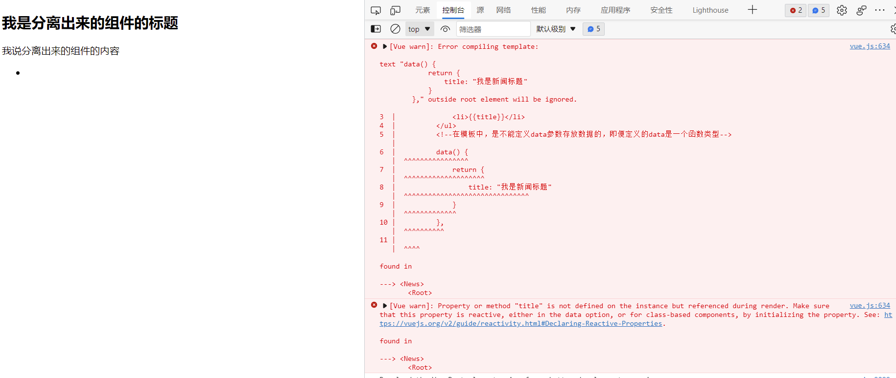

组件，其实就和Vue实例很相似，Vue实例也可以看成是一个组件。

组件，可以有：

1. 自己的data属性；

2. methods属性；

3. computed属性；

4. 声明周期；

……

凡是Vue实例拥有的属性，组件都可以拥有，但是需要记住不能在script、template类似仅仅是分离组件的地方使用，而是需要在组件渲染的地方使用。按照当前我们已经掌握的知识点，可以在创建组件构造器的时候、组件注册的时候使用:

> 组件对象的原型指向Vue

```javascript
    // 创建组件构造器是声明多种组件选项
    let cpnC = Vue.extend({
        template: ``,
        data() {
            return {

            }
        },
        computed: {},
        methods: {}
    });

    // 组件注册时声明多种组件选项
    Vue.component("my-cpn", {
        template: ``,
        data() {
            return {}
        },
        methods: {}
    });
    //创建Vue实例,得到 ViewModel
    let app = new Vue({
        el: '#app',
        data: {},
        methods: {}
    });
```

### 为什么data必须要是一个函数？

组件的数据、方法、属性，都放到组件自己的域内。组件之间要相互隔离，不能相互渗透。

```html
    <div id="app">
        <counter></counter>
        <counter></counter>
        <counter></counter>
    </div>

    <template id="counter">
        <div class="counter">
            <h2>当前数是：{{counter}}</h2>
            <div class="btn-area">
                <button @click="increment">+</button>
                <button @click="decrement" :disabled="isDisabled">-</button>
            </div>
        </div>
    </template>
    <script>
        Vue.component("counter", {
            template: "#counter",
            data() {
                return {
                    counter: 0
                }
            },
            computed: {
                isDisabled() {
                    return this.counter <= 1 ? true : false;
                }
            },
            methods: {
                increment() {
                    this.counter++;
                },
                decrement() {
                    this.counter--;
                }
            }
        });
        //创建Vue实例,得到 ViewModel
        let app = new Vue({
            el: '#app',
            data: {},
            methods: {}
        });
    </script>
```

组件中的data必须是一个函数，为了不让多个组件实例共享同一个data对象，组件之间应该相互隔离。

### 组件通信

**父子组件之间的通信**

从以前的知识了解到，子组件是不能直接访问到父组件或者顶层Vue实例中的数据的，但有些场景，或者叫大部分场景，数据是从父组件获取到的，子组件还要使用。

实际上，也都是父组件将值传递给子组件，然后子组件可以将这些数据根据规则展示。

**如何进行父子组件之间的通信呢？**

Vue给我们提供了两种方式：

1. 父组件通过props属性向子组件传递数据；

    props传值有两种方式：

    * 字符串数组，数组中的字符串就是传递时的名称
        
        - 数组形式的传值，在实际项目中很少使用
    
```html
    <div id="app">
        <!--父组件将数据fruits传递给了子组件的自定义属性cfruits-->
        <fruits :cfruits="fruits"></fruits>
    </div>

    <template id="fruits">
        <ul class="fruits">
            <!--子组件可以使用自定义属性cfruits-->
            <li v-for="(item,index) in cfruits" :key="item">{{item}}</li>
        </ul>
    </template>

    <script>

        //创建Vue实例,得到 ViewModel
        let app = new Vue({
            el: '#app',
            data: {
                fruits: ["apple", "banana", "pear", "peach", "photos"]
            },
            methods: {},
            components: {
                "fruits": {
                    template: "#fruits",
                    // 子组件自定义了一个自定义属性(props)cfruits，用来接收父组件的数据
                    props: ["cfruits"]
                }
            }
        });
    </script>
```

    * 对象，对象可以设置传递时的类型，也可以设置默认值、是否必须得传值等

```html
    <div id="app">
        <blog :ctitle="title" :ccontent="content" :cauthor="author"></blog>
    </div>

    <!--自定义个一个模板-->
    <template id="article">
        <div class="article">
            <div class="title">
                <h3>{{ctitle}}</h3>
            </div>
            <div class="content">{{ccontent}}</div>
        </div>
    </template>

    <script>
        const blog = {
            template: "#article",
            // props向子组件传值：对象形式，可限定属性类型、默认值
            props: {
                ctitle: String, // 限定类型
                ccontent: {
                    type: String, // 限定类型
                    default: "今天我们来探讨一个有趣的问题，如果玉兔遇到莱昂纳多·斐波那契，那明年中秋嫦娥在月亮上会拥有几只玉兔呢？" // 设置默认值
                },
                cauthor: {
                    type: String,
                    required: true // 设置该属性必须要从父组件传值过来
                }
            }
        };
        //创建Vue实例,得到 ViewModel
        let app = new Vue({
            el: '#app',
            data: {
                title: "基于活文档理念的 UI 自动化测试框架",
                content: "不管是需求文档、代码、还是测试用例，本质上都是一种知识的表达，不同时期每一种知识载体的权威性也不同。比如在需求评审阶段，需求文档就是最权威的知识。而测试阶段，测试用例又变成了最权威的知识载体。"
            },
            methods: {},
            components: {
                blog
            }
        });
    </script>
```

在父组件向子组件通过props传值时，子组件中自定义的props中的属性，命名方式可以是驼峰形式，也可以是以-分隔的方式，但是在使用驼峰形式命名时，在组件中接收数据的时候，需要修改成以-分隔的形式，否则代码无法被正常解析，接收不到数据，但代码不会报错。

```html
    <div id="app">
        <!--子组件user中的props的userName属性，在组件传值中引用的时候，需要将驼峰改成-分隔的形式，否则无法正常解析，代码不会报错-->
        <user :user-name="name" :age="age" :occ="occ"></user>
        <div class="remark" :p1="p1" :propsName="p2" :props-prop="p3">{{remark}}</div>
    </div>

    <template id="user">
        <div class="user">
            <h3>姓名：{{userName}}</h3>
            <p>年龄：{{age}}</p>
            <p>职业：{{occ}}</p>
        </div>
    </template>
    <script>
        const user = {
            template: "#user",
            props: {
                userName: String, // 属性命名可以是驼峰形式，但是在组件中接收数据时，需要使用以-分隔的形式，如user-name
                age: Number,
                occ: String
            }
        };
        //创建Vue实例,得到 ViewModel
        let app = new Vue({
            el: '#app',
            data: {
                name: "Nicholas Zakas",
                age: 26,
                occ: "Programmer",
                remark:"备注信息",
                p1: "自定义属性",
                p2: "自定义属性2",
                p3: "自定义属性3"
            },
            methods: {},
            components: {
                user
            }
        });
    </script>
```

> 不光是在父子组件通过props方式通信时有类似问题，而是只要铜鼓v-bind指令的时候，都有类似的问题。只不过是在常规的数据绑定时，如果属性名有驼峰标识的，就自动转换成小写了，如果是属性是以-分隔的，就原样输出。

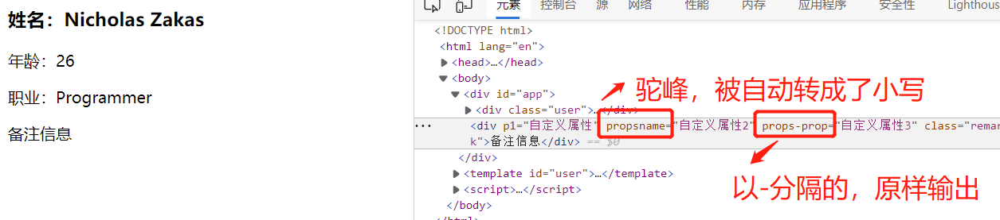

2. 子组件通过事件向父组件发送消息，向父组件发送信息

子组件在给父组件传递消息时，可以通过$emit向父组件发送消息，告诉父组件当前子组件发生了一些事情，并把发生的事情的具体信息汇总给父组件。

简单用法：

```html
    <!--监听子组件自定义事件item-click的响应函数cpnClick可以没有参数，默认会把子组件自定义函数的参数传递给处理函数-->
    <categories :categories="categories" @item-click="cpnClick"></categories>
    <template id="categories">
        <div>
            <!--响应函数itemClick(item)需要加参数item，告知父组件什么数据被传递了过去-->
            <button class="category" v-for="item in categories" :Key="item.id"
                @click="itemClick(item)">{{item.name}}</button>
        </div>
    </template>
    <script>
        itemClick(item) {
            this.$emit("item-click", item); // $emit通常可以有2个参数，第一个参数为自定义事件，也就是父组件需要监听的事件，第2个参数为需要向父组件传递的参数
        }
    </script>
```

来看下完整的案例：

```html
    <div id="app">
        <!--监听子组件自定义事件item-click的响应函数cpnClick可以没有参数，默认会把子组件自定义函数的参数传递给处理函数-->
        <categories :categories="categories" @item-click="cpnClick"></categories>
    </div>

    <template id="categories">
        <div>
            <!--响应函数itemClick(item)需要加参数item，告知父组件什么数据被传递了过去-->
            <button class="category" v-for="item in categories" :Key="item.id"
                @click="itemClick(item)">{{item.name}}</button>
        </div>
    </template>
    <script>
        const categories = {
            template: "#categories",
            props: {
                categories: {
                    type: Array,
                    default() {
                        return []
                    }
                }
            },
            methods: {
                itemClick(item) {
                    this.$emit("item-click", item);
                }
            }

        };
        //创建Vue实例,得到 ViewModel
        let app = new Vue({
            el: '#app',
            data: {
                categories: [
                    {
                        id: "mobile",
                        name: "手机"
                    },
                    {
                        id: "computer",
                        name: "电脑"
                    },
                    {
                        id: "digital",
                        name: "数码"
                    },
                    {
                        id: "shoes",
                        name: "鞋"
                    },
                    {
                        id: "books",
                        name: "图书"
                    }
                ]
            },
            methods: {
                // 监听子组件自定义事件的响应函数，需要接收从子组件自定义函数传递过来的参数
                cpnClick(name,item) {
                    console.log(item);
                    console.log(name);
                }
            },
            components: {
                categories
            }
        });
    </script>
```

> 通过$emit向父组件传递消息，是常用的几种父子组件通信方式中的一种，还有其他的几种方式，如事件总成、provide/inject、$attrs和$listeners等，可以逐渐熟悉。

### 子组件不要直接绑定props中的值，而是要绑定data或计算属性中的值

> 一般情况下，子组件中的值都是从父组件获取的，那么假如子组件中有form表单使用v-model的时候，那么表单不要直接绑定子组件的props，而应该绑定子组件的data中的值或者计算属性。

**原则已经了解了，那么子组件中，v-model可以直接绑定子组件的props吗？**

仅从子组件的数据实现上，是可以实现的，表面上看是没有问题的，但是代码在执行过程中，会报异常：

```html
    <div id="app">
        <cpn :number1="num1" :number2="num2"></cpn>
    </div>

    <template id="cpn">
        <div>
            <h3>props中的只：{{number1}}</h3>
            <!--直接绑定了props中的属性，从表面上看是没有问题的，但是代码运行过程中会报异常-->
            <input type="text" v-model="number1">
            <h3>props中的值：{{number2}}</h3>
            <!--直接绑定了props中的属性，从表面上看是没有问题的，但是代码运行过程中会报异常-->
            <input type="text" v-model="number2">
        </div>
    </template>

    <script>
        //创建Vue实例,得到 ViewModel
        let app = new Vue({
            el: '#app',
            data: {
                num1: 1,
                num2: 0
            },
            methods: {},
            components: {
                cpn: {
                    template: "#cpn",
                    props: {
                        number1: Number,
                        number2: Number
                    }
                }
            }
        });
    </script>
```

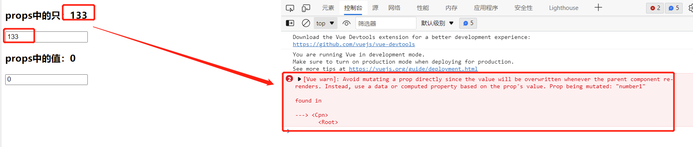

异常信息也提示我们了，可以使用data或者计算属性来绑定v-model。 ------- 需要注意，子组件的data是一个函数，不是一个对象。

```html
    <div id="app">
        <cpn :number1="num1" :number2="num2"></cpn>
    </div>

    <template id="cpn">
        <div>
            <h3>props中的只：{{number1}}</h3>
            <!--直接绑定了props中的属性，从表面上看是没有问题的，但是代码运行过程中会报异常-->
            <input type="text" v-model="number1">
            <h3>data中：{{dnumber1}}</h3>
            <!--绑定了data中的值，页面展示正常，代码执行过程中也没有报异常，完美-->
            <input type="text" v-model="dnumber1">
            <h3>props中的值：{{number2}}</h3>
            <!--直接绑定了props中的属性，从表面上看是没有问题的，但是代码运行过程中会报异常-->
            <input type="text" v-model="number2">
            <!--绑定了计算属性，效果完美-->
            <h3>绑定计算属性：{{cnumber2}}</h3>
            <input type="text" v-model="cnumber2">
        </div>
    </template>

    <script>
        //创建Vue实例,得到 ViewModel
        let app = new Vue({
            el: '#app',
            data: {
                num1: 1,
                num2: 0
            },
            methods: {},
            components: {
                cpn: {
                    template: "#cpn",
                    data() {
                        return {
                            dnumber1: this.number1,
                            dnumber2: this.number2
                        }
                    },
                    computed: {
                        cnumber2: {
                            set(newValue) {
                                this.dnumber2 = newValue;
                            },
                            get() {
                                return this.dnumber2;
                            }
                        }
                    },
                    props: {
                        number1: Number,
                        number2: Number
                    }
                }
            }
        });
    </script>
```

还是上面的案例，希望实现在子组件中值的变化的时候，也能修改到父组件中的值，怎么实现呢？因为是表单，所以就表单的v-model拆解一下就可以了。

```html
    <div id="app">
        <cpn :number1="num1" :number2="num2" @num1-change="num1Change"></cpn>
    </div>

    <template id="cpn">
        <div>
            <h3>props中的只：{{number1}}</h3>
            <!--直接绑定了props中的属性，从表面上看是没有问题的，但是代码运行过程中会报异常-->
            <input type="text" v-model="number1">
            <h3>data中：{{dnumber1}}</h3>
            <!--绑定了data中的值，页面展示正常，代码执行过程中也没有报异常，完美-->
            <input type="text" v-model="dnumber1">
            <h3>在子组件变化时，也修改到父组件中的值，也就是props中的值：{{number1}}</h3>
            <input type="text" :value="dnumber1" @input="number1Change">
            <h3>props中的值：{{number2}}</h3>
            <!--直接绑定了props中的属性，从表面上看是没有问题的，但是代码运行过程中会报异常-->
            <input type="text" v-model="number2">
            <!--绑定了计算属性，效果完美-->
            <h3>绑定计算属性：{{cnumber2}}</h3>
            <input type="text" v-model="cnumber2">
        </div>
    </template>

    <script>
        //创建Vue实例,得到 ViewModel
        let app = new Vue({
            el: '#app',
            data: {
                num1: 1,
                num2: 0
            },
            methods: {
                num1Change(value){
                    console.log(value);
                    this.num1 = parseInt(value);
                }
            },
            components: {
                cpn: {
                    template: "#cpn",
                    data() {
                        return {
                            dnumber1: this.number1,
                            dnumber2: this.number2
                        }
                    },
                    computed: {
                        cnumber2: {
                            set(newValue) {
                                this.dnumber2 = newValue;
                            },
                            get() {
                                return this.dnumber2;
                            }
                        }
                    },
                    props: {
                        number1: Number,
                        number2: Number
                    },
                    methods:{
                        number1Change(event){
                            this.dnumber1 = event.target.value;
                            this.$emit("num1-change",this.dnumber1);
                        }
                    }
                }
            }
        });
    </script>
```

所有的需求都实现了。

### 父组件调用子组件的方法&获取子组件的数据

父子组件通信，可以通过props实现父组件给子组件传值，子组件可以通过$emit自定义事件向父组件发送消息，携带数据的方式实现数据的互传。但在一些场景，父组件中可能需要出发一些事件来执行子组件中的方法、获取子组件的数据，那么获取子组件就成了一个现实的问题了。

Vue给我们提供了2个属性来获取子组件：$children、$refs.

$children:是一个数组，可以获取当前组件的所有子组件，通过数组索引精准获取子组件。

> 由于子组件的不确定性，可能会动态的添加、移除，所以$children的这种获取子组件的方式，有些场景不是很方便，用的相对少一些。

```html
    <div id="app">
        <cpn :msg="msg" :info="info"></cpn>
        <cpn :msg="msg" :info="info"></cpn>
        <cpn :msg="msg" :info="info"></cpn>
        <button @click="getChildrenMethod">调用子组件方法</button>
        <button @click="getChildrenData">获取子组件数据</button>
    </div>
    <template id="cpn">
        <div class="cpn">
            <h3>{{msg}}</h3>
            <p>{{info}}</p>
        </div>
    </template>

    <script>
        let cpn = {
            template: "#cpn",
            data() {
                return {}
            },
            props: {
                msg: String,
                info: String
            },
            methods: {
                showMessage() {
                    console.log(this.msg);
                }
            }
        };
        //创建Vue实例,得到 ViewModel
        let app = new Vue({
            el: '#app',
            data: {
                msg: "父组件调用子组件方法",
                info: "父组件获取子组件数据"
            },
            methods: {
                // 通过$children获取子组件的方法
                getChildrenMethod() {
                    this.$children[0].showMessage();
                },
                // 通过$children获取子组件的数据
                getChildrenData() {
                    console.log(this.$children[0].info);
                }
            },
            components: {
                cpn
            }
        });
    </script>
```

通过$children、索引的方式，成功的执行了子组件的方法、获取到了子组件的数据。

但是我们也可以从demo中看到，子组件没有自己的唯一标识，只能通过数组索引来获取、定位子组件，但是如果在一些逻辑中动态的添加了子组件、移除了子组件，可能之前获取、定位到的子组件就不对了，这个时候可以通过$refs来精准定位子组件。

**$refs精准获取子组件**

首先给子组件添加ref属性，然后父组件就可以通过$refs拿到子组件的ref的属性值，就实现了子组件的精准定位。由于$refs的精准定位，不会因为子组件的增减、位置移动而改变所以使用的场景相对$children要多一些。

组件中更需要添加ref属性

```html
<cpn :msg="cpnMsg" :info="cpnInfo" ref="cpn"></cpn>
<mycpn :msg="mycpnMsg" :info="mycpnInfo" ref="mycpn"></mycpn>
```

```html
    <div id="app">
        <cpn :msg="cpnMsg" :info="cpnInfo" ref="cpn"></cpn>
        <mycpn :msg="mycpnMsg" :info="mycpnInfo" ref="mycpn"></mycpn>
        <button @click="getChildMethod">通过$refs执行子组件方法</button>
        <button @click="getChildData">通过$refs获取子组件数据</button>
    </div>

    <template id="cpn">
        <div class="refs">
            <h3>{{msg}</h3>
            <p>{{info}}</p>
        </div>
    </template>
    <template id="mycpn">
        <div class="refs">
            <h3>{{msg}}</h3>
            <p>{{info}}</p>
        </div>
    </template>
    <script>
        let cpn = {
            template: "#cpn",
            props: {
                msg: String,
                info: String
            },
            methods: {
                showMsg() {
                    console.log("子组件cpn的方法被执行了");
                }
            }
        };
        let mycpn = {
            template: "#mycpn",
            props: {
                msg: String,
                info: String
            },
            methods: {
                showMsg() {
                    console.log("子组件mycpn的方法被执行了");
                }
            }
        };
        //创建Vue实例,得到 ViewModel
        let app = new Vue({
            el: '#app',
            data: {
                cpnMsg: "cpn通过$refs获取子组件执行子组件方法",
                cpnInfo: "cpn通过$refs获取子组件数据",
                mycpnMsg: "mycpn通过$refs获取子组件执行子组件方法",
                mycpnInfo: "mycpn通过$refs获取子组件数据"
            },
            methods: {
                //通过$refs精准获取子组件，并通过获取的子组件执行了子组件的方法
                getChildMethod() {
                    this.$refs.cpn.showMsg(); // 子组件cpn的方法被执行了
                    this.$refs.mycpn.showMsg(); // 子组件mycpn的方法被执行了
                },
                getChildData() {
                    console.log(this.$refs.cpn.msg); //cpn通过$refs获取子组件执行子组件方法
                    console.log(this.$refs.mycpn.msg); //mycpn通过$refs获取子组件执行子组件方法
                }
            },
            components: {
                cpn,
                mycpn
            }
        });
    </script>
```

### 父子组件的相互访问

父组件访问子组件：

1. $children 数组格式，可以通过数组索引定位、获取子组件，但是由于子组件的可能会动态变化，所以个别场景下通过$children不能精准的获取到子组件，用的较少；

2. $refs 对象格式化，可以在子组件使用时添加ref属性，然后父组件通过$refs获取子组件的ref的属性值，精准获取子组件，简单、好用，使用场景较多

```html
<cpn :msg="cpnMsg" :info="cpnInfo" ref="cpn"></cpn>
<mycpn :msg="mycpnMsg" :info="mycpnInfo" ref="mycpn"></mycpn>
<script>
    this.$refs.cpn.showMsg(); // 访问、调用子组件的方法
    this.$refs.cpn.msg; // 访问、获取子组件数据
</script>
```

**子组件访问父组件**

可以通过$parent实现子组件调用父组件的方法、获取父组件的数据，可以通过$root获取根组件（就是Vue实例），并执行根组件的方法，获取根组件的数据。

```html
    <div id="app">
        <pcpn :msg="msg"></pcpn>
    </div>

    <template id="pcpn">
        <div class="pcpn">
            <h3>父组件</h3>
            <ccpn></ccpn>
        </div>
    </template>

    <template id="ccpn">
        <div class="ccpn">
            <h4>子组件</h4>
            <button @click="executeParentMethod">子组件获取父组件，执行父组件方法</button><br>
            <button @click="getParentData">子组件获取父组件数据</button><br>
            <button @click="executeRootMethod">子组件执行根组件方法</button><br>
            <button @click="getRootData">子组件获取根组件数据</button>
        </div>
    </template>

    <script>
        let ccpn = {
            template: "#ccpn",
            methods: {
                // 通过$parent获取父组件，执行父组件中的方法
                executeParentMethod() {
                    this.$parent.showMessage(); //父组件的方法被执行了
                },

                // 通过$parent获取到了父组件数据
                getParentData() {
                    console.log(this.$parent.msg); // 根组件传递给父组件的数据
                },

                // 通过$root执行根组件方法
                executeRootMethod() {
                    this.$root.showMessage(); // 根组件的方法被执行了
                },

                // 通过$root获取根组件数据
                getRootData() {
                    console.log(this.$root.rinfo); //根组件数据
                }
            }
        };
        let pcpn = {
            template: "#pcpn",
            components: {
                ccpn
            },
            props: {
                msg: String
            },
            methods: {
                showMessage() {
                    console.log("父组件的方法被执行了");
                }
            }
        };
        //创建Vue实例,得到 ViewModel
        let app = new Vue({
            el: '#app',
            data: {
                msg: "根组件传递给父组件的数据",
                rinfo: "根组件数据"
            },
            methods: {
                showMessage() {
                    console.log("根组件的方法被执行了");
                }
            },
            components: {
                pcpn
            }
        });
    </script>
```

虽然从技术上可以实现子组件访问父组件，但是优秀的实践一般不这么做，因为这会破坏组件的复用性，提高子组件和当前父组件的耦合性。拆分组件的目的就是为了复用，但是如果子组件和某个固定的父组件耦合了，就不具备了扩展性和复用性了，除非做很多的判断。

### slot 插槽

在生活中，我们都接触过USB接口，电脑上的USB口，我可以接入一个键盘，可以接入鼠标，也可以接入音箱、硬盘等等外接设备。那么在前端的开发中是否也有类似的功能或者场景呢？看如下案例：

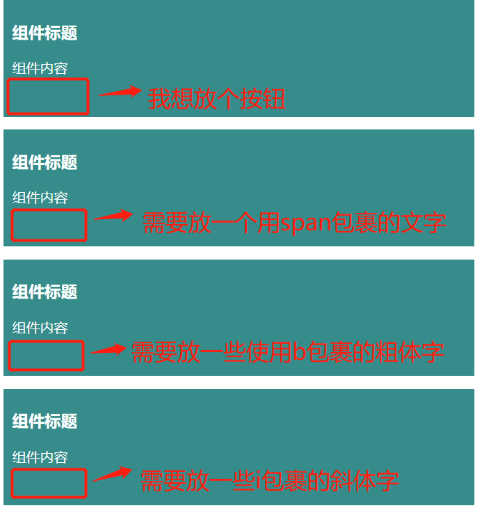

从案例中我们可以看到，这几个模块是一个组件的重复使用渲染出来的结果，但是实际场景中，确实又出现了如图片中一些诉求。如有的地方需要放置一个按钮，有的地方需要放置一些斜体字等等，但是组件的大部分的模块还是相同的，仅仅有部分且是小部分不同。

1. 针对每个模块都重新封装一个组件：但是现在的组件大部分是相同的，重新封装，应该不是一个最好的解决方案；

2. 把不同的元素，放在组件外面去实现：现在的场景正好是需要在组建的末尾有元素不同，那如果是正好是在已经显示的两个元素的中间呢？

上面的两种方式都不太理想，vue给我们提供了一种slot(插槽)解决方案，就类似电脑上的USB接口，slot就类似USB接口，只是一个占位，具体接入的什么，就让接入者去决定。那么这样一来，组件封装可以按照这样的规则：

1. 抽取共性；

2. 保留区别(不同)：不同的地方使用slot占位

```html
<!--组件中，title和content部分都是相同的，抽取这部分的共性，剩下的部分不同，使用slot占位，具体是什么，接入者去决定-->
<div class="slot">
    <h3>{{title}}</h3>
    <p>{{content}}</p>
    <slot></slot>
</div>
```

看组件的定义和应用：

```html
<cpn :title="title" :content="content">
    <!--button元素就替换了组件中的slot-->
    <button>按钮</button>
</cpn>
<cpn :title="title" :content="content">
    <!--span元素替换了组件中的slot-->
    <span>我被span包裹了</span>
</cpn>
<template id="cpn">
    <!--组件中，title和content部分都是相同的，抽取这部分的共性，剩下的部分不同，使用slot占位，具体是什么，接入者去决定-->
    <div class="slot">
        <h3>{{title}}</h3>
        <p>{{content}}</p>
        <slot></slot>
    </div>
</template>
```

现在情况又来了，比如有一个组件被复用了多次，使用slot的地方，大多数的组件都相同，仅有个别的不同，那么slot可以设置默认值吗？可以的。

1. slot可以设置默认值：如果设置了默认值，组件不给slot传值的时候，就直接使用默认值；

```html
<!--slot中的元素，为slot的默认值-->
<slot><i class="fcr">我是红色斜体</i></slot>
```

2. slot设置了默认值后，如果组件又给slot传值了，那么就slot就使用组件给传递过来的值

```html
    <div id="app">
        <cpn :title="title" :content="content">
            <!--button元素就替换了组件中的slot-->
            <button>按钮</button>
        </cpn>
        <cpn :title="title" :content="content">
            <!--span元素替换了组件中的slot-->
            <span>我被span包裹了</span>
        </cpn>
        <!--下面两个元素都没有给slot传值，那么就会直接使用slot的默认值，显示红色斜体文字-->
        <cpn :title="title" :content="content"></cpn>
        <cpn :title="title" :content="content"></cpn>
    </div>

    <template id="cpn">
        <!--组件中，title和content部分都是相同的，抽取这部分的共性，剩下的部分不同，使用slot占位，具体是什么，接入者去决定-->
        <div class="slot">
            <h3>{{title}}</h3>
            <p>{{content}}</p>
            <!--slot中的元素，为slot的默认值-->
            <slot><i class="fcr">我是红色斜体</i></slot>
        </div>
    </template>
    <script>
        let cpn = {
            template: "#cpn",
            props: {
                title: String,
                content: String
            }
        };
        //创建Vue实例,得到 ViewModel
        let app = new Vue({
            el: '#app',
            data: {
                title: "组件标题",
                content: "组件内容"
            },
            methods: {},
            components: {
                cpn
            }
        });
    </script>
```

**插槽slot知识点汇总**

1. 基本使用：<slot></slot>

2. 默认值：<slot><span>222</span></slot>

3. 如果组件中给插槽传递了多个值，那么多个值都会传递给slot

```html
<cpn :title="title" :content="content">
    <!--下面的3个元素都会传递给组件的slot-->
    <button>按钮</button>
    <span>我是后来的文字</span>
    <i>斜体字</i>
</cpn>
```

**具名插槽slot**

```html
<cpn><button>按钮</button></cpn>
<div class="cpn">
    <h3>组件标题</h3>
    <p>组件内容</p>
    <slot></slot>
    <slot></slot>
    <slot></slot>
</div>
```

看代码，假如我们的组件中使用了多个slot，那么组件中的内容，会替换组件中的哪个slot呢？没有办法去找，结果是替换元素替换了所有的slot。

实际上，我并不想替换所有的slot，而是只想替换中间的一个，那么我怎么使用呢？

只需要给slot加一个name属性就可以了，也就是具名slot（插槽），然后在使用的时候，使用slot属性指定name属性即可，如

```html
<cpn>
    <button slot="center"></button>
</cpn>
<div class="cpn">
    <h3>组件标题</h3>
    <p>组件内容</p>
    <slot name="left"></slot>
    <slot name="center"></slot>
    <slot name="right"></slot>
</div>
```

这样就会只替换slot的name值为center的slot了。

> 在组件中的替换slot元素，如果不加slot属性，那么就只能替换匿名的slot，且是所有的，有1个匿名slot就替换1个，有多个匿名slot就替换多个匿名的slot。

来看完整的案例：

```html
    <div id="app">
        <cpn>
            <!--通过slot指定要替换的slot-->
            <button slot="center">按钮</button>
        </cpn>
    </div>

    <template id="cpn">
        <div class="cpn">
            <h3>组件标题</h3>
            <p>组件内容</p>
            <slot name="left"><span>左侧元素</span></slot>
            <slot name="center"><span>中间元素</span></slot>
            <slot name="right"><span>右侧元素</span></slot>
        </div>
    </template>
    <script>
        let cpn = {
            template: "#cpn"
        };
        //创建Vue实例,得到 ViewModel
        let app = new Vue({
            el: '#app',
            data: {},
            methods: {},
            components: {
                cpn
            }
        });
    </script>
```

**作用域插槽**

父组件替换插槽的标签，但是内容由子组件来决定。在使用过程中，slot需要通过一个自定义的属性绑定数据源，然后使用时通过slot的slot-scope属性来获取当前slot所在的组件的数据源，如：

```html
    <div>
    <!--slot通过自定义属性:data绑定了当前组件的数据源planguages，表示该slot从当前组件获取数据源-->
        <slot :data="planguages">
            <ul>
                <li v-for="item in planguages">{{item}}</li>
            </ul>
        </slot>
    </div>

    <!--slot取得了当前组件的数据源，在使用时需要通过slot-scope属性来指定当前slot是从本身所在的组件获取数据的-->
    <cpn>
        <!--获取子组件的数据-->
        <!--Vue2.5.x以下需要使用template模板，2.5.x版本以上就可以不再使用template模板了-->
        <!--slot-scope属性固定，属性值可以自定义，这里我使用的slot，也可以是其他的自定义名字，如scope、abc等，只是在取数据的时候需要和该属性名保持一致即可-->
        <template slot-scope="slot">
            <span v-for="item in slot.data">{{item}}</span>
        </template>
    </cpn>
```

来看下完整demo：

```html
    <div id="app">
        <cpn></cpn>
        <cpn>
            <!--获取子组件的数据-->
            <!--Vue2.5.x以下需要使用template模板，2.5.x版本以上就可以不再使用template模板了-->
            <!--slot-scope属性固定，属性值可以自定义，这里我使用的slot，也可以是其他的自定义名字，如scope、abc等，只是在取数据的时候需要和该属性名保持一致即可-->
            <template slot-scope="slot">
                <span v-for="item in slot.data">{{item}}</span>
            </template>
        </cpn>
        <cpn>
            <template slot-scope="slot">
                <span>{{slot.data.join(', ')}}</span>
            </template>
        </cpn>
    </div>

    <template id="cpn">
        <div>
            <slot :data="planguages">
                <ul>
                    <li v-for="item in planguages">{{item}}</li>
                </ul>
            </slot>
        </div>
    </template>

    <script>
        let cpn = {
            template: "#cpn",
            data() {
                return {
                    planguages: ["Javascript", "C++", "Python", "Java", "Object-C", "Go"]
                }
            }
        };
        //创建Vue实例,得到 ViewModel
        let app = new Vue({
            el: '#app',
            data: {},
            methods: {},
            components: {
                cpn
            }
        });
    </script>
```

###　模块化开发

早期的js功能简单，技术实现重在服务端，前端开发相对简单一些。随着项目规模的扩大、人员的扩增，js文件增多，不易维护了。就需要找一些解决方案来解决开发中出现的问题。

js代码模块化之前，js开发大概率会遇到的一些常见问题：

1. 全局变量同名；

2. 依赖顺序：js的依赖顺序是固定的，不能灵活变动

解决全量同名、命名冲突的问题，按照ES5及以前的技术标准，可以通过立即执行函数来解决，即：

```javascript
//a.js
var flag = true;

function sum(a, b) {
    return a + b;
}

//b.js
var flag = false;

function increment(a, b) {
    return a + b;
}
```

那么在引用这2个js文件的时候，如：

```html
    <script src="./js/a.js"></script>
    <script src="./js/b.js"></script>
    <script>
        var newFlag = flag;
    </script>
```

newFlag的值是什么呢？当然了，大家应该都知道，值是false，但是最初的初衷可能是想用true的。

所以原来的js技术标准，有一些常见的问题，但是也有一些解决：就是上面提到的立即执行函数:比如a.js

```javascript
; (function () {
    var flag = true;

    function sum(a, b) {
        return a + b;
    }

})();
```

命名的问题是解决了，但是在这个函数之外，我也就用不到这个函数里面定义的变量和方法了，就失去了代码的复用性了。那有没有办法让我们已经写的代码既能够复用，又能避免上面提到的一些比如命名冲突、依赖顺序固定的问题呢？按照之前的技术标准，还是借助立即执行函数，也有类似的解决方案（现在已经已经不用了，从ES6标准开始，ECMA标准内置了标准的模块化方案）。


```javascript
//a.js 优化后的
;
var moduleA = (function () {
    //新建一个空对象，用来结束需要、可以返回的属性、方法
    var obj = {};
    var flag = true;

    function sum(a, b) {
        return a + b;
    }

    // 将在这个立即执行函数中声明的变量、方法，赋值给空对象的属性
    obj.flag = flag;
    obj.sum = sum;

    // 将对象暴露出去，外部只要拿到了这个对象，就可以使用这个对象的内部属性、方法了
    return obj;
})();
```

在立即执行函数内部（立即执行函数是一个密闭空间），将函数的变量、函数，都赋值给一个空对象，在函数执行的时候，将对象暴露出去，最终在引用这个文件的时候，就会自动拿到了函数内部的变量和方法。

```html
    <script src="./js/a.js"></script>
    <script>
        var newFlag = moduleA.flag;
        var newFlag2 = moduleB.flag;
        console.log(newFlag); // true
    </script>
```

在ES6标准之前，这是常用的一种模块化方案。

> 立即执行函数解决了命名冲突问题，命名函数中使用返回对象的方式，又解决了代码的复用问题。

**常用的模块化规范**

1. CommonJS

2. AMD

3. CMD

4. ES6 Modules

这些模块化规范中，AMD和CMD用的比较少，现在常用的是ES6 modules，其中CommonJS是一个规范，其典型的案例是nodejs，webpack也使用了其文件、模块的导入、导出思想。

CommonJS规范，一个文件就是一个模块，文件也不需要使用立即执行函数（匿名函数）来实现环境的隔离了，模块通过导出(exports)、导入(require)来实现，可以看个简单案例（CommonJs规范在浏览器中没有实现环境，只浏览下代码的样子吧）：

```javascript
// a.js
var flag = true;

function sum(a, b) {
    return a + b;
}

module.exports = { flag, sum }; //导出的是一个对象

//b.js
var mA = require("./a"); // 导入的mA也是一个对象，也可以以一种结构的方式引入，如下

console.log(mA.flag); // true
console.log(mA.sum(3, 4)); // 7


// b.js 以结构的方式引入a.js
var { flag, sum } = require("./a"); // 结构后的引用，就可以直接使用在a模块中定义的变量和方法了
```

### ES6 Module

ES6 modules,两个核心，就是export、import。

导出，大概可以分为导出变量、对象、函数、class。

**导出变量**

导出方式1：

模块导出：

```javascript
var flag = false;

function sum(a, b) {
    return a + b;
}

export { flag, sum };
```

导出方式2：变量、对象直接导出 -----  定义时直接导出

```javascript
// 这种到处方式，其实也是对象的导出方式，导入时也需要以对象的形式导入
export var age = 18;
var person = {
    name: "Nicholas Zakas",
    age: 18,
    job: "Programmer"
};

// 导入
import {age,person} from "./a.js"
console.log(age);
```

导出方式3：变量、对象先定义后，最后统一在一个对象中导出

```javascript
var username = "Nicholas Zakas";
var job = "Programmer";
var birthday = "2021-12-12";
export { username, job, birthday };

// 导入,导入后可直接使用
import {username,job,birthday} from "./a.js";
console.log(username); // Nicholas Zakas
console.log(job); // Programmer
console.log(birthday); //2021-12-12
```

**导出函数、class**

导出函数，可以按如下语法：

```javascript
// 导出方式1
export function fn(){}
```

**export default**

同一个模块中，有且只能有一个export default。

通过export default导出的变量，不需要使用{}包裹，引入的时候也不需要使用{}包裹，但是导出的变量，需要是一个已经存在的变量。

```javascript
// 导出时，名称sum不能使用{}包裹，
function sum(num1,num2){
    return num1 + num2;
}
export default sum;
//导入时，自定义的变量名也不能使用{}包裹
import sum from "./a.js"; // sum是自定义的，不能使用{}包裹
```

### webpack

#### 认识webpack

现代的javascript应用的静态模块打包工具，主要两个方面：

1. 模块

2. 打包

##### 前端模块化和打包的关系

代码开发中，可以使用任何一种代码的模块化方案，webpack会将源码转译成大部分浏览器能识别的模块化方案，帮我们处理好模块之间的依赖关系，保证在浏览器中正常执行。

webpack除了可以处理js的模块化，也可以处理css、图片、JSON的模块化处理。

最终将webpack经过编译、打包后的代码部署到服务器，让浏览器解释、执行经过webpack编译、打包后的代码。

##### 和gulp、grunt的区别

grunt基本没啥人用了，使用量非常小了。

gulp、grunt的核心是task，是任务流，前端自动化管理工具。

**什么时候使用gulp呢？**

简单的任务流，不涉及到复杂的模块化的时候；

只需要进行简单的静态资源的合并、压缩；

这样的两个场景，使用gulp是一个不错的选择，轻量化的工具，灵活的配置。
#### webpack的安装

依赖node环境：webpack的运行需要先安装了node.js

node中有一个包管理工具：npm（node package manager），管理node各种包。

> webpack --version：查看webpack的版本

```bash
npm install webpack -g // 以全局方式安装最新版本的webpack
npm install webpack --save-dev // 本地安装
webpack --version 查看webpack版本
```

**webpack、node、npm的关系**

1. webpack的运行需要依赖node

2. node有很强大的功能，但是需要各种node工具的支持，node提供了一个包的管理工具npm(Node package manager)来管理这些node的工具包；

3. webpack也是一个node的工具包，可以通过npm来安装、管理webpack；

> webpack一般情况下，不建议全局安装。在学习的时候， 为了更好的了解webpack，可以全局安装来学习使用。

> 通过webpack或者一些框架的脚手架工具初始化的项目，项目中都会有一个package.json文件，该文件中的scripts部分，有执行webpack命令的，这里的webpack，是项目内部的，不是全局的。

#### webpack起步

一般情况下，前端项目都会有两个目录：src、dist

> src:source，源 ,dist:distribution,发布

项目的源文件，都放在src中，编译后放到dist中，最后只需要将dist部署到服务器即可。

main.js:一般情况下，前端项目习惯使用main.js来作为入口文件（也有使用index.js作为入口文件的，但是在前端项目中，使用的比较少）。

在使用了webpack或者其他模块化工具的项目中，我们开发的源代码，都使用模块化的思维去组织、编写代码，至于代码之间的依赖关系、我们不用去理会，webpack或者使用的其他的编译工具会帮我们梳理这些不同模块之间的依赖关系。

webpack一些指令：

```bash
webpack src/*.js dist/*.js  # webpack编译文件，将src目录下的*.js打包、编译到dist目录下的*.js文件
```

源代码中，使用的模块化方式不受限制，一些常规的模块化方式都可以被webpack完美的解析、编译。

```js
// src下，main.js入口文件，mathUtil.js功能函数
// CommonJS模块化方式
// mathUtil.js
function add(num1, num2) {
    return num1 + num2;
}

function mul(num1, num2) {
    return num1 * num2;
}

module.exports = {
    add, mul
};

// main.js引入方式
const {add, mul} = require("./mathUtil.js");
console.log(add(20, 24));
console.log(mul(10, 25));


// 也可以使用ES6的模块化方式
// mathUtil.js
function add(num1, num2) {
    return num1 + num2;
}

function mul(num1, num2) {
    return num1 * num2;
}

export {
    add, mul
};

// mainjs
import {add,mul} from "./mathUtil" // webpack环境下，模块文件的扩展名.js可以省略
console.log(add(10, 20));
console.log(mul(15, 20));
```

注意下，我们每次改动了代码后， 都需要重新webpack编译：

```bash
webpack .\src\main.js .\dist\bundle.js
```

到目前为止，我们还没有设置webpack的热启动，所以每次改动了文件之后，都需要重新编译，以后配置了webpack的热启动之后，就不需要每次都重新编译了。

#### webpack配置

上面的案例中，我们每次改动了文件之后，都需要执行webpack ./src/main.js ./dist/bundle.js指令，告诉webpack去做一些事情，将main.js编译、打包到dist目录下，那么有没有办法不需要每次都敲这么多的指令，而只是简单的敲一个webpack，就可以完成我们上面复杂的指令呢？

通过webpack的配置，是可以达到这个目的的。只是我们告诉webpack需要做的事情的方式，发生了一些改变而已.原来是在终端告诉webpack要做一些事情,怎么去做,现在我把这些指令放到了一个配置文件中,让webpack自己去找这个配置文件.

配置文件名:webpack.config.js  配置文件名固定，不允许更改。（以后会有更改方式，到目前为止，可以先认为该文件名就是固定的、不可更改就可以了，方便理解）

```javascript
const path = require("path"); // 引入path包，获取当前文件的绝对路径
module.exports = {
    entry: "./src/main.js",
    output: {
        path: path.resolve(__dirname,"dist"), // __dirname,node上下文中的一个全局变量，用来获取当前文件的绝对路径
        filename: "bundle.js"
    }
};
```

> 项目中只要使用到了node包的时候，就先通过npm init初始化一个package.json文件，用来管理node包。不过不建该文件代码也不会报错，不会出现代码不能正常执行的情况。

**配置执行命令，如将webpack指令配置成npm run build**

package.json中有一个scripts选项属性，可以配置执行指令，配置好的指令以npm run xxx的方式运行，如npm run dev。

```json
  "scripts": {
    "test": "echo \"Error: no test specified\" && exit 1",
    "build": "webpack"
  },
```

之后，就可以通过npm run build来编译打包文件了。

在packages.json中的scripts中配置了执行指令之后，那么指令会优先寻找本地的包，如果本地（也就是当前项目中）没有指令需要的包，就会去全局去找。

> npm安装、管理包的是，有开发时依赖和运行时依赖两个场景，开始时依赖，npm install pck --save-dev,运行时依赖，npm install pkg --save;webpack是一个开发时依赖，项目build完之后，webpack就没有什么用了。

package.json中：

1. devDependencies：开发时依赖，只有在开发的时候会用到，代码开发完并编译、打包后，就不会再用到了，如webpack

2. dependencies：运行时依赖，代码在运行时会用的到，而不管是在代码打包前，还是在代码打包后，如vue、UI库、工具包之类的；

**直接在终端执行webpack指令，执行的是本地的还是全局的webpack呢？**

直接在终端执行webpack指令，执行的是全局的webpack指令。

**怎么可以在终端执行本地的webpack指令呢？局部安装webpack**

1. 在package.json中的scripts选项中，配置自定义指令：会优先执行本地项目内的webpack指令，如果本地项目内找不到才会去全局环境去找webpack；

```json
  "scripts": {
    "test": "echo \"Error: no test specified\" && exit 1",
    "build": "webpack"
  },
```

2. 根据本地webpack目录找到webpack后执行，才是本地的webpack指令

```bash
 ./node_modules/.bin/webpack
```

#### webpack核心loader的使用

webpack本身只能处理js模块，但是在基于webpack管理的项目中，万物皆模块，webpack本身又处理不了非js的文件，那么就需要loader来处理了。

本质上，loader就是个函数。

```javascript
const path = require("path");

module.exports = {
    entry: "./src/main.js",
    output: {
        path: path.resolve(__dirname, "dist"),
        filename: "bundle.js"
    },
    module: {
        // 简单的两个样式的loader的配置，配置前先要install安装一下
        rules: [
            {
                test: /\.css$/i,
                // 在有多个loader时，webpack的读取顺序是从右到左
                use: ["style-loader", "css-loader"],
            },
        ]
    }
};
```

配置完成loader之后，webpack就可以处理css像js模块一样来处理样式模块了，

```javascript
import {sum, mul} from "./js/mathUtil";

console.log(sum(10, 20));
console.log(mul(5, 10));

// 在需要的地方通过requrie引入css即可
require("./css/normal.css")
```

#### webpack中配置vue

#### plugin的使用

#### 搭建本地服务器

1. 本地服务器，热更新