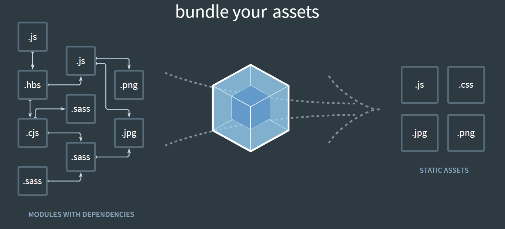

### webpack4.0

#### webpack是什么，可以做什么？

webpack可以简单理解为模块打包机，它可以做一些事情：分析我们的项目目录结构，找到Javascript模块以及其他的一些浏览器不能直接运行的扩展语言如less、sass、ts等，并将它们编译、解析为浏览器可以识别的格式文件让浏览器去运行他们。官网上的这个图解释的非常好：

**webpack具体可以做什么呢？**

1. 代码转换

2. 文件优化

3. 代码分割

4. 模块合并

5. 自动刷新

6. 代码校验

7. 自动发布

**学习、使用webpack需要的一些基础知识**

1. nodejs

2. npm

3. es6

**学习webpack应该重点学习、关注的内容**

1. webpack的常见配置

2. webpack的高级配置

3. webpack的优化策略

4. ast抽象语法树

5. webpack中的Tapable

6. 掌握webpack流程，手写webpack

7. 手写webpack中常用的loader

8. 手写webpack中常见的plugin