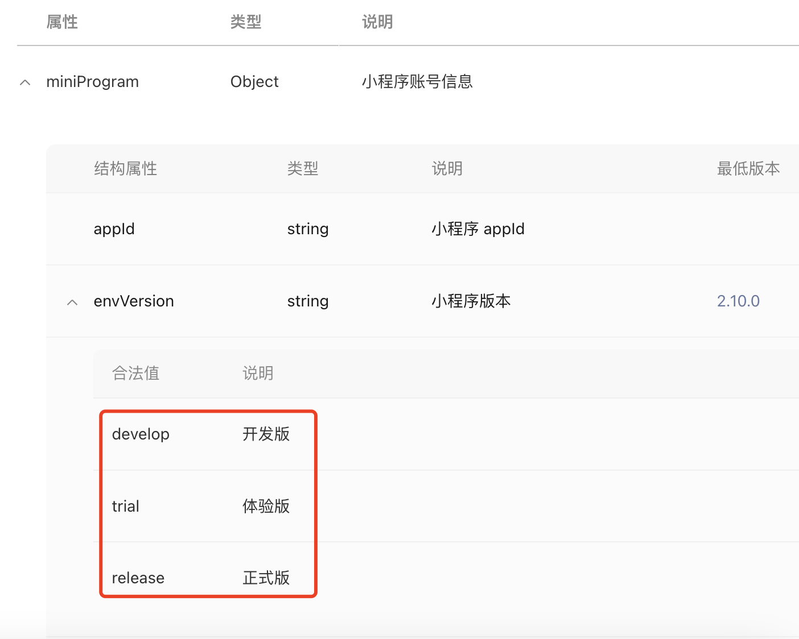

### 小程序怎么判断当前是开发版、体验版还是正式版呢?

可以通过wx.getAccountInfoSync()这个api来获取当前小程序的信息,其中包括了环境信息:

具体可参考:https://developers.weixin.qq.com/miniprogram/dev/api/open-api/account-info/wx.getAccountInfoSync.html

**也可以通过__wxConfig.envVersion来区分开发版、体验版和正式版**

通过资料查询到也可以通过__wxConfig.envVersion来获取当前的环境时开发版、体验版还是正式版,在开发者工具中可以正常获取到,还没有在线上使用过,备注一下,后续补上.

具体信息可参考:[https://developers.weixin.qq.com/community/develop/article/doc/000e6606ab4ac0edb4791eb4951013](https://developers.weixin.qq.com/community/develop/article/doc/000e6606ab4ac0edb4791eb4951013)

### 抖音小程序通过tt.getEnvInfoSync()来获取账号信息,来区分开发版、体验版和正式版

抖音小程序也提供了tt.getEnvInfoSync()这个api来区分环境版本,只是返回的数据信息和微信小程序有些区别,具体可参考:[https://developer.open-douyin.com/docs/resource/zh-CN/mini-app/develop/api/foundation/env/get-env-info-sync](https://developer.open-douyin.com/docs/resource/zh-CN/mini-app/develop/api/foundation/env/get-env-info-sync)

### 支付宝小程序区别环境版本

支付宝小程序提供了和微信小程序相同的api来支持获取当前小程序的账号信息my.getAccountInfoSync(),返回值信息也是一致的, 这个感觉有好.

具体信息可参考:[https://opendocs.alipay.com/mini/api/my.getAccountInfoSync?pathHash=938e83c4](https://opendocs.alipay.com/mini/api/my.getAccountInfoSync?pathHash=938e83c4)

### 百度小程序环境版本区分

百度小程序提供了和抖音小程序同名的api来获取当前小程序的账号信息,可以以此来获取当前的环境信息:

具体可参考:[https://smartprogram.baidu.com/docs/develop/api/device_sys/swan-getEnvInfoSync/](https://smartprogram.baidu.com/docs/develop/api/device_sys/swan-getEnvInfoSync/)

### Taro区分小程序的环境版本

### 常见问题

1. 在提审的时候,各端小程序的审核方看到的是正式版,还是体验版的呢?

2. Taro中是怎么判断的?不同的Taro版本的判断方式有无区别?都支持到了所有的端吗?