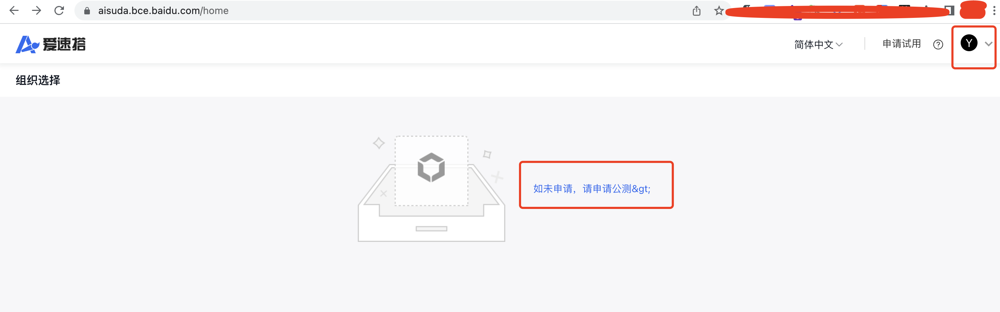
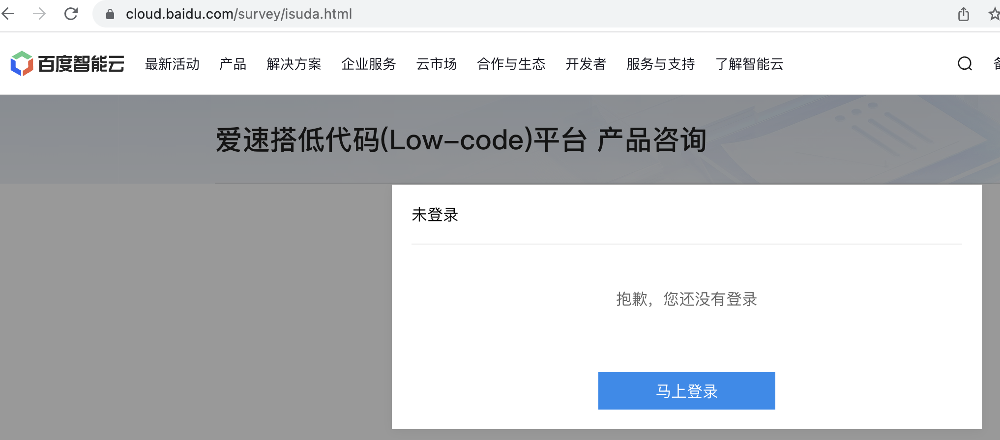
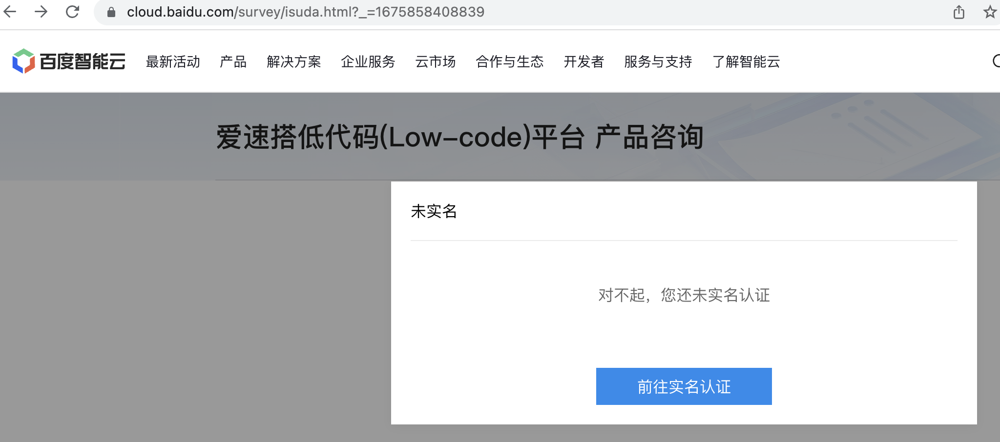
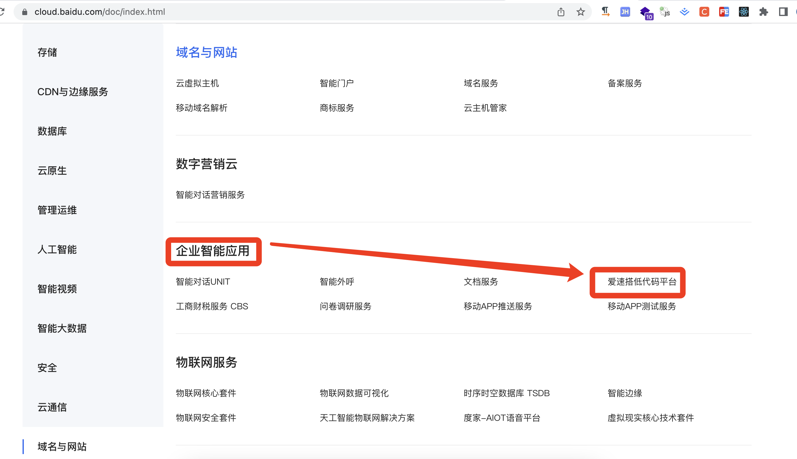

### 1. 爱速搭

参考链接：https://aisuda.bce.baidu.com/amis/zh-CN/docs/index

爱速搭，是百度的一个低代码平台，我根据它的官网https://aisuda.bce.baidu.com进来了，提示我输入邮箱获取一个验证码后即可，结果我以这种方式登录后并没有什么内容，而是说如果我想要体验平台，就申请下公测吧，那我申请吧，结果悲催了，又让我登录，拿到刚才的不是登录吗？

可我点击“申请公测”又让我登录了

登录后，提示我需要实名认证，难道我使用一个写代码的工具，还得实名后才能用，这体验太糟糕了，必须得实名，还没有关闭这个弹层的地方和操作。

算了，不申请了，我找到了爱速搭的文档，有兴趣的朋友可以了解下吧：https://cloud.baidu.com/doc/ISUDA/index.html

它的来源，可不好找，百度云产品列表中有入口：https://cloud.baidu.com/doc/index.html，

