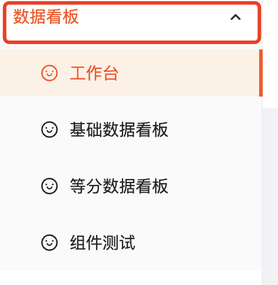

### -webkit-user-select控制页面文字被选中

在做基于浏览器的网页的时候，经常在快速点击一个地方的时候，会触发双击事件，导致点击区域之外的文字被选中，如图所示：


实际场景是，我本来是点击箭头实现菜单的折叠和展开效果的，但是由于我点击箭头的速度较快，触发了双击事件，导致箭头区域之外的文字被选中了。这在web页面中经常出现，那么怎么处理，可以不触发点击区域之外的文字被选中呢？

css提供了-webkit-user-select这个属性，可以设置某个区域文本能否被用户选中。标准属性为user-select，由于使用chrome浏览器的场景居多，我使用了-webkit前缀了。

在使用该属性的时候，生效的部分的文字不能被选中，需要慎用，需要控制某个元素的时候，那么就精确到某个元素。如图：



我只希望点击顶部的“数据看板”那一行的时候，不要触发双击事件，那么我就只给当前这个模块添加user-select属性，并设置为none就可以了.

```css
.ant-menu-submenu-title {
    -webkit-user-select: none;
}
```

不要给超出范围的模块使用该属性，否则会导致文字不能被选中，还有可能会导致拖拽功能的实现。这里不做过多的讨论了。