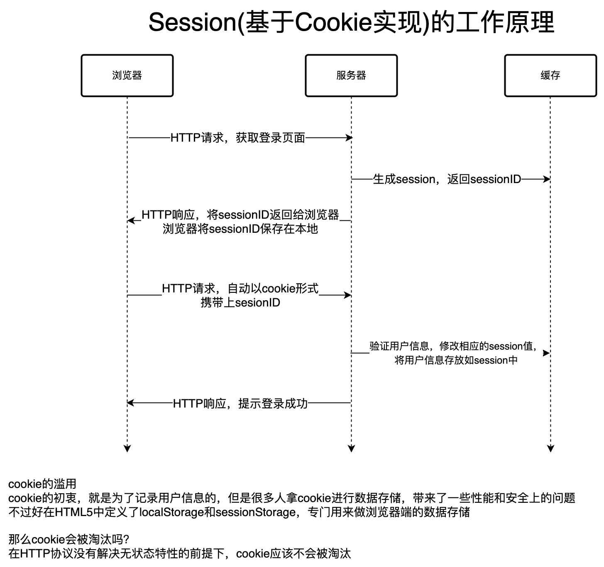

### 1. cookie(session)简单认识

cookie，就是保存在浏览器上的一小段纯文本，不包含任何可执行的代码。

cookie的初衷，是为了记录用户信息的，标识用户的身份信息，但是由于由于使用不当，拿cookie做一些客户端的数据存储。由于这些信息是明文存储，所以就带来了一些安全和性能上的隐患。

### 2. cookie的记录用户标识信息，是什么场景？

主要是http协议的无状态性。不同的http请求，服务器是没有办法知道新的请求是合法的还是非法的，是以前发送过的请求，还是第一次进来的请求，因为http协议的无状态性，没有办法获取请求的标识信息。cookie就解决了这个问题。

来看下大概的原理图：

### 3. cookie会被淘汰吗？

由于现在的浏览器端存储，已经有webstorage，如localStorage和sessionStorage，那么coockie会被淘汰吗？

要回答这个问题，我们首先需要了解cookie和webstorage主要是用来做什么的？

cookie，主要是为了配合http协议，解决用户标识问题的，webstorage主要是为了浏览器端端数据存储的。那么这个问题就很容易回答了，拿就是在http协议无状态特性没有改变的情况下，cookie应该是不会被淘汰的。