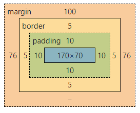

<!-- START doctoc generated TOC please keep comment here to allow auto update -->
<!-- DON'T EDIT THIS SECTION, INSTEAD RE-RUN doctoc TO UPDATE -->
**Table of Contents**  *generated with [DocToc](https://github.com/thlorenz/doctoc)*

- [1. 了解盒模型](#1-%E4%BA%86%E8%A7%A3%E7%9B%92%E6%A8%A1%E5%9E%8B)
- [2. 标准盒模型](#2-%E6%A0%87%E5%87%86%E7%9B%92%E6%A8%A1%E5%9E%8B)
- [3. 替代(IE)盒模型](#3-%E6%9B%BF%E4%BB%A3ie%E7%9B%92%E6%A8%A1%E5%9E%8B)

<!-- END doctoc generated TOC please keep comment here to allow auto update -->

### 1. 了解盒模型

对于前端开发来说，必须要掌握的一个技术点就是 CSS 的盒模型。

CSS 中的盒模型，又可以分为块级盒子(Block box)和内联盒子(Inline box)。

CSS 中广泛使用两种盒子模型：块级盒子和内联盒子，不同的盒子模型会在页面流和元素之间的关系表现出不同的行为。

一个标准的盒模型，会重点关注以下几个方面的内容：

1. ContentBox：当前盒子的区域，可以通过 width 和 height 来设置

2. PaddingBox：边距，包裹在内容区域周围的空白区域，可以通过 padding 相关属性设置

3. BorderBox：盒子模型的边框，可以通过 border 相关属性设置

4. MarginBox：当前盒子与外部其他盒子的间距，可以通过 margin 相关属性设置

所以在前端开发领域常说的盒模型，就是指的 CSS 的这几个属性的设置对外部显示形式的影响关系的模型。


CSS 的盒模型，离不开 HTML 标签的表现形式。

HTML 标签，有默认的表现形式，有的默认是块状(block)的盒模型，有的默认是内联(inline)的盒模型。块状的盒模型，可以可以支持 CSS 盒模型中的所有属性，而内联的标签，只支持了部分的盒模型属性，内联的盒模型元素，默认会展示在一行，不会自动进行换行，块状盒模型标签，每个标签会自动占据一行，自动换行。

常用的块状标签元素：div、p、ul、ol、li、table、form、hr、header、footer、dl、dd、dt、address、article 等

常用的内联标签元素：b、big、i、small、span、em、a、img、sub、sup 等

### 2. 标准盒模型

标准的盒模型，设置的width和height仅仅是内容区的尺寸，并不是整个盒子的尺寸，整个盒子的尺寸需要我们设置的内容区域的width、height 加上 order和padding。

```html
<style>
  * {
    padding: 0;
    margin: 0;
  }
  .box {
    width: 200px;
    height: 100px;
    border: 5px solid #f20;
    padding: 10px;
    margin: 100px auto 0;
    color: #fff;
    text-align: center;
    background-color: #369;
  }
</style>
<div class="box">盒子</div>
```

这个模块，其占用的实际宽度为：230px(200+10+10+5+5)，实际高度为130px(100+10+10+5+5),其效果图如下：


### 3. 替代(IE)盒模型

替代(IE)和模型，就是设置的宽高，就是盒子（元素）的所有的宽高尺寸，包括padding、border。

标准盒模型，通过设置box-sizing: border-box;属性转换为替代(IE)盒模型

```css
* {
    padding: 0;
    margin: 0;
}
.box {
    width: 200px;
    height: 100px;
    border: 5px solid #f20;
    padding: 10px;
    // 标准盒模型转换为替代(IE)盒模型
    box-sizing: border-box;
    margin: 100px auto 0;
    color: #fff;
    text-align: center;
    background-color: #369;
}
```

效果图如下：



盒模型没有那么复杂，主要是在做页面布局的时候，留意模块的元素内部的宽高、元素与元素之间的间距，尤其是上下元素之间可能会发生间距重叠的现象。都是一些很小的细节，没有什么深奥的技术点和窍门，就是需要细心加多练。