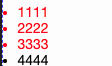

### css实现筛选同级别中除最后一个元素的所有元素

前端开发中，经常需要对一些元素设置一些特殊的样式，如为最后一个元素设置差异化的样式，除最后一个元素之外设置特殊样式。今天我们就来实现一下除最后一个元素之外的元素设置样式.

css3的出现，给我们提供了很多好用的选择器，我们想要实现的效果，就可以借助:not选择来实现。

如下的HTML结构：

```html
<ul>
    <li>1111</li>
    <li>2222</li>
    <li>3333</li>
    <li>4444</li>
</ul>
```

我们实现一下对前3个li设置特殊样式，而最后一个li不具备的样式：

```css
ul > li:not(:last-child){
    color: #f20;
}
```

效果如下：

