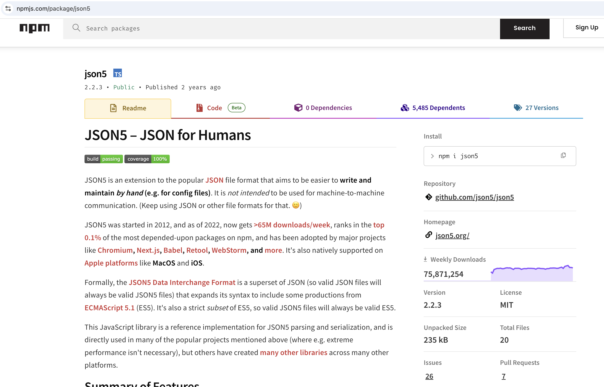

### JSON中的注释

对于大多数的开发者来说，应该都有这么一个共识：JSON不能有注释。

然而最近看到一个新的站点：[https://douglascrockfordisnotyourdad.technomancy.us/](https://douglascrockfordisnotyourdad.technomancy.us/),这个站点的title很有意思，说Douglas Crockford不是你爸爸。可能是因为曾经有个叫Douglas Crockford的人告诉别人JSON中不能有注释吧，然后表达了对这种建议的的反对。

下面分享一个可以在JSON中支持注释的NPM库。

[JSON5](https://www.npmjs.com/package/json5)

### 什么是JSON5？

JSON5是一种对流行的JSON文件格式的扩展，旨在让手工编写和维护变得更加简单和直观。然而，它并非为机器与机器之间的通信设计.

JSON5是JSON的超集，其语法扩展自ECMAScript5.1(ES5)，同时，JSON5也是ES5的严格子集，保证了向后兼容性和一致性。

JSON5项目始于2012年，截止2024年，JSON5每周的下载量超过了8500万次，是npm上最受依赖的0.1%软件包之一，并被广泛应用于主流项目如Chromium、Next.js、Babel、Retool、Webstorm等。此外，JSON5原生支持MacOS和iOS等苹果平台。

### JSON5的主要功能

以下是一些JSON5支持但是JSON不支持的一些能力：

**对象**

- 对象的键可以是ES5的IdentifierName

- 对象可以有一个尾随逗号

**数组**

- 数组可以有一个尾随逗号

**字符串**

- 字符串可以使用单引号

- 字符串支持字符转义

- 字符串可以通过转义字符跨多行书写

**数字**

- 支持十六进制数

- 支持带前导或尾随小数点的数字

- 支持IEEE 754的正无穷大、负无穷大和NaN

- 数字可以以显示正号开头

**注释**

- 支持单行或多行注释

**空白字符**

- 支持更多的空白字符

### 安装使用