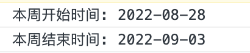
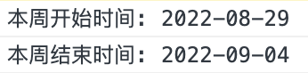

### moment设置自然周为周一到周日

项目中，有一个需求，需要显示当前周，最初的代码实现如下：

```tsx
const startTime = moment().startOf("week");
const endTime = moment().endOf("week");
```

因为我知道有的时候一周的开始是周日而不是周一，周最后1天是周六而不是周日，我的业务诉求是希望周一是一周的开始，周日是一周的结束，我专门测试一下。

```tsx
    const startTime = moment().startOf("week");
    const endTime = moment().endOf("week");  
    console.log("本周开始时间:", startTime.format("YYYY-MM-DD"));
    console.log("本周结束时间:", endTime.format("YYYY-MM-DD"));
```

看下结果：



8月28日是周日，9月3日是周六，这不是我想要的结果。那怎么办呢？


### 本地化设置，实现自然周的第1天为周一，最后1天为周日

自然周的第一天和最后一天，在不同的国家和地区是不同的时间。那么我们是不是可以通过本地化来设置一下呢？

```tsx
import moment from 'moment';
// 国际化，设置中国为本地化环境
moment.locale("zh-cn");
```

再来测试下：

```tsx
    const startTime = moment().startOf("week");
    const endTime = moment().endOf("week");  
    console.log("本周开始时间:", startTime.format("YYYY-MM-DD"));
    console.log("本周结束时间:", endTime.format("YYYY-MM-DD"));
```



### moment时间格式化

moment时间格式化，首先需要是通过moment获取的时间，然后才能调用moment的格式化方法，直接上案例：

```tsx
moment().endOf("week").format("YYYY-MM-DD");
```

通过moment获取时间后，是moment时间了，然后再调用moment的时间格式化方法。