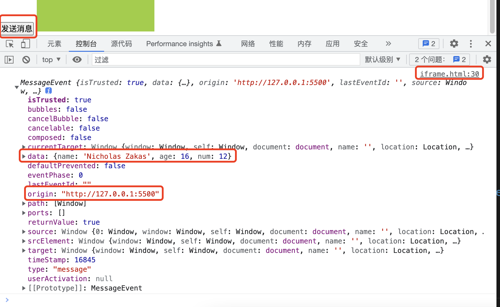

### 使用postMessage解决iframe的通信问题

在做web项目的时候，有的时候的一些场景需要用到iframe的场景，使用iframe就会涉及到一个通信问题。

index.html
```html
<h2>我是一个页面壳子，一个容器</h2>
<button id="btn">发送消息</button>
<iframe src="./iframe.html" frameborder="0" class="iframe" id="myIframe"></iframe>
<script>
    var iframe = document.getElementById("myIframe");
    var btn = document.querySelector("#btn");
    var user = {
        name: "Nicholas Zakas",
        age: 16,
        num: 12
    };
    btn.onclick = function () {
        iframe.contentWindow.postMessage(user, "*");
    };
</script>
```

index.html里面嵌套了一个iframe，且通过按钮的点击事件，向iframe子页面通过postMessage发送了一些信息。

下面来看下iframe页面接收信息页面：

iframe.html

```html
<div class="container">
    <h3>我是一个iframe页面</h3>
</div>
<script>
    function getMessageFromIndex(event) {
        var n = 10;
        console.log(event);
    }
    window.addEventListener("message", getMessageFromIndex, false);
</script>
```

从demo中，我们看到：子页面iframe通过监听message事件，然后接收到了一些信息。

先声明一下，这个demo是可以正常发送信息，且子页面iframe也可以正常的获取到从父页面发送过来的信息。

### 信息发送的一些基础知识点

postMessage:一般情况下的调用方式为window.postMessage()，该方法可以安全的实现跨源通信。

通常情况下，对于多个页面之间不同页面的脚本，只有当这些页面处于同一个源(协议、端口、域名都相同)下时才可以相互通信。而window.postMessage()方法提供了一种机制来规避这个限制，在合理使用的情况下，可以安全、方便的实现不同源下的脚本相互通信。

语法：

window.postMessage(message,targetOrigin);

> 注意这个window，是对一个窗口的引用，而不是一个固定的属性值，如对来源窗口的引用，可以是：

```js
// 获得当前页面的来源窗口
var targetWindow = window.opener;

// 来源窗口发送消息
targetWindow.postMessage("发送消息了","*");
```

注意到demo中的targetWindow就是语法中讲解到的window，它指的是一个窗口的引用，而不是说指代当前窗口。

> contentWindow是iframe的一个个固定属性，指iframe窗口。

targetOrigin参数：指定需要接收消息的url。这里指定的url，就是看可以通过message事件接收到消息的页面，如果没有限制，也可以设置为*.为了安全起见，最好还是有针对性的设置，而不是给一个通配符*。

在iframe页面接收消息的时候，可以通过event.origin属性，对来源做一些校验，基本上可以规避安全问题。

有了上面提到的一些基础知识后，我们来看demo：

index.html
```html
<h2>我是一个页面壳子，一个容器</h2>
<button id="btn">发送消息</button>
<iframe src="./iframe.html" frameborder="0" class="iframe" id="myIframe"></iframe>
<script>
    var btn = document.querySelector("#btn");
    var user = {
        name: "Nicholas Zakas",
        age: 16,
        num: 12
    };
    btn.onclick = function () {
        var iframe = document.getElementById("myIframe");
        iframe.contentWindow.postMessage(user, "*");
    };
</script>
```

在原页面中，我们声明了一个按钮和一个iframe，iframe有一个引用页面,当前目录下的iframe.html.

在页面中，按钮触发了点击事件，然后通过获取到了iframe元素，又通过iframe的窗口引用contentWindow,想iframe页面发送了一条消息。

再来看下iframe.html来接收消息：

iframe.html
```html
<div class="container">
    <h3>我是一个iframe页面</h3>
</div>
<script>
    function getMessageFromIndex(event) {
        console.log(event);
    }
    window.addEventListener("message", getMessageFromIndex, false);
</script>
```
在iframe页面，通过监听message事件，来接收从原窗口postMessage过来的信息。

这里注意下message事件的响应函数的event参数。



通过打印的信息，可以看出来，信息已经从index.html正常的传递给了iframe.html(上图信息都是从iframe.html打印的),iframe.html也正常的接收到了信息。在接收到的信息中，可以重点关注标注出来的2个字段：data和origin。

data：就是从来源页面传递过来的数据，数据类型，普通的数据类型都可以，如数字、字符串、数组、对象，都做过测试，都是可以的。传递的数据，会被结构化克隆算法序列化，这意味着我们开发者基本上可以不受限制的将数据对象安全的传递给目标窗口而不需要自己序列化。

origin：数据来源。我们可以通过该字段，对来源数据做安全性校验，这就在一定程度上规避了存在隐患来源的数据。

### 总结

虽然现在使用iframe的场景不是很多，但是涉及到iframe之间的通信问题，已经被解决了，且可以规避安全问题，安全上有保证了。

通信方式：

原页面通过获取iframe的引用，iframe通过当前window再postMessage，iframe页面通过监听message事件接收信息，接收到的信息都在message事件的响应函数的event参数中，这个event参数中最重要的是data和origin两个字段。

```js
// 原页面发送消息
btn.onclick = function () {
    var iframe = document.getElementById("myIframe");
    iframe.contentWindow.postMessage(arr, "*");
};

// 目标iframe页面接收消息
function getMessageFromIndex(event) {
    var n = 10;
    console.log(event.data);
}
window.addEventListener("message", getMessageFromIndex, false);
```