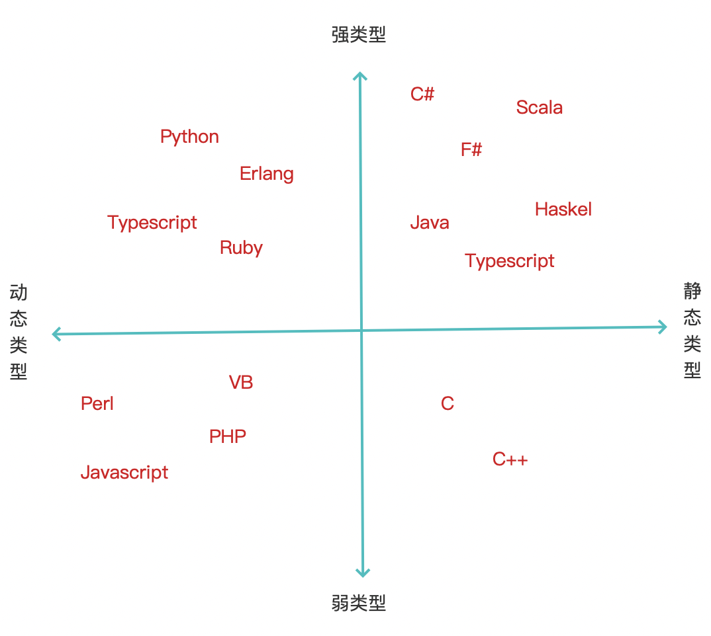

### 静态类型和动态类型

编程语言按照类型检查可以分为两个大类：静态类型(Static Typing)和动态类型(Dynamic Typing)。在现在比较流行的编程语言里，静态类型的代表语言有Java、C++、Golang等，动态类型语言有Python、Ruby等。

静态类型，它的主要表现就是变量在声明期间就已经确定了它的具体的类型，在声明之后就不允许在再变了，具有某一确定类型的静态类型变量就只能保存这个指定类型的数据。如果保存其他类型的数据，那么就会在编译期间报错。

动态类型，它的主要特点就是只有在运行时执行到了这个变量的时候才能确定这个变量的类型。在这之前这个变量是没有明确的类型的。也有一种观念，就是动态类型语言中，变量是没有类型的，只有数据有类型，变量可以保存各种类型的数据。说法不同，本质一样。动态类型语言中，变量保存了一个数据类型之后，也可以再继续保存其他的数据类型，就是说一个变量可以保存任何类型的变量。所以又说它的类型是动态的。

### 强类型和弱类型

从类型安全的角度来讲，又可以将编程语言分为强类型语言和弱类型语言。强类型和弱类型语言的主要区别，就是是否允许随意的进行隐式的类型转换。

从类型检查的角度可以将编程语言分为静态类型语言和动态类型语言，二者之间的主要区别就是是否允许进行任意的修改变量类型。

