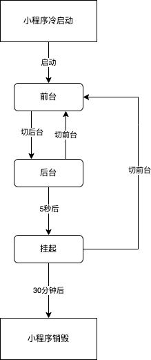

### 1. 注册小程序

每个小程序都需要在app.js中调用App方法注册小程序实例，绑定小程序的生命周期回调函数、错误监听和页面不存在监听函数等。

```js
// app.js
App({
    onLaunch(options){
        // 生命周期回调 --- 监听小程序初始化
    },
    onShow(options){
        // 生命周期回调 --- 监听小程序启动或切换后台
    },
    onHide(){
        // 生命周期回调 --- 监听小程序切换后台
    },
    onPageNotFound(res){
        // 页面不存在监听函数
    }
    onError(msg){
        // 错误监听函数
    }
})

```

小程序生命周期函数

| 属性     | 参数   | 必需 | 说明                                                         |
| -------- | ------ | ---- | ------------------------------------------------------------ |
| onLaunch | Object | 否   | 小程序初始化完成时执行；参数与wx.getLaunchOptionsSync一致，具体可参考：https://developers.weixin.qq.com/miniprogram/dev/api/base/app/life-cycle/wx.getLaunchOptionsSync.html |
| onShow   | Object | 否   | 小程序启动，或者从后台切入到前台时触发；参数与w x.onAppShow一直，具体可参考：https://developers.weixin.qq.com/miniprogram/dev/api/base/app/app-event/wx.onAppShow.html |
| onHide   |        | 否   | 小程序从前台切入后台时触发                                   |

整个小程序只有一个App实例，是整个小程序共享的，开发者可以通过getApp()方法获取到全局唯一的App实例，获取App上的数据或者调用注册在app上的函数。

### 2. 小程序生命周期

小程序从启动到最终销毁，中间会经历多个状态，小程序在不同的状态下会有不同的表现。

小程序启动后，会首先进入到前台状态，这个时候，小程序可以在前台和后台之间状态的切换，如果进入到后台状态后5秒钟没有响应，那么小程序就会被刮起，刮起后的小程序也可以再次被切入到前台。如果进入到刮起状态的小程序30分钟没有响应，那么该小程序就会被销毁。具体过程可参考下图：



#### 2.1 小程序启动

从用户认知的角度来看，广义的小程序的启动可以分为两种情况，一种情况是冷启动，一种情况是热启动。

**冷启动:** 如果用户是首次打开，或者小程序被销毁以后再次打开，此时小程序需要重新加载启动，称之为冷启动

**热启动:** 如果用户已经打开过某小程序，然后在一定的时间内再次打开小程序，此时小程序还没有被销毁，只是从后台状态切换到前台状态，这个过程就是热启动。

> 从小程序生命周期角度来看，我没所说的启动，一般是指冷启动，热启动一般就被称为后台切换为前台。
#### 2.2 前台与后台

小程序启动后，界面被展示给用户，此时小程序处于“前台”状态。

当用户“关闭”小程序时，小程序并没有真正被关闭，而是仅仅切换到了“后台”状态，此时的小程序还可以在运行一段时间，但是此时会有部分api的使用会受到限制。

切换到后台的方式包括但不限于以下几种方式：

- 点击右上角胶囊按钮离开小程序

- iOS从屏幕左侧右滑离开小程序

- 安卓设备点击返回键离开小程序

- 小程序前前台运行时直接将微信切后台(手势或者home键)

- 小程序前台运行时直接锁屏

当用户再次进入微信并打开小程序时，小程序就又会进入到前台状态。
#### 2.3 挂起

小程序进入到后台状态一段时间(目前是5s)后，微信会停止小程序js线程的执行，小程序进入到“挂起”状态。

此时，小程序的内存状态会被保留，但是开发者的代码会停止执行，事件和接口回调会在小程序再次进入到“前台”状态时触发、执行。

当开发者使用了后台音乐播放、后台地理位置等后台能力时，小程序可以在后台持续运行，不会被挂起。

#### 2.4 小程序销毁

如果用户很久没有使用小程序，或者系统资源紧张，小程序会被“销毁”，即完全终止运行。具体来说包括以下几种场景：

1. 当小程序进入到后台状态被挂起后，如果很长时间(目前是30分钟)没有再次进入到小程序前台，小程序会被销毁

2. 当小程序占用系统资源过高，可能会被系统销毁或被微信客户端主动回收

    - 在iOS上，当微信客户端在一定时间间隔内连续收到系统内存警告时，会根据一定的策略，主动销毁小程序，并提示用户“运行内存不足，请重新打开小程序”。具体策略不固定，会实时进行调整优化

    - 建议小程序在必要时使用wx.onMemoryWarning监听内存告警事件，进行必要的内存清理

### 小程序冷启动时的页面

小程序冷启动时，打开的页面有如下2种情况：

1. (A类场景):启动的场景中不带path

    - 基础库2.8.0以下版本，进入首页

    - 基础库2.8.0及以上版本遵循“重新启动策略”，可能是首页或上次退出的页面    

2. (B类场景):启动场景中带有path，则直接进入对应的path页面

#### 重新启动策略配置

是在app.json中的window属性中的restartStrategy属性，或者页面配置中的restartStrategy属性进行配置。属性值有homePage和homePageAndLatestPage,homePage为从首页启动，homePageAndLatestPage为从上次退出的页面启动

### 退出

小程序在可能退出之前，可以调用页面回调函数onSaveExitState,如果想保存页面中数据，则可以在这个函数中保存想要保存的数据。