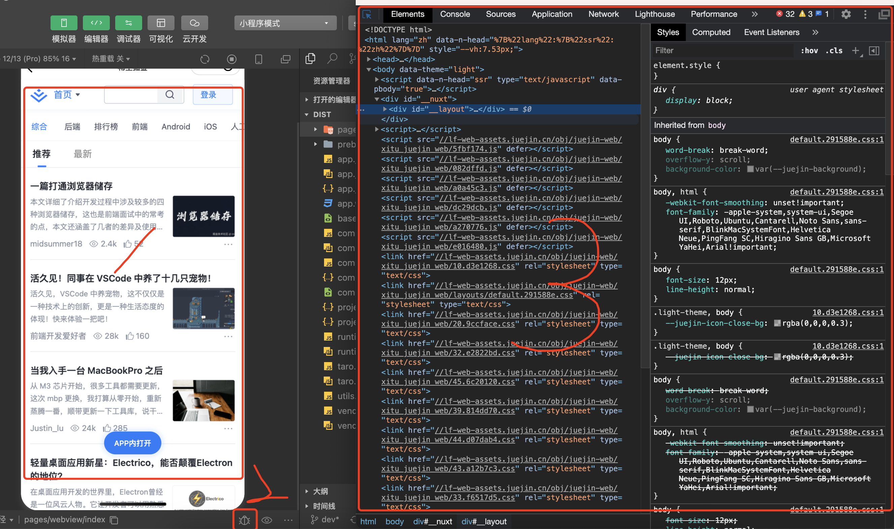

## 小程序能力列表

主要指微信小程序,次之为在Taro体系下的小程序生态体系.

### 1. webview的能力

#### 1.0 webview支持所有的小程序

webview不支持个人类型小程序

自定义导航栏对webview组件无效

#### 1.1 webview和原生小程序之间的通信

webview调用原生小程序的组件

#### 1.2 webview可以打开的链接

- webview默认可以打开关联的公众号的文章

    - 没有关联的公众号的文章,可以直接打开吗?

        - 没有关联的公众号的文章,不可以打开

- 打开其他链接,需要在小程序后台配置白名单

#### 1.3 webview页面怎么调试

开发者工具中,模拟器右下角有一个debug的小图标,点击后就是一个devtools,和浏览器一样,挺好用

**真机中就只能在页面中嵌入vConsole来实现了**

参考链接:[https://github.com/Tencent/vConsole/blob/dev/README_CN.md](https://github.com/Tencent/vConsole/blob/dev/README_CN.md)

### 2. 小程序和其他端之间的跳转

app和小程序之间、小程序和H5之间、小程序和短信之间、小程序和订阅消息之间、小程序和微信消息之间能否相互打开

### 3. 自定义导航栏

1. 自定义导航栏对所有页面有效吗?

    自定义导航栏通过navigationStyle:custom来自定义导航栏,该配置对webview组件无效

2. 自定义导航栏可以隐藏胶囊吗?

