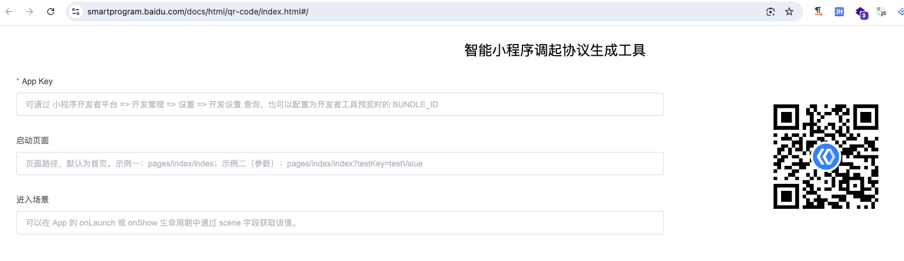

### 百度小程序生成小程序码

百度小程序,不像其他的小程序,可以直接在小程序管理后台配置生成指定页面的小程序码,不过百度提供了一个配置页面可以帮我们实现同样的功能.

链接地址:https://smartprogram.baidu.com/docs/html/qr-code/index.html#/

在这个页面中,我们提供App key和启动页面,就可以生成一个指定启动页面的小程序码,然后就可以通过百度app扫码来进入到指定的页面. 

