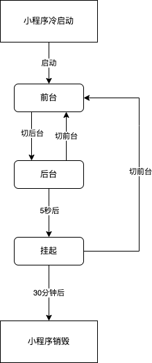

### 1. 小程序运行周期

参考链接:https://developers.weixin.qq.com/miniprogram/dev/framework/runtime/operating-mechanism.html

小程序从启动到最终的销毁,会经历多个不同的状态,小程序在不同的状态会有不同的表现.

小程序不同的状态之间的切换,可参考下图:



#### 1.1 小程序启动方式

小程序有两种启动方式:

1. 冷启动

2. 热启动

**冷启动**

如果用户是手册打开小程序,或者小程序小会后再次打开,此时小程序需要重新加载启动,这种启动方式成为冷启动.

**热启动**

如果用户已经打开过某个小程序,然后在一定的时间内再次打开该小程序,这时小程序还没有被销毁,只是进行了一次前后台的状态切换,这种启动方式属于热启动.

> 一定的时间内再次打开,这个一定的时间,一般的情况下是30分钟.

从小程序的生命周期角度来看,大多数情况下说的启动都指“冷启动”,而热启动被称作为后台切换为前台,也就是小程序状态之间的切换.

#### 1.2 小程序不同状态之间的切换

**前台与后台**

小程序的不同状态,可以概括为前台和后台.

**前台**:小程序启动后,界面展示给用户,此时小程序处于前台状态.

**后台**:用户"关闭"小程序后,这时小程序并没有被真正的关闭,而只是通过用户的一些操作,将界面隐藏起来,用户看不到了,这个时候称小程序处于后台状态.此时小程序还可以运行一段时间,在这个时间内,部分api的使用会被限制,前台切换到后台的方式包括但不限于以下几种:

- 点击右上角胶囊按钮离开小程序

- iOS从屏幕左侧右滑离开小程序

- 安卓点击返回键离开小程序

- 小程序运行时直接把微信切换到后台(手势或者home键)

- 小程序运行时直接锁屏

当用户再次进入小程序时,小程序就会重新进入前台.

#### 1.3 小程序挂起

小程序切换到后台5s后被挂起,这时微信会停止小程序js线程的执行,但是小程序的内存状态会被保留,但是开发者的业务代码会被停止执行,事件和接口回调等会在小程序重新进入前台时恢复执行.

> 但是当开发者使用了后台音乐播放、后台地理位置等能力时,小程序可以在后台继续执行,不会进入到挂起状态.

#### 1.4 小程序销毁

如果用户长时间没有使用小程序,或者系统资源紧张,小程序会被销毁,即小程序会终止运行.具体来讲,包括但不限于以下几种场景,小程序会被销毁:

- 小程序进入后台后被挂起,长时间(30分钟)都没有被切换为前台,小程序会被销毁

- 小程序占用系统资源过高,被系统销毁或者被微信客户端主动回收

    * iOS上,当微信客户端在一定时间间隔内连续收到系统内存警告时,会根据一定的策略,主动销毁小程序,并提示用户“运行内存不足,请重新打开该小程序”.具体策略不一,会持续进行调整优化.

    * 建议小程序在必要时使用wx.onMemoryWarning监听内存警告事件,进行必要的内存清理.

#### 1.5 小程序冷启动页面

小程序冷启动时,打开的页面有以下几种情况:

- 启动的场景中不带path

    * 基础库2.8.0以下版本,进入首页

    * 基础库2.8.0及以上版本,遵循下面的“小程序重新启动策略”,可能是首页或者是上次退出的页面

- 启动的场景中带有path,则启动进入对应的path页面

**小程序重新启动策略**

小程序的重新启动策略,从基础库2.8.0版本开始支持,在2.8.0以下版本,需要做兼容处理

#### 1.6 小程序退出

每当小程序可能被销毁之前,页面会回调函数onSaveExitState.如果想保存页面中的状态,可以在这个回调函数中保留一些状态、数据,下次启动时可以通过exitState获得这些保存的数据.

```js
Page({
  onLoad: function() {
    var prevExitState = this.exitState // 尝试获得上一次退出前 onSaveExitState 保存的数据
    if (prevExitState !== undefined) { // 如果是根据 restartStrategy 配置进行的冷启动，就可以获取到
      prevExitState.myDataField === 'myData' 
    }
  },
  onSaveExitState: function() {
    var exitState = { myDataField: 'myData' } // 需要保存的数据
    return {
      data: exitState,
      expireTimeStamp: Date.now() + 24 * 60 * 60 * 1000 // 超时时刻
    }
  }
})

```

### 2. 小程序更新机制

参考文档:https://developers.weixin.qq.com/miniprogram/dev/framework/runtime/update-mechanism.html

开发者在小程序管理后台发布了新的版本小程序之后,微信客户端会有若干时机去检查本地缓存的小程序有没有新版本,并进行小程序代码包的更新.如果用户本地有小程序的历史版本,则此时打开的有可能还是旧版本.

#### 2.1 启动时同步更新

以下情况下,小程序启动时会同步更新代码包.同步更新会阻塞小程序的启动流程,影响小程序的启动耗时

> 如果更新失败或者超时,为了保障小程序的可用性,还是会使用本地版本打开

**定期检查发现新版本更新**

微信运行时,会定期检查最近使用的小程序是否有更新.如果有更新,下次小程序启动时会同步进行更新,更新到最新版本后再打开小程序,尽可能保证用户能够尽快使用小程序的最新版本.

**用户长时间未使用小程序**

用户长时间未使用小程序时,为保障小程序版本的实时性,会强制同步检查版本更新,更新到最新版本后再打开小程序.

若用户处于弱网环境、下载最新版本失败等情况下,仍会启动本地的较低版本.

#### 2.2 启动时异步更新

即使启动前没有发现更新,小程序每次冷启动时都会异步检查是否有新版本.如果发现有新版本,将会异步下载新版本的代码包,但档次启动仍会使用客户端本地的旧版本代码,即新版本的小程序会在下一次冷启动才会使用.


#### 2.3 小程序后台的相关设置

#### 2.4 小结

1. 开发者在后台发布新版本之后,没有办法立刻影响到所有的现有用户,正常情况下,在全量发布24小时之后,新版本可以覆盖到99%以上的用户

2. 小程序管理后台设置的“优先使用本地版本设置”和“小程序最低可用版本设置”不会影响同步更新与异步更新的选择.