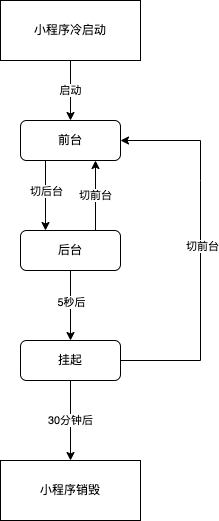

### 1. 注册小程序

每个小程序都需要在app.js中调用App方法注册小程序实例，绑定小程序的生命周期回调函数、错误监听和页面不存在监听函数等。

```js
// app.js
App({
    onLaunch(options){
        // 生命周期回调 --- 监听小程序初始化
    },
    onShow(options){
        // 生命周期回调 --- 监听小程序启动或切换后台
    },
    onHide(){
        // 生命周期回调 --- 监听小程序切换后台
    },
    onPageNotFound(res){
        // 页面不存在监听函数
    }
    onError(msg){
        // 错误监听函数
    }
})

```

小程序生命周期函数

| 属性     | 参数   | 必需 | 说明                                                         |
| -------- | ------ | ---- | ------------------------------------------------------------ |
| onLaunch | Object | 否   | 小程序初始化完成时执行；参数与wx.getLaunchOptionsSync一致，具体可参考：https://developers.weixin.qq.com/miniprogram/dev/api/base/app/life-cycle/wx.getLaunchOptionsSync.html |
| onShow   | Object | 否   | 小程序启动，或者从后台切入到前台时触发；参数与w x.onAppShow一直，具体可参考：https://developers.weixin.qq.com/miniprogram/dev/api/base/app/app-event/wx.onAppShow.html |
| onHide   |        | 否   | 小程序从前台切入后台时触发                                   |

整个小程序只有一个App实例，是整个小程序共享的，开发者可以通过getApp()方法获取到全局唯一的App实例，获取App上的数据或者调用注册在app上的函数。

### 2. 小程序生命周期

小程序从启动到最终销毁，中间会经历多个状态，小程序在不同的状态下会有不同的表现。

小程序启动后，会首先进入到前台状态，这个时候，小程序可以在前台和后台之间状态的切换，如果进入到后台状态后5秒钟没有响应，那么小程序就会被刮起，刮起后的小程序也可以再次被切入到前台。如果进入到刮起状态的小程序30分钟没有响应，那么该小程序就会被销毁。具体过程可参考下图：



#### 2.1 小程序启动

从用户认知的角度来看，广义的小程序的启动可以分为两种情况，一种情况是冷启动，一种情况是热启动。

**冷启动:** 如果用户是首次打开，或者小程序被销毁以后再次打开，此时小程序需要重新加载启动，称之为冷启动

**热启动:** 如果用户已经打开过某小程序，然后在一定的时间内再次打开小程序，此时小程序还没有被销毁，只是从后台状态切换到前台状态，这个过程就是热启动。

> 从小程序生命周期角度来看，我没所说的启动，一般是指冷启动，热启动一般就被称为后台切换为前台。
#### 2.2 前台与后台

#### 2.3 挂起

#### 2.4 小程序销毁
