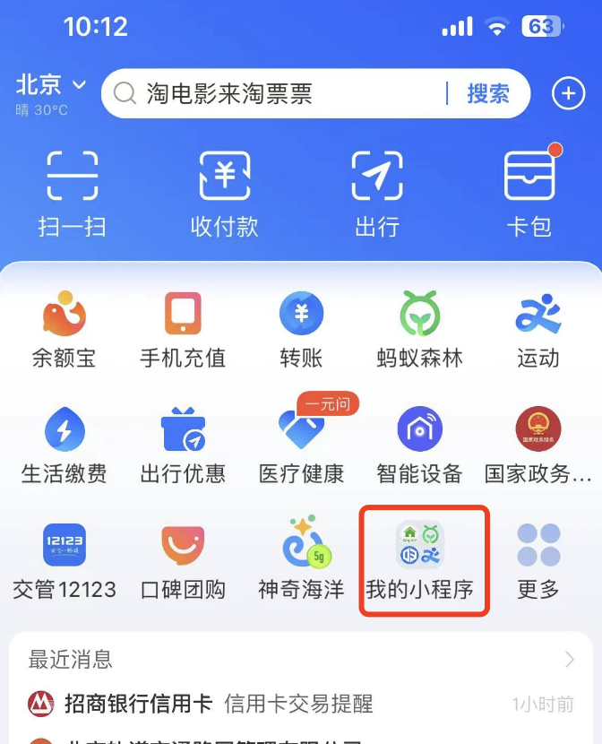
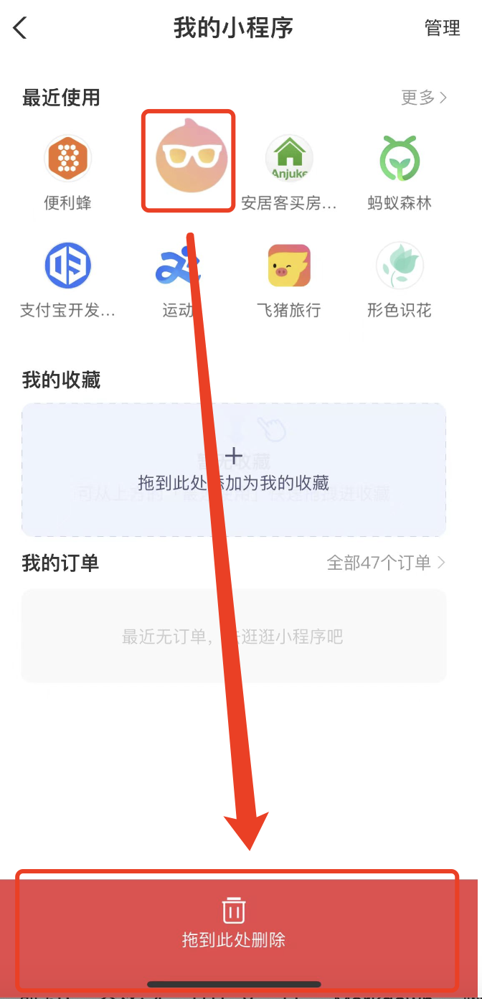
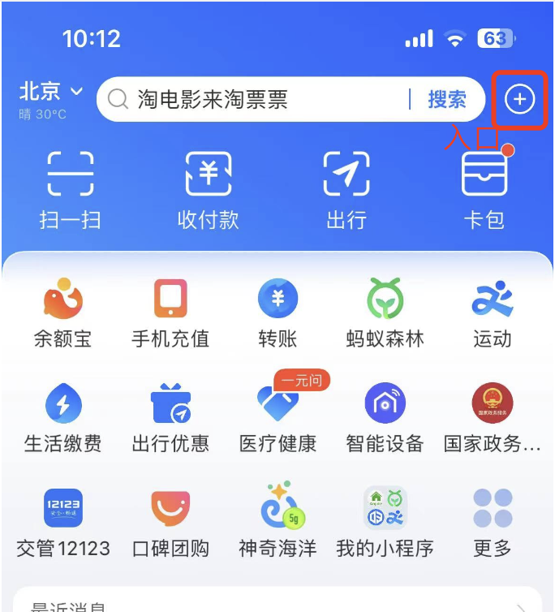
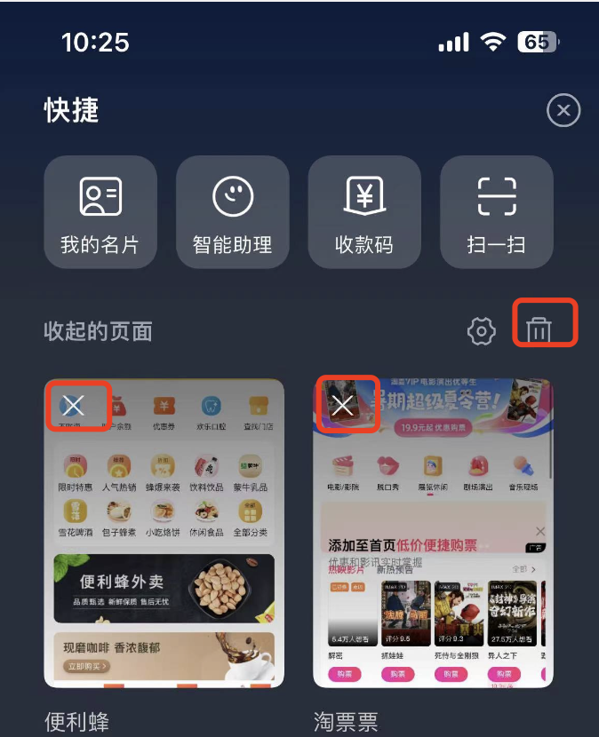

### 清除小程序缓存

主要是说怎么清除小程序的本地缓存.

#### 微信小程序

#### 支付宝小程序

支付宝小程序,可以在“我的小程序”中找到使用过的小程序,然后选择相应的小程序拖拽到底部进行删除即可.

具体过程可参考如下:

1. 在支付宝app首页金刚位区域找到“我的小程序”

2. 在“我的小程序”中找到使用过的小程序,然后选择相应的小程序拖拽到底部进行删除即可.

至此,支付宝小程序的缓存清除完毕,之前在支付宝中对刚删除的小程序的一些使用记录将被清除.

**tips**

网上也有查询到说是可以在快捷方式里面清除使用记录,方式如下:

1. 进入到快捷方式页面

2. 找到使用过的小程序,或者选择全部清除icon进行全部清除

使用这种方式只能清除掉对某个或某些小程序的访问记录,并不能清除掉小程序的本地缓存,这点是需要注意的.

#### 百度小程序

#### 抖音小程序

在iOS的抖音中,不能直接清除抖音小程序的使用记录,抖音的客服说是抖音客户端有机制会自动清除,但是这个机制,对于我们开发者来说是不透明的,不能够按需去清除,不够友好.

在Android的抖音中,倒是有可以清除抖音小程序使用记录的地方,可以按需清除.但是它仅仅是清除使用记录,并不会清除小程序在本地的缓存.

#### 快手小程序
