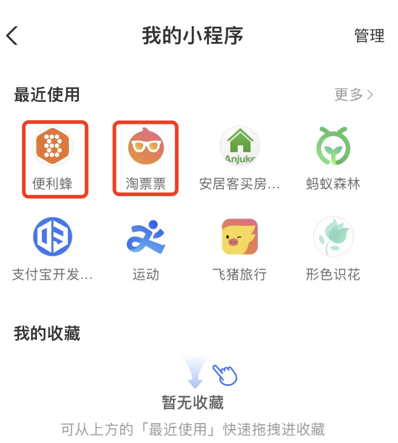

### 清除小程序缓存

主要是说怎么清除小程序的本地缓存.

#### 微信小程序

#### 支付宝小程序

支付宝小程序,可以在“我的小程序”中找到使用过的小程序,然后选择相应的小程序拖拽到底部进行删除即可.

具体过程可参考如下:

1. 在支付宝app首页金刚位区域找到“我的小程序”

2. 在“我的小程序”中找到使用过的小程序,然后选择相应的小程序拖拽到底部进行删除即可.

至此,支付宝小程序的缓存清除完毕,之前在支付宝中对刚删除的小程序的一些使用记录将被清除.
#### QQ小程序

#### 百度小程序

#### 抖音小程序

#### 快手小程序
