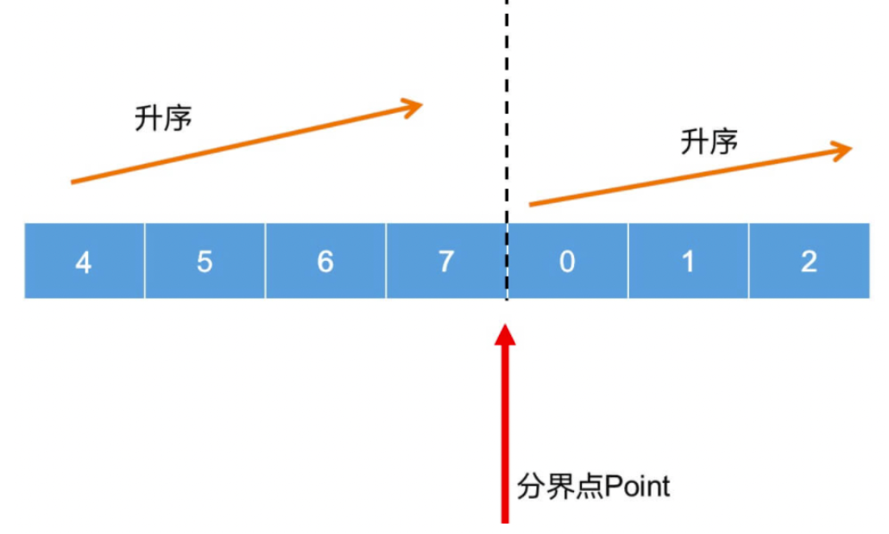

### 1. 什么是二分查找法

二分查找法是计算机科学中一种常用的查找算法，也被称为半斤搜索法，是一种在有序数组中查找某个特定元素的算法。

从名字也可以理解，是从中间开始向两侧搜索，所以也被称为半斤搜索法。

使用场景 --- 要使用二分查找法，需要满足下面的 2 个条件：

1. 存储在数组中
2. 数组是有序排序的

搜索过程从数组的中间开始向两侧搜索，如果要查找数据正好是中间数据，则查找结束。

如果要查找的元素大于或者小于中间元素，则继续在大于或小于中间元素的那一侧继续查找，依此类推

如果在最终查找数据为空，则表示没有找到要找到的数据，表示数组中没有要查找的数据

二分查找法，每次查找都将查找范围缩小一半

除了在数据很少的情况下，二分查找和普通查找的区别不大，但是如果在数据量特别大的情况下，二分查找法的优势就会体现出来。

在一个有 n 项的有序数组中，查找一个特定数据，普通查找最多可能会查找 n 次；二分查找最多查找 logn 次。

```js
// 二分查找
function binary_search(arr, target) {
  if (arr.length < 0) {
    return -1;
  }
  // 低位下标，即最小值时候的下标
  let lowerIndex = 0;
  // 高位下标，即最大值时的下标
  let highIndex = arr.length - 1;

  while (lowerIndex <= highIndex) {
    const middleIndex = Math.floor((lowerIndex + highIndex) / 2);
    if (target < arr[middleIndex]) {
      highIndex = middleIndex - 1;
    } else if (target > arr[middleIndex]) {
      lowerIndex = middleIndex + 1;
    } else {
      // 没有重复数的时候
      // return middleIndex;

      // 有重复数的时候
      if (middleIndex === 0 || arr[middleIndex - 1] < arr[middleIndex]) {
        return middleIndex;
      }
      //否则高位下标为中间索引-1，继续查找
      highIndex = middleIndex - 1;
    }
  }
  return -1;
}
let arr = [3, 4, 7, 23, 90, 90, 93];
console.log(binary_search(arr, 90)); // 4
```

通过上面的介绍，我们知道二分查找法，适用于有序数组，还有一种场景也适合二分查找法，是<font color="#f20">轮转后的有序数组</font>

轮转后的有序数组，我没有找到有明确的定义，这里可以简单的理解一下：原本是一个有序数组，将以原有序数组中的一个有序数字为轴，将其之前的所有数都轮转到数组末尾，得到的数组就是一个轮转后的有序数组。

如[7,8,9,10,2,3,4]就是一个轮转后的有序数组，即原有序数组[2,3,4,7,8,9,10]以 7 为轴，将之前的 2,3,4 数组项轮转到数组末尾，得到了轮转后的有序数组[7,8,9,10,2,3,4]

轮转后的有序数组，有一个特性，就是存在一个分界点来分界两个有序数组。



分界点的特性：

分界点元素>=第一个元素

分界点元素<第一个元素

轮转后的有序数组的二分查找法的代码实现

```js
// 二分查找法 --- 轮转后的有序数组的实现
function binary_search_revert(arr, target) {
    // 数组为空的情况
    if (arr == null || !arr.length) {
        return -1; // -1表示数组为null，或者没有数组项，就是一个空数组
    }

    // 搜索区间是前后都是hi闭区间
    let beginIndex = 0;
    let endIndex = arr.length - 1;
    while (beginIndex <= endIndex) {
        let midIndex = beginIndex + ((endIndex - beginIndex) >> 2);
        if (arr[midIndex] == target) {
            return midIndex;
        }
        // 如果左侧是有序的
        if (arr[beginIndex] <= arr[midIndex]) {
            //如果target在[ arr[beginIndex],arr[midIndex] ]中，那么就在这个区间内查找
            if (arr[beginIndex] <= target && arr[midIndex] >= target) {
                endIndex = midIndex - 1;
            } else {
                beginIndex = midIndex + 1;
            }
            // 如果右侧是有序的
        } else {
            // 如果在target在[arr[midIndex],arr[endIndex]]中
            if (arr[midIndex] <= target && arr[endIndex] >= target) {
                beginIndex = midIndex + 1;
            } else {
                endIndex = midIndex - 1;
            }
        }
    }
    return -1;
}
let arr2 = [8, 12, 89, 102, 3, 5, 7];
console.log(binary_search_revert(arr2, 77)); // -1
console.log(binary_search_revert(arr2, 102)); // 3
```

对于乱转后的有序数组的排序，有了更多的条件，实现中需要添加更多的条件判断。

### 2. 应用场景

二分查找法，最多查找O(logn)次就可以找到目标数据，查找高效。

虽然二分查找算法十分高效，但是因为它本身的一些特点：

1. 有序：要通过查找的数组是有序的
2. 数组：要查找的数据的数据结构，要是一个数组

这2个限制条件，我们很难保证我们要查找的数据都是有序的，或者都是帮我们做好了排序的。

关于二分查找法，一些特点如下：

1. 不适合数据量太小的数列：数据量小的数列，直接使用普通的查找方法没准是更快的，实现起来也更简单；
2. 每次数组元素的比较是比较耗时的，二分查找法就大量的减少了数据比较的次数，大大的减少了比较的耗时；
3. 不适合数据量太大的数列，二分查找的作用的数据结构是顺序表，也就是有序数组，而数组需要连续的存储空间，系统并不一定有这么大的连续内存可以使用；
