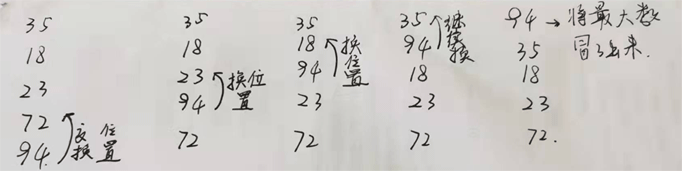
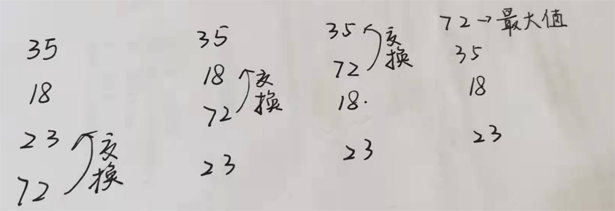

### 1. 快速排序算法

冒泡排序(Bubble Sort)，是计算机科学中一种较为简单的排序算法。

冒泡排序的思想，就是每次遍历没有排序的数列之后，将一个数据元素浮上去，即将一个排好序的数据给浮上去。

例如我们将对 35,18,23,72,94 按照从大到小的顺序进行排序

因为是大小顺序排序，所以可以从最后的位置开始遍历

第一波遍历：

先比较最后 2 个值：72 和 94,94 大于 72，两者交换顺序；

接着继续比较 94 和 23,94 大于 23，二者交换顺序

继续比较 94 和 18，交换 94 和 18 位置

继续比较 94 和 35，交换二者位置



第一次遍历之后，冒出最大值 94，接下来进行第 2 波遍历，从剩下的 4 个元素进行排序，依次类推:



依此排序剩下的 3 个数据。

简单的实现算法如下：

```js
// 冒泡排序（Bubble Sort） 按照从大到小的顺序排序
function bubbleSort(arr) {
    const len = arr.length;
    for (let i = 0; i < len - 1; i++) {
        for (let j = 0; j < len - 1 - i; j++) {
            // arr[j] < arr[j + 1] 改成arr[j] > arr[j + 1]就是从小到大排序了
            if (arr[j] < arr[j + 1]) {
                let temp = arr[j + 1];
                arr[j + 1] = arr[j];
                arr[j] = temp;
            }
        }
    }
    return arr;
}

const arr = [35, 18, 23, 72, 94];
console.log(bubbleSort(arr)); // [94, 72, 35, 23, 18]
```

做一些优化实现：

```js
function bubbleSortOpt(arr) {
    let i = arr.length - 1;
    while (i > 0) {
        // 每一轮遍历开始时，都不记录交换
        let pos = 0;
        for (let j = 0; j < i; j++) {
            if (arr[j] < arr[j + 1]) {
                let temp = arr[j];
                arr[j] = arr[j + 1];
                arr[j + 1] = temp;
                // 记录交换的位置
                pos = j;
            }
        }
        // 记录下当前位置，准备下一轮的遍历
        i = pos;
    }
    return arr;
}
const arr = [35, 18, 23, 72, 94];
console.log(bubbleSortOpt(arr)); //[94, 72, 35, 23, 18]
```

### 2.应用场景

冒泡排序的核心部分是双重嵌套循环，时间复杂度为O(N2)，相比较其他的排序算法，是一种相对较高的时间复杂度，一般情况下是不推荐使用的，但是由于冒泡排序算法的简洁性，通常用来学习程序设计、算法入门的案例。
